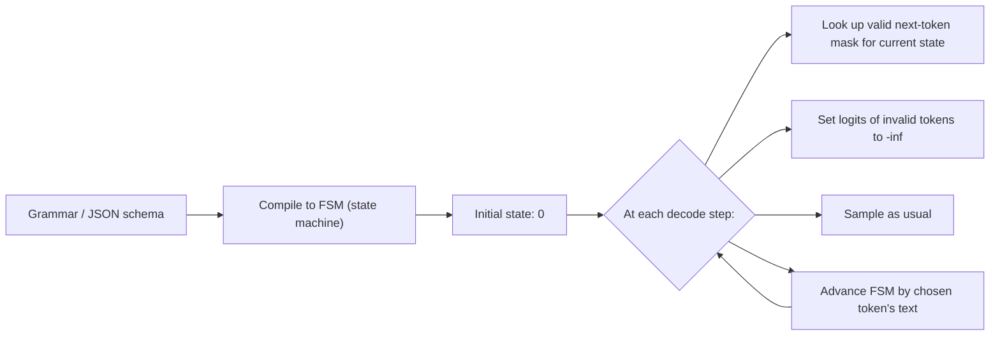

# Structured Output

<Mode is="learn">

> **Prereqs:** [Sampling](./sampling). Constrained decoding is *another mask* applied between the model's logits and the sampled token.

When you call `client.beta.chat.completions.parse(response_format=Movie)` against a vLLM v1 server, you've handed the engine a Pydantic model and asked it to make sure the output is a parseable `Movie`. Behind the scenes, vLLM hands the schema to <Term name="constrained decoding">constrained decoding</Term> — specifically, to an engine like XGrammar that compiles the schema into a finite-state machine. At every decode step, *between* the model producing logits and the sampler picking a token, the FSM emits a mask: every token that would violate the grammar gets logit `-∞`. The model literally cannot emit malformed JSON. Output isn't *probably* parseable. It's parseable by construction.

This matters because "respond in JSON" prompts still produce malformed output **5–15% of the time** on current frontier models. A 5% malformed rate at 1M requests/day is 50,000 production errors. The historical answer — "ask nicely, retry on parse failure" — was always a bandage; the 2024 wave of fast grammar engines (XGrammar, Outlines v0.1, vLLM's grammar backend) made constrained decoding *fast enough that there is no longer a tradeoff*. Per-step overhead is sub-millisecond on a 128K-token vocab. In 2026, the question is no longer "should I use constrained decoding?" — it's "which engine, and at what point in my pipeline?"

## TL;DR

- "Respond in JSON" prompts still produce malformed output **5–15% of the time** on current frontier models. That's a production failure, not a glitch.
- **Constrained decoding** compiles your schema/grammar into a **finite-state machine**, then at every decode step **masks logits for tokens that would violate the grammar**. Output is *guaranteed* parseable.
- **XGrammar** (2024) is the current speed champion: a context-free grammar engine with a token-mask cache that makes the overhead **under 5% of decode time**. Default in vLLM v1, SGLang, TensorRT-LLM.
- **Outlines** (2023) pioneered the FSM-mask approach. Slower than XGrammar in some cases; still widely used for its Python-level ergonomics.
- **llama.cpp's GBNF** is the same idea for the local-LLM world. Same speed regime, same correctness guarantee.
- **Don't use it on reasoning traces.** Constrained decoding hurts free-form thought; apply it only at the final-answer extraction step.

## Mental model



The FSM is the *memory* of the constraint; the per-step token-mask is the *enforcement*. Sampling itself is unchanged — temperature, top-p, min-p still apply, but only over the valid tokens.

## From JSON schema to FSM

A JSON schema like `{"name": str, "age": int}` becomes a regular language: `\{"name": "[^"]*", "age": [0-9]+\}` (simplified). A regular language has a deterministic finite automaton — every state knows which characters lead to which next states.

The work the engine does once at compile time:

1. Parse the grammar/schema into a context-free grammar (CFG).
2. Convert to a pushdown / finite automaton (depending on grammar class).
3. **For every (state, token) pair in the model's vocabulary, precompute whether that token is valid.** This produces a 2D mask: `mask[state, token_id] ∈ {0, -∞}`.

The work the engine does at every decode step:

```python
mask = grammar_state_to_mask[fsm_state]      # cached, O(V) memory
logits += mask                                # vectorized; fused in production kernels
token = sample(logits, temperature, top_p, min_p)
fsm_state = grammar_advance(fsm_state, token) # O(1)
```

Per-step cost: one vector add + one state transition. **This is why it's nearly free** when the cache is warm.

## Tokens, not characters

The trickiest part. The grammar is defined over *characters* (or bytes), but the model emits *tokens* — each token is an arbitrary string of bytes. A single token may match multiple grammar states ("`": ` is one token in the Llama tokenizer that simultaneously closes a string, types a colon, and opens whitespace).

So the mask isn't `is byte b valid?` — it's `is the entire byte-sequence of token t a valid extension from this FSM state?`. Computing that lookup table is `O(V × states × max_token_length)` at compile time. **For Llama-3 (128K tokens) and a moderate JSON schema, this is a few hundred milliseconds, one-time, fully cached after.**

XGrammar's headline contribution: a **persistent grammar-state cache** that handles ambiguous splits efficiently and shares work across requests. The cache and the precomputed token-validity table are why XGrammar's per-step overhead is sub-millisecond on a 128K-token vocab.

## Three engines, one idea

| Engine     | Grammar class | Compile speed | Per-step overhead | Notes |
|------------|---------------|---------------|-------------------|-------|
| Outlines   | Regex / JSON schema → FSM | slow (seconds) on large schemas | 1–3 ms | Easy Python API; great for prototyping. |
| XGrammar   | CFG (BNF) | fast (~100 ms) | ~0.1 ms | Default in vLLM v1. Handles full GBNF + JSON schema. |
| llama.cpp GBNF | CFG (GBNF) | fast | ~0.5 ms | Local-LLM world; same speed regime. |
| LM Format Enforcer | regex | slow | 1–5 ms | Earlier alternative; mostly subsumed. |

In production today (April 2026), **XGrammar is the answer for vLLM/SGLang stacks; GBNF is the answer for llama.cpp**. Outlines lives on for ergonomic reasons (Pydantic models compile cleanly to it) but is increasingly a *frontend* whose backend is XGrammar.

## The Pydantic / instructor flow

The pattern most teams use:

```python
from pydantic import BaseModel
from openai import OpenAI

class Movie(BaseModel):
    title: str
    year: int
    rating: float

client = OpenAI(base_url="http://localhost:8000/v1")
resp = client.beta.chat.completions.parse(
    model="llama-3.3-70b",
    messages=[{"role": "user", "content": "Pick a movie I should watch tonight."}],
    response_format=Movie,        # Pydantic model auto-converted to JSON schema
)

movie: Movie = resp.choices[0].message.parsed
```

Under the hood, the server (vLLM v1, with XGrammar) compiles the JSON schema corresponding to `Movie`, applies the per-step mask, and returns a guaranteed-parseable response. The Pydantic instance is hydrated with no `try/except`.

For agentic tool use, the schema is the OpenAI function-call schema; the engine constrains the model to emit a valid function call. Same machinery, different schema.

## When NOT to use it

Three cases where constrained decoding *hurts*:

1. **Reasoning traces** (R1, o-series). The model needs free-form thought before the answer. Constrain only the final answer extraction, never the trace.
2. **Open-ended creative generation.** Schemas are constraints; constraints are anti-creativity.
3. **When the schema doesn't match the model's prior**. If you constrain Llama to emit a 50-field JSON it has never seen during training, the FSM keeps it on rails but quality plummets — you've told the model *what* to write but not *how*. Few-shot examples help.

The general rule: **constrain at API boundaries, not in the middle of thought.**

## Run it in your browser

A toy FSM constrainer for a tiny vocab. Watch the mask shape as the FSM walks through valid JSON.

<RunInBrowser
  description="Mini JSON-object constrainer. The 'model' has a 16-token vocab; the FSM masks logits at each step."
  code={`import numpy as np

# Pretend tokenizer: 16 tokens. We'll constrain output to the regex { "k" : N }
# where N is one or more digits.
VOCAB = ['{', '}', '"', ':', 'k', '0','1','2','3','4','5','6','7','8','9', ' ']
TOK   = {t: i for i, t in enumerate(VOCAB)}
V     = len(VOCAB)

# FSM states for the regex { " k " : digits }
# (intentionally minimal; ignores whitespace flexibility for clarity)
TRANSITIONS = {
    0:  {'{': 1},
    1:  {'"': 2},
    2:  {'k': 3},
    3:  {'"': 4},
    4:  {':': 5},
    5:  {**{d: 6 for d in '0123456789'}},
    6:  {**{d: 6 for d in '0123456789'}, '}': 7},
    7:  {},                                  # accept
}

def mask_for_state(state):
    """Return a -inf-masked addend matching the valid next tokens."""
    addend = np.full(V, -np.inf, dtype=np.float32)
    for tok, _next in TRANSITIONS.get(state, {}).items():
        addend[TOK[tok]] = 0.0
    return addend

def advance(state, tok_str):
    return TRANSITIONS.get(state, {}).get(tok_str, None)

# Pretend logits: the "model" loves wrong characters early. We'll fix it.
rng = np.random.default_rng(42)
state = 0
out = []
for step in range(20):
    if not TRANSITIONS.get(state):
        print(f"\\nstate {state}: ACCEPT — output: {''.join(out)!r}")
        break
    raw_logits = rng.standard_normal(V).astype(np.float32) * 2.0
    constrained = raw_logits + mask_for_state(state)
    chosen = int(constrained.argmax())
    tok_str = VOCAB[chosen]
    print(f"step {step:>2} state={state}  chose {tok_str!r}  "
          f"(raw argmax was {VOCAB[int(raw_logits.argmax())]!r})")
    out.append(tok_str)
    state = advance(state, tok_str)
    if state is None:
        print(f"  FSM rejected unexpected token; halting.")
        break

print("Result is valid JSON of the schema:", ''.join(out))
`}
/>

In production this same loop runs but with `mask_for_state` precomputed for every `(state, full_vocab_token)` pair, and the model is the LLM rather than `rng.standard_normal`. The shape is identical.

## Quick check

<FillIn
  prompt="The data structure that constrained decoding compiles a JSON schema into:"
  answer="finite state machine"
  accept={["FSM", "DFA", "automaton", "finite-state machine", "finite automaton"]}
  hint="Three letters in the production papers."
  explanation="JSON schemas → regular grammars → DFA / FSM. The FSM's state is what the engine tracks across decode steps; transitions advance the state when a token is sampled."
/>

<Quiz
  question="A team adds Outlines for JSON output to a vLLM serving stack. Throughput drops 30%. They open an issue. What's the *most likely* fix?"
  options={[
    'Increase max_num_batched_tokens.',
    'Switch the constrained-decoding backend from Outlines to XGrammar (vLLM v1\'s default).',
    'Reduce the JSON schema complexity.',
    'Disable PagedAttention.',
  ]}
  answer={1}
  explanation="Outlines on a v0-era backend is the textbook source of constrained-decoding slowdown. XGrammar's per-step overhead is ~10x lower because of its grammar-state cache and vectorised mask application. vLLM v1 ships XGrammar as the default backend; switching is one config flag and recovers nearly all the lost throughput. Schema complexity helps marginally; PagedAttention is unrelated."
/>

## Key takeaways

1. **Constrained decoding turns parse failures into impossibilities.** Output is always grammar-valid by construction.
2. **The mechanism is a per-step token mask** driven by an FSM state. Sampling is unchanged — temperature, top-p, min-p still apply over the valid set.
3. **XGrammar is the speed champion in 2026.** Outlines pioneered the technique; XGrammar, llama.cpp's GBNF, and LM Format Enforcer all converge on the same idea, with XGrammar fastest on large vocab.
4. **Tokenizer-aware masking is the hard part.** The FSM operates on chars, the model emits tokens — that mismatch is the work the precomputed table absorbs.
5. **Don't constrain reasoning, only final answers.** Free thought first, constraint at the boundary. The two-pass setup (R1-style trace, then constrained extraction) is the production pattern.

## Go deeper

<Resources
  items={[
    { kind: 'paper', href: 'https://arxiv.org/abs/2411.15100', title: 'XGrammar: Flexible and Efficient Structured Generation Engine for Large Language Models', author: 'Dong et al., 2024', note: 'The XGrammar paper. Section 4 has the grammar-state cache that delivers the speedup.' },
    { kind: 'paper', href: 'https://arxiv.org/abs/2307.09702', title: 'Efficient Guided Generation for Large Language Models', author: 'Willard & Louf, 2023', note: 'The Outlines paper. The original FSM-mask formulation.' },
    { kind: 'blog', href: 'https://blog.dottxt.co/coalescence.html', title: 'dottxt — Coalescence in Constrained Decoding', author: 'dottxt (Outlines team), 2024', note: 'Best explanation of the token-vs-character mismatch and how engines solve it.' },
    { kind: 'docs', href: 'https://docs.vllm.ai/en/latest/features/structured_outputs.html', title: 'vLLM — Structured Outputs', note: 'Production docs. Backends, knobs, the response_format API.' },
    { kind: 'docs', href: 'https://github.com/ggerganov/llama.cpp/blob/master/grammars/README.md', title: 'llama.cpp — GBNF Grammars', note: 'The local-LLM equivalent. Same idea, GBNF syntax instead of JSON schema.' },
    { kind: 'repo', href: 'https://github.com/mlc-ai/xgrammar', title: 'mlc-ai/xgrammar', note: 'Reference implementation. `xgrammar/grammar.py` and `xgrammar/grammar_matcher.py` are the FSM and the mask.' },
    { kind: 'repo', href: 'https://github.com/dottxt-ai/outlines', title: 'dottxt-ai/outlines', note: 'The pioneering library. Pydantic-first ergonomics; backends include XGrammar and llama.cpp.' },
  ]}
/>

</Mode>

<Mode is="reference">

> **Prereqs:** [Sampling](./sampling). Constrained decoding is *another mask* applied between the model's logits and the sampled token.

## TL;DR

- "Respond in JSON" prompts still produce malformed output **5–15% of the time** on current frontier models. That's a production failure, not a glitch.
- **Constrained decoding** compiles your schema/grammar into a **finite-state machine**, then at every decode step **masks logits for tokens that would violate the grammar**. Output is *guaranteed* parseable.
- **XGrammar** (2024) is the current speed champion: a context-free grammar engine with a token-mask cache that makes the overhead **under 5% of decode time**. Default in vLLM v1, SGLang, TensorRT-LLM.
- **Outlines** (2023) pioneered the FSM-mask approach. Slower than XGrammar in some cases; still widely used for its Python-level ergonomics.
- **llama.cpp's GBNF** is the same idea for the local-LLM world. Same speed regime, same correctness guarantee.
- **Don't use it on reasoning traces.** Constrained decoding hurts free-form thought; apply it only at the final-answer extraction step.

## Why this matters

Every agent, every tool-use stack, every JSON-out API endpoint either runs on constrained decoding or runs on prayer. The historical answer — "ask nicely, retry on parse failure" — fails at scale: a 5% malformed rate at 1M requests/day is 50,000 production errors. Constrained decoding turns parse failures from a probabilistic problem into an impossibility.

The 2024 wave (XGrammar, Outlines v0.1, vLLM's grammar backend) made it *fast enough that there's no longer a tradeoff*. In 2026, the question is no longer "should I use constrained decoding?" — it's "which engine, and at what point in my pipeline?"

## Mental model


The FSM is the *memory* of the constraint; the per-step token-mask is the *enforcement*. Sampling itself is unchanged — temperature, top-p, min-p still apply, but only over the valid tokens.

## Concrete walkthrough

### From JSON schema to FSM

A JSON schema like `{"name": str, "age": int}` becomes a regular language: `\{"name": "[^"]*", "age": [0-9]+\}` (simplified). A regular language has a deterministic finite automaton — every state knows which characters lead to which next states.

The work the engine does once at compile time:

1. Parse the grammar/schema into a context-free grammar (CFG).
2. Convert to a pushdown / finite automaton (depending on grammar class).
3. **For every (state, token) pair in the model's vocabulary, precompute whether that token is valid.** This produces a 2D mask: `mask[state, token_id] ∈ {0, -∞}`.

The work the engine does at every decode step:

```python
mask = grammar_state_to_mask[fsm_state]      # cached, O(V) memory
logits += mask                                # vectorized; fused in production kernels
token = sample(logits, temperature, top_p, min_p)
fsm_state = grammar_advance(fsm_state, token) # O(1)
```

Per-step cost: one vector add + one state transition. **This is why it's nearly free** when the cache is warm.

### Tokens, not characters

The trickiest part. The grammar is defined over *characters* (or bytes), but the model emits *tokens* — each token is an arbitrary string of bytes. A single token may match multiple grammar states ("`": ` is one token in the Llama tokenizer that simultaneously closes a string, types a colon, and opens whitespace).

So the mask isn't `is byte b valid?` — it's `is the entire byte-sequence of token t a valid extension from this FSM state?`. Computing that lookup table is `O(V × states × max_token_length)` at compile time. **For Llama-3 (128K tokens) and a moderate JSON schema, this is a few hundred milliseconds, one-time, fully cached after.**

XGrammar's headline contribution: a **persistent grammar-state cache** that handles ambiguous splits efficiently and shares work across requests. The cache and the precomputed token-validity table are why XGrammar's per-step overhead is sub-millisecond on a 128K-token vocab.

### Three engines, one idea

| Engine     | Grammar class | Compile speed | Per-step overhead | Notes |
|------------|---------------|---------------|-------------------|-------|
| Outlines   | Regex / JSON schema → FSM | slow (seconds) on large schemas | 1–3 ms | Easy Python API; great for prototyping. |
| XGrammar   | CFG (BNF) | fast (~100 ms) | ~0.1 ms | Default in vLLM v1. Handles full GBNF + JSON schema. |
| llama.cpp GBNF | CFG (GBNF) | fast | ~0.5 ms | Local-LLM world; same speed regime. |
| LM Format Enforcer | regex | slow | 1–5 ms | Earlier alternative; mostly subsumed. |

In production today (April 2026), **XGrammar is the answer for vLLM/SGLang stacks; GBNF is the answer for llama.cpp**. Outlines lives on for ergonomic reasons (Pydantic models compile cleanly to it) but is increasingly a *frontend* whose backend is XGrammar.

### The Pydantic / instructor flow

The pattern most teams use:

```python
from pydantic import BaseModel
from openai import OpenAI

class Movie(BaseModel):
    title: str
    year: int
    rating: float

client = OpenAI(base_url="http://localhost:8000/v1")
resp = client.beta.chat.completions.parse(
    model="llama-3.3-70b",
    messages=[{"role": "user", "content": "Pick a movie I should watch tonight."}],
    response_format=Movie,        # Pydantic model auto-converted to JSON schema
)

movie: Movie = resp.choices[0].message.parsed
```

Under the hood, the server (vLLM v1, with XGrammar) compiles the JSON schema corresponding to `Movie`, applies the per-step mask, and returns a guaranteed-parseable response. The Pydantic instance is hydrated with no `try/except`.

For agentic tool use, the schema is the OpenAI function-call schema; the engine constrains the model to emit a valid function call. Same machinery, different schema.

### When NOT to use it

Three cases where constrained decoding *hurts*:

1. **Reasoning traces** (R1, o-series). The model needs free-form thought before the answer. Constrain only the final answer extraction, never the trace.
2. **Open-ended creative generation.** Schemas are constraints; constraints are anti-creativity.
3. **When the schema doesn't match the model's prior**. If you constrain Llama to emit a 50-field JSON it has never seen during training, the FSM keeps it on rails but quality plummets — you've told the model *what* to write but not *how*. Few-shot examples help.

The general rule: **constrain at API boundaries, not in the middle of thought.**

## Run it in your browser

A toy FSM constrainer for a tiny vocab. Watch the mask shape as the FSM walks through valid JSON.

<RunInBrowser
  description="Mini JSON-object constrainer. The 'model' has a 16-token vocab; the FSM masks logits at each step."
  code={`import numpy as np

# Pretend tokenizer: 16 tokens. We'll constrain output to the regex { "k" : N }
# where N is one or more digits.
VOCAB = ['{', '}', '"', ':', 'k', '0','1','2','3','4','5','6','7','8','9', ' ']
TOK   = {t: i for i, t in enumerate(VOCAB)}
V     = len(VOCAB)

# FSM states for the regex { " k " : digits }
# (intentionally minimal; ignores whitespace flexibility for clarity)
TRANSITIONS = {
    0:  {'{': 1},
    1:  {'"': 2},
    2:  {'k': 3},
    3:  {'"': 4},
    4:  {':': 5},
    5:  {**{d: 6 for d in '0123456789'}},
    6:  {**{d: 6 for d in '0123456789'}, '}': 7},
    7:  {},                                  # accept
}

def mask_for_state(state):
    """Return a -inf-masked addend matching the valid next tokens."""
    addend = np.full(V, -np.inf, dtype=np.float32)
    for tok, _next in TRANSITIONS.get(state, {}).items():
        addend[TOK[tok]] = 0.0
    return addend

def advance(state, tok_str):
    return TRANSITIONS.get(state, {}).get(tok_str, None)

# Pretend logits: the "model" loves wrong characters early. We'll fix it.
rng = np.random.default_rng(42)
state = 0
out = []
for step in range(20):
    if not TRANSITIONS.get(state):
        print(f"\\nstate {state}: ACCEPT — output: {''.join(out)!r}")
        break
    raw_logits = rng.standard_normal(V).astype(np.float32) * 2.0
    constrained = raw_logits + mask_for_state(state)
    chosen = int(constrained.argmax())
    tok_str = VOCAB[chosen]
    print(f"step {step:>2} state={state}  chose {tok_str!r}  "
          f"(raw argmax was {VOCAB[int(raw_logits.argmax())]!r})")
    out.append(tok_str)
    state = advance(state, tok_str)
    if state is None:
        print(f"  FSM rejected unexpected token; halting.")
        break

print("Result is valid JSON of the schema:", ''.join(out))
`}
/>

In production this same loop runs but with `mask_for_state` precomputed for every `(state, full_vocab_token)` pair, and the model is the LLM rather than `rng.standard_normal`. The shape is identical.

## Quick check

<FillIn
  prompt="The data structure that constrained decoding compiles a JSON schema into:"
  answer="finite state machine"
  accept={["FSM", "DFA", "automaton", "finite-state machine", "finite automaton"]}
  hint="Three letters in the production papers."
  explanation="JSON schemas → regular grammars → DFA / FSM. The FSM's state is what the engine tracks across decode steps; transitions advance the state when a token is sampled."
/>

<Quiz
  question="A team adds Outlines for JSON output to a vLLM serving stack. Throughput drops 30%. They open an issue. What's the *most likely* fix?"
  options={[
    'Increase max_num_batched_tokens.',
    'Switch the constrained-decoding backend from Outlines to XGrammar (vLLM v1\'s default).',
    'Reduce the JSON schema complexity.',
    'Disable PagedAttention.',
  ]}
  answer={1}
  explanation="Outlines on a v0-era backend is the textbook source of constrained-decoding slowdown. XGrammar's per-step overhead is ~10x lower because of its grammar-state cache and vectorised mask application. vLLM v1 ships XGrammar as the default backend; switching is one config flag and recovers nearly all the lost throughput. Schema complexity helps marginally; PagedAttention is unrelated."
/>

## Key takeaways

1. **Constrained decoding turns parse failures into impossibilities.** Output is always grammar-valid by construction.
2. **The mechanism is a per-step token mask** driven by an FSM state. Sampling is unchanged — temperature, top-p, min-p still apply over the valid set.
3. **XGrammar is the speed champion in 2026.** Outlines pioneered the technique; XGrammar, llama.cpp's GBNF, and LM Format Enforcer all converge on the same idea, with XGrammar fastest on large vocab.
4. **Tokenizer-aware masking is the hard part.** The FSM operates on chars, the model emits tokens — that mismatch is the work the precomputed table absorbs.
5. **Don't constrain reasoning, only final answers.** Free thought first, constraint at the boundary. The two-pass setup (R1-style trace, then constrained extraction) is the production pattern.

## Go deeper

<Resources
  items={[
    { kind: 'paper', href: 'https://arxiv.org/abs/2411.15100', title: 'XGrammar: Flexible and Efficient Structured Generation Engine for Large Language Models', author: 'Dong et al., 2024', note: 'The XGrammar paper. Section 4 has the grammar-state cache that delivers the speedup.' },
    { kind: 'paper', href: 'https://arxiv.org/abs/2307.09702', title: 'Efficient Guided Generation for Large Language Models', author: 'Willard & Louf, 2023', note: 'The Outlines paper. The original FSM-mask formulation.' },
    { kind: 'blog', href: 'https://blog.dottxt.co/coalescence.html', title: 'dottxt — Coalescence in Constrained Decoding', author: 'dottxt (Outlines team), 2024', note: 'Best explanation of the token-vs-character mismatch and how engines solve it.' },
    { kind: 'docs', href: 'https://docs.vllm.ai/en/latest/features/structured_outputs.html', title: 'vLLM — Structured Outputs', note: 'Production docs. Backends, knobs, the response_format API.' },
    { kind: 'docs', href: 'https://github.com/ggerganov/llama.cpp/blob/master/grammars/README.md', title: 'llama.cpp — GBNF Grammars', note: 'The local-LLM equivalent. Same idea, GBNF syntax instead of JSON schema.' },
    { kind: 'repo', href: 'https://github.com/mlc-ai/xgrammar', title: 'mlc-ai/xgrammar', note: 'Reference implementation. `xgrammar/grammar.py` and `xgrammar/grammar_matcher.py` are the FSM and the mask.' },
    { kind: 'repo', href: 'https://github.com/dottxt-ai/outlines', title: 'dottxt-ai/outlines', note: 'The pioneering library. Pydantic-first ergonomics; backends include XGrammar and llama.cpp.' },
  ]}
/>

</Mode>

<LessonComplete />
