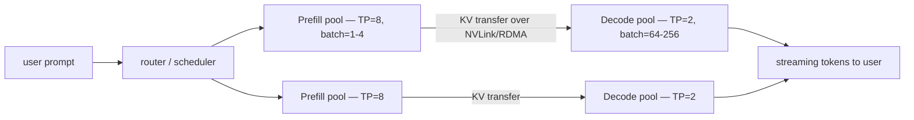

# Disaggregated Serving

> **Prereqs:** [KV Cache Basics](./kv-basics), [PagedAttention](./paged-attention), [Prefix & RadixAttention](./prefix-radix). This lesson is *where* the cache lives and how it gets there.

## TL;DR

- Prefill is **compute-bound** (long parallel matmul on the prompt). Decode is **memory-bandwidth-bound** (one token at a time, re-reading the whole KV cache). Running them on the same GPU forces a compromise both jobs hate.
- **Disaggregated serving** = two GPU pools. The **prefill pool** runs prompts to completion, then **transfers KV** to a **decode pool** that streams tokens to the user. Each pool is sized and tuned for its job.
- Pioneered as a research idea in **DistServe** (OSDI 2024) and shipped at scale in **Mooncake** (Moonshot AI, 2024) and **vLLM-disagg** / **SGLang-disagg** (2024–2025). By 2026 it's standard in any frontier-model serving stack.
- The **KV transfer** between pools is the crux. NVLink intra-node, RDMA / NIXL inter-node. Round-trip cost is usually 5–30 ms — hidden behind the first decode step.
- Net win: **3–4× more decode throughput at the same SLO**, or 2× tighter TTFT at the same throughput. Big wins for long contexts and SLOs that bound TTFT and TPOT (time-per-output-token) separately.

## Why this matters

Modern SLOs aren't a single latency number — they're a pair. TTFT (time-to-first-token) controls how chat *feels*. TPOT (time-per-output-token) controls how fast it *streams*. On a single co-located GPU, prefill steals tokens from decode (queueing) and decode pollutes the prefill batch (low utilization). You end up over-provisioning to satisfy both. Splitting the workload lets each pool run at the right batch size, the right tensor parallelism, and the right scheduler — so the same fleet serves dramatically more users at the same SLO.

This is also the architectural shift that made **128K+ context viable in production** at frontier labs. Long-context prefill is brutal; co-locating it with decode caps how many concurrent decoders you can interleave. Disaggregation removes the cap.

## Mental model



Prefill pools run **few sequences at a time** with high tensor parallelism — what compute-heavy matmuls love. Decode pools run **lots of sequences at a time** with lower tensor parallelism but maximum batch — what memory-bandwidth-bound decode loves. The KV cache moves in the middle.

## Concrete walkthrough

### Why one GPU is bad at both jobs

| Phase    | Bottleneck         | Loves          | Hates                      |
|----------|--------------------|----------------|----------------------------|
| Prefill  | FLOPs              | Big TP, low batch (tokens already provide parallelism via N) | Decoders interrupting batch shape |
| Decode   | HBM bandwidth      | Big batch (amortize KV reads) | Long prefill stalling the batch |

Run them together and the scheduler has to pick: serve a fresh long prompt → decode batch starves; pack many short prompts in a chunked-prefill schedule → prefill is sliced into less-efficient chunks. **Chunked prefill** ([next module](../inference-time/chunked-prefill)) is the *co-located* compromise. Disaggregation is the **pull-them-apart** answer.

### What "disaggregated" actually does

1. The router receives a request. It picks a **prefill instance** (idle or shortest queue).
2. The prefill instance runs the full prompt forward, materializing K, V across all `L` layers and all KV heads.
3. The router picks a **decode instance** (lowest-latency batch slot available).
4. The KV cache is **transferred** — usually layer by layer, often overlapped with the next layer's prefill — to the decode instance's HBM via NVLink (intra-node) or RDMA (inter-node). vLLM-disagg uses NIXL (NVIDIA's transfer library); SGLang uses Mooncake's transfer engine.
5. The decode instance runs autoregressive generation. The user sees tokens streaming.

The transfer cost is real but bounded. For a 70B model with GQA and a 4K prompt, KV is ~1 GB; 25 GB/s NVLink → ~40 ms. The first-decode step starts as soon as the **first layer's** KV arrives — overlapping the rest of the transfer. Net visible TTFT is `prefill_time + ~5 ms`.

### How the math changes

Take a 70B model on H100, 8K prompt, 256 output tokens, 1024 concurrent users at the same throughput.

**Co-located (single pool, TP=8, chunked prefill):**

- Practical decode batch: ~32 (any larger and TPOT exceeds SLO due to long-prefill chunks).
- Prefill MFU: ~25% (chunked schedule + decode interleaving).
- Sustained throughput: limited by decode batch.

**Disaggregated (prefill TP=8 batch=2, decode TP=2 batch=128):**

- Prefill MFU: ~40% (no decode contamination; can run prompts back-to-back).
- Decode batch: ~128 (no prefill stalls).
- Sustained throughput: **2.8–3.2×** higher under same TTFT/TPOT SLO. Mooncake reports up to **5×** on long-context workloads.

Numbers are illustrative — your actual ratio depends on prompt-to-output ratio, KV size per request, and interconnect.

### The KV transfer is the only hard part

Three knobs:

- **Layer-wise pipelining.** Don't wait for all `L` layers' KV to arrive — start decoding as soon as layer 0 lands. Each subsequent layer's KV must arrive before that layer's first decode step.
- **Compression.** Some stacks compress KV during transfer (e.g., FP8 → INT8 for the wire) and decompress in decode. Saves bandwidth at small accuracy cost.
- **Topology awareness.** Schedule prefill→decode pairs that share an NVLink switch when possible. Cross-node RDMA is 4–10× slower than intra-node NVLink.

```python
# Skeleton of the transfer engine, ignoring layer pipelining.
def serve(req):
    prefill_inst = router.pick_prefill()
    kv = prefill_inst.run_prefill(req.prompt)         # (L, kv_heads, T, d_head)

    decode_inst = router.pick_decode()
    handle = transport.send_kv(
        src=prefill_inst,
        dst=decode_inst,
        kv=kv,
        layer_pipeline=True,      # start decoding as layer 0 arrives
    )

    return decode_inst.stream_decode(req, kv_handle=handle)
```

Real implementations (Mooncake's `Transfer Engine`, NVIDIA NIXL, SGLang's PD-disagg pipeline) wrap this with retry, flow control, and layer-level synchronization primitives.

### When *not* to disaggregate

- **Short prompts (< ~256 tokens)** — prefill is so cheap that co-location is fine. Transfer overhead dominates.
- **Tiny fleets (< 8 GPUs)** — fixed-cost overhead of two pools eats the win.
- **Single-tenant batch jobs** — no SLO pressure means the chunked-prefill compromise is fine.

For chat, agents, evals, retrieval-heavy workloads, or anything pushing 8K+ contexts, disaggregation pays.

## Run it in your browser

A back-of-envelope simulator. Vary prompt length, output length, KV transfer bandwidth — see when disaggregation wins.

<RunInBrowser
  description="Compare co-located vs disaggregated under the same SLO. Tweak the inputs and re-run."
  code={`def colocated_throughput(
    prompt_tokens, output_tokens,
    prefill_tflops, decode_bw_gbs,
    kv_per_token_kb, model_tflops_per_token,
):
    """Sustained tokens/s with chunked prefill on one pool."""
    # Per-request prefill compute and decode bandwidth cost.
    prefill_t = (prompt_tokens * model_tflops_per_token) / (prefill_tflops * 1e12)
    decode_t  = output_tokens  * (kv_per_token_kb * 1024) / (decode_bw_gbs * 1e9)
    # Chunked prefill couples them; effective serial cost per request.
    return output_tokens / (prefill_t + decode_t)

def disagg_throughput(
    prompt_tokens, output_tokens,
    prefill_tflops, decode_bw_gbs, transfer_gbs,
    kv_total_mb, kv_per_token_kb, model_tflops_per_token,
):
    """Sustained tokens/s with prefill pool + decode pool + KV transfer."""
    prefill_t  = (prompt_tokens * model_tflops_per_token) / (prefill_tflops * 1e12)
    transfer_t = (kv_total_mb / 1024) / transfer_gbs       # GB / GB/s
    decode_t   = output_tokens * (kv_per_token_kb * 1024) / (decode_bw_gbs * 1e9)
    # Pools run in parallel; the bottleneck is the slowest pool.
    pool_max = max(prefill_t + transfer_t, decode_t)
    return output_tokens / pool_max

# Llama-3.1-70B-class config (GQA), H100, intra-node NVLink.
prompt, output = 8192, 256
model_tflops = 0.4              # ≈ 6 * 70B = 420 GFLOPs/token forward; pick MFU-realistic.
kv_per_tok_kb = 320              # 2 * 80 layers * 8 KV heads * 128 d_head * 2 bytes / 1024
kv_total_mb   = (prompt + output) * kv_per_tok_kb / 1024

co  = colocated_throughput(prompt, output, 1500, 3000, kv_per_tok_kb, model_tflops)
da  = disagg_throughput(prompt, output, 1979, 3300, 25, kv_total_mb, kv_per_tok_kb, model_tflops)

print(f"Co-located:    {co:>8.1f} tok/s/instance")
print(f"Disaggregated: {da:>8.1f} tok/s/instance   ({da / co:>4.1f}x)")
print()
print("Now bump prompt to 32K and rerun. The gap widens — long prefill is exactly")
print("where co-located decode batches starve and disaggregation pulls away.")
`}
/>

The numbers are stylized but the shape is right: as prompt length grows, the prefill phase gets long enough that co-located decode batches stall, and disaggregation's win compounds.

## Quick check

<FillIn
  prompt="The two SLOs that disaggregated serving optimizes for separately:"
  answer="TTFT and TPOT"
  accept={[
    "TTFT TPOT",
    "ttft and tpot",
    "time-to-first-token and time-per-output-token",
    "time to first token and time per output token",
  ]}
  hint="One controls how chat *feels*; the other controls how fast it *streams*."
  explanation="TTFT (time-to-first-token) is dominated by prefill; TPOT (time-per-output-token) is dominated by decode. Co-locating them on one GPU couples the two SLOs; disaggregation lets each pool target its own."
/>

<Quiz
  question="A team runs Llama-3.1-405B on a single 8×H100 node, co-located. They're missing TTFT SLO at 8K context but decode throughput is fine. Their first move?"
  options={[
    'Add more GPUs in the same co-located shape.',
    'Split into a prefill pool (e.g., TP=8 batch=2) and decode pool (TP=2 batch large), with NVLink-bandwidth KV transfer between.',
    'Reduce decode batch size.',
    'Switch from H100 to H200.',
  ]}
  answer={1}
  explanation="The symptom — TTFT bad, decode throughput good — is the textbook case for disaggregation. The prefill pool gets all the FLOPs, the decode pool keeps its batch, and KV moves over NVLink. (a) buys raw capacity but doesn't fix the structural coupling. (c) helps marginally but at the cost of decode throughput. (d) is a hardware bandaid that doesn't address the architecture."
/>

## Key takeaways

1. **Prefill and decode are different jobs.** Compute-bound vs bandwidth-bound, big TP vs big batch. Forcing them onto the same GPU compromises both.
2. **Disaggregation = two pools + a KV transport.** Each pool tunes for its job; the transport (NVLink/RDMA) hides behind the first decode step via layer pipelining.
3. **The throughput multiplier is real.** Published results: 2–5× under same SLO. Bigger wins as prompts get longer.
4. **vLLM-disagg, SGLang-disagg, and Mooncake are the three production references in 2025–2026.** All open-source, all built on a `Transfer Engine` abstraction.
5. **Disaggregation, prefix caching, paged attention, and chunked prefill are orthogonal optimizations.** A modern stack uses all four. Each addresses a different inefficiency in the same KV-bound pipeline.

## Go deeper

<Resources
  items={[
    { kind: 'paper', href: 'https://arxiv.org/abs/2401.09670', title: 'DistServe: Disaggregating Prefill and Decoding for Goodput-Optimized LLM Serving', author: 'Zhong et al., OSDI 2024', note: 'The paper that named the technique. Read sections 3 and 4 for the goodput formulation that drives every later system.' },
    { kind: 'paper', href: 'https://arxiv.org/abs/2407.00079', title: 'Mooncake: A KVCache-centric Disaggregated Architecture for LLM Serving', author: 'Qin et al. (Moonshot AI), 2024', note: 'Production system serving Kimi at scale. Detailed numbers on 100B+ context disaggregation.' },
    { kind: 'blog', href: 'https://blog.vllm.ai/2025/05/07/disaggregated.html', title: 'vLLM — Disaggregated Prefill / Decode', note: 'Authoritative writeup with benchmarks and config knobs. Pair with the docs.' },
    { kind: 'blog', href: 'https://lmsys.org/blog/2025-05-05-large-scale-ep/', title: 'SGLang — Large-Scale Disaggregated Serving', author: 'LMSYS, 2025', note: 'Real-fleet numbers including Mooncake-transport integration.' },
    { kind: 'docs', href: 'https://docs.nvidia.com/dynamo/latest/', title: 'NVIDIA NIXL / Dynamo', note: 'NIXL is the KV-transfer primitive most disaggregated stacks now build on. Dynamo wraps it for serving.' },
    { kind: 'repo', href: 'https://github.com/kvcache-ai/Mooncake', title: 'kvcache-ai/Mooncake', note: 'The transfer engine in production-ready form. Read `mooncake-transfer-engine` for the wire protocol.' },
    { kind: 'repo', href: 'https://github.com/sgl-project/sglang', title: 'sgl-project/sglang', note: 'See `python/sglang/srt/disaggregation/` for the prefill→decode pipeline.' },
    { kind: 'repo', href: 'https://github.com/vllm-project/vllm', title: 'vllm-project/vllm', note: 'See `vllm/v1/distributed/` and the disagg-related entries in `vllm/v1/core/`.' },
  ]}
/>

<LessonComplete />
