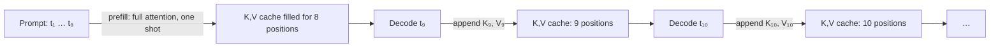

# KV Cache Basics

## TL;DR

- Without a KV cache, every token would re-attend over the entire prompt. With it, each new token does *one* extra row of attention math.
- The cache is `2 × n_layers × n_kv_heads × head_dim × seq_len × dtype_bytes`. For Llama 3.1 70B at 32K context that's **~10 GB** — often more than the weights.
- The cache lives on the GPU and grows linearly with each generated token. Long contexts OOM on the cache long before they OOM on weights.
- Every modern serving optimization (PagedAttention, prefix caching, MLA, KV quantization) is fundamentally about managing this one buffer.

## Why this matters

LLM inference is two different jobs glued together. **Prefill** runs the prompt through every layer in one big parallel matmul. **Decode** generates one token at a time, attending back to everything before it. If decode recomputed K and V for the prompt every step, generation would be quadratic in context length and nothing past 1K tokens would be usable.

The KV cache is the single most important state in an inference server. Knowing its size and growth rate is the difference between explaining why a 70B model needs 4× H100s for 32K context and just guessing.

## Mental model



Think of it as a per-layer ring buffer that grows by one row of `(K, V)` pairs every generated token. Attention at step *t* reads all *t* rows in parallel.

## Concrete walkthrough — the size math

KV-cache memory in bytes, for a single sequence:

```
size = 2  ×  n_layers  ×  n_kv_heads  ×  head_dim  ×  seq_len  ×  bytes_per_element
       │
       └── 2 because you store K *and* V
```

For a few canonical models in BF16 (2 bytes/element) at 8K context:

| Model              | layers | kv_heads | head_dim | KV @ 8K |
| ------------------ | ------ | -------- | -------- | ------- |
| Llama 3.1 8B       | 32     | 8        | 128      | **1.0 GB** |
| Llama 3.1 70B      | 80     | 8        | 128      | **2.5 GB** |
| Llama 3.1 70B (32K)| 80     | 8        | 128      | **10 GB** |
| Llama 3.1 405B     | 126    | 8        | 128      | **3.9 GB** |

(GQA — `n_kv_heads << n_query_heads` — already saves ~8× over MHA. Without GQA, that 70B at 32K would be 80 GB of cache alone.)

For a batch of `B` concurrent users, multiply by `B`. This is why a serving system's max concurrent users is almost entirely a function of how much VRAM is left after weights, not how fast the GPU is.

## Run it in your browser

Compute the cache size for any model and context length right here. Edit the params and re-run.

<RunInBrowser
  description="No GPU needed — pure arithmetic."
  code={`def kv_cache_bytes(layers, kv_heads, head_dim, seq_len, dtype_bytes=2, batch=1):
    """Bytes occupied by the KV cache for one or more concurrent sequences."""
    return 2 * layers * kv_heads * head_dim * seq_len * dtype_bytes * batch

# A few real models. Numbers in GB.
configs = [
    ("Llama-3.1-8B  @ 8K  bs=1",  32, 8,  128,   8_192, 2, 1),
    ("Llama-3.1-70B @ 8K  bs=1",  80, 8,  128,   8_192, 2, 1),
    ("Llama-3.1-70B @ 32K bs=1",  80, 8,  128,  32_768, 2, 1),
    ("Llama-3.1-70B @ 32K bs=8",  80, 8,  128,  32_768, 2, 8),
    ("Mistral-7B    @ 32K bs=16", 32, 8,  128,  32_768, 2, 16),
    ("Llama-3.1-8B  @ 128K bs=1", 32, 8,  128, 131_072, 2, 1),
]

for name, *args in configs:
    gb = kv_cache_bytes(*args) / 1024**3
    print(f"{name:<32}  {gb:>7.2f} GB")
`}
/>

A few things this should make obvious: (1) batch and context length both blow up the cache linearly; (2) at long contexts on a big model, the cache is the binding constraint; (3) the `n_kv_heads` parameter (GQA) is doing enormous work — DeepSeek's MLA squeezes this further.

## Quick check

<Quiz
  question="A 70B model with GQA (8 KV heads, 128 head_dim, 80 layers) is serving 16 concurrent users at 16K context in BF16. Roughly how much GPU memory is consumed by the KV cache alone?"
  options={[
    'About 1.5 GB',
    'About 10 GB',
    'About 80 GB',
    'About 320 GB',
  ]}
  answer={2}
  explanation="2 × 80 × 8 × 128 × 16384 × 2 × 16 ≈ 80 GB. That's an entire H100 just for cache — which is why 70B at long contexts at scale needs multi-GPU and tricks like PagedAttention to avoid fragmentation."
/>

## Key takeaways

1. **The cache is `2 × L × H_kv × D × T` bytes per sequence** — memorize this formula. It is the most useful single equation in LLM serving.
2. **Cache often exceeds weights** at long contexts. A 70B model in BF16 weighs ~140 GB; its cache at 32K × bs=8 is ~80 GB.
3. **GQA was the first major breakthrough** in cache compression (8× over MHA). MLA (DeepSeek-V2/V3) compresses another ~10×.
4. **Decode is memory-bandwidth bound, not compute bound**, because each token re-reads the whole cache. This is why FP8 / INT4 KV quantization matters.

## Go deeper

<Resources
  items={[
    { kind: 'paper', href: 'https://arxiv.org/abs/2309.06180', title: 'Efficient Memory Management for LLM Serving with PagedAttention', author: 'Kwon et al., SOSP 2023', note: 'The vLLM paper. The OS-style paging idea that made long-context serving practical.' },
    { kind: 'paper', href: 'https://arxiv.org/abs/2305.13245', title: 'GQA: Training Generalized Multi-Query Transformer Models', author: 'Ainslie et al., 2023', note: 'Why every modern model uses GQA.' },
    { kind: 'paper', href: 'https://arxiv.org/abs/2405.04434', title: 'DeepSeek-V2: Multi-head Latent Attention (MLA)', author: 'DeepSeek-AI, 2024', note: 'The 10× cache compression that\'s reshaping 2025 architectures.' },
    { kind: 'video', href: 'https://www.youtube.com/watch?v=kCc8FmEb1nY', title: 'Let\'s build GPT: from scratch, in code, spelled out', author: 'Andrej Karpathy', note: 'The reference video for understanding attention mechanically; KV cache discussion at the end.' },
    { kind: 'blog', href: 'https://blog.vllm.ai/2024/09/05/perf-update.html', title: 'vLLM v0.6 perf update', author: 'vLLM team, 2024', note: 'Blow-by-blow account of how cache management decisions move throughput.' },
    { kind: 'repo', href: 'https://github.com/vllm-project/vllm', title: 'vllm-project/vllm', note: 'Reference implementation. Read `vllm/attention/backends/` and `vllm/core/block_manager.py`.' },
  ]}
/>

<LessonComplete />
