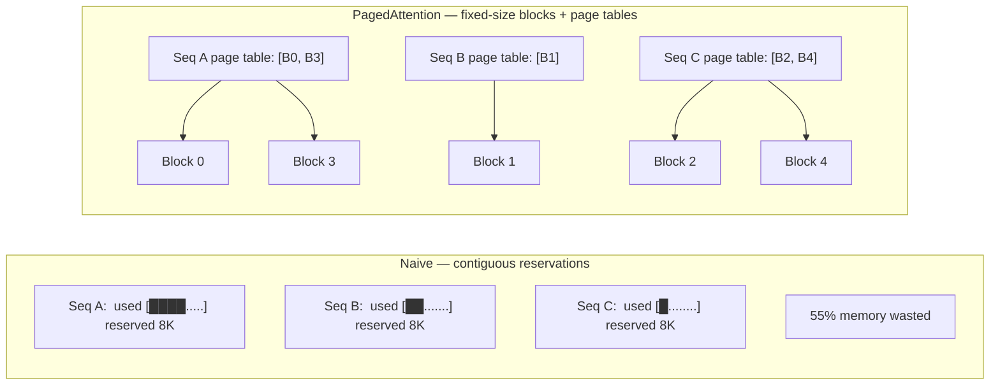

# PagedAttention (vLLM)

## TL;DR

- The naive KV cache reserves a contiguous slab equal to the *max* context for each sequence. Most sequences are shorter — **60–80% of GPU memory is wasted on internal fragmentation**.
- **PagedAttention** (Kwon et al., SOSP 2023, the vLLM paper) treats the cache like an OS treats virtual memory: small fixed-size **blocks** + per-sequence **block tables** + a **block allocator**.
- Result: **2–4× higher throughput** than HuggingFace TGI on the same hardware. vLLM's defaults match the paper's design.
- **vLLM v1** (late 2024) refactored the engine around chunked prefill + PagedAttention as the unified primitive. **SGLang's RadixAttention** is the alternative paradigm — same paged storage, plus prefix-tree sharing.
- This is the single most impactful kernel-level change in LLM serving since FlashAttention. Required reading.

## Why this matters

Before PagedAttention, an inference server with ~80 GB GPU memory could serve ~5 concurrent Llama-2-7B sequences at long context, because each sequence reserved its full max-token KV slab — even if it only ever produced 200 tokens.

After PagedAttention: same hardware, **30–50** concurrent sequences. The math didn't change. The memory layout did. A 6× throughput jump from a data-structure change is rare in systems.

If you're going to operate any LLM in production, you need to read the vLLM paper and understand the page table.

## Mental model — the OS analogy



The cache is one big pool of small blocks (e.g., 16 tokens each). Each sequence holds a list of block IDs — its **page table** — pointing to wherever its KV pages happen to live. Allocation is dynamic; freeing is per-block.

This is **exactly virtual memory**, applied to GPU tensors.

## Concrete walkthrough

### The fragmentation problem

Naive serving allocates a max-context KV slab per sequence:

```python
kv_cache = torch.empty(
    (batch_max, seq_max, n_layers, n_kv_heads, head_dim, 2),  # 2 for K and V
    device='cuda', dtype=torch.bfloat16
)
```

If `seq_max = 8192` and most sequences finish at length 256, you've reserved ~32× the memory you actually use. You can't pack new sequences into that space because each slot is committed to one sequence.

For a 70B model with 8 KV heads, head_dim 128, 80 layers, BF16, max_seq 8K, batch 16:

> **wasted slab** = 2 × 80 × 8 × 128 × 8192 × 2 × 16 ≈ **80 GB**

— exactly the memory of an H100. And most of those slots are empty most of the time.

### How PagedAttention organizes memory

```python
# Each block holds B contiguous tokens worth of (K, V) for all heads, all layers
BLOCK_SIZE = 16
# Pool of blocks — a single big tensor
kv_pool = torch.empty(
    (n_blocks, n_layers, 2, BLOCK_SIZE, n_kv_heads, head_dim),
    device='cuda', dtype=torch.bfloat16
)
free_blocks = list(range(n_blocks))  # the "free list"

# Per sequence, a page table — a list of block IDs
class SequenceKV:
    page_table: list[int]  # ordered list of block IDs
    last_block_used: int   # how many slots in the last block are occupied

# Adding a new token:
def append_token(seq, k_new, v_new):
    if seq.last_block_used == BLOCK_SIZE:
        seq.page_table.append(allocate_new_block())
        seq.last_block_used = 0
    # write into kv_pool at (seq.page_table[-1], :, :, seq.last_block_used, :, :)
    ...
    seq.last_block_used += 1
```

When a sequence ends, its blocks return to the free list — no fragmentation, no compaction.

### The custom attention kernel

A standard attention kernel assumes K/V are contiguous in memory. With paged storage, K[t] and K[t+1] might live in different blocks — the kernel has to consult the page table to find each one.

vLLM's PagedAttention kernel does this: it walks the page table for each query, gathers the K/V slabs for each block, and runs the attention math. Implemented in CUDA + integrated with FlashAttention's tiling. Performance is **within 5%** of contiguous attention on Hopper.

### Two extra tricks PagedAttention enables

**Copy-on-write for branched sequences.** Beam search and parallel sampling generate multiple continuations from the same prompt. With paged storage, all branches *share* the prompt blocks read-only and only allocate new blocks when they diverge. Memory savings: $\propto$ branch factor.

**Prefix caching across requests.** If two requests share a system prompt, they share the same blocks. SGLang's RadixAttention takes this further with a radix tree of shared prefixes. For a serving system answering many queries with the same long preamble, this saves enormous KV memory.

## Real numbers — from the vLLM SOSP paper

Llama 7B on a single A100, OPT trace:

| System | Throughput (req/s) | Latency p99 (s) | Memory waste |
| --- | --- | --- | --- |
| HuggingFace `generate` | 4.5 | 28 | 73% |
| FasterTransformer | 7.2 | 18 | 50% |
| **vLLM** | **23.0** | 6 | 4% |

**5×** the throughput of HuggingFace, **3×** of FasterTransformer. From the same model on the same GPU.

By 2025–2026, vLLM v1 + chunked prefill + speculative decoding ships another ~1.5–2× on top of this.

## Run it in your browser — page-table simulator

<RunInBrowser
  description="Simulate fragmentation: 100 sequences of varied length under naive vs paged allocation."
  code={`import random
random.seed(7)

BLOCK_SIZE = 16
N_BLOCKS = 4096           # pool of 64K tokens worth of cache
SEQS = 100
LEN_DIST = [(64, 0.4), (256, 0.35), (1024, 0.15), (4096, 0.07), (8192, 0.03)]
def sample_len():
    r = random.random(); cum = 0
    for L, p in LEN_DIST:
        cum += p
        if r < cum: return L
    return LEN_DIST[-1][0]

# --- Naive: each sequence reserves max_seq slots ---
MAX_SEQ = 8192
naive_reserved = SEQS * MAX_SEQ
naive_used     = sum(sample_len() for _ in range(SEQS))
naive_waste    = 1 - naive_used / naive_reserved

# --- Paged: each sequence allocates ceil(len / BLOCK_SIZE) blocks ---
random.seed(7)
paged_blocks = sum((sample_len() + BLOCK_SIZE - 1) // BLOCK_SIZE for _ in range(SEQS))
paged_capacity_blocks = paged_blocks
paged_used = sum(sample_len() for _ in range(SEQS))
paged_capacity_tokens = paged_blocks * BLOCK_SIZE
paged_waste = 1 - paged_used / paged_capacity_tokens

print(f"Naive  | reserved = {naive_reserved:>7d} tokens, used = {naive_used:>5d}, waste = {naive_waste*100:.1f}%")
print(f"Paged  | allocated = {paged_capacity_tokens:>5d} tokens ({paged_blocks} blocks of {BLOCK_SIZE}), waste = {paged_waste*100:.1f}%")
print(f"Memory factor (paged / naive): {paged_capacity_tokens / naive_reserved:.3f}x")
`}
/>

You'll see naive wastes ~80%+ on this distribution; paged wastes under 5%. Same workload, ~20× less memory.

## Quick check

<Quiz
  question="You're seeing OOM errors on a 70B inference server at batch 16, max_seq 4K. The cache theoretically needs ~5 GB but you have ~70 GB free after weights. What's the most likely root cause?"
  options={[
    'Memory fragmentation from naive contiguous KV slabs — switch to vLLM / PagedAttention.',
    'The model is too big for the GPU.',
    'GPU drivers are misconfigured.',
    'You need a smaller `max_seq` parameter.',
  ]}
  answer={0}
  explanation="The 5 GB theoretical vs 70 GB available gap is the textbook fragmentation symptom. A naive server reserves max_seq per sequence × batch = 16 × 4K worth of slabs even if most sequences finish in 200 tokens. Switching to PagedAttention (vLLM, SGLang) typically fixes this immediately and lets you run 5-10× more concurrent sequences."
/>

## Key takeaways

1. **PagedAttention = OS virtual memory for the KV cache.** Fixed-size blocks, per-sequence page tables, dynamic allocation, ~zero fragmentation.
2. **The custom kernel handles non-contiguous K/V access.** Within ~5% of FlashAttention contiguous performance.
3. **Two structural unlocks come for free:** copy-on-write (cheap branching) and cross-request prefix sharing (huge for templated prompts).
4. **vLLM's defaults are the paper's design.** If you operate vLLM, tune `block_size` (default 16) and `gpu_memory_utilization` (default 0.9). Most other knobs are second-order.
5. **SGLang's RadixAttention generalizes prefix sharing.** Same paged storage; smarter sharing topology. Use it when you have a prompt forest, not just a prefix.

## Go deeper

<Resources
  items={[
    { kind: 'paper', href: 'https://arxiv.org/abs/2309.06180', title: 'Efficient Memory Management for LLM Serving with PagedAttention', author: 'Kwon et al. (UC Berkeley, SOSP 2023)', note: 'The vLLM paper. Required reading. Read it twice.' },
    { kind: 'blog', href: 'https://blog.vllm.ai/2024/09/05/perf-update.html', title: 'vLLM v0.6 perf update', author: 'vLLM team (2024)', note: 'How chunked prefill + PagedAttention compose into the v1 engine.' },
    { kind: 'paper', href: 'https://arxiv.org/abs/2312.07104', title: 'Efficiently Programming Large Language Models using SGLang', author: 'Zheng et al. (2024)', note: 'RadixAttention paper. Generalizes prefix sharing.' },
    { kind: 'repo', href: 'https://github.com/vllm-project/vllm', title: 'vllm-project/vllm', note: 'Reference implementation. Read `vllm/core/block_manager.py` and `vllm/attention/backends/flash_attn.py`.' },
    { kind: 'repo', href: 'https://github.com/sgl-project/sglang', title: 'sgl-project/sglang', note: 'The RadixAttention serving stack. Often beats vLLM on workloads with shared prefixes.' },
    { kind: 'video', href: 'https://www.youtube.com/watch?v=5ZlavKF_98U', title: 'Woosuk Kwon — vLLM @ SOSP 2023', author: 'Woosuk Kwon (lead author)', note: 'Author talk. Cleanest 20-minute explanation of the design.' },
    { kind: 'paper', href: 'https://arxiv.org/abs/2407.00079', title: 'Mooncake: Trading More Storage for Less Computation (2024)', note: 'Disaggregated KV-cache architecture from Moonshot. Where serving systems are headed.' },
    { kind: 'docs', href: 'https://docs.vllm.ai/en/latest/', title: 'vLLM documentation', note: 'Operational reference. Skim the "Engine Args" page once a quarter — it changes.' },
  ]}
/>

<LessonComplete />
