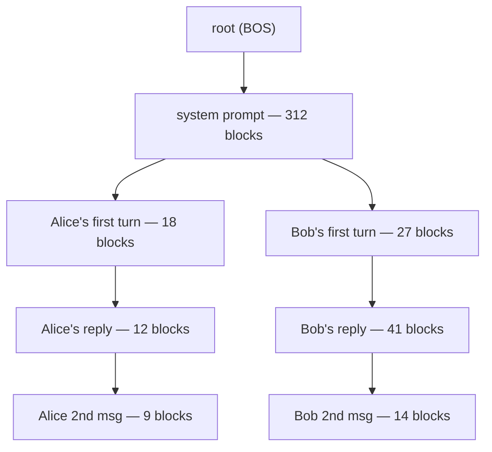

# Prefix & RadixAttention

> **Prereqs:** [KV Cache Basics](./kv-basics) and [PagedAttention](./paged-attention). This lesson is what happens *between* requests, not within them.

## TL;DR

- Most production traffic isn't unique. Two requests share a system prompt; ten requests share a chat history; a hundred requests share a few-shot template. **Prefill those shared tokens once, reuse the KV across requests.**
- vLLM v0.5+ ships **automatic prefix caching** (APC): every block whose contents have been seen before is served from a hash table instead of recomputed.
- SGLang's **RadixAttention** generalises APC to a **radix tree** — every prefix of every conversation is a node, every block is a tree edge, eviction is LRU on the tree. Sharing extends down the entire tree, not just the root prompt.
- Real workloads see **3–10× throughput on TTFT** (time-to-first-token) when prefix hit rate is high. Chatbots, agents, evals, and few-shot inference are all prefix-heavy by nature.
- **Cache reuse is correct only when the prefix tokens are byte-identical** (after tokenization). Tokenizer drift, hidden whitespace, RNG-seeded prompts → cache miss.

## Why this matters

Time-to-first-token (TTFT) is the user-visible latency in chat. TTFT is dominated by **prefill** — running every prompt token through every layer. If your system prompt is 4K tokens, every new conversation eats a 4K-token prefill before the user sees anything. Prefix caching turns that 4K prefill into a hash lookup. On a 70B model on H100, that's the difference between **~1.2 s TTFT and ~30 ms**. For agent loops that re-issue tool-augmented prompts hundreds of times per task, the impact compounds — total wall time can drop 5–10×.

This is also why "is your serving stack prefix-aware" is a real procurement question in 2026. vLLM v1, SGLang, TensorRT-LLM, and Hugging Face TGI all support some form. The differences are in tree structure, eviction policy, and how aggressively they cache mid-conversation suffixes.

## Mental model



Every node is a contiguous block-aligned chunk of tokens. Every edge means "extend this prefix." When Alice sends a third message, the server walks the tree from root → system → Alice's first turn → reply → 2nd msg, finds the longest cached prefix, and **only prefills the new tail**. When the cache fills, an LRU sweep evicts leaves first.

## Concrete walkthrough

### Three flavours of prefix cache

| System         | Granularity            | Sharing scope            | Eviction        | Notes |
|----------------|------------------------|---------------------------|-----------------|-------|
| vLLM APC       | KV block (16 tokens)   | Per-block hash table      | LRU             | Shipped v0.5; on by default in v1. Tracks block-content hashes globally. |
| SGLang RadixAttn | Variable-length edge   | Tree (any prefix)         | LRU on tree     | Best for branching chat; explicit handling of conversation history. |
| TensorRT-LLM   | KV block               | Per-block hash table      | LRU + reuse score | Lower-level; integrates with NVIDIA's batch scheduler. |
| HF TGI         | Per-conversation       | Pinned prefix (manual)    | Manual / TTL    | Simpler model; client passes a `cache_id`. |

The mental difference: **APC** is a hash table; **RadixAttention** is a tree. The tree wins when the same conversation forks (multi-turn chat with branching, agent loops with self-consistency, evals running variants of the same prompt).

### Why a *block-aligned* hash works

KV blocks are typically 16 tokens. A block's contents are determined by the *tokens themselves plus the tokens before it* (because each KV vector depends on the entire preceding context via the attention pattern… wait, no — KV at position `t` depends only on positions `[0..t]` through self-attention. K and V at position `t` are projections of `h_t`, where `h_t` came from layer L-1 attending over `h_{t}` and earlier).

So the hash of a block is `hash(prefix_tokens_so_far)`. Two requests that share the first 312 blocks **bit-exactly** share KV for those 312 blocks — no recomputation, no quality cost, no approximation.

```python
# vLLM's APC, in spirit
def block_hash(prev_block_hash: int, tokens: tuple[int, ...]) -> int:
    return hash((prev_block_hash, tokens))   # chained → prefix-determined

# On prefill:
existing = []
prev_hash = 0
for block_tokens in chunked(prompt_tokens, BLOCK=16):
    h = block_hash(prev_hash, block_tokens)
    if h in self.cache:
        existing.append(self.cache[h])       # reuse: zero compute
        prev_hash = h
    else:
        break                                 # first miss = recompute from here on

new_blocks = run_prefill(prompt_tokens[len(existing) * 16 :])
self.cache.update(zip(new_hashes, new_blocks))
```

The "first miss = recompute from here on" rule is critical: cache hits **must** be a contiguous prefix from the front. You can't have a hit at block 4, miss at block 5, hit at block 6 — the K, V at block 6 are functions of *everything* up to block 5.

### What hit rate looks like in practice

| Workload                       | Typical prefix hit rate  | TTFT speedup   |
|--------------------------------|--------------------------|----------------|
| Single-shot Q&A (no shared sys prompt) | 0–5%             | ~1×            |
| Customer-support chatbot       | 60–85%                   | 3–6×           |
| Agent w/ ReAct loop            | 80–95%                   | 5–10×          |
| Evals (N variants of same shot template) | 95%+              | 10–20×         |
| Coding assistant (repo-level context) | 70–90%            | 4–8×           |

Hit rate is the headline metric. Track it (vLLM exposes `prefix_cache_hit_rate` per-engine). If it's below 50% on a chat workload, your prompt template is probably non-canonical (RNG seeds, timestamps, ID injection at the *front* instead of the back).

### Cache-busting prompts to avoid

Anything that mutates the prefix breaks sharing. Common foot-guns:

- **Timestamps near the start.** Move them to the end of the system message.
- **Per-user IDs in the system prompt.** Move to a tool definition or the user turn.
- **Random IDs (UUIDs, request IDs).** Almost never belong in the LLM input.
- **Tokenizer mismatch between client and server** — e.g., trailing whitespace handled differently. Always tokenize server-side and pin the tokenizer version.
- **Different chat templates per call.** Pin the template; don't let downstream code rebuild it.

## Run it in your browser

A working radix-tree prefix cache simulator. Insert sequences, watch shared edges, query hit rate.

<RunInBrowser
  description="Builds a prefix tree across 6 chat sequences. Shows nodes and the prefix-cache hit rate."
  code={`from collections import defaultdict

class RadixNode:
    __slots__ = ('children', 'tokens', 'value')
    def __init__(self, tokens=()):
        self.children = {}     # first-token → RadixNode
        self.tokens = tokens   # full token tuple stored along this edge
        self.value = None      # would be the KV blocks; we just track presence

class RadixTree:
    def __init__(self):
        self.root = RadixNode()
        self.tokens_seen = 0
        self.tokens_hit = 0

    @staticmethod
    def lcp(a, b):
        i = 0
        while i < len(a) and i < len(b) and a[i] == b[i]: i += 1
        return i

    def insert(self, seq):
        self.tokens_seen += len(seq)
        node = self.root
        i = 0
        while i < len(seq):
            first = seq[i]
            if first not in node.children:
                # No child starting with this token — fresh edge.
                child = RadixNode(tuple(seq[i:]))
                child.value = True
                node.children[first] = child
                return
            child = node.children[first]
            n = self.lcp(child.tokens, seq[i:])
            self.tokens_hit += n
            if n == len(child.tokens):
                i += n
                node = child                       # walked into existing edge
            else:
                # Need to split the edge at offset n.
                old_tail = RadixNode(child.tokens[n:])
                old_tail.value, old_tail.children = child.value, child.children
                child.tokens = child.tokens[:n]
                child.value = None
                child.children = {old_tail.tokens[0]: old_tail}
                if i + n < len(seq):
                    new_tail = RadixNode(tuple(seq[i+n:]))
                    new_tail.value = True
                    child.children[seq[i+n]] = new_tail
                else:
                    child.value = True
                return

    def report(self):
        return {
            'tokens_seen': self.tokens_seen,
            'tokens_hit':  self.tokens_hit,
            'hit_rate':    self.tokens_hit / max(1, self.tokens_seen),
        }

# Simulate a chat workload: shared system prompt, two users, branching turns.
SYS = tuple(range(1, 21))                       # 20 tokens of system prompt
A1  = SYS + tuple(range(100, 110))              # Alice turn 1
A2  = A1  + tuple(range(120, 128))              # Alice turn 2
B1  = SYS + tuple(range(200, 215))              # Bob turn 1
B2  = B1  + tuple(range(220, 230))              # Bob turn 2
B3  = B2  + tuple(range(240, 252))              # Bob turn 3 (long)

tree = RadixTree()
for seq in (SYS, A1, A2, B1, B2, B3):
    tree.insert(seq)

r = tree.report()
print(f"tokens seen: {r['tokens_seen']}")
print(f"tokens hit:  {r['tokens_hit']}")
print(f"hit rate:    {r['hit_rate']:.1%}")
print()
print("With six sequences sharing a 20-token system prompt and forking,")
print("we already see substantial prefix reuse. Production traffic is far more redundant.")
`}
/>

A real implementation also tracks per-block reference counts, evicts via LRU on leaves, and pages KV blocks into and out of GPU memory. The skeleton above is the data-structure idea — vLLM's APC and SGLang's RadixAttention fill in the GPU plumbing.

## Quick check

<FillIn
  prompt="A cache hit must always start from the very first token of the prompt — you cannot skip a missed block in the middle. The technical reason:"
  answer="K and V at position t depend on all positions 0..t-1"
  accept={[
    "K and V at position t depend on the previous tokens",
    "kv at position t depends on prior tokens",
    "self-attention is causal",
  ]}
  hint="Why are KV vectors at position t a function of the entire preceding context?"
  explanation="Each layer's K, V are projections of the previous layer's hidden state, which itself attended over earlier positions. So K, V at position t encode all of [0..t]. Skipping a block in the middle would require recomputing everything after the skipped slot anyway."
/>

<Quiz
  question="A team's chat product has a 4K-token system prompt. They're seeing 5% prefix-cache hit rate. The biggest single thing they can change?"
  options={[
    'Increase block size from 16 to 32 tokens.',
    'Move a `[Request: <uuid>]` header from the start of the system prompt to the end of the user message.',
    'Switch from APC to RadixAttention.',
    'Disable prefix caching — at 5% hit rate it is pure overhead.',
  ]}
  answer={1}
  explanation="A UUID at the front of the system prompt makes every request bit-different from byte 0, which means *every* block hashes uniquely. Even a 1-byte change at offset 0 destroys all sharing downstream. Move the variable bits to the tail and the hit rate jumps. RadixAttention vs APC matters less; block size matters less; both pale against fixing prompt structure."
/>

## Key takeaways

1. **Prefix caching turns repeated prompts into hash lookups.** TTFT goes from "prefill cost" to "memcpy cost."
2. **Hits must be contiguous from the front** — a single varying byte at offset 0 invalidates the entire downstream cache.
3. **Hit rate is the metric.** Track it. If it's below 50% on a chat workload, the prompt template is the bug.
4. **vLLM v1 = automatic prefix caching by default.** SGLang's RadixAttention does the same with a tree, which wins on branching workloads.
5. **The savings stack.** PagedAttention tames *intra-request* memory; prefix caching tames *inter-request* duplication; speculative decoding tames decode latency. They compose.

## Go deeper

<Resources
  items={[
    { kind: 'paper', href: 'https://arxiv.org/abs/2312.07104', title: 'SGLang: Efficient Execution of Structured Language Model Programs', author: 'Zheng et al., 2024', note: 'Section 4 introduces RadixAttention. The clearest published description of a tree-structured KV cache.' },
    { kind: 'paper', href: 'https://arxiv.org/abs/2309.06180', title: 'Efficient Memory Management for LLM Serving with PagedAttention', author: 'Kwon et al., SOSP 2023', note: 'The vLLM paper. APC is a follow-on; this is the foundation.' },
    { kind: 'blog', href: 'https://blog.vllm.ai/2024/01/27/automatic-prefix-caching.html', title: 'vLLM — Automatic Prefix Caching', note: 'Authoritative explainer with benchmarks. Read this and the v1 update.' },
    { kind: 'blog', href: 'https://lmsys.org/blog/2024-07-25-sglang-llama3/', title: 'SGLang v0.4 — RadixAttention with Llama 3', author: 'LMSYS, 2024', note: 'Hit-rate plots on real chat workloads.' },
    { kind: 'docs', href: 'https://docs.vllm.ai/en/latest/features/automatic_prefix_caching.html', title: 'vLLM docs — Prefix Caching', note: 'How to enable, monitor, and debug. Includes the metric names you want in Grafana.' },
    { kind: 'repo', href: 'https://github.com/sgl-project/sglang', title: 'sgl-project/sglang', note: 'Reference implementation. `python/sglang/srt/mem_cache/radix_cache.py` is the data structure; `model_runner.py` shows how it integrates with prefill.' },
    { kind: 'repo', href: 'https://github.com/vllm-project/vllm', title: 'vllm-project/vllm', note: 'See `vllm/v1/core/kv_cache_manager.py` for the v1 prefix-cache implementation.' },
  ]}
/>

<LessonComplete />
