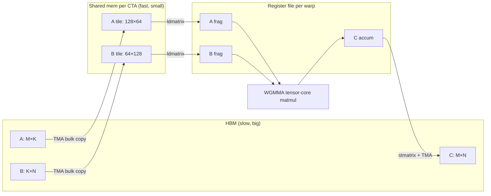

# GEMM (Hopper / Blackwell)

## TL;DR

- **GEMM** = General Matrix Multiplication. **`C = α·A·B + β·C`**. ~80% of LLM training and inference flops live here.
- A naive matmul reads each input element $O(N)$ times — fully memory-bound. Production kernels do **cache blocking** at multiple levels (registers, shared memory, L2) so each byte from HBM gets reused $\sim 64–256\times$.
- On Hopper / Blackwell, the kernel structure is **TMA + WGMMA + warp specialization** — async copies overlap with tensor-core matmul, and producer/consumer warps split the work.
- **CUTLASS 4** (NVIDIA) and **Triton 3.x** are the two ways most teams write it in 2026. Hand-tuned CUTLASS still wins by 5–10% on edge shapes; Triton wins on developer time.
- For LLM inference at small batch (decode), GEMM becomes **GEMV** — different optimization regime, memory-bound, where INT4/FP8 weight quant rules.

## Why this matters

When you read PyTorch model code, almost every `Linear(...)` layer compiles to a GEMM. Same for every attention QK/SV projection, every FFN block, every embedding lookup at scale. Changing how fast GEMM runs changes how much your model costs.

A 70B inference at long context is ~80% GEMM time. A frontier pretraining run is ~85% GEMM time. The job of every kernel library — cuBLAS, CUTLASS, hipBLASLt, ROCm Composable Kernel, Triton autotune — is to land GEMM at >70% of theoretical peak across the shapes your workload actually uses.

This lesson is the systems engineer's mental model of why fast matmul is hard, what changed on Hopper / Blackwell, and how to read a CUTLASS source file.

## Mental model — the multi-level tile



Three nested levels of tiling, three sets of memory:

1. **Block tile** — each thread block (CTA) computes a $M_{\text{tile}} \times N_{\text{tile}}$ chunk of $C$. Pulls A and B tiles into shared memory.
2. **Warp tile** — each warp inside the CTA computes a sub-chunk; loads fragments into registers.
3. **Tensor-core instruction** — the inner loop is a fixed-size mma (e.g., $64 \times 128 \times 16$ on Hopper WGMMA).

The whole kernel is **a triple nested loop with async data movement between levels**.

## Concrete walkthrough — the four eras

### Era 1: Naive (the wrong baseline)

```cpp
for (int m = 0; m < M; m++)
  for (int n = 0; n < N; n++)
    for (int k = 0; k < K; k++)
      C[m][n] += A[m][k] * B[k][n];
```

For $M = N = K = 4096$ this reads B's columns $M$ times — every element of B is loaded 4096× from HBM. **Arithmetic intensity** (flops per byte loaded) is essentially $O(1)$. Memory-bound, ~1% of peak.

### Era 2: Cache blocking on CPU (Goto, GotoBLAS)

Tile the loops so a sub-tile of B fits in L1, gets reused $M_{\text{tile}}$ times. Loop ordering matters:

```cpp
for (int kk = 0; kk < K; kk += K_TILE)
  for (int mm = 0; mm < M; mm += M_TILE)
    for (int nn = 0; nn < N; nn += N_TILE)
      // ... inner block uses sub-tiles, with the K loop innermost so A is contiguous
```

This was state of the art for CPU GEMM through the 2000s. Concept survives; everything modern is cache blocking with extra steps.

### Era 3: Tensor cores on Volta–Ampere

Volta (2017) introduced **tensor cores** — a single instruction that computes a $4 \times 4 \times 4$ fp16 matmul-accumulate. By Ampere (A100, 2020), the instruction was $16 \times 16 \times 16$, and the throughput was an order of magnitude over fp32 ALUs.

Every modern GEMM kernel structure became:

```text
for k_tile in K:
  cooperative load A_tile, B_tile into SMEM
  __syncthreads()
  for warp_k in K_tile:
    load A_frag, B_frag into registers via ldmatrix
    mma.sync(C_frag, A_frag, B_frag, C_frag)  // tensor core instruction
  __syncthreads()
write C tile back to HBM
```

CUTLASS's "TileGEMM" generation pattern was built around this. Each tile size is tuned for the SM and the dtype.

### Era 4: Hopper & Blackwell — async + warp specialization

Hopper (H100, 2022) added two big things: **TMA** (Tensor Memory Accelerator) and **WGMMA** (warpgroup matmul). Blackwell (B200, 2025) added **5th-gen tensor cores**, **NVFP4** native, and **CGAs** (cluster-level cooperation).

The new structural pattern is **producer/consumer warps**:

```text
warp_group_0 (producer): TMA loads — `cp.async.bulk` from HBM into SMEM with mbarriers
warp_group_1 (consumer): WGMMA — reads SMEM, accumulates into register file
mbarrier signals when each tile is ready; double-buffered SMEM keeps both groups busy
```

The kernel is essentially a **software pipeline**: tile $k+1$ is being TMA-loaded while tile $k$ is being computed. This hides HBM latency completely.

CUTLASS 4 expresses this with the **CuTe** layout language. A modern Hopper GEMM kernel is ~300 lines of C++ that orchestrates this dance.

## Real numbers — Llama-3.1 70B inference, batch 1, decode

Per-token GEMM time on a single H100, BF16:

| Implementation | tok/s (decode) | % of HBM-BW peak | Notes |
| --- | --- | --- | --- |
| Naive PyTorch | ~5 | 4% | Reference only |
| `torch.matmul` (cuBLAS) | ~38 | 30% | Default in eager PyTorch |
| `torch.compile` (Inductor → CUTLASS) | ~52 | 41% | + fusion of dequant + GEMM |
| vLLM + Marlin INT4 kernel | ~88 | 70% | Memory-bound regime; weight quant pays off |
| TensorRT-LLM FP8 | ~110 | — | Compute-bound past this point |

**Decode is memory-bound.** Each generated token re-reads the entire model from HBM. Faster GEMM doesn't help past ~70% HBM-bw — what helps is reading less (quantization, KV-cache compression).

**Prefill is compute-bound.** Long prompts process many tokens in parallel, $M$ and $K$ both large, kernel hits 80%+ of fp16 peak. This is where tensor-core throughput really matters.

This split is the central reason production stacks treat prefill and decode as fundamentally different jobs (see *Disaggregated Serving*).

## Run it in your browser — predict GEMM throughput

<RunInBrowser
  description="Roofline-style estimate. Plug in shape + dtype + hardware, get an upper bound for tok/s."
  code={`def gemm_roofline(M, N, K, dtype_bytes, hbm_gbps, peak_tflops):
    """Rough roofline ceiling for a single GEMM of shape (M, N, K)."""
    flops = 2 * M * N * K            # ~2 flops per multiply-add
    bytes_traffic = (M*K + K*N + M*N) * dtype_bytes  # one full read of A,B plus write of C
    arith_intensity = flops / bytes_traffic
    bw_bound_s = bytes_traffic / (hbm_gbps * 1e9)
    compute_bound_s = flops / (peak_tflops * 1e12)
    return arith_intensity, bw_bound_s * 1e6, compute_bound_s * 1e6  # \xb5s

# H100 SXM, BF16: ~3 TB/s HBM, ~990 TFLOPS BF16 tensor-core peak
configs = [
    ("Llama 70B FFN (M=8192,N=28672,K=8192) prefill", 8192, 28672, 8192),
    ("Llama 70B FFN decode bs=1                 ", 1, 28672, 8192),
    ("Attention QK^T at 4K seq  (M=4096,N=4096,K=128)", 4096, 4096, 128),
]
for name, m, n, k in configs:
    ai, bw_us, comp_us = gemm_roofline(m, n, k, 2, 3000, 990)
    bound = "memory-bound" if bw_us > comp_us else "compute-bound"
    print(f"{name}\\n  arith intensity = {ai:>7.1f} flops/byte  "
          f"BW-bound: {bw_us:>7.1f} \xb5s  Compute-bound: {comp_us:>6.1f} \xb5s  -> {bound}\\n")
`}
/>

You'll see arithmetic intensity ~1024 for big training shapes (compute-bound, GEMM thrives) and ~256 for inference attention (still compute-bound), but **AI < 16 for batch-1 decode** — pure memory-bound, no kernel can save you.

## Quick check

<Quiz
  question="Your LLM inference is at batch 1 generating 50 tok/s on an H100. The GEMM kernel achieves 70% of HBM bandwidth peak. What's the most likely path to 100 tok/s?"
  options={[
    'Switch to a faster GEMM kernel — there must be 30% headroom on the matmul itself.',
    'Read less from HBM — switch to INT4 weight quantization with a fused dequant-matmul kernel.',
    'Increase tensor parallelism to 2 GPUs.',
    'Compile with torch.compile to fuse more ops.',
  ]}
  answer={1}
  explanation="At 70% of HBM peak, the kernel is already memory-bound — there's no GEMM headroom. The only way to make decode faster is to *read less*. INT4 weights (with kernels like Marlin) cut the bytes-per-token roughly 4×, which directly translates to faster decode in this regime. Tensor parallelism helps for big models, but if HBM bandwidth is the limit on each GPU, splitting doesn't free that. torch.compile helps prefill more than decode."
/>

## Key takeaways

1. **GEMM is the workload.** 80%+ of training and inference compute. Fast GEMM = cheaper AI.
2. **Three levels of tiling** — block (SMEM), warp (registers), tensor-core instruction. Modern kernels are software pipelines across these.
3. **Hopper / Blackwell broke the old kernel template.** TMA + WGMMA + warp specialization replaced the `__syncthreads()` + `mma.sync` pattern. CUTLASS 4 / CuTe is the way to write it.
4. **Prefill ≠ decode.** Prefill is compute-bound, GEMM peak matters. Decode is memory-bound, weight quantization rules.
5. **Don't write GEMM from scratch in production.** Use cuBLAS, CUTLASS, or Triton autotune. *Read* CUTLASS source — it's the best free systems-coding reference on Earth.

## Go deeper

<Resources
  items={[
    { kind: 'blog', href: 'https://siboehm.com/articles/22/CUDA-MMM', title: 'How to Optimize a CUDA Matmul Kernel for cuBLAS-like Performance', author: 'Simon Boehm (2022, still the best intro)', note: 'Walks through 10 progressive kernel versions on Ampere. The single best one-blog GEMM tutorial.' },
    { kind: 'paper', href: 'https://arxiv.org/abs/2402.13499', title: 'Outperforming cuBLAS on H100: A Worked Example with FP16', author: 'Hazy Research / Pranjal Shankhdhar (2024)', note: 'The Hopper-specific kernel that finally beat cuBLAS on a real shape. CUTLASS-based.' },
    { kind: 'docs', href: 'https://github.com/NVIDIA/cutlass', title: 'NVIDIA/cutlass', note: 'CUTLASS 4 with CuTe. The reference. Read `examples/` and the `cute/` headers — best systems C++ on the internet.' },
    { kind: 'docs', href: 'https://triton-lang.org/main/getting-started/tutorials/03-matrix-multiplication.html', title: 'Triton — Matrix Multiplication tutorial', note: '~150 lines of Python that hits >70% of cuBLAS perf. The gentlest path to a fast modern GEMM.' },
    { kind: 'paper', href: 'https://arxiv.org/abs/2407.10671', title: 'ThunderKittens: Simple, Fast, and Adorable AI Kernels', author: 'Spector et al. (Hazy Research, 2024)', note: 'Tile-DSL alternative to CUTLASS — terse, expressive, hits the same peak.' },
    { kind: 'video', href: 'https://www.youtube.com/watch?v=DdTsX6DQk24', title: 'Tri Dao — Hardware Software Co-Design for AI', author: 'Tri Dao at Hazy Research', note: 'Why kernels look the way they do, from the FlashAttention author.' },
    { kind: 'docs', href: 'https://docs.nvidia.com/cuda/parallel-thread-execution/index.html#warp-level-matrix-multiply-accumulate-instructions', title: 'PTX ISA — wgmma / mma instructions', note: 'The actual hardware instruction set. Skim this once; you\'ll never look at it the same way again.' },
    { kind: 'paper', href: 'https://arxiv.org/abs/2402.10774', title: 'Marlin: Mixed-Precision GEMM for INT4 LLMs', author: 'Frantar, Castro, Gala, Alistarh (IST-DASLab, 2024)', note: 'The INT4 weight + FP16 activation kernel that powers vLLM\'s quant inference. Required reading for memory-bound regime.' },
  ]}
/>

<LessonComplete />
