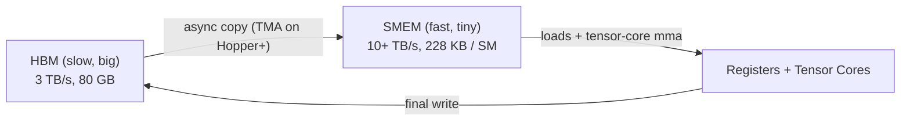

# Shared Memory

<Mode is="learn">

The previous two lessons set the stage. The SM is the unit you optimize for; the warp is what actually runs; the tensor cores do the math. The missing piece — the one that turns "GPU has compute" into "GPU is fast" — is **shared memory**.

Shared memory (SMEM) is a small, programmer-managed scratch pad inside each SM: about 228 KB on H100, 256 KB on B200. It's roughly 10× faster than HBM and lives right next to the tensor cores. Every fast AI kernel works the same way: stream a tile of data from HBM into SMEM, then have all the threads in the block hammer that tile dozens of times before moving to the next. Without SMEM tiling, your kernel is HBM-bandwidth-bound and runs at under 10% of peak. With it, you get the actual chip you paid for.

There's a catch, of course. SMEM is split into 32 **banks** — one per warp lane — and if two threads in a warp simultaneously hit the same bank with different addresses, the hardware serializes them. A 32-way **bank conflict** (all 32 lanes hitting the same bank) is *32× slower* than the conflict-free version. Most kernel-perf bugs in hand-written CUDA come down to one of two things: missing SMEM tiling entirely, or having SMEM tiling with a bank conflict on every access.

## TL;DR

- **Shared memory** (SMEM) is per-SM, programmer-managed, on-chip scratch. ~228 KB on H100, 256 KB on B200. Latency: ~30 cycles. Bandwidth: ~10× HBM.
- Every fast kernel uses SMEM as a **staging area**: load a tile from HBM into SMEM, all the threads in the block access it many times, then write the result back. Without SMEM tiling, kernels are HBM-bandwidth-bound and run at under 10% of peak.
- SMEM is split into **32 banks** (one per warp lane). If two threads in a warp hit the same bank with different addresses → **bank conflict** → serialization. **A single 32-way conflict cuts throughput by 32×.**
- The standard fix is **swizzling**: a permutation of the SMEM index that hashes consecutive threads to different banks. CUTLASS/CUTE do this for you; understanding the principle is what lets you debug a slow kernel.
- On Hopper+, the **TMA (Tensor Memory Accelerator)** is a hardware async-copy engine that loads tiles into SMEM in the background while the rest of the warp computes. This is the foundation of every modern AI kernel.

## Mental model



A fast kernel is a *funnel*: HBM streams tiles into SMEM; SMEM feeds tensor cores via registers; tensor cores accumulate; final results stream back. Most of the time the tensor cores are running on data that arrived 3 stages ago — async copies are the only way the math goes fast.

## Why SMEM exists

A naive matmul reads each input element O(N) times directly from HBM. For a 4096×4096 matmul: 4096³ × 2 bytes = **128 GB of memory traffic** for inputs alone — runs in ~40 ms at 3 TB/s, but the actual math is only ~140 TFLOPs / 1979 ≈ 71 μs. So a memory-bound implementation is **560× slower** than compute-bound. SMEM is what closes that gap.

The trick: each output tile of size BM × BN reads BM × K from A and K × BN from B, and reuses each input element BN (or BM) times within the SMEM cache. Effective HBM reads per output = (BM·K + K·BN) / (BM·BN) — for BM = BN = 128 and K very large, that's about 1/64 the naive count. **SMEM amplifies effective bandwidth by ~64×.**

## Declaring and using SMEM

```cuda
__global__ void matmul_smem(const float* A, const float* B, float* C, int M, int N, int K) {
    constexpr int BM = 128, BN = 128, BK = 8;
    __shared__ float As[BM][BK];
    __shared__ float Bs[BK][BN];
    // ... cooperative load + compute as in the previous lesson ...
}
```

Two things to know:
1. The size is fixed at kernel-compile time (`__shared__ float As[128][8]`).
2. SMEM is *per-block*. Every block on every SM gets its own copy when launched. Total SMEM = `kernel_smem × blocks_per_SM × num_SMs`.

For dynamic-size SMEM (rare in AI kernels, common in graph algorithms): `extern __shared__ float buf[];` plus a launch param. Most production AI code uses static-size.

## Bank conflicts — the canonical SMEM bug

SMEM is logically a 2D array, but physically it's split into **32 banks** of 4-byte words. Bank `k` holds words at addresses `4k, 4k+128, 4k+256, ...` (mod 128 bytes). The 32 lanes of a warp issue 32 SMEM accesses simultaneously; if all 32 hit different banks, the access is one cycle. If two or more lanes hit the *same* bank with different addresses, the hardware serializes them.

A 32-way conflict (all 32 lanes hitting the same bank) is **32× slower** than a conflict-free access. This is the single most common reason a hand-written kernel is half the speed it should be.

The classic example: column-major access to a row-major shared tile.

```cuda
__shared__ float Bs[BK][BN];           // BK=8, BN=128 → BN is the contiguous dim
// Warp lane k accesses Bs[lane][col] — lane k touches bank (k * BK + col_offset) mod 32
// If BK ≡ 0 mod 32 (or shares a factor), all lanes hit the same bank → 32-way conflict.
```

For `BK = 8`, lanes 0..31 access columns differing by 8 in bank index → no conflict. For `BK = 16`, lanes alternate banks → 2-way conflict (2× slower). For `BK = 32`, full 32-way conflict — catastrophic.

Profiling tools tell you this directly: in `ncu`, look at `l1tex__shared_st_bank_conflict` and `l1tex__shared_ld_bank_conflict`. If those are >0, you have work to do.

## The fix: padding or swizzling

**Padding** — add an extra word to break the alignment:

```cuda
__shared__ float Bs[BK][BN + 1];     // +1 column of waste, no more conflicts
```

Crude but effective. Costs ~1% of the SMEM tile in waste.

**Swizzling** — permute the SMEM index so logically-consecutive accesses land in different banks. Hopper SMEM has hardware support for swizzle patterns; on older GPUs you XOR the index into a swizzled address yourself:

```cuda
int swizzle(int row, int col) {
    return row * BN + (col ^ (row & 0x7));
}
// Now Bs[swizzle(i, j)] places consecutive logical (i, j) entries into different banks.
```

CUTLASS / CUTE auto-swizzle. Triton picks a swizzle for you when emitting PTX. Hand-written kernels in 2026 generally use the hardware swizzle modes (`swizzle<3, 3, 3>` etc. in PTX), not manual XOR.

## TMA — async loads on Hopper+

The Tensor Memory Accelerator is a dedicated hardware unit that does bulk async copies between HBM and SMEM. The key property: **a TMA load takes one instruction on a single thread**, not 32 threads cooperating. The TMA engine fires-and-forgets the copy; your warp continues to execute other instructions; you `wait` on the TMA fence later.

```cuda
// Pseudocode for Hopper TMA usage
cuda::barrier mbar;
init(mbar);

cp.async.bulk.tensor.2d(SMEM_buf, &tma_descriptor, &mbar, M, K, blockIdx);
// ... do useful work; tensor cores can mma on a previously-loaded tile ...
mbar.wait();    // sync only when you actually need this tile
```

Combined with **warp specialization** (some warps in the block are "producers" doing TMA, others are "consumers" doing mma), you get a perfectly pipelined kernel: while one warp's TMA is bringing in tile k+1, another warp's tensor cores are mma'ing tile k. This is what FlashAttention-3, TileLang, and ThunderKittens are built on.

## CUTE / Triton — the modern abstraction

In CUTE (CUTLASS's layout language), SMEM tiles, swizzle modes, and TMA descriptors are all expressed as **layouts** — composable mappings from logical coords to physical addresses. The same kernel runs on Ampere (no TMA, manual cp.async) and Hopper (TMA-aware) with the same code; the layout types change.

Triton hides this entirely. You write:

```python
a = tl.load(A_ptr + offsets, mask=mask, other=0.0)
```

and the compiler picks: cp.async on Ampere, TMA on Hopper, whatever is fastest on Blackwell. Same source, optimal code per chip.

## Run it in your browser — bank-conflict simulator

<RunInBrowser
  description="See how a warp's 32 SMEM accesses distribute across 32 banks for various stride patterns."
  code={`def access_pattern(name, addresses):
    """Compute bank usage and conflict factor for a warp's worth of SMEM accesses."""
    BANKS = 32
    # 4-byte words → bank = (address // 4) % 32
    banks = [(a // 4) % BANKS for a in addresses]
    counts = [banks.count(b) for b in range(BANKS)]
    conflict = max(counts)
    print(f"{name:<35} max conflicts on a single bank: {conflict}x")

# Each warp lane k accesses one element. We compute its address.
# Pattern A: row-major access to a (32, 32) FP32 tile, lanes go across columns.
print("Tile float32[32][32], lanes 0..31 read row 0 columns 0..31:")
addresses_A = [4 * (0 * 32 + lane) for lane in range(32)]
access_pattern("  contiguous columns (good)", addresses_A)

# Pattern B: lanes go down a column (transposed access pattern).
print("Same tile, lanes 0..31 read column 0 rows 0..31:")
addresses_B = [4 * (lane * 32 + 0) for lane in range(32)]
access_pattern("  one column (32x conflict)", addresses_B)

# Pattern C: padded tile float32[32][33] — same column access, no conflict.
print("Padded tile float32[32][33], same column-traversal:")
addresses_C = [4 * (lane * 33 + 0) for lane in range(32)]
access_pattern("  padded (no conflict)", addresses_C)

# Pattern D: XOR swizzle — col XOR with row's low 5 bits scatters across all 32 banks.
print("Swizzled access (col XOR (row & 0x1f)):")
addresses_D = [4 * (lane * 32 + (0 ^ (lane & 0x1f))) for lane in range(32)]
access_pattern("  swizzled (no conflict)", addresses_D)
`}
/>

The pattern-B output shows the canonical 32× conflict: every lane hits bank 0. Adding one column of padding (pattern C) or a bit of XOR swizzle (D) takes it back to 1×. This is the kind of micro-decision that turns a 250 GB/s SMEM into a 12 TB/s SMEM.

## Quick check

<FillIn
  prompt="The number of SMEM banks on every CUDA GPU since Volta:"
  answer="32"
  hint="One per warp lane."
  explanation="32 banks of 4-byte words. The hardware lets a warp issue 32 SMEM accesses per cycle; if they all hit different banks, throughput is one cycle. Same-bank-different-address = serialized."
/>

<Quiz
  question="A new kernel author writes a transpose kernel using `__shared__ float tile[32][32]`. They benchmark and find SMEM stalls dominating. What's the *one-line fix*?"
  options={[
    'Switch to `__shared__ double tile[32][32]`.',
    'Pad the tile to `__shared__ float tile[32][33]`.',
    'Reduce block size.',
    'Add `__syncthreads()` before each access.',
  ]}
  answer={1}
  explanation="A 32×32 FP32 tile has stride 32 — every column access has all 32 lanes hitting the same bank → 32-way conflict. Padding to 33 (or swizzling) breaks the alignment. This is the textbook GPU optimization; literally one character of source change for ~10× throughput on transpose-style kernels."
/>

## Key takeaways

1. **SMEM is the staging area** between HBM and tensor cores. ~228 KB on H100, ~256 KB on B200. Programmer-managed.
2. **32 banks. Bank conflicts are the most common SMEM bug.** A 32-way conflict cuts throughput by 32×.
3. **Padding (`+1`) or swizzling fixes conflicts.** CUTLASS and Triton do this automatically; hand-written kernels need to be aware.
4. **TMA on Hopper+** is the async-copy engine that makes warp-specialized kernels possible. Every modern AI kernel uses it.
5. **The funnel is HBM → SMEM → registers → tensor cores.** Get the SMEM choreography right and the rest is bookkeeping.

## Go deeper

<Resources
  items={[
    { kind: 'docs', href: 'https://docs.nvidia.com/cuda/cuda-c-programming-guide/index.html#shared-memory', title: 'CUDA C++ Programming Guide — Shared Memory', note: 'Authoritative description of SMEM, banks, and conflicts. Section 5.3.2 has the bank-conflict examples.' },
    { kind: 'docs', href: 'https://docs.nvidia.com/cuda/parallel-thread-execution/index.html#tensor-memory', title: 'PTX ISA — TMA / cp.async.bulk.tensor', note: 'The hardware spec for the Tensor Memory Accelerator. The instruction your kernel ultimately emits.' },
    { kind: 'blog', href: 'https://research.colfax-intl.com/tutorial-hopper-async-warp-specialization/', title: 'Colfax — Hopper Asynchronous Warp Specialization', note: 'Best modern walkthrough of TMA + producer/consumer warps on H100. Hands-on, code-first.' },
    { kind: 'blog', href: 'https://siboehm.com/articles/22/CUDA-MMM', title: 'siboehm — Optimizing CUDA MMM', note: 'The bank-conflict optimization stage shows the speedup numerically.' },
    { kind: 'blog', href: 'https://hazyresearch.stanford.edu/blog/2024-05-12-tk', title: 'ThunderKittens — Hazy Research', note: 'Where the 16×16 SMEM tile becomes a primitive. The "register pressure problem" section is exactly this lesson\'s mental model.' },
    { kind: 'repo', href: 'https://github.com/NVIDIA/cutlass', title: 'NVIDIA/cutlass', note: '`include/cute/atom/copy_traits_sm90.hpp` is the source of truth for TMA usage; `include/cute/swizzle.hpp` is the modern swizzle abstraction.' },
  ]}
/>

</Mode>

<Mode is="reference">

> **Prereqs:** [SM Architecture](./sm-architecture) and [Thread Hierarchy](./thread-hierarchy). This lesson is the third leg of the GPU-fundamentals triangle: how kernels actually move data on-chip.

## TL;DR

- **Shared memory** (SMEM) is per-SM, programmer-managed, on-chip scratch. ~228 KB on H100, 256 KB on B200. Latency: ~30 cycles. Bandwidth: ~10× HBM.
- Every fast kernel uses SMEM as a **staging area**: load a tile from HBM into SMEM, all the threads in the block access it many times, then write the result back. Without SMEM tiling, kernels are HBM-bandwidth-bound and run at under 10% of peak.
- SMEM is split into **32 banks** (one per warp lane). If two threads in a warp hit the same bank with different addresses → **bank conflict** → serialization. **A single 32-way conflict cuts throughput by 32×.**
- The standard fix is **swizzling**: a permutation of the SMEM index that hashes consecutive threads to different banks. CUTLASS/CUTE do this for you; understanding the principle is what lets you debug a slow kernel.
- On Hopper+, the **TMA (Tensor Memory Accelerator)** is a hardware async-copy engine that loads tiles into SMEM in the background while the rest of the warp computes. This is the foundation of every modern AI kernel.

## Why this matters

If you can write code that uses HBM well, you've made a 10–100 GB/s computer. If you can write code that uses SMEM well, you've made a 1–5 TB/s computer. Every modern AI kernel — Flash Attention, GEMM, paged attention, the GroupNorm fused into your model — is fundamentally a story about SMEM choreography. Knowing how SMEM works is what separates "I called `torch.matmul` and it was slow" from "I'm reading the kernel and I see the bug."

## Mental model


A fast kernel is a *funnel*: HBM streams tiles into SMEM; SMEM feeds tensor cores via registers; tensor cores accumulate; final results stream back. Most of the time the tensor cores are running on data that arrived 3 stages ago — async copies are the only way the math goes fast.

## Concrete walkthrough

### Why SMEM exists

A naive matmul reads each input element O(N) times directly from HBM. For a 4096×4096 matmul: 4096³ × 2 bytes = **128 GB of memory traffic** for inputs alone — runs in ~40 ms at 3 TB/s, but the actual math is only ~30 GFLOPs… wait, ~140 TFLOPs / 1979 = 71 μs. So a memory-bound implementation is **560× slower** than compute-bound. SMEM is what closes that gap.

The trick: each output tile of size BM × BN reads BM × K from A and K × BN from B, and reuses each input element BN (or BM) times within the SMEM cache. Effective HBM reads per output = (BM·K + K·BN) / (BM·BN) — for BM = BN = 128 and K very large, that's about 1/64 the naive count. **SMEM amplifies effective bandwidth by ~64×.**

### Declaring and using SMEM

```cuda
__global__ void matmul_smem(const float* A, const float* B, float* C, int M, int N, int K) {
    constexpr int BM = 128, BN = 128, BK = 8;
    __shared__ float As[BM][BK];
    __shared__ float Bs[BK][BN];
    // ... cooperative load + compute as in the previous lesson ...
}
```

Two things to know:
1. The size is fixed at kernel-compile time (`__shared__ float As[128][8]`).
2. SMEM is *per-block*. Every block on every SM gets its own copy when launched. Total SMEM = `kernel_smem × blocks_per_SM × num_SMs`.

For dynamic-size SMEM (rare in AI kernels, common in graph algorithms): `extern __shared__ float buf[];` plus a launch param. Most production AI code uses static-size.

### Bank conflicts — the canonical SMEM bug

SMEM is logically a 2D array, but physically it's split into **32 banks** of 4-byte words. Bank `k` holds words at addresses `4k, 4k+128, 4k+256, ...` (mod 128 bytes). The 32 lanes of a warp issue 32 SMEM accesses simultaneously; if all 32 hit different banks, the access is one cycle. If two or more lanes hit the *same* bank with different addresses, the hardware serializes them.

A 32-way conflict (all 32 lanes hitting the same bank) is **32× slower** than a conflict-free access. This is the single most common reason a hand-written kernel is half the speed it should be.

The classic example: column-major access to a row-major shared tile.

```cuda
__shared__ float Bs[BK][BN];           // BK=8, BN=128 → BN is the contiguous dim
// Warp lane k accesses Bs[lane][col] — lane k touches bank (k * BK + col_offset) mod 32
// If BK ≡ 0 mod 32 (or shares a factor), all lanes hit the same bank → 32-way conflict.
```

For `BK = 8`, lanes 0..31 access columns differing by 8 in bank index → no conflict. For `BK = 16`, lanes alternate banks → 2-way conflict (2× slower). For `BK = 32`, full 32-way conflict — catastrophic.

Profiling tools tell you this directly: in `ncu`, look at `l1tex__shared_st_bank_conflict` and `l1tex__shared_ld_bank_conflict`. If those are >0, you have work to do.

### The fix: padding or swizzling

**Padding** — add an extra word to break the alignment:

```cuda
__shared__ float Bs[BK][BN + 1];     // +1 column of waste, no more conflicts
```

Crude but effective. Costs ~1% of the SMEM tile in waste.

**Swizzling** — permute the SMEM index so logically-consecutive accesses land in different banks. Hopper SMEM has hardware support for swizzle patterns; on older GPUs you XOR the index into a swizzled address yourself:

```cuda
int swizzle(int row, int col) {
    return row * BN + (col ^ (row & 0x7));
}
// Now Bs[swizzle(i, j)] places consecutive logical (i, j) entries into different banks.
```

CUTLASS / CUTE auto-swizzle. Triton picks a swizzle for you when emitting PTX. Hand-written kernels in 2026 generally use the hardware swizzle modes (`swizzle<3, 3, 3>` etc. in PTX), not manual XOR.

### TMA — async loads on Hopper+

The Tensor Memory Accelerator is a dedicated hardware unit that does bulk async copies between HBM and SMEM. The key property: **a TMA load takes one instruction on a single thread**, not 32 threads cooperating. The TMA engine fires-and-forgets the copy; your warp continues to execute other instructions; you `wait` on the TMA fence later.

```cuda
// Pseudocode for Hopper TMA usage
cuda::barrier mbar;
init(mbar);

cp.async.bulk.tensor.2d(SMEM_buf, &tma_descriptor, &mbar, M, K, blockIdx);
// ... do useful work; tensor cores can mma on a previously-loaded tile ...
mbar.wait();    // sync only when you actually need this tile
```

Combined with **warp specialization** (some warps in the block are "producers" doing TMA, others are "consumers" doing mma), you get a perfectly pipelined kernel: while one warp's TMA is bringing in tile k+1, another warp's tensor cores are mma'ing tile k. This is what FlashAttention-3, TileLang, and ThunderKittens are built on.

### CUTE / Triton — the modern abstraction

In CUTE (CUTLASS's layout language), SMEM tiles, swizzle modes, and TMA descriptors are all expressed as **layouts** — composable mappings from logical coords to physical addresses. The same kernel runs on Ampere (no TMA, manual cp.async) and Hopper (TMA-aware) with the same code; the layout types change.

Triton hides this entirely. You write:

```python
a = tl.load(A_ptr + offsets, mask=mask, other=0.0)
```

and the compiler picks: cp.async on Ampere, TMA on Hopper, whatever is fastest on Blackwell. Same source, optimal code per chip.

## Run it in your browser — bank-conflict simulator

<RunInBrowser
  description="See how a warp's 32 SMEM accesses distribute across 32 banks for various stride patterns."
  code={`def access_pattern(name, addresses):
    """Compute bank usage and conflict factor for a warp's worth of SMEM accesses."""
    BANKS = 32
    # 4-byte words → bank = (address // 4) % 32
    banks = [(a // 4) % BANKS for a in addresses]
    counts = [banks.count(b) for b in range(BANKS)]
    conflict = max(counts)
    print(f"{name:<35} max conflicts on a single bank: {conflict}x")

# Each warp lane k accesses one element. We compute its address.
# Pattern A: row-major access to a (32, 32) FP32 tile, lanes go across columns.
print("Tile float32[32][32], lanes 0..31 read row 0 columns 0..31:")
addresses_A = [4 * (0 * 32 + lane) for lane in range(32)]
access_pattern("  contiguous columns (good)", addresses_A)

# Pattern B: lanes go down a column (transposed access pattern).
print("Same tile, lanes 0..31 read column 0 rows 0..31:")
addresses_B = [4 * (lane * 32 + 0) for lane in range(32)]
access_pattern("  one column (32x conflict)", addresses_B)

# Pattern C: padded tile float32[32][33] — same column access, no conflict.
print("Padded tile float32[32][33], same column-traversal:")
addresses_C = [4 * (lane * 33 + 0) for lane in range(32)]
access_pattern("  padded (no conflict)", addresses_C)

# Pattern D: XOR swizzle — col XOR with row's low 5 bits scatters across all 32 banks.
print("Swizzled access (col XOR (row & 0x1f)):")
addresses_D = [4 * (lane * 32 + (0 ^ (lane & 0x1f))) for lane in range(32)]
access_pattern("  swizzled (no conflict)", addresses_D)
`}
/>

The pattern-B output shows the canonical 32× conflict: every lane hits bank 0. Adding one column of padding (pattern C) or a bit of XOR swizzle (D) takes it back to 1×. This is the kind of micro-decision that turns a 250 GB/s SMEM into a 12 TB/s SMEM.

## Quick check

<FillIn
  prompt="The number of SMEM banks on every CUDA GPU since Volta:"
  answer="32"
  hint="One per warp lane."
  explanation="32 banks of 4-byte words. The hardware lets a warp issue 32 SMEM accesses per cycle; if they all hit different banks, throughput is one cycle. Same-bank-different-address = serialized."
/>

<Quiz
  question="A new kernel author writes a transpose kernel using `__shared__ float tile[32][32]`. They benchmark and find SMEM stalls dominating. What's the *one-line fix*?"
  options={[
    'Switch to `__shared__ double tile[32][32]`.',
    'Pad the tile to `__shared__ float tile[32][33]`.',
    'Reduce block size.',
    'Add `__syncthreads()` before each access.',
  ]}
  answer={1}
  explanation="A 32×32 FP32 tile has stride 32 — every column access has all 32 lanes hitting the same bank → 32-way conflict. Padding to 33 (or swizzling) breaks the alignment. This is the textbook GPU optimization; literally one character of source change for ~10× throughput on transpose-style kernels."
/>

## Key takeaways

1. **SMEM is the staging area** between HBM and tensor cores. ~228 KB on H100, ~256 KB on B200. Programmer-managed.
2. **32 banks. Bank conflicts are the most common SMEM bug.** A 32-way conflict cuts throughput by 32×.
3. **Padding (`+1`) or swizzling fixes conflicts.** CUTLASS and Triton do this automatically; hand-written kernels need to be aware.
4. **TMA on Hopper+** is the async-copy engine that makes warp-specialized kernels possible. Every modern AI kernel uses it.
5. **The funnel is HBM → SMEM → registers → tensor cores.** Get the SMEM choreography right and the rest is bookkeeping.

## Go deeper

<Resources
  items={[
    { kind: 'docs', href: 'https://docs.nvidia.com/cuda/cuda-c-programming-guide/index.html#shared-memory', title: 'CUDA C++ Programming Guide — Shared Memory', note: 'Authoritative description of SMEM, banks, and conflicts. Section 5.3.2 has the bank-conflict examples.' },
    { kind: 'docs', href: 'https://docs.nvidia.com/cuda/parallel-thread-execution/index.html#tensor-memory', title: 'PTX ISA — TMA / cp.async.bulk.tensor', note: 'The hardware spec for the Tensor Memory Accelerator. The instruction your kernel ultimately emits.' },
    { kind: 'blog', href: 'https://research.colfax-intl.com/tutorial-hopper-async-warp-specialization/', title: 'Colfax — Hopper Asynchronous Warp Specialization', note: 'Best modern walkthrough of TMA + producer/consumer warps on H100. Hands-on, code-first.' },
    { kind: 'blog', href: 'https://siboehm.com/articles/22/CUDA-MMM', title: 'siboehm — Optimizing CUDA MMM', note: 'The bank-conflict optimization stage shows the speedup numerically.' },
    { kind: 'blog', href: 'https://hazyresearch.stanford.edu/blog/2024-05-12-tk', title: 'ThunderKittens — Hazy Research', note: 'Where the 16×16 SMEM tile becomes a primitive. The "register pressure problem" section is exactly this lesson\'s mental model.' },
    { kind: 'repo', href: 'https://github.com/NVIDIA/cutlass', title: 'NVIDIA/cutlass', note: '`include/cute/atom/copy_traits_sm90.hpp` is the source of truth for TMA usage; `include/cute/swizzle.hpp` is the modern swizzle abstraction.' },
  ]}
/>

</Mode>

<LessonComplete />
