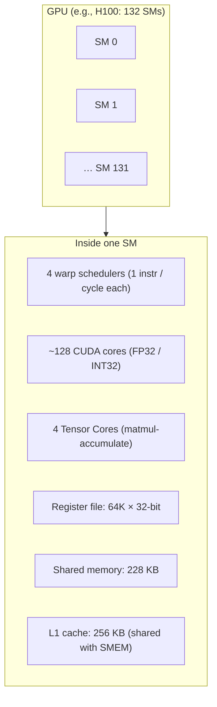

# SM Architecture

> **Companion to:** [Thread Hierarchy](./thread-hierarchy) (the programmer's view) and [Shared Memory](./shared-memory) (the per-SM scratch pad). This lesson is the hardware view: what's actually inside the chip.

## TL;DR

- A modern GPU is a fleet of **Streaming Multiprocessors** (SMs). Each SM is its own little processor: 4 warp schedulers, 64–128 CUDA cores, 4 tensor cores, a register file, and shared memory. Everything that runs on a GPU runs on one SM at a time.
- The **warp** is the real unit of execution: 32 threads marching in lockstep through one instruction at a time. Threads in a warp can't truly diverge — they take turns when they branch. **A kernel that thinks "thread" is the unit is going to be slow.**
- **Tensor Cores** do the heavy lifting in modern AI: 4×8×16 (or larger) FP16/BF16/FP8 matrix-multiply-accumulate per cycle per core. Hopper has 4 per SM; Blackwell has more and faster ones with FP4/FP6 support.
- **Occupancy** is the fraction of an SM's potential warps that are actually resident. High occupancy hides memory latency; low occupancy with high arithmetic intensity is fine. Don't chase occupancy as an end in itself.
- The same kernel on H100 (132 SMs) vs B200 (148 SMs) vs MI355X (288 CUs) sees different parallelism budgets. Tile size and CTA count are tuned per-chip.

## Why this matters

Every fast GPU kernel — Flash Attention, cuBLAS GEMM, PagedAttention, vLLM kernels — is written *to the SM*. The programmer's "thread block" abstraction is real, but the *unit you optimize against* is one SM with a fixed budget of registers, shared memory, and warp slots. Knowing the SM's resources by heart is what lets you read a CUTLASS source file and immediately see why it picked a 128×128 tile, four pipelined stages, and 8 warps per CTA. Without this picture, kernel code looks like magic numbers.

## Mental model



Memorize the resources of one SM. Every kernel-tuning decision (tile size, occupancy, register pressure, smem usage) is a budget allocation across this list.

## Concrete walkthrough

### What's inside an H100 SM

| Resource             | H100 SM                         | What it bounds                       |
|----------------------|----------------------------------|--------------------------------------|
| Warp schedulers      | 4                                | Up to 4 warps issue per cycle        |
| CUDA cores (FP32)    | 128                              | Vector / scalar non-tensor work       |
| Tensor cores         | 4 (4th gen)                      | All the AI matmul throughput          |
| Register file        | 64 K × 32-bit (256 KB)           | Per-thread registers; tile size       |
| Shared memory + L1   | 228 KB + 28 KB driver reserved  | On-chip scratch + L1 cache            |
| Max threads resident | 2048                             | Occupancy ceiling                     |
| Max warps resident   | 64                               | Same as 2048 / 32                    |
| Max blocks resident  | 32                               | Number of CTAs co-resident            |
| HBM bandwidth (chip)| 3.35 TB/s                        | Cross-SM memory traffic               |

For comparison: a B200 SM bumps tensor cores to FP4-capable 5th-gen, raises shared memory to 256 KB, and adds the **Tensor Memory Accelerator (TMA)** as a first-class async-copy engine. MI355X uses CUs (Compute Units) instead of SMs — same idea, different name, slightly different layout.

### The warp is the real unit

A warp is 32 threads. They share an instruction pointer. When they all take the same branch, they execute together at full throughput. When they diverge — half take the if, half take the else — the warp **serializes** through both branches: it executes the if-branch with the else-half masked off, then the else-branch with the if-half masked off. Throughput halves per divergence level.

```cuda
// Bad: each thread does different work based on its lane id
if (threadIdx.x % 2 == 0) { do_heavy_work_A(); } else { do_heavy_work_B(); }
// Both branches execute serially within the warp.

// Good: all 32 threads in the warp do the same work, on different data.
out[i] = heavy_work(in[i]);
```

This is why "embarrassingly parallel" maps to GPUs but anything with branching needs care. Sorting, sparse data, dynamic batching — all classic GPU pain points because they branch.

### Tensor cores do (almost) all the work

A tensor core in Hopper executes one `mma.sync` per clock per warp at FP16: a 16×8×16 matmul-and-accumulate, producing a 16×8 fragment. That's 16 × 8 × 16 × 2 = **4096 FLOPs/cycle/warp** at FP16. Per SM with 4 tensor cores running concurrently (warp-specialized), that's roughly 16,000 FLOPs/cycle. Times ~1.8 GHz boost clock × 132 SMs ≈ 1979 TFLOPS — exactly NVIDIA's spec sheet number.

The lesson: **everything else on the SM is bookkeeping for the tensor cores**. CUDA cores load and stage data; warp schedulers issue mma; shared memory holds tiles; registers hold accumulators. The CUDA cores themselves don't even hit 100 TFLOPS — the tensor cores are the reason the chip exists.

On Blackwell, this generalizes: 5th-gen tensor cores do FP4/FP6 in addition to FP8/FP16, and the **Tensor Memory** (a new on-chip pool) sits between SMEM and the tensor cores so you can keep accumulators larger than the register file allows.

### Occupancy, briefly

Occupancy = (warps actually resident on SM) / (max warps the SM can hold). Each warp consumes:
- registers (per-thread × 32)
- shared memory (per-CTA, divided across warps in the CTA)
- a "warp slot" (max 64 warps per SM on H100)

If you use 128 registers/thread on H100, max warps is `64K / (128 × 32) = 16` — 25% occupancy. If your kernel has high arithmetic intensity (lots of math per memory load) that's *fine* — you don't need extra warps to hide memory latency. If your kernel is memory-bound, low occupancy means HBM stalls show through.

**Don't chase occupancy. Chase throughput.** A FlashAttention kernel runs at ~25% occupancy by design — it spends most of its registers on accumulators because that's where the win is.

### Reading CUTLASS by SM resources

A CUTLASS kernel definition like `gemm<tile=128x128x64, stages=3, warps_per_cta=8>` translates to:
- **Tile 128×128×64**: each CTA computes a 128×128 output block, processing K in chunks of 64. Output bytes: 128 × 128 × 4 (FP32 accum) = 64 KB → fits in register file.
- **3 stages**: the async-copy pipeline keeps 3 K-chunks in flight (stage 0 reading from HBM, stage 1 in SMEM, stage 2 being matmul'd). Triple-buffered to hide HBM latency.
- **8 warps per CTA**: 256 threads. Tensor cores run on warps; at 4 schedulers per SM and 8 warps per CTA, each scheduler has 2 warps to round-robin. Hides instruction issue latency.
- **Shared memory used**: 3 stages × (128 × 64 + 64 × 128) × 2 bytes = 96 KB. Fits in 228 KB SMEM. Could fit 2 CTAs per SM → potentially higher occupancy, but the kernel typically chooses 1 to keep registers per warp high.

The numbers aren't magic; they're an SM-budget allocation. Once you can read tile shapes as resource allocations, kernel code becomes legible.

## Run it in your browser — SM resource calculator

<RunInBrowser
  description="Type in a kernel's tile shape and stage count; see the resource budget vs an H100 SM."
  code={`def cta_resources(tile_m, tile_n, tile_k, stages, dtype_bytes_in=2, dtype_bytes_acc=4):
    """Approximate SM resources for one CTA running this tile."""
    # Output (C accumulator) lives in registers per CTA
    c_regs_bytes = tile_m * tile_n * dtype_bytes_acc

    # Pipelined SMEM for inputs A and B
    smem_bytes = stages * (tile_m * tile_k + tile_k * tile_n) * dtype_bytes_in

    return c_regs_bytes, smem_bytes

H100_SM = {
    "register_file_bytes": 64 * 1024 * 4,       # 64K × 32-bit
    "smem_bytes":          228 * 1024,
    "max_warps":           64,
    "tensor_cores":        4,
}

print(f"H100 SM budget: {H100_SM['register_file_bytes']//1024} KB regs, "
      f"{H100_SM['smem_bytes']//1024} KB SMEM, {H100_SM['max_warps']} warp slots")
print()
print(f"{'tile (M×N×K)':>16} {'stages':>7} {'C regs':>10} {'SMEM':>10} {'fits SM?':>10}")
print('-' * 58)

configs = [
    (128, 128, 64, 3, "CUTLASS default H100 GEMM"),
    (128, 128, 64, 4, "deeper pipeline"),
    (256, 128, 64, 3, "wider tile"),
    (64, 64, 64, 3, "small tile (good for small-N decode)"),
    (256, 256, 64, 3, "too big — register file overflow"),
]
for m, n, k, s, label in configs:
    c, smem = cta_resources(m, n, k, s)
    fits = c < H100_SM['register_file_bytes'] and smem < H100_SM['smem_bytes']
    print(f"{m}x{n}x{k:>3} {s:>7} {c//1024:>7} KB {smem//1024:>7} KB {'YES' if fits else 'NO':>9}   {label}")
`}
/>

The 256×256 tile fails because 256 KB of FP32 accumulators exceeds the 256 KB register file (and CUTLASS would spill to local memory, killing throughput). This is exactly why CUTLASS / Triton autotune only emits a handful of tile shapes — the rest don't fit.

## Quick check

<FillIn
  prompt="The number of threads per warp on every NVIDIA GPU since 2008:"
  answer="32"
  hint="One number; doesn't change between Volta, Hopper, Blackwell, or any successor."
  explanation="A warp is 32 threads. AMD's wavefront is 64. The unit hasn't changed in 17+ years on NVIDIA — every CUDA programming idiom is built around it."
/>

<Quiz
  question="A custom kernel author profiles their FA-style attention kernel and finds it runs at 22% occupancy on H100. They worry. What's the *most likely* correct response?"
  options={[
    'Reduce register pressure to raise occupancy.',
    'Check throughput — if tensor-core utilization is high (>70%), low occupancy is by design and shouldn\'t be touched.',
    'Increase the CTA size.',
    'Switch to Blackwell.',
  ]}
  answer={1}
  explanation="Flash Attention–style kernels run at 20–30% occupancy *by design* because they need lots of registers per thread for the running max/sum and the tile accumulators. Low occupancy is fine when the tensor cores stay busy. The metric to watch is `sm__pipe_tensor_op_cycles_active.avg.pct_of_peak_sustained_active` (in ncu), not occupancy. Lowering register count to raise occupancy would either spill (slow) or shrink the tile (also slow)."
/>

## Key takeaways

1. **The SM is the unit you optimize against.** Memorize its resources: register file, shared memory, warp slots, tensor cores.
2. **A warp is 32 threads in lockstep.** Branch divergence serializes; embarrassingly-parallel patterns thrive.
3. **Tensor cores are why the GPU is fast.** Everything else on the SM is bookkeeping to keep the tensor cores fed.
4. **Occupancy is a means, not an end.** High arithmetic intensity → low occupancy is fine.
5. **Reading kernel tile shapes = reading SM resource allocations.** Once this clicks, CUTLASS / Triton kernels stop being magic.

## Go deeper

<Resources
  items={[
    { kind: 'docs', href: 'https://docs.nvidia.com/cuda/cuda-c-programming-guide/index.html#hardware-implementation', title: 'CUDA C++ Programming Guide — Hardware Implementation', note: 'Authoritative. The "Compute Capability" tables list per-SM resources for every architecture from Kepler through Blackwell.' },
    { kind: 'docs', href: 'https://docs.nvidia.com/cuda/hopper-tuning-guide/index.html', title: 'NVIDIA Hopper Tuning Guide', note: 'How to think about TMA, WGMMA, async memory pipelines, warp specialization. Required reading before writing serious H100 code.' },
    { kind: 'docs', href: 'https://docs.nvidia.com/cuda/blackwell-tuning-guide/index.html', title: 'NVIDIA Blackwell Tuning Guide', note: '5th-gen tensor cores, FP4, Tensor Memory. The 2025+ extension of the Hopper guide.' },
    { kind: 'blog', href: 'https://hazyresearch.stanford.edu/blog/2024-05-12-tk', title: 'ThunderKittens — Hazy Research', author: 'Spector et al., 2024', note: 'Best modern explanation of warp-specialized programming in plain English. Read alongside the SM picture above.' },
    { kind: 'blog', href: 'https://siboehm.com/articles/22/CUDA-MMM', title: 'siboehm — How to Optimize a CUDA Matmul', note: 'Walks from naive to near-cuBLAS in stages. Best ground-up CUDA tutorial on the modern open web.' },
    { kind: 'repo', href: 'https://github.com/NVIDIA/cutlass', title: 'NVIDIA/cutlass', note: 'The reference. Look at `cute/atom/mma_traits_sm90.hpp` to see how Hopper tensor-core operations are encoded.' },
  ]}
/>

<LessonComplete />
