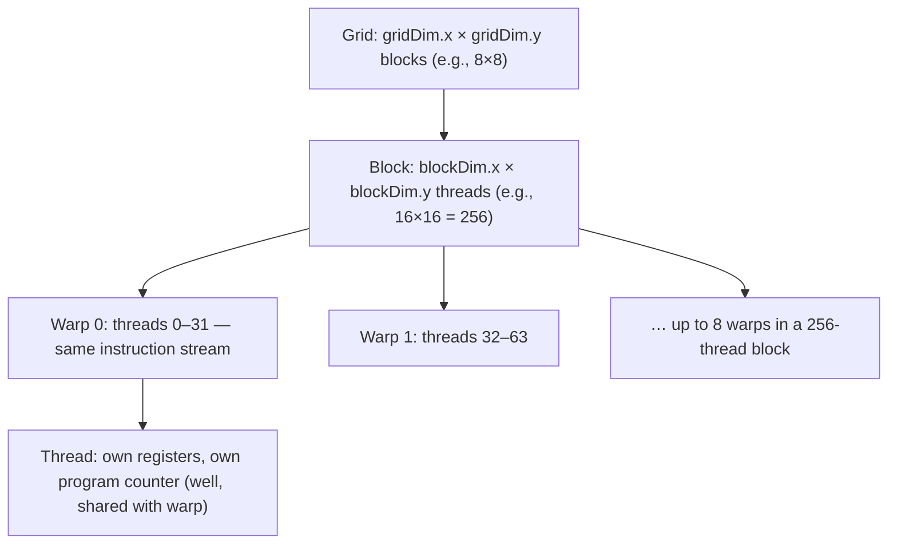

# Thread Hierarchy

> **Prereq:** [SM Architecture](./sm-architecture) (the hardware view). This lesson is the *programmer's view* — how CUDA / HIP / Triton expose the SM's parallelism.

## TL;DR

- A CUDA kernel launches a **grid** of **thread blocks** (CTAs). Each block runs on a single SM. Each block is a set of **threads**, organized internally into **warps** of 32.
- Hierarchy: **grid → block → warp → thread**. Each level has its own coordinates (`blockIdx`, `threadIdx`, etc.) and its own synchronization primitives.
- **The block-per-tile pattern** is universal in modern AI kernels: each block computes one output tile (e.g., 128×128 of a matmul). The grid is `(M/128, N/128)`. Index math turns block coordinates into tile coordinates.
- **Synchronization is hierarchical**: `__syncthreads()` syncs a block, `__syncwarp()` syncs a warp, the CUDA driver syncs the grid. Cooperative groups generalize this on H100+ with **distributed shared memory** (DSMEM) — adjacent blocks share an SMEM cluster.
- **Triton hides this hierarchy.** A Triton kernel sees one *program* per tile; the warp/thread layer is implicit and the compiler decides. Same mental model, less typing.

## Why this matters

The thread hierarchy is the API the GPU presents to the programmer. Every CUDA / HIP / Triton / CUTLASS kernel is written against it. Reading kernel code requires fluency in the index math: "this block computes tile `(blockIdx.x, blockIdx.y)`, which corresponds to output rows `[M0..M0+128)` and columns `[N0..N0+128)` of the matrix." Get this index translation in your head and kernel code becomes 90% boilerplate; miss it and every kernel looks like noise.

## Mental model



Each block runs on **one** SM. Each warp runs on **one** scheduler. Each thread is just a lane in a SIMD lane within a warp. The hierarchy is how you address them.

## Concrete walkthrough

### Index math

The standard idioms:

```cuda
// 1D grid of 1D blocks: typical for elementwise kernels
int i = blockIdx.x * blockDim.x + threadIdx.x;
if (i < N) out[i] = f(in[i]);

// 2D grid for a matmul: each block computes one output tile
int row = blockIdx.y * BLOCK_M + threadIdx.y;
int col = blockIdx.x * BLOCK_N + threadIdx.x;

// Warp-level: which warp am I in this block?
int warp_id = threadIdx.x / 32;        // 8 warps in a 256-thread block
int lane_id = threadIdx.x % 32;        // my lane within the warp
```

The "tile coordinate" view is the productive one. `blockIdx.x` and `blockIdx.y` give you the tile's position; the rest is reading and writing within that tile.

### How big should a block be?

The answer is almost always **128 or 256 threads** — i.e., 4 or 8 warps. Reasons:
- Below 32: most of a warp is wasted.
- 32–64: only 1–2 warps; can't hide instruction latency.
- 128–256: enough warps for the scheduler to round-robin; smem and registers stay reasonable.
- 512+: register pressure climbs, fewer blocks fit per SM, occupancy drops.

CUTLASS GEMM typically uses 128 or 256 threads per block (4 or 8 warps). FlashAttention uses 4 warps per block. Triton autotunes between options but the answer is rarely outside this band.

### Block-per-tile, in code

A bare CUDA matmul:

```cuda
__global__ void matmul(const float* A, const float* B, float* C,
                       int M, int N, int K) {
    constexpr int BM = 128, BN = 128, BK = 8;
    __shared__ float As[BM][BK];
    __shared__ float Bs[BK][BN];

    int row = blockIdx.y * BM + threadIdx.y;
    int col = blockIdx.x * BN + threadIdx.x;
    float acc = 0.0f;

    for (int k0 = 0; k0 < K; k0 += BK) {
        // Cooperatively load a tile of A and B into shared memory.
        As[threadIdx.y][threadIdx.x] = A[row * K + k0 + threadIdx.x];
        Bs[threadIdx.y][threadIdx.x] = B[(k0 + threadIdx.y) * N + col];
        __syncthreads();

        // Each thread accumulates its part of C.
        for (int k = 0; k < BK; ++k) {
            acc += As[threadIdx.y][k] * Bs[k][threadIdx.x];
        }
        __syncthreads();
    }
    if (row < M && col < N) C[row * N + col] = acc;
}

// Launch:
dim3 block(16, 16);            // 256 threads
dim3 grid(N / 128, M / 128);   // one block per output tile
matmul<<<grid, block>>>(A, B, C, M, N, K);
```

This is ~90% of every shared-memory matmul ever written. Real production GEMM (cuBLAS, CUTLASS) replaces the inner loop with `mma.sync` calls to tensor cores and adds pipelined async copies — but the outer skeleton is identical.

### Synchronization, by level

| Level                    | Primitive                                       | Cost                              |
|--------------------------|-------------------------------------------------|-----------------------------------|
| Lanes within a warp      | `__syncwarp()` or implicit (lockstep)           | Free; warps execute in lockstep   |
| Threads within a block   | `__syncthreads()` or `bar.sync`                 | Cheap (~10 cycles on Hopper)      |
| Blocks within a cluster  | `cluster.sync()` (Hopper+)                      | Tens of cycles                    |
| Blocks across the grid   | Kernel launch boundary or `grid.sync()` (cooperative kernels) | Microseconds          |
| Different kernels         | `cudaStreamSynchronize()` from host             | Driver round-trip                 |

The big jump is from block-level (cheap) to grid-level (cudaDeviceSynchronize, microseconds). This is why kernels are sized so each one independently produces an output — you don't want to synchronize across blocks more than necessary.

### Hopper / Blackwell extensions

H100 added **thread block clusters**: groups of 8 (or up to 16) blocks that share a *distributed shared memory* (DSMEM) pool. Threads in one block can directly address shared memory in a sibling block (within the cluster) over the SM-to-SM interconnect. This is exactly what FlashAttention-3 uses to overlap MMA on one warp with TMA loads on another.

You opt in with a launch parameter (`__cluster_dims__(2, 1, 1)` in CUDA, similar in Triton). Most LLM training kernels in 2025–2026 use clusters; most inference kernels do not (overhead vs benefit).

### Triton — the same hierarchy, hidden

```python
@triton.jit
def matmul_kernel(A, B, C, M, N, K, stride_am, ...):
    pid_m = tl.program_id(axis=0)            # this is your blockIdx.y
    pid_n = tl.program_id(axis=1)            # this is your blockIdx.x

    # Triton handles thread / warp layout for you. You just write tile math.
    offs_m = pid_m * BLOCK_M + tl.arange(0, BLOCK_M)
    offs_n = pid_n * BLOCK_N + tl.arange(0, BLOCK_N)
    acc = tl.zeros((BLOCK_M, BLOCK_N), dtype=tl.float32)

    for k0 in range(0, K, BLOCK_K):
        a = tl.load(A + ...)                  # tile of A
        b = tl.load(B + ...)                  # tile of B
        acc += tl.dot(a, b)

    tl.store(C + ..., acc)
```

There's no `threadIdx`. Triton allocates a 32-warp block-equivalent program per `pid`, picks tile sizes via autotune, and emits PTX with the right warp/thread distribution. **Same hierarchy, same SM execution, different surface.** This is why most teams write new kernels in Triton and reach for CUTLASS only when they need the last 5%.

## Run it in your browser — block / warp / thread index translator

<RunInBrowser
  description="Walk a thread index through the CUDA hierarchy and get its tile coordinates."
  code={`def cuda_indices(grid_x, grid_y, block_x, block_y, bx, by, tx, ty,
                  block_m, block_n):
    """Given grid + thread coords, return tile + position-in-tile."""
    tile_row = by * block_m
    tile_col = bx * block_n
    elem_row = tile_row + ty
    elem_col = tile_col + tx
    warp_id  = (ty * block_x + tx) // 32
    lane_id  = (ty * block_x + tx) % 32
    return tile_row, tile_col, elem_row, elem_col, warp_id, lane_id

# Imagine a matmul output 4096×4096, tile 128×128, block 16×16 = 256 threads.
M, N = 4096, 4096
BLOCK_M, BLOCK_N = 128, 128
GRID_X, GRID_Y = N // BLOCK_N, M // BLOCK_M
print(f"grid: {GRID_X}×{GRID_Y} blocks, {GRID_X*GRID_Y} total = one block per output tile")
print()
print(f"{'block':>10}{'thread':>10} -> {'tile':>14} {'elem':>14} {'warp':>6} {'lane':>6}")
print('-' * 65)
for (bx, by, tx, ty) in [(0,0,0,0), (0,0,15,15), (3,2,0,0), (31,31,15,15)]:
    tr, tc, er, ec, w, l = cuda_indices(GRID_X, GRID_Y, 16, 16, bx, by, tx, ty,
                                         BLOCK_M, BLOCK_N)
    print(f"({bx:>2},{by:>2}) ({tx:>2},{ty:>2}) -> ({tr:>4},{tc:>4})  "
          f"({er:>4},{ec:>4})  w={w}  l={l}")

print()
print("Notice: thread (15,15) of block (0,0) writes element (15,15) of C.")
print("Thread (15,15) of block (31,31) writes element (4095,4095). Whole grid covers the matrix.")
`}
/>

This is the index calculation every kernel author does in their head. After 100 kernels, it's automatic.

## Quick check

<FillIn
  prompt="A typical CUDA matmul kernel has the launch shape `dim3 grid(N/BN, M/BM); dim3 block(BX, BY)`. Each block computes:"
  answer="one output tile"
  accept={["one tile of C", "one BMxBN tile", "a tile", "one output block"]}
  hint="Block-per-tile is the canonical pattern."
  explanation="One CTA per output tile is the universal modern matmul layout. The grid sweeps the tiles; each block computes its own output region; the inner k-loop streams in tiles of A and B."
/>

<Quiz
  question="Why is `blockDim.x = 1024` rarely the right choice for a matmul kernel, even though it maximizes threads per block?"
  options={[
    'CUDA limits blocks to 1024 threads.',
    'Large blocks consume too many registers and shared memory, dropping occupancy and spilling registers.',
    'Tensor cores can\'t handle 1024-thread blocks.',
    'It\'s slower because of warp scheduling overhead.',
  ]}
  answer={1}
  explanation="With 1024 threads per block, even a modest 80 registers/thread eats the whole register file (1024 × 80 × 4 = 320 KB > 256 KB). The kernel either spills (catastrophic for throughput) or only fits one block per SM (low occupancy). 128–256 thread blocks are the sweet spot — enough warps for scheduling, low enough register pressure to fit multiple blocks per SM."
/>

## Key takeaways

1. **Hierarchy: grid → block → warp → thread.** Each level has its own coords, its own sync primitive, its own resources.
2. **Block-per-tile is the universal pattern.** `blockIdx` gives you the tile; `threadIdx` your position within the tile.
3. **128 or 256 threads per block** for almost all production kernels. Below or above is rare.
4. **Synchronization cost grows with scope.** `__syncwarp` is free; `__syncthreads` is cheap; grid sync is microseconds.
5. **Triton hides the warp/thread layer but not the grid/block one.** You still write `program_id` for the tile coordinate; the rest the compiler picks.

## Go deeper

<Resources
  items={[
    { kind: 'docs', href: 'https://docs.nvidia.com/cuda/cuda-c-programming-guide/index.html#programming-model', title: 'CUDA C++ Programming Guide — Programming Model', note: 'Authoritative. Sections 2.2 (thread hierarchy) and 2.3 (memory hierarchy) are exactly this lesson.' },
    { kind: 'docs', href: 'https://docs.nvidia.com/cuda/cooperative-groups/', title: 'CUDA Cooperative Groups', note: 'Modern API for warp-, block-, and cluster-level primitives. Cleaner than the legacy intrinsics.' },
    { kind: 'docs', href: 'https://triton-lang.org/main/programming-guide/chapter-1/introduction.html', title: 'Triton — Programming Guide', note: 'How `tl.program_id` maps to CUDA blocks; why Triton does not expose threads.' },
    { kind: 'blog', href: 'https://siboehm.com/articles/22/CUDA-MMM', title: 'siboehm — Optimizing CUDA MMM', note: 'Step-by-step matmul optimization. The block/warp/tile picture in code, with measurements.' },
    { kind: 'blog', href: 'https://research.colfax-intl.com/cutlass-tutorial/', title: 'Colfax — CUTLASS Tutorial Series', note: 'Modern (2024) CUTLASS walkthroughs. The first article on layout maps to thread hierarchy.' },
    { kind: 'repo', href: 'https://github.com/NVIDIA/cutlass', title: 'NVIDIA/cutlass', note: 'Look at `examples/00_basic_gemm` to see the simplest end-to-end kernel that uses tile-per-CTA correctly.' },
  ]}
/>

<LessonComplete />
