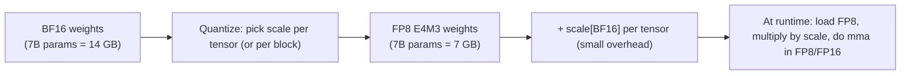

# FP8 Inference

<Mode is="learn">

For most of GPU history, "quantization" meant **INT8** — pack each value into a signed 8-bit integer with one scale factor per tensor, hope the dynamic range was tight enough, and accept the calibration mess that came with it. INT8 worked; nobody loved it.

Then Hopper shipped FP8. Specifically two variants — **E4M3** and **E5M2** — that look like tiny floating-point numbers (1 sign bit, a few exponent bits, a few mantissa bits) instead of integers. The exponent gives them dynamic range *without* per-tensor calibration tricks, the tensor cores execute them natively at 2× the BF16 throughput, and the accuracy is meaningfully better than INT8 at the same 8 bits.

Today FP8 is the default 2026 production-inference quantization. On H100, BF16 → FP8 weights + KV cache halves your HBM traffic, gets you ~1.7× decode throughput, and typically costs less than 0.5 points of MMLU. **If you're not running FP8 in 2026 inference, you're paying ~2× more than necessary.** This lesson is what FP8 actually is, when to pick E4M3 vs E5M2, and how per-tensor scaling makes the trick work.

## TL;DR

- **FP8** is an 8-bit floating-point format (sign + exponent + mantissa). Two variants: **E4M3** (4 exponent bits, 3 mantissa, range ~ ±448, used for weights/activations) and **E5M2** (5 exponent bits, 2 mantissa, range ~ ±57344, used for gradients during training).
- Replaced **INT8** as the standard quantization format on H100+ because: it preserves exponent flexibility (no per-tensor calibration mess), tensor cores natively support it, and accuracy is meaningfully better at the same bit-width.
- **Hopper added FP8 tensor cores; Blackwell added FP4 / FP6 alongside.** All modern AI compilers (CUTLASS, Triton, vLLM, FlashAttention-3) support FP8 weights + activations + KV cache.
- Quality regression from BF16 → FP8 is typically **under 0.5 points** on standard benchmarks (MMLU, GSM8K). KV-cache FP8 quantization adds ~0 measurable regression for most models.
- **Per-tensor scaling** is the magic — the format itself has limited range, but each tensor (or each block) carries a scale factor so the actual values can span any magnitude. The scale is stored in higher precision (BF16 or FP32).

## Mental model



The scale carries the dynamic range; FP8 carries the values. Together you get most of FP16's precision at half the bytes.

## What FP8 actually is, bit-for-bit

A float has three pieces: 1 sign bit, E exponent bits (with bias), M mantissa bits. Examples:

| Format        | Sign | Exp | Mantissa | Bias | Max value | Min positive |
|---------------|------|-----|----------|------|-----------|--------------|
| FP32          | 1    | 8   | 23       | 127  | ~3.4e38   | ~1.2e-38     |
| FP16          | 1    | 5   | 10       | 15   | 65504     | ~6e-5        |
| BF16          | 1    | 8   | 7        | 127  | ~3.4e38   | ~1.2e-38     |
| **E4M3 (FN)** | 1    | 4   | 3        | 7    | **448**   | **2^-9 ≈ 0.002** |
| **E5M2**      | 1    | 5   | 2        | 15   | **57344** | **2^-16**    |

Two important caveats on the FP8 row:

- **E4M3 here is "E4M3FN"** — the OCP / NVIDIA variant where the all-ones exponent encodes finite values + a single NaN, rather than IEEE-style ±∞. That extra encoding slot is why max = 448 (not 240, which is the strict-IEEE max). The H100, B200, and MI300 all use E4M3FN.
- **E5M2 follows IEEE rules**: bias 15, ±∞ at all-ones exponent, max finite = 57344. So max = 57344 *excludes* the inf encoding; the all-ones encoding itself is reserved.

Key observations:
- **E4M3** has higher precision (3 mantissa bits → ~7 representable values per power of 2) but tiny range (±448).
- **E5M2** has wider range (±57344, like FP16) but lower precision (only 2 mantissa bits → 4 values per power of 2).
- Both are way coarser than BF16. Direct conversion of an arbitrary BF16 tensor would clip and round badly.

The fix: per-tensor (or per-block) scaling.

## Per-tensor scaling

Store one BF16 (or FP32) scalar `S` per tensor. The actual value of a weight is `S * fp8_value`. To pick `S`:

1. Find the absolute max value `M` across the tensor.
2. Set `S = M / 448` (so the max value, when divided by S, fits in E4M3's range).
3. For each weight `w`, store `quantize(w / S)` as FP8.

Memory cost: 1 scalar per tensor, negligible. Quality cost: each value is rounded to its nearest E4M3 representable, but because the dynamic range now matches the tensor's, no clipping happens and most rounding error is below 0.5%.

For very large tensors, **block scaling** (one scalar per 32 or 128 elements) trades a bit more memory for tighter range matching → better accuracy. CUTLASS 4 and DeepSeek-V3 both use this.

```python
# Sketch of FP8 quantization
def quantize_fp8_e4m3(w_bf16, block_size=128):
    # w_bf16 shape: (out, in)
    out, inn = w_bf16.shape
    n_blocks = inn // block_size
    w_blocks = w_bf16.view(out, n_blocks, block_size)
    abs_max = w_blocks.abs().amax(dim=-1, keepdim=True)
    scales = abs_max / 448.0          # shape: (out, n_blocks, 1) in BF16
    w_fp8 = (w_blocks / scales).to(torch.float8_e4m3fn)  # cast to FP8
    return w_fp8, scales

# At inference: dequantize via scales, then multiply.
def matmul_fp8(x_fp8, x_scales, w_fp8, w_scales):
    # On Hopper this is one fused mma.sync; we sketch the math:
    return (x_fp8 * x_scales) @ (w_fp8 * w_scales)
```

The Python above is a math sketch — it's *not* what runs at inference. In production, FP8 matmul executes as a single hardware instruction issued from CUDA C++:

```cpp
// Inside a Hopper kernel — one warpgroup matmul on FP8 inputs, FP32 accumulator.
// 64×128×16 tile per instruction. Scales applied via a fused epilogue.
asm volatile(
    "wgmma.mma_async.sync.aligned.m64n128k16.f32"
    ".f8e4m3.f8e4m3 "                    // FP8 E4M3 inputs
    "{%0,%1,%2,%3,%4,%5,%6,%7},"         // 8 output FP32 fragments
    " %8, %9, p, 1, 1;\n"                // operand descriptors + scale
    : "+f"(d[0]), "+f"(d[1]), "+f"(d[2]), "+f"(d[3]),
      "+f"(d[4]), "+f"(d[5]), "+f"(d[6]), "+f"(d[7])
    : "l"(a_desc), "l"(b_desc), "r"(p_state)
);
```

CUTLASS / CUTE wraps this in a typed C++ template; you rarely write the inline PTX yourself. But it's worth seeing once — every FP8 inference kernel ultimately reduces to instructions of this shape.

## When to use E4M3 vs E5M2

| Scenario                      | Format | Why |
|-------------------------------|--------|-----|
| Inference weights             | E4M3   | Higher precision; weight magnitudes are bounded |
| Inference activations         | E4M3   | Same |
| Inference KV cache            | E4M3 (or E5M2 for very long context) | Tradeoff |
| Training: gradients (post-AdamW) | E5M2 | Wider range; gradients can have outliers |
| Training: optimizer state     | BF16 / FP32 | Don't quantize the running averages |

Frontier training (DeepSeek-V3, Llama-4 reportedly) does **mixed FP8** training: weights and activations in E4M3, gradients in E5M2, master weights in FP32, AdamW state in BF16. This is the recipe for FP8 training without losing accuracy at scale.

## KV cache in FP8

The KV cache is a separate quantization opportunity. A 70B model at 32K context with batch 16 has ~80 GB of KV in BF16; halve that with FP8 and you fit twice as many concurrent users in the same VRAM.

vLLM v1 supports `kv_cache_dtype="fp8"` as a one-flag switch:

```python
from vllm import LLM
llm = LLM(model="meta-llama/Llama-3.1-70B-Instruct", kv_cache_dtype="fp8")
```

Quality regression on chat / reasoning benchmarks: typically negligible. Long-context retrieval may regress slightly more. **Worth A/B-testing on your eval but rarely a blocker.**

## What it costs to actually run FP8 GEMMs

The peak FP8 throughput numbers from spec sheets:

| GPU       | BF16 TFLOPs | FP8 TFLOPs | Effective speedup (decode) |
|-----------|-------------|------------|----------------------------|
| A100      | 312         | n/a        | n/a                        |
| H100      | 989         | 1979       | ~1.7×                      |
| H200      | 989         | 1979       | ~2.0× (more HBM)           |
| B200      | 2250        | 4500       | ~2.5×                      |
| MI300X    | 1307        | 2614       | ~1.7×                      |
| MI355X    | 2400        | 5000       | ~2.4×                      |

Decode is bandwidth-bound, not compute-bound, so the effective speedup is closer to "bytes saved by FP8" (~2×) than the headline 2.5×. Either way the win is real.

## When FP8 hurts

Three failure modes to know:

1. **Outlier-heavy activations.** Some channels (especially in older models, or fine-tuned ones) have outlier activations that overflow E4M3's range. The fix is **rotation quantization** ([next lesson](./rotation-quant)) or per-channel scaling.
2. **Long-tail accuracy.** Aggregate benchmarks barely move; specific niche tasks (e.g., low-resource translation, detailed math reasoning) sometimes regress 1–2 points. Validate on your eval.
3. **Old hardware.** Pre-Hopper GPUs don't have FP8 tensor cores; you'd be doing FP8 → BF16 dequantization in software, which is slower than just using BF16. Not a useful target.

For most production workloads in 2026, FP8 is the default and these are edge cases. But knowing they exist lets you debug the rare regression.

## Run it in your browser — FP8 quantize / dequantize

<RunInBrowser
  description="Approximate E4M3 quantization with per-tensor scaling. See round-trip error."
  code={`import numpy as np

# E4M3 representable values: a sparse set spanning ±448.
# We approximate by a power-of-2 ladder with 8 mantissa steps per binade.
E4M3_MAX = 448.0

def quantize_e4m3_per_tensor(x):
    """Per-tensor scaling, then nearest-representable round."""
    abs_max = np.abs(x).max()
    if abs_max == 0: return x.copy(), 1.0
    scale = abs_max / E4M3_MAX
    x_scaled = x / scale
    # Approximate E4M3 by snapping to log-spaced grid.
    # Real hardware does this exactly via the FP8 format's bit layout.
    sign = np.sign(x_scaled)
    mag = np.abs(x_scaled)
    # 4 exponent bits => 16 binades; 3 mantissa bits => 8 levels per binade
    log2 = np.log2(np.maximum(mag, 1e-8))
    binade = np.floor(log2)
    in_binade = mag / np.exp2(binade)            # in [1, 2)
    # 8 levels per binade: round to nearest 1/8
    quantized_in_binade = np.round(in_binade * 8) / 8
    quantized_mag = quantized_in_binade * np.exp2(binade)
    quantized = sign * np.minimum(quantized_mag, E4M3_MAX)
    return quantized, scale

def quantize_e4m3_per_block(x, block_size=128):
    flat = x.reshape(-1, block_size)
    out = np.zeros_like(flat)
    scales = np.zeros(flat.shape[0])
    for i in range(flat.shape[0]):
        out[i], scales[i] = quantize_e4m3_per_tensor(flat[i])
    return (out * scales[:, None]).reshape(x.shape)

# Test on a synthetic weight tensor
rng = np.random.default_rng(0)
w_bf16 = rng.standard_normal((128, 128)).astype(np.float32) * 2.0

# Per-tensor quantize-dequantize
w_q, s = quantize_e4m3_per_tensor(w_bf16)
w_dq = w_q * s  # actually we already returned the dequantized for clarity
err_per_tensor = np.abs(w_bf16 - w_dq).mean() / np.abs(w_bf16).mean()

# Per-block quantize-dequantize (block_size=128)
w_dq_block = quantize_e4m3_per_block(w_bf16, block_size=128)
err_per_block = np.abs(w_bf16 - w_dq_block).mean() / np.abs(w_bf16).mean()

print(f"per-tensor scale, mean rel error: {err_per_tensor:.2%}")
print(f"per-block (128) scale, mean rel error: {err_per_block:.2%}")
print()
print("Per-block scaling is what frontier models use — block_size 32 or 128.")
print("Each block stores one BF16 scale; tighter range match, lower error.")
`}
/>

You'll typically see per-tensor scaling at ~3–5% mean relative error and per-block scaling at ~1–2%. That extra precision is what lets FP8 maintain quality at scale.

## Quick check

<FillIn
  prompt="The two FP8 variants on H100 — E4M3 for weights/activations, E5M2 for ___"
  answer="gradients"
  accept={["training gradients", "gradients during training"]}
  hint="Why does E5M2 have wider range than E4M3?"
  explanation="E5M2 is used for gradients during FP8 training because gradient magnitudes can span many orders during early training (especially with new init schemes), so the wider range matters more than the slightly worse precision."
/>

<Quiz
  question="A team migrates 70B inference from BF16 to FP8 on H100, expecting 2× decode throughput. They see only 1.6×. The most likely reason:"
  options={[
    'FP8 tensor cores aren\'t enabled.',
    'Decode is HBM-bandwidth-bound. Going from 2 → 1 byte per weight halves the bandwidth requirement, but other factors (activations, KV cache layout) cap the speedup at ~1.7× in practice.',
    'Their CUDA version is too old.',
    'They forgot to quantize the embedding table.',
  ]}
  answer={1}
  explanation="The 2× spec headline assumes purely-bandwidth-bound work. Real decode also moves activations, KV cache pages, output buffers — none of which are halved by weight FP8. The realistic effective speedup from BF16→FP8 weights alone is 1.5–1.8×. Combining with FP8 KV cache pushes closer to 2×."
/>

## Key takeaways

1. **FP8 = floating-point at 8 bits, with per-tensor or per-block scaling.** E4M3 for weights/activations, E5M2 for gradients.
2. **Tensor-core native on Hopper+** — `wgmma.fp8.fp8.f32` is the production instruction.
3. **~1.7–2× decode throughput** from BF16 → FP8 weights + KV; quality regression typically below 0.5 pts on standard benchmarks.
4. **Block scaling beats per-tensor.** Frontier models use block_size=32 or 128.
5. **Watch out for outlier-heavy activations** — fix with rotation quantization or skip FP8 on those layers.

## Go deeper

<Resources
  items={[
    { kind: 'paper', href: 'https://arxiv.org/abs/2209.05433', title: 'FP8 Formats for Deep Learning', author: 'Micikevicius et al., 2022', note: 'The original NVIDIA FP8 paper. Section 3 has the format design rationale.' },
    { kind: 'paper', href: 'https://arxiv.org/abs/2412.19437', title: 'DeepSeek-V3 Technical Report', author: 'DeepSeek-AI, 2024', note: 'Section 3 details the production FP8 training recipe at 671B / 14.8T-token scale. The clearest worked example.' },
    { kind: 'docs', href: 'https://docs.nvidia.com/deeplearning/transformer-engine/user-guide/index.html', title: 'NVIDIA Transformer Engine — FP8 Documentation', note: 'How NVIDIA does it in production. Sections on delayed scaling and the autocast API are essential.' },
    { kind: 'docs', href: 'https://docs.vllm.ai/en/latest/quantization/fp8.html', title: 'vLLM — FP8 Inference', note: 'Production knobs and observed throughput on real models.' },
    { kind: 'blog', href: 'https://pytorch.org/blog/fp8-on-hopper/', title: 'PyTorch — FP8 on Hopper', note: 'PyTorch\'s native FP8 support. Includes the float8_e4m3fn dtype and the autocast hooks.' },
    { kind: 'repo', href: 'https://github.com/NVIDIA/TransformerEngine', title: 'NVIDIA/TransformerEngine', note: 'Reference impl. `transformer_engine/pytorch/fp8.py` is the autocast layer; the `cpp/` side has the C++ kernels.' },
  ]}
/>

</Mode>

<Mode is="reference">

## TL;DR

- **FP8** is an 8-bit floating-point format (sign + exponent + mantissa). Two variants: **E4M3** (4 exponent bits, 3 mantissa, range ~ ±448, used for weights/activations) and **E5M2** (5 exponent bits, 2 mantissa, range ~ ±57344, used for gradients during training).
- Replaced **INT8** as the standard quantization format on H100+ because: it preserves exponent flexibility (no per-tensor calibration mess), tensor cores natively support it, and accuracy is meaningfully better at the same bit-width.
- **Hopper added FP8 tensor cores; Blackwell added FP4 / FP6 alongside.** All modern AI compilers (CUTLASS, Triton, vLLM, FlashAttention-3) support FP8 weights + activations + KV cache.
- Quality regression from BF16 → FP8 is typically **under 0.5 points** on standard benchmarks (MMLU, GSM8K). KV-cache FP8 quantization adds ~0 measurable regression for most models.
- **Per-tensor scaling** is the magic — the format itself has limited range, but each tensor (or each block) carries a scale factor so the actual values can span any magnitude. The scale is stored in higher precision (BF16 or FP32).

## Why this matters

FP8 is the single biggest practical compression win in 2024–2026 production inference. Halve the bytes per weight (vs BF16), halve the HBM traffic, ~1.7× decode throughput on H100 — at near-zero quality cost. Every modern serving stack (vLLM v1, SGLang, TensorRT-LLM) defaults to FP8 weights + FP8 KV when the hardware supports it. **If you're not using FP8 in 2026 inference, you're paying ~2× more than necessary.** Knowing how it works under the hood is what lets you tune the per-tensor scaling, debug occasional accuracy regressions, and pick between E4M3 and E5M2.

## Mental model


The scale carries the dynamic range; FP8 carries the values. Together you get most of FP16's precision at half the bytes.

## Concrete walkthrough

### What FP8 actually is, bit-for-bit

A float has three pieces: 1 sign bit, E exponent bits (with bias), M mantissa bits. Examples:

| Format        | Sign | Exp | Mantissa | Bias | Max value | Min positive |
|---------------|------|-----|----------|------|-----------|--------------|
| FP32          | 1    | 8   | 23       | 127  | ~3.4e38   | ~1.2e-38     |
| FP16          | 1    | 5   | 10       | 15   | 65504     | ~6e-5        |
| BF16          | 1    | 8   | 7        | 127  | ~3.4e38   | ~1.2e-38     |
| **E4M3 (FN)** | 1    | 4   | 3        | 7    | **448**   | **2^-9 ≈ 0.002** |
| **E5M2**      | 1    | 5   | 2        | 15   | **57344** | **2^-16**    |

Two important caveats on the FP8 row:

- **E4M3 here is "E4M3FN"** — the OCP / NVIDIA variant where the all-ones exponent encodes finite values + a single NaN, rather than IEEE-style ±∞. That extra encoding slot is why max = 448 (not 240, which is the strict-IEEE max). The H100, B200, and MI300 all use E4M3FN.
- **E5M2 follows IEEE rules**: bias 15, ±∞ at all-ones exponent, max finite = 57344. So max = 57344 *excludes* the inf encoding; the all-ones encoding itself is reserved.

Key observations:
- **E4M3** has higher precision (3 mantissa bits → ~7 representable values per power of 2) but tiny range (±448).
- **E5M2** has wider range (±57344, like FP16) but lower precision (only 2 mantissa bits → 4 values per power of 2).
- Both are way coarser than BF16. Direct conversion of an arbitrary BF16 tensor would clip and round badly.

The fix: per-tensor (or per-block) scaling.

### Per-tensor scaling

Store one BF16 (or FP32) scalar `S` per tensor. The actual value of a weight is `S * fp8_value`. To pick `S`:

1. Find the absolute max value `M` across the tensor.
2. Set `S = M / 448` (so the max value, when divided by S, fits in E4M3's range).
3. For each weight `w`, store `quantize(w / S)` as FP8.

Memory cost: 1 scalar per tensor, negligible. Quality cost: each value is rounded to its nearest E4M3 representable, but because the dynamic range now matches the tensor's, no clipping happens and most rounding error is below 0.5%.

For very large tensors, **block scaling** (one scalar per 32 or 128 elements) trades a bit more memory for tighter range matching → better accuracy. CUTLASS 4 and DeepSeek-V3 both use this.

```python
# Sketch of FP8 quantization
def quantize_fp8_e4m3(w_bf16, block_size=128):
    # w_bf16 shape: (out, in)
    out, inn = w_bf16.shape
    n_blocks = inn // block_size
    w_blocks = w_bf16.view(out, n_blocks, block_size)
    abs_max = w_blocks.abs().amax(dim=-1, keepdim=True)
    scales = abs_max / 448.0          # shape: (out, n_blocks, 1) in BF16
    w_fp8 = (w_blocks / scales).to(torch.float8_e4m3fn)  # cast to FP8
    return w_fp8, scales

# At inference: dequantize via scales, then multiply.
def matmul_fp8(x_fp8, x_scales, w_fp8, w_scales):
    # On Hopper this is one fused mma.sync; we sketch the math:
    return (x_fp8 * x_scales) @ (w_fp8 * w_scales)
```

The Python above is a math sketch — it's *not* what runs at inference. In production, FP8 matmul executes as a single hardware instruction issued from CUDA C++:

```cpp
// Inside a Hopper kernel — one warpgroup matmul on FP8 inputs, FP32 accumulator.
// 64×128×16 tile per instruction. Scales applied via a fused epilogue.
asm volatile(
    "wgmma.mma_async.sync.aligned.m64n128k16.f32"
    ".f8e4m3.f8e4m3 "                    // FP8 E4M3 inputs
    "{%0,%1,%2,%3,%4,%5,%6,%7},"         // 8 output FP32 fragments
    " %8, %9, p, 1, 1;\n"                // operand descriptors + scale
    : "+f"(d[0]), "+f"(d[1]), "+f"(d[2]), "+f"(d[3]),
      "+f"(d[4]), "+f"(d[5]), "+f"(d[6]), "+f"(d[7])
    : "l"(a_desc), "l"(b_desc), "r"(p_state)
);
```

CUTLASS / CUTE wraps this in a typed C++ template; you rarely write the inline PTX yourself. But it's worth seeing once — every FP8 inference kernel ultimately reduces to instructions of this shape.

### When to use E4M3 vs E5M2

| Scenario                      | Format | Why |
|-------------------------------|--------|-----|
| Inference weights             | E4M3   | Higher precision; weight magnitudes are bounded |
| Inference activations         | E4M3   | Same |
| Inference KV cache            | E4M3 (or E5M2 for very long context) | Tradeoff |
| Training: gradients (post-AdamW) | E5M2 | Wider range; gradients can have outliers |
| Training: optimizer state     | BF16 / FP32 | Don't quantize the running averages |

Frontier training (DeepSeek-V3, Llama-4 reportedly) does **mixed FP8** training: weights and activations in E4M3, gradients in E5M2, master weights in FP32, AdamW state in BF16. This is the recipe for FP8 training without losing accuracy at scale.

### KV cache in FP8

The KV cache is a separate quantization opportunity. A 70B model at 32K context with batch 16 has ~80 GB of KV in BF16; halve that with FP8 and you fit twice as many concurrent users in the same VRAM.

vLLM v1 supports `kv_cache_dtype="fp8"` as a one-flag switch:

```python
from vllm import LLM
llm = LLM(model="meta-llama/Llama-3.1-70B-Instruct", kv_cache_dtype="fp8")
```

Quality regression on chat / reasoning benchmarks: typically negligible. Long-context retrieval may regress slightly more. **Worth A/B-testing on your eval but rarely a blocker.**

### What it costs to actually run FP8 GEMMs

The peak FP8 throughput numbers from spec sheets:

| GPU       | BF16 TFLOPs | FP8 TFLOPs | Effective speedup (decode) |
|-----------|-------------|------------|----------------------------|
| A100      | 312         | n/a        | n/a                        |
| H100      | 989         | 1979       | ~1.7×                      |
| H200      | 989         | 1979       | ~2.0× (more HBM)           |
| B200      | 2250        | 4500       | ~2.5×                      |
| MI300X    | 1307        | 2614       | ~1.7×                      |
| MI355X    | 2400        | 5000       | ~2.4×                      |

Decode is bandwidth-bound, not compute-bound, so the effective speedup is closer to "bytes saved by FP8" (~2×) than the headline 2.5×. Either way the win is real.

### When FP8 hurts

Three failure modes to know:

1. **Outlier-heavy activations.** Some channels (especially in older models, or fine-tuned ones) have outlier activations that overflow E4M3's range. The fix is **rotation quantization** ([next lesson](./rotation-quant)) or per-channel scaling.
2. **Long-tail accuracy.** Aggregate benchmarks barely move; specific niche tasks (e.g., low-resource translation, detailed math reasoning) sometimes regress 1–2 points. Validate on your eval.
3. **Old hardware.** Pre-Hopper GPUs don't have FP8 tensor cores; you'd be doing FP8 → BF16 dequantization in software, which is slower than just using BF16. Not a useful target.

For most production workloads in 2026, FP8 is the default and these are edge cases. But knowing they exist lets you debug the rare regression.

## Run it in your browser — FP8 quantize / dequantize

<RunInBrowser
  description="Approximate E4M3 quantization with per-tensor scaling. See round-trip error."
  code={`import numpy as np

# E4M3 representable values: a sparse set spanning ±448.
# We approximate by a power-of-2 ladder with 8 mantissa steps per binade.
E4M3_MAX = 448.0

def quantize_e4m3_per_tensor(x):
    """Per-tensor scaling, then nearest-representable round."""
    abs_max = np.abs(x).max()
    if abs_max == 0: return x.copy(), 1.0
    scale = abs_max / E4M3_MAX
    x_scaled = x / scale
    # Approximate E4M3 by snapping to log-spaced grid.
    # Real hardware does this exactly via the FP8 format's bit layout.
    sign = np.sign(x_scaled)
    mag = np.abs(x_scaled)
    # 4 exponent bits => 16 binades; 3 mantissa bits => 8 levels per binade
    log2 = np.log2(np.maximum(mag, 1e-8))
    binade = np.floor(log2)
    in_binade = mag / np.exp2(binade)            # in [1, 2)
    # 8 levels per binade: round to nearest 1/8
    quantized_in_binade = np.round(in_binade * 8) / 8
    quantized_mag = quantized_in_binade * np.exp2(binade)
    quantized = sign * np.minimum(quantized_mag, E4M3_MAX)
    return quantized, scale

def quantize_e4m3_per_block(x, block_size=128):
    flat = x.reshape(-1, block_size)
    out = np.zeros_like(flat)
    scales = np.zeros(flat.shape[0])
    for i in range(flat.shape[0]):
        out[i], scales[i] = quantize_e4m3_per_tensor(flat[i])
    return (out * scales[:, None]).reshape(x.shape)

# Test on a synthetic weight tensor
rng = np.random.default_rng(0)
w_bf16 = rng.standard_normal((128, 128)).astype(np.float32) * 2.0

# Per-tensor quantize-dequantize
w_q, s = quantize_e4m3_per_tensor(w_bf16)
w_dq = w_q * s  # actually we already returned the dequantized for clarity
err_per_tensor = np.abs(w_bf16 - w_dq).mean() / np.abs(w_bf16).mean()

# Per-block quantize-dequantize (block_size=128)
w_dq_block = quantize_e4m3_per_block(w_bf16, block_size=128)
err_per_block = np.abs(w_bf16 - w_dq_block).mean() / np.abs(w_bf16).mean()

print(f"per-tensor scale, mean rel error: {err_per_tensor:.2%}")
print(f"per-block (128) scale, mean rel error: {err_per_block:.2%}")
print()
print("Per-block scaling is what frontier models use — block_size 32 or 128.")
print("Each block stores one BF16 scale; tighter range match, lower error.")
`}
/>

You'll typically see per-tensor scaling at ~3–5% mean relative error and per-block scaling at ~1–2%. That extra precision is what lets FP8 maintain quality at scale.

## Quick check

<FillIn
  prompt="The two FP8 variants on H100 — E4M3 for weights/activations, E5M2 for ___"
  answer="gradients"
  accept={["training gradients", "gradients during training"]}
  hint="Why does E5M2 have wider range than E4M3?"
  explanation="E5M2 is used for gradients during FP8 training because gradient magnitudes can span many orders during early training (especially with new init schemes), so the wider range matters more than the slightly worse precision."
/>

<Quiz
  question="A team migrates 70B inference from BF16 to FP8 on H100, expecting 2× decode throughput. They see only 1.6×. The most likely reason:"
  options={[
    'FP8 tensor cores aren\'t enabled.',
    'Decode is HBM-bandwidth-bound. Going from 2 → 1 byte per weight halves the bandwidth requirement, but other factors (activations, KV cache layout) cap the speedup at ~1.7× in practice.',
    'Their CUDA version is too old.',
    'They forgot to quantize the embedding table.',
  ]}
  answer={1}
  explanation="The 2× spec headline assumes purely-bandwidth-bound work. Real decode also moves activations, KV cache pages, output buffers — none of which are halved by weight FP8. The realistic effective speedup from BF16→FP8 weights alone is 1.5–1.8×. Combining with FP8 KV cache pushes closer to 2×."
/>

## Key takeaways

1. **FP8 = floating-point at 8 bits, with per-tensor or per-block scaling.** E4M3 for weights/activations, E5M2 for gradients.
2. **Tensor-core native on Hopper+** — `wgmma.fp8.fp8.f32` is the production instruction.
3. **~1.7–2× decode throughput** from BF16 → FP8 weights + KV; quality regression typically below 0.5 pts on standard benchmarks.
4. **Block scaling beats per-tensor.** Frontier models use block_size=32 or 128.
5. **Watch out for outlier-heavy activations** — fix with rotation quantization or skip FP8 on those layers.

## Go deeper

<Resources
  items={[
    { kind: 'paper', href: 'https://arxiv.org/abs/2209.05433', title: 'FP8 Formats for Deep Learning', author: 'Micikevicius et al., 2022', note: 'The original NVIDIA FP8 paper. Section 3 has the format design rationale.' },
    { kind: 'paper', href: 'https://arxiv.org/abs/2412.19437', title: 'DeepSeek-V3 Technical Report', author: 'DeepSeek-AI, 2024', note: 'Section 3 details the production FP8 training recipe at 671B / 14.8T-token scale. The clearest worked example.' },
    { kind: 'docs', href: 'https://docs.nvidia.com/deeplearning/transformer-engine/user-guide/index.html', title: 'NVIDIA Transformer Engine — FP8 Documentation', note: 'How NVIDIA does it in production. Sections on delayed scaling and the autocast API are essential.' },
    { kind: 'docs', href: 'https://docs.vllm.ai/en/latest/quantization/fp8.html', title: 'vLLM — FP8 Inference', note: 'Production knobs and observed throughput on real models.' },
    { kind: 'blog', href: 'https://pytorch.org/blog/fp8-on-hopper/', title: 'PyTorch — FP8 on Hopper', note: 'PyTorch\'s native FP8 support. Includes the float8_e4m3fn dtype and the autocast hooks.' },
    { kind: 'repo', href: 'https://github.com/NVIDIA/TransformerEngine', title: 'NVIDIA/TransformerEngine', note: 'Reference impl. `transformer_engine/pytorch/fp8.py` is the autocast layer; the `cpp/` side has the C++ kernels.' },
  ]}
/>

</Mode>

<LessonComplete />
