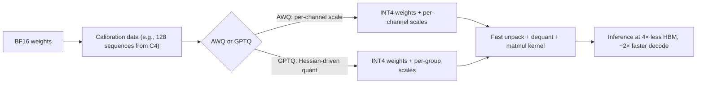

# INT4 / AWQ / GPTQ

<Mode is="learn">

> **Prereq:** [FP8 Inference](./fp8-overview). INT4 is the next step down — 4× compression, more accuracy work to maintain quality.

If FP8 was the "free lunch" of 2024 quantization — halve the bytes, lose under half a point of MMLU, done — then INT4 is the "harder lunch." You get **4× compression** instead of 2×, but only if you do real work to keep quality up. A naive 4-bit quantization of a 70B model can drop several MMLU points; the modern recipes (AWQ, GPTQ, K-quants) are what get that loss back down to 1–2.

The reason INT4 matters anyway: it's how you fit Llama-3-70B on a single H100, and how you run a 7B model on a phone. Every consumer-facing local-LLM stack — llama.cpp, MLX, Ollama, ExecuTorch with XNNPACK INT4 — defaults to 4-bit. Every server-side aggressive-compression stack — vLLM with Marlin kernels, TensorRT-LLM with AWQ — does too. This lesson is the recipes (what they do), the formats (Q4_K_M and friends), and the kernel side (why "smaller weights" doesn't automatically mean "faster decode").

## TL;DR

- **INT4** stores weights as 4-bit integers. Two weights per byte, **4× compression** over BF16. The cost: more accuracy work — naive INT4 quantization regresses noticeably; modern recipes (AWQ, GPTQ) close most of the gap.
- **GPTQ** (Frantar et al., 2022) is a *post-training* <Term name="quantization">quantization</Term> recipe: iteratively quantize weights using **second-order info** (Hessian-based) to minimize per-layer reconstruction error. Offline; needs a <Term name="calibration data">calibration set</Term>; produces ~0.5–2 pt regression on MMLU.
- **AWQ** (Lin et al., 2024) is **activation-aware**: it identifies "salient" weights (those that hugely affect activations) and protects them by per-channel scaling. Often outperforms GPTQ at the same bit-width; faster to apply.
- **INT4 is the format for: 4-bit on-device inference (llama.cpp Q4_K_M, <Term name="gguf">GGUF</Term>), low-cost serving with very large models on a single GPU, edge AI.** Not used for training — INT4 gradients are too lossy.
- **The kernel matters as much as the format.** INT4 weights need fast unpack-and-multiply kernels (Marlin, exllama, AWQ-CUTLASS); without them, the "4× smaller" doesn't translate to "much faster."

## Mental model



The recipe (AWQ vs GPTQ) determines *which* weights are quantized how; the kernel determines *how fast* the quantized weights run.

## The bit layout

INT4 = 4 bits per weight. Two ways to lay them out:

- **Pack two weights per byte.** Standard for storage. Unpack at compute time.
- **Symmetric (signed)** vs **asymmetric (unsigned)**. Symmetric: range `[-8, 7]`, zero is exactly representable, scale is the only metadata. Asymmetric: range `[0, 15]`, store both `(scale, zero_point)` per group. Symmetric is simpler; asymmetric handles skewed distributions better.

A <Term name="quantization group">**group**</Term> is a chunk of weights sharing one (scale, zero_point). Group sizes 32, 64, or 128 are standard. Larger group → less metadata, more error; smaller group → more metadata, less error.

For a 70B model at INT4, group_size=128, asymmetric:
- Weight data: 70B × 0.5 bytes = 35 GB
- Scale data: 70B / 128 × 2 bytes (BF16 scale) ≈ 1 GB
- Zero-point: 70B / 128 × 0.5 bytes (4-bit zero point) ≈ 280 MB
- Total: ~36 GB

vs BF16 at 140 GB. **~4× compression net of metadata.**

## GPTQ — second-order quantization

The trick: when you quantize one weight, you can adjust *unquantized* nearby weights to compensate. <Term name="gptq">GPTQ</Term> formalizes this using the Hessian of the reconstruction loss `||Wx - W_q x||²` over the calibration set.

For each layer, GPTQ:
1. Compute the Hessian `H = X·Xᵀ` over calibration activations.
2. Pick a column to quantize next.
3. Quantize that column to INT4.
4. Update the remaining columns to compensate, using `H` to weight the update.
5. Repeat until all columns are quantized.

Effect: weight-quantization errors are *spread* across the unquantized weights, lowering total reconstruction error. The math is sketched in the original paper (algorithm 1) and ships in the `auto-gptq` library.

Cost: hours per model on a workstation GPU (the Hessian computation is the expensive step). Result: ~0.5–2 pt regression on MMLU at 4-bit, group_size=128, depending on model.

## AWQ — activation-aware quantization

The observation: not all weights matter equally. Some weight rows are "salient" — large weights paired with high-magnitude activations — and quantizing them causes big errors. <Term name="awq">AWQ</Term> identifies these and **protects them via per-channel scaling**.

The procedure:
1. Run a calibration pass; record activation magnitudes per channel.
2. For each linear layer, compute a per-input-channel scale factor `s_c = activation_max_c^α` (with α ~0.5 typically).
3. Quantize `(W * s_c)` (the *scaled* weights) to INT4. Salient channels are now smaller (post-scaling), so they round less.
4. At inference: divide activations by `s_c` before matmul, restoring correctness.

Effect: salient weights spend their bit budget on what matters; less-salient weights get quantized harder. Same INT4 bits, better accuracy.

AWQ is **simpler to apply than GPTQ** (no Hessian, less compute) and often more accurate. Most production serving stacks (vLLM, ExecuTorch, llama.cpp) ship AWQ-quantized models as a first-class option.

The math sketch — what the calibration pass actually does, in pseudocode you can read in 30 seconds:

```python
# AWQ calibration sketch — per linear layer
# X: calibration activations (n_samples, in_features)
# W: original BF16 weights (out_features, in_features)
act_max = X.abs().amax(dim=0)        # (in_features,) — outlier magnitudes
s = act_max ** 0.5                    # α=0.5 is the AWQ default
W_scaled = W * s                      # boost salient input channels
W_q, scales = quantize_int4_per_group(W_scaled, group_size=128)
# At inference: y = (x / s) @ dequantize(W_q, scales)  — math unchanged.
```

That's the entire offline algorithm. Forty lines in production code, runs in minutes.

## llama.cpp's K-quants — a different recipe

llama.cpp (and via it, the local-LLM ecosystem) uses its own quantization family called **K-quants**: Q4_K_M, Q5_K_M, Q3_K_S, etc. The "K" stands for *k-means*-like grouping; they pick scales per super-block (256 weights) with sub-block refinement.

| Format    | Avg bits/weight | Accuracy vs BF16 | Production use |
|-----------|------------------|-------------------|----------------|
| Q2_K      | 2.6              | ~5–10 pt drop     | Aggressive edge |
| Q3_K_M    | 3.4              | ~3–5 pt drop      | Edge if Q4 won't fit |
| **Q4_K_M**| **4.5**          | **~1–2 pt drop** | **Default for local LLMs** |
| Q5_K_M    | 5.5              | ~0.5 pt           | Quality-preferred edge |
| Q6_K      | 6.6              | ~0.2 pt           | Near-lossless edge |
| Q8_0      | 8.5              | ~0.1 pt           | Sanity-check baseline |

Q4_K_M is the 2024–2026 default in local LLMs because it's the sweet spot of size and quality. Mostly equivalent to AWQ-INT4 in accuracy; sometimes slightly better on small models.

## The kernel side — Marlin, AWQ kernels, exllama

INT4 weights are useless without a kernel that *reads* them fast. The fast-unpack pattern, on Hopper / Ampere:

1. Load 8 bytes (16 INT4 weights) from HBM into a register.
2. Unpack into 16 INT8 lanes via bit-shifts.
3. Apply scale × zero-point.
4. Convert to FP16/BF16 for the mma.
5. Multiply with FP16/BF16 activation in a <Term name="tensor core">tensor core</Term>.

Sketched as CUDA C++ — this is the inner loop of every fast INT4 kernel:

```cpp
// Sign-extending unpack of 8 INT4 weights packed in one uint32_t.
__device__ inline void unpack_int4_x8(uint32_t packed, int8_t out[8]) {
    #pragma unroll
    for (int i = 0; i < 8; ++i) {
        // Take the i-th nibble, then sign-extend 4-bit -> 8-bit by
        // shifting left then arithmetic-right.
        int8_t nib = static_cast<int8_t>((packed >> (4 * i)) & 0xF);
        out[i] = static_cast<int8_t>((nib << 4) >> 4);
    }
}

// Fused dequant + half conversion. scale is the per-group BF16/FP16 scale.
__device__ inline void dequant_to_half(const int8_t in[8], half scale, half out[8]) {
    #pragma unroll
    for (int i = 0; i < 8; ++i) {
        out[i] = __int2half_rn(in[i]) * scale;
    }
}
// The actual matmul is then mma.sync.aligned.m16n8k16 over FP16 fragments.
// Marlin's win: the unpack + scale + mma all happen back-to-back inside one
// warp-level pipeline stage, so HBM bandwidth is the binding constraint.
```

Real kernels are denser — they pack the unpack into vectorized PTX, double-buffer through shared memory, and overlap compute with the next tile's load — but this is the shape. Production kernels:

- **Marlin** (CMU/HazyResearch, 2024) — fastest known INT4 kernel for Ampere+. ~95% of theoretical HBM bandwidth; integrated into vLLM.
- **AWQ-CUTLASS** — AWQ-aware kernels using CUTLASS's INT4 templates. Fused unpacking.
- **exllama / exllamav2** — community-maintained, tight on Ampere/Hopper.
- **llama.cpp's INT4 quants** — CPU-optimized (NEON, AVX-512), Metal-optimized for Apple, Vulkan / CUDA paths.

The lesson: a model's quantization format is half the story; **picking a serving stack with a good kernel is the other half**.

## Calling it from Python

The user-facing surface is a one-liner. vLLM picks the right INT4 kernel automatically based on the saved checkpoint format:

```python
from vllm import LLM

llm = LLM(
    model="meta-llama/Llama-3.1-70B-Instruct",
    quantization="awq",          # or "gptq", or "marlin"
    dtype="float16",
)
out = llm.generate(["Explain INT4 quantization in one sentence."])
```

That's the production user surface. The C++ above is what runs inside.

## When NOT to use INT4

- **Training.** INT4 gradients are too lossy. FP8 is the training compression.
- **Models smaller than ~3B.** The accuracy cost is proportionally larger; FP8 is usually a better tradeoff.
- **Workloads with diverse outputs.** Niche tasks where the 1–2 pt regression matters. Validate on your eval first.

For 7B+ inference on memory-constrained hardware, INT4 is the default.

## Run it in your browser — toy AWQ vs naive INT4

<RunInBrowser
  description="Compare naive INT4 quantization vs activation-aware (AWQ-style) on a synthetic linear layer."
  code={`import numpy as np

def quantize_int4(w, group_size=128, asymmetric=True):
    """Per-group INT4 quantization."""
    out, inn = w.shape
    n_groups = inn // group_size
    w_g = w.reshape(out, n_groups, group_size)
    if asymmetric:
        w_min = w_g.min(axis=-1, keepdims=True)
        w_max = w_g.max(axis=-1, keepdims=True)
        scale = (w_max - w_min) / 15.0
        zero  = w_min
        q = np.round((w_g - zero) / scale).clip(0, 15)
        return q, scale, zero
    else:
        abs_max = np.abs(w_g).max(axis=-1, keepdims=True)
        scale = abs_max / 7.0
        q = np.round(w_g / scale).clip(-8, 7)
        return q, scale, None

def dequantize(q, scale, zero=None):
    if zero is not None:
        return q * scale + zero
    return q * scale

# Generate a linear layer + calibration activations
rng = np.random.default_rng(0)
W = rng.standard_normal((512, 512)).astype(np.float32) * 0.3
X = rng.standard_normal((1024, 512)).astype(np.float32)

# A few input channels have outlier activations (the "salient" channels)
X[:, :16] *= 30

# Naive INT4: quantize W as-is
q_naive, s_naive, z_naive = quantize_int4(W)
W_naive = dequantize(q_naive, s_naive, z_naive).reshape(W.shape)
naive_err = np.abs(X @ W - X @ W_naive).mean()

# AWQ-style: per-input-channel scale based on activation magnitudes
act_max = np.abs(X).max(axis=0)        # shape (512,)
s_chan = act_max ** 0.5                # AWQ's α=0.5
W_scaled = W * s_chan[:, None]         # boost salient input channels
q_awq, s_awq, z_awq = quantize_int4(W_scaled)
W_awq_dq = dequantize(q_awq, s_awq, z_awq).reshape(W.shape)
W_awq = W_awq_dq / s_chan[:, None]     # undo the scale
awq_err = np.abs(X @ W - X @ W_awq).mean()

print(f"naive INT4 mean output error: {naive_err:.4f}")
print(f"AWQ-style INT4 mean output error: {awq_err:.4f}")
print(f"AWQ improvement: {naive_err / awq_err:.1f}x lower error")
print()
print("AWQ pays for the salient input channels with bits taken from non-salient ones.")
print("Same total bits; lower output error.")
`}
/>

You'll see AWQ deliver a meaningful drop in output error vs naive INT4 — that's the activation-aware win in miniature.

## Quick check

<FillIn
  prompt="The 4-bit format llama.cpp ships as default for local LLM inference:"
  answer="Q4_K_M"
  accept={["q4_k_m", "Q4_K", "Q4 K M"]}
  hint="K-quant family; the M variant."
  explanation="Q4_K_M = 4-bit K-quant, medium variant. ~4.5 effective bits/weight (mixing 4-bit and 6-bit blocks for salient parts), ~1-2 pt MMLU drop. It\'s the local-LLM default because the size/quality tradeoff is so well-tuned."
/>

<Quiz
  question="A team has Llama-3-70B at BF16 and wants to fit it on a single H100 (80 GB). The cleanest path:"
  options={[
    'INT8 quantization.',
    'INT4 quantization (AWQ or GPTQ) — drops weight memory to ~35 GB, fits with KV-cache room to spare.',
    'Distillation to a smaller model.',
    'Tensor parallelism across 2 GPUs.',
  ]}
  answer={1}
  explanation={`70B BF16 = 140 GB; INT8 = 70 GB (still doesn't fit comfortably with KV cache); INT4 = 35 GB (fits with ~45 GB headroom for KV at 8K context, batch 16). AWQ or GPTQ INT4 are the standard production move for "70B on a single H100." Distillation is a much bigger lift; TP=2 doubles your hardware bill.`}
/>

## Key takeaways

1. **INT4 = 4× weight compression** with ~1–2 pt MMLU regression at the modern recipe (AWQ or GPTQ).
2. **AWQ is activation-aware; GPTQ is Hessian-aware.** Both work; AWQ is simpler and often better.
3. **Group size 32–128, asymmetric, with per-group scale.** Standard production layout.
4. **Q4_K_M is the local-LLM default.** llama.cpp's K-quants; comparable to AWQ-INT4 in accuracy.
5. **The kernel matters.** Marlin / AWQ-CUTLASS / exllamav2 turn the 4× compression into a ~2× decode speedup; without them, you're just smaller, not faster.

## Go deeper

<Resources
  items={[
    { kind: 'paper', href: 'https://arxiv.org/abs/2210.17323', title: 'GPTQ: Accurate Post-Training Quantization for Generative Pre-trained Transformers', author: 'Frantar et al., 2022', note: 'The GPTQ paper. Section 3 has the algorithm; section 4 the empirical results.' },
    { kind: 'paper', href: 'https://arxiv.org/abs/2306.00978', title: 'AWQ: Activation-aware Weight Quantization for LLM Compression and Acceleration', author: 'Lin et al., 2024', note: 'The AWQ paper. Best modern reference for the salient-channel idea.' },
    { kind: 'paper', href: 'https://arxiv.org/abs/2408.11743', title: 'Marlin: Mixed-Precision Auto-Regressive Linear Algebra for Compressed LLMs', author: 'Frantar & Castro, 2024', note: 'The fastest 2026 INT4 kernel. Section 3 has the unpack-and-mma microarchitecture.' },
    { kind: 'docs', href: 'https://docs.vllm.ai/en/latest/quantization/index.html', title: 'vLLM — Quantization', note: 'Authoritative on which formats vLLM supports + observed throughput. Sections on AWQ, GPTQ, and Marlin.' },
    { kind: 'docs', href: 'https://github.com/ggerganov/llama.cpp/blob/master/docs/quantize.md', title: 'llama.cpp — Quantization Guide', note: 'The K-quant lineage in detail. Includes when to use each format.' },
    { kind: 'repo', href: 'https://github.com/AutoGPTQ/AutoGPTQ', title: 'AutoGPTQ', note: 'Reference GPTQ implementation. Plug-in to PyTorch / transformers.' },
    { kind: 'repo', href: 'https://github.com/casper-hansen/AutoAWQ', title: 'AutoAWQ', note: 'Reference AWQ implementation. Same plug-in pattern.' },
    { kind: 'repo', href: 'https://github.com/IST-DASLab/marlin', title: 'IST-DASLab/marlin', note: 'The Marlin kernel. The README has the throughput table that justifies the 2024 production migration.' },
  ]}
/>

</Mode>

<Mode is="reference">

> **Prereq:** [FP8 Inference](./fp8-overview). INT4 is the next step down — 4× compression, more accuracy work to maintain quality.

## TL;DR

- **INT4** stores weights as 4-bit integers. Two weights per byte, **4× compression** over BF16. The cost: more accuracy work — naive INT4 quantization regresses noticeably; modern recipes (AWQ, GPTQ) close most of the gap.
- **GPTQ** (Frantar et al., 2022) is a *post-training* quantization recipe: iteratively quantize weights using **second-order info** (Hessian-based) to minimize per-layer reconstruction error. Offline; needs a calibration set; produces ~0.5–2 pt regression on MMLU.
- **AWQ** (Lin et al., 2024) is **activation-aware**: it identifies "salient" weights (those that hugely affect activations) and protects them by per-channel scaling. Often outperforms GPTQ at the same bit-width; faster to apply.
- **INT4 is the format for: 4-bit on-device inference (llama.cpp Q4_K_M, GGUF), low-cost serving with very large models on a single GPU, edge AI.** Not used for training — INT4 gradients are too lossy.
- **The kernel matters as much as the format.** INT4 weights need fast unpack-and-multiply kernels (Marlin, exllama, AWQ-CUTLASS); without them, the "4× smaller" doesn't translate to "much faster."

## Why this matters

If FP8 is the standard 2026 server-class quantization, INT4 is the standard 2026 *edge and aggressive-server* quantization. A 70B model at INT4 fits in 35 GB — a single H100 instead of two. A 7B model at 4-bit fits in 4 GB — a phone instead of a laptop. Every consumer-facing local-LLM stack (llama.cpp, MLX, ExecuTorch with XNNPACK INT4) ships with INT4 as the default. Knowing AWQ vs GPTQ — and the kernel landscape — is the price of admission for serious on-device AI work.

## Mental model


The recipe (AWQ vs GPTQ) determines *which* weights are quantized how; the kernel determines *how fast* the quantized weights run.

## Concrete walkthrough

### The naive bit layout

INT4 = 4 bits per weight. Two ways to lay them out:

- **Pack two weights per byte.** Standard for storage. Unpack at compute time.
- **Symmetric (signed)** vs **asymmetric (unsigned)**. Symmetric: range `[-8, 7]`, zero is exactly representable, scale is the only metadata. Asymmetric: range `[0, 15]`, store both `(scale, zero_point)` per group. Symmetric is simpler; asymmetric handles skewed distributions better.

A **group** is a chunk of weights sharing one (scale, zero_point). Group sizes 32, 64, or 128 are standard. Larger group → less metadata, more error; smaller group → more metadata, less error.

For a 70B model at INT4, group_size=128, asymmetric:
- Weight data: 70B × 0.5 bytes = 35 GB
- Scale data: 70B / 128 × 2 bytes (BF16 scale) ≈ 1 GB
- Zero-point: 70B / 128 × 0.5 bytes (4-bit zero point) ≈ 280 MB
- Total: ~36 GB

vs BF16 at 140 GB. **~4× compression net of metadata.**

### GPTQ — second-order quantization

The trick: when you quantize one weight, you can adjust *unquantized* nearby weights to compensate. GPTQ formalizes this using the Hessian of the reconstruction loss `||Wx - W_q x||²` over the calibration set.

For each layer, GPTQ:
1. Compute the Hessian `H = X·Xᵀ` over calibration activations.
2. Pick a column to quantize next.
3. Quantize that column to INT4.
4. Update the remaining columns to compensate, using `H` to weight the update.
5. Repeat until all columns are quantized.

Effect: weight-quantization errors are *spread* across the unquantized weights, lowering total reconstruction error. The math is sketched in the original paper (algorithm 1) and ships in the `auto-gptq` library.

Cost: hours per model on a workstation GPU (the Hessian computation is the expensive step). Result: ~0.5–2 pt regression on MMLU at 4-bit, group_size=128, depending on model.

### AWQ — activation-aware quantization

The observation: not all weights matter equally. Some weight rows are "salient" — large weights paired with high-magnitude activations — and quantizing them causes big errors. AWQ identifies these and **protects them via per-channel scaling**.

The procedure:
1. Run a calibration pass; record activation magnitudes per channel.
2. For each linear layer, compute a per-input-channel scale factor `s_c = activation_max_c^α` (with α ~0.5 typically).
3. Quantize `(W * s_c)` (the *scaled* weights) to INT4. Salient channels are now smaller (post-scaling), so they round less.
4. At inference: divide activations by `s_c` before matmul, restoring correctness.

Effect: salient weights spend their bit budget on what matters; less-salient weights get quantized harder. Same INT4 bits, better accuracy.

AWQ is **simpler to apply than GPTQ** (no Hessian, less compute) and often more accurate. Most production serving stacks (vLLM, ExecuTorch, llama.cpp) ship AWQ-quantized models as a first-class option.

### llama.cpp's K-quants — a different recipe

llama.cpp (and via it, the local-LLM ecosystem) uses its own quantization family called **K-quants**: Q4_K_M, Q5_K_M, Q3_K_S, etc. The "K" stands for *k-means*-like grouping; they pick scales per super-block (256 weights) with sub-block refinement.

| Format    | Avg bits/weight | Accuracy vs BF16 | Production use |
|-----------|------------------|-------------------|----------------|
| Q2_K      | 2.6              | ~5–10 pt drop     | Aggressive edge |
| Q3_K_M    | 3.4              | ~3–5 pt drop      | Edge if Q4 won't fit |
| **Q4_K_M**| **4.5**          | **~1–2 pt drop** | **Default for local LLMs** |
| Q5_K_M    | 5.5              | ~0.5 pt           | Quality-preferred edge |
| Q6_K      | 6.6              | ~0.2 pt           | Near-lossless edge |
| Q8_0      | 8.5              | ~0.1 pt           | Sanity-check baseline |

Q4_K_M is the 2024–2026 default in local LLMs because it's the sweet spot of size and quality. Mostly equivalent to AWQ-INT4 in accuracy; sometimes slightly better on small models.

### The kernel side — Marlin, AWQ kernels, exllama

INT4 weights are useless without a kernel that *reads* them fast. The fast-unpack pattern:

1. Load 8 bytes (16 INT4 weights) from HBM.
2. Unpack into 16 INT8 lanes via bit-shifts in registers.
3. Apply scale × zero-point.
4. Convert to FP16/BF16 for the mma.
5. Multiply with FP16/BF16 activation.

Production kernels:
- **Marlin** (CMU/HazyResearch, 2024) — fastest known INT4 kernel for Ampere+. ~95% of theoretical HBM bandwidth; integrated into vLLM.
- **AWQ-CUTLASS** — AWQ-aware kernels using CUTLASS's INT4 templates. Fused unpacking.
- **exllama / exllamav2** — community-maintained, tight on Ampere/Hopper.
- **llama.cpp's INT4 quants** — CPU-optimized (NEON, AVX-512), Metal-optimized for Apple, Vulkan / CUDA paths.

The lesson: a model's quantization format is half the story; **picking a serving stack with a good kernel is the other half**.

### When NOT to use INT4

- **Training.** INT4 gradients are too lossy. FP8 is the training compression.
- **Models smaller than ~3B.** The accuracy cost is proportionally larger; FP8 is usually a better tradeoff.
- **Workloads with diverse outputs.** Niche tasks where the 1–2 pt regression matters. Validate on your eval first.

For 7B+ inference on memory-constrained hardware, INT4 is the default.

## Run it in your browser — toy AWQ vs naive INT4

<RunInBrowser
  description="Compare naive INT4 quantization vs activation-aware (AWQ-style) on a synthetic linear layer."
  code={`import numpy as np

def quantize_int4(w, group_size=128, asymmetric=True):
    """Per-group INT4 quantization."""
    out, inn = w.shape
    n_groups = inn // group_size
    w_g = w.reshape(out, n_groups, group_size)
    if asymmetric:
        w_min = w_g.min(axis=-1, keepdims=True)
        w_max = w_g.max(axis=-1, keepdims=True)
        scale = (w_max - w_min) / 15.0
        zero  = w_min
        q = np.round((w_g - zero) / scale).clip(0, 15)
        return q, scale, zero
    else:
        abs_max = np.abs(w_g).max(axis=-1, keepdims=True)
        scale = abs_max / 7.0
        q = np.round(w_g / scale).clip(-8, 7)
        return q, scale, None

def dequantize(q, scale, zero=None):
    if zero is not None:
        return q * scale + zero
    return q * scale

# Generate a linear layer + calibration activations
rng = np.random.default_rng(0)
W = rng.standard_normal((512, 512)).astype(np.float32) * 0.3
X = rng.standard_normal((1024, 512)).astype(np.float32)

# A few input channels have outlier activations (the "salient" channels)
X[:, :16] *= 30

# Naive INT4: quantize W as-is
q_naive, s_naive, z_naive = quantize_int4(W)
W_naive = dequantize(q_naive, s_naive, z_naive).reshape(W.shape)
naive_err = np.abs(X @ W - X @ W_naive).mean()

# AWQ-style: per-input-channel scale based on activation magnitudes
act_max = np.abs(X).max(axis=0)        # shape (512,)
s_chan = act_max ** 0.5                # AWQ's α=0.5
W_scaled = W * s_chan[:, None]         # boost salient input channels
q_awq, s_awq, z_awq = quantize_int4(W_scaled)
W_awq_dq = dequantize(q_awq, s_awq, z_awq).reshape(W.shape)
W_awq = W_awq_dq / s_chan[:, None]     # undo the scale
awq_err = np.abs(X @ W - X @ W_awq).mean()

print(f"naive INT4 mean output error: {naive_err:.4f}")
print(f"AWQ-style INT4 mean output error: {awq_err:.4f}")
print(f"AWQ improvement: {naive_err / awq_err:.1f}x lower error")
print()
print("AWQ pays for the salient input channels with bits taken from non-salient ones.")
print("Same total bits; lower output error.")
`}
/>

You'll see AWQ deliver a meaningful drop in output error vs naive INT4 — that's the activation-aware win in miniature.

## Quick check

<FillIn
  prompt="The 4-bit format llama.cpp ships as default for local LLM inference:"
  answer="Q4_K_M"
  accept={["q4_k_m", "Q4_K", "Q4 K M"]}
  hint="K-quant family; the M variant."
  explanation="Q4_K_M = 4-bit K-quant, medium variant. ~4.5 effective bits/weight (mixing 4-bit and 6-bit blocks for salient parts), ~1-2 pt MMLU drop. It\'s the local-LLM default because the size/quality tradeoff is so well-tuned."
/>

<Quiz
  question="A team has Llama-3-70B at BF16 and wants to fit it on a single H100 (80 GB). The cleanest path:"
  options={[
    'INT8 quantization.',
    'INT4 quantization (AWQ or GPTQ) — drops weight memory to ~35 GB, fits with KV-cache room to spare.',
    'Distillation to a smaller model.',
    'Tensor parallelism across 2 GPUs.',
  ]}
  answer={1}
  explanation={`70B BF16 = 140 GB; INT8 = 70 GB (still doesn't fit comfortably with KV cache); INT4 = 35 GB (fits with ~45 GB headroom for KV at 8K context, batch 16). AWQ or GPTQ INT4 are the standard production move for "70B on a single H100." Distillation is a much bigger lift; TP=2 doubles your hardware bill.`}
/>

## Key takeaways

1. **INT4 = 4× weight compression** with ~1–2 pt MMLU regression at the modern recipe (AWQ or GPTQ).
2. **AWQ is activation-aware; GPTQ is Hessian-aware.** Both work; AWQ is simpler and often better.
3. **Group size 32–128, asymmetric, with per-group scale.** Standard production layout.
4. **Q4_K_M is the local-LLM default.** llama.cpp's K-quants; comparable to AWQ-INT4 in accuracy.
5. **The kernel matters.** Marlin / AWQ-CUTLASS / exllamav2 turn the 4× compression into a ~2× decode speedup; without them, you're just smaller, not faster.

## Go deeper

<Resources
  items={[
    { kind: 'paper', href: 'https://arxiv.org/abs/2210.17323', title: 'GPTQ: Accurate Post-Training Quantization for Generative Pre-trained Transformers', author: 'Frantar et al., 2022', note: 'The GPTQ paper. Section 3 has the algorithm; section 4 the empirical results.' },
    { kind: 'paper', href: 'https://arxiv.org/abs/2306.00978', title: 'AWQ: Activation-aware Weight Quantization for LLM Compression and Acceleration', author: 'Lin et al., 2024', note: 'The AWQ paper. Best modern reference for the salient-channel idea.' },
    { kind: 'paper', href: 'https://arxiv.org/abs/2408.11743', title: 'Marlin: Mixed-Precision Auto-Regressive Linear Algebra for Compressed LLMs', author: 'Frantar & Castro, 2024', note: 'The fastest 2026 INT4 kernel. Section 3 has the unpack-and-mma microarchitecture.' },
    { kind: 'docs', href: 'https://docs.vllm.ai/en/latest/quantization/index.html', title: 'vLLM — Quantization', note: 'Authoritative on which formats vLLM supports + observed throughput. Sections on AWQ, GPTQ, and Marlin.' },
    { kind: 'docs', href: 'https://github.com/ggerganov/llama.cpp/blob/master/docs/quantize.md', title: 'llama.cpp — Quantization Guide', note: 'The K-quant lineage in detail. Includes when to use each format.' },
    { kind: 'repo', href: 'https://github.com/AutoGPTQ/AutoGPTQ', title: 'AutoGPTQ', note: 'Reference GPTQ implementation. Plug-in to PyTorch / transformers.' },
    { kind: 'repo', href: 'https://github.com/casper-hansen/AutoAWQ', title: 'AutoAWQ', note: 'Reference AWQ implementation. Same plug-in pattern.' },
    { kind: 'repo', href: 'https://github.com/IST-DASLab/marlin', title: 'IST-DASLab/marlin', note: 'The Marlin kernel. The README has the throughput table that justifies the 2024 production migration.' },
  ]}
/>

</Mode>

<LessonComplete />
