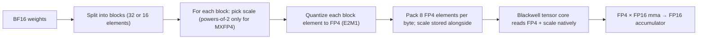

# MXFP4 / NVFP4

<Mode is="learn">

> **Prereqs:** [FP8 Inference](./fp8-overview), [INT4 / AWQ / GPTQ](./int4-and-awq). The microscaling story builds directly on per-block FP8 and INT4 ideas.

INT4 quantization is a software trick: pack two weights per byte, store a scale per group, write a fast unpack kernel, hope the recipe (AWQ or GPTQ) recovers the accuracy. It works, but the GPU has no idea you did any of it — every multiply still happens in FP16 after a software dequant.

<Term name="microscaling">**Microscaling formats**</Term> — MXFP4, NVFP4, and their wider cousins MXFP6 and MXFP8 — flip that. They're 4-bit *floating-point* values with a tiny per-block scale, defined by an OCP industry standard, and the Blackwell <Term name="tensor core">tensor cores</Term> consume them natively. No software unpack. The mma instruction takes FP4 weights, FP16 activations, and produces an FP16 accumulator at full tensor-core throughput. On B200 that's roughly **2× the FP8 rate**.

The bet: block-FP4 + hardware support beats INT4 + AWQ/GPTQ in both speed and quality, and the field is converging on it. NVIDIA, AMD (MXFP4 in MI355X), and the OCP spec community are aligned. Knowing what FP4 actually *is* now puts you ahead of the 2026–2027 pivot.

## TL;DR

- **MXFP4** (Microscaling FP4) is an OCP-standardized 4-bit floating-point format with **per-block scale factors**. Each 32-element block has its own E8M0 (8-bit exponent) scale; the elements themselves are 4-bit floats (E2M1: 1 sign, 2 exp, 1 mantissa).
- **NVFP4** is NVIDIA's variant — same idea, slightly different scale factor (E4M3 instead of E8M0), block size 16 instead of 32. Higher accuracy at slightly higher metadata cost.
- **Blackwell tensor cores natively support these formats.** MXFP4/NVFP4 weights × FP16 activations → FP16 accumulator at full tensor-core throughput. No software unpack-and-dequantize.
- **Quality vs INT4 AWQ/GPTQ:** comparable on most benchmarks; better on long-tail outliers because the *floating-point* representation handles wide dynamic range that INT4 has to scale for.
- **Why this matters for 2026–2027:** if Blackwell tensor cores are 2× faster on FP4 than FP8, and quality holds, FP4 becomes the default inference format. INT4 may become legacy.

## Mental model



The scale is *per-block* (not per-tensor); the block size is small (16–32 elements); and crucially the *math at runtime* is one tensor-core instruction, not a software unpack.

## What's in 4 bits, exactly

Each FP4 element (E2M1):

| Sign | Exp (2 bits) | Mantissa (1 bit) | Representable values            |
|------|--------------|-------------------|----------------------------------|
| 0/1  | 00, 01, 10, 11 | 0 / 1            | ±0.5, ±1, ±1.5, ±2, ±3, ±4, ±6  |

That's it. **15 distinct values** (the 16th is a NaN encoding). Per-block, every weight quantizes to one of these.

The block scale is then multiplied in:

- **MXFP4**: scale is `2^k` for k ∈ [-127, 128]. Stored as 8 bits (the exponent E8M0, reinterpreted as the power of 2). Per 32-element block.
- **NVFP4**: scale is an arbitrary E4M3 value (range ±448). Stored as 8 bits. Per 16-element block.

Per-block metadata cost:
- MXFP4: 1 byte / 32 elements = 0.25 bits per element extra (4.25 bits/weight effective)
- NVFP4: 1 byte / 16 elements = 0.5 bits per element extra (4.5 bits/weight effective)

For a 70B model:
- MXFP4: 70B × 4.25 / 8 = ~37 GB
- NVFP4: 70B × 4.5 / 8 = ~39 GB

vs INT4 with group_size=128 and BF16 scale at ~36 GB. **Comparable size, much better speed.**

## Why per-block, why FP-not-INT

Two big design choices:

**Per-block scaling** (vs per-tensor or per-channel) is what makes 4-bit math work *without calibration data*. Each block adapts to its local distribution. A 32-element chunk of a normally-distributed weight matrix has an absolute-max value that varies; a per-block scale captures this variation cheaply. INT4 with group_size=128 does the same thing but with an integer-not-float element representation.

**Floating-point not integer**: a 4-bit FP element captures wider dynamic range *within the block* than a 4-bit INT does. INT4 elements are evenly-spaced in [-8, 7]; FP4 elements are *log-spaced* (powers of 2 with 1 mantissa bit per binade). For weight distributions with heavy tails — which is most of them — log-spaced is a better match.

The combined effect: MXFP4 / NVFP4 deliver **near-INT4 size with near-FP8 accuracy**, especially on long-tail benchmarks where INT4 AWQ/GPTQ tend to drop a fraction of a point that FP4 doesn't.

## Hardware support

| GPU       | FP4 tensor-core support | TFLOPs (FP4) |
|-----------|-------------------------|---------------|
| H100      | No                      | n/a           |
| H200      | No                      | n/a           |
| **B200**  | **Yes (5th-gen TC)**    | **~9000**     |
| GB200     | Yes                     | ~10000        |
| MI300X    | No                      | n/a           |
| **MI355X**| **Yes (matrix cores)**  | **~10000**    |

On B200 / MI355X, FP4 is **2× faster than FP8** at the tensor-core level. Combined with halved HBM traffic (4 bits → 2 bits per multiply), end-to-end decode throughput approaches the headline 2× ratio.

Pre-Blackwell hardware can still use MXFP4 for storage (smaller models on disk and in HBM), but inference compute happens by dequantizing to FP8/FP16 first. That removes the speedup.

## What the kernel actually issues

On Blackwell, FP4 inference is a single tensor-core instruction per tile. The wgmma family gained FP4 input variants in the 5th-gen tensor core; CUTLASS 4 wraps them in a typed C++ template. The raw <Term name="ptx">PTX</Term> looks like:

```cpp
// Blackwell warpgroup matmul on FP4 inputs, FP16 accumulator.
// 64 × 128 × 32 tile per instruction. Per-block scales are fed in
// alongside the operand descriptors — the tensor core applies them.
asm volatile(
    "wgmma.mma_async.sync.aligned.m64n128k32.f16"
    ".f4e2m1.f4e2m1 "                    // FP4 E2M1 inputs
    "{%0,%1,%2,%3,%4,%5,%6,%7},"         // 8 output FP16 fragments
    " %8, %9, %10, %11, p, 1, 1;\n"      // operand desc + per-block scales
    : "+r"(d[0]), "+r"(d[1]), "+r"(d[2]), "+r"(d[3]),
      "+r"(d[4]), "+r"(d[5]), "+r"(d[6]), "+r"(d[7])
    : "l"(a_desc), "l"(b_desc),
      "l"(a_scales_desc), "l"(b_scales_desc),
      "r"(p_state)
);
```

Compare to the FP8 instruction in the [FP8 lesson](./fp8-overview): same shape, narrower elements, separate scale-descriptor operands. **The whole point** of the format is that the tensor core consumes the scales — there's no software dequant in the inner loop.

You don't write that PTX yourself. CUTLASS's `Sm100` collective MMA templates emit it for you. But it's worth seeing the instruction once: every modern FP4 inference kernel reduces to a series of wgmma instructions of this shape.

## Calling it from Python

The user surface is one config flag:

```python
from vllm import LLM

llm = LLM(
    model="meta-llama/Llama-3.1-70B-Instruct",
    quantization="mxfp4",        # or "nvfp4" on Blackwell
)
# Under the hood: vLLM converts weights to MXFP4, stores per-block scales,
# uses Sm100 (Blackwell) kernels that take FP4 weights + FP16 activations.
```

That's the whole serving change. The vLLM weight loader handles the BF16 → MXFP4 conversion (or loads pre-quantized checkpoints from Hugging Face); the kernel selection is automatic based on the GPU SM version.

For training, FP4 is *not yet* a stable production target — the rounding is too aggressive for gradient updates. Some 2025 research (FP4 training papers) shows it's possible with carefully-tuned recipes, but as of 2026 it's not the default.

## MXFP4 vs NVFP4 vs MXFP6 vs MXFP8

The microscaling family has multiple bit widths:

| Format  | Bits/elem | Block size | Effective bits/weight | Use case |
|---------|-----------|------------|------------------------|----------|
| MXFP4   | 4         | 32         | ~4.25                  | Aggressive inference |
| NVFP4   | 4         | 16         | ~4.5                   | Higher-quality 4-bit  |
| MXFP6   | 6         | 32         | ~6.25                  | Quality-preferred low-bit |
| MXFP8   | 8         | 32         | ~8.25                  | Production training (E4M3 + per-block scale) |

MXFP8 is essentially "FP8 with per-block scaling instead of per-tensor" — one of the formats DeepSeek-V3 uses for training stability. MXFP6 is a niche quality-preferred option; MXFP4 / NVFP4 are the production inference formats for 2025+.

## Where the gotchas are

1. **Compiler maturity.** MXFP4 / NVFP4 support is younger than FP8. vLLM v1, SGLang, TensorRT-LLM all support it as of 2025; ExecuTorch and IREE have it landed but with more rough edges. Triton-AMD's MXFP4 support arrived in early 2025.
2. **Block-size mismatch issues.** Some kernels assume a specific block size; mixing MXFP4 (block=32) and NVFP4 (block=16) data in the same model breaks them. Pin one or the other across all layers.
3. **Quality on small models.** Sub-3B models tend to lose accuracy faster with 4-bit anything. Stick to FP8 for tiny models.

## Run it in your browser — MXFP4 vs INT4 simulator

<RunInBrowser
  description="Quantize a synthetic weight to MXFP4 (block-FP) and INT4 (per-group); compare quality."
  code={`import numpy as np

# FP4 (E2M1) representable absolute values: 0, 0.5, 1, 1.5, 2, 3, 4, 6
FP4_VALUES = np.array([-6, -4, -3, -2, -1.5, -1, -0.5, 0, 0.5, 1, 1.5, 2, 3, 4, 6])

def round_to_fp4(x):
    """Snap to nearest FP4 representable value."""
    diffs = np.abs(x[..., None] - FP4_VALUES)
    idx = diffs.argmin(axis=-1)
    return FP4_VALUES[idx]

def quantize_mxfp4(w, block_size=32):
    """Per-block FP4 quantization with power-of-2 scale (MXFP4 spec)."""
    flat = w.reshape(-1, block_size)
    abs_max = np.abs(flat).max(axis=-1, keepdims=True)
    # Scale: round abs_max/6 (the FP4 max value) to nearest power of 2
    scale_log = np.ceil(np.log2(np.maximum(abs_max / 6.0, 1e-30)))
    scale = np.exp2(scale_log)
    q = round_to_fp4(flat / scale)
    return (q * scale).reshape(w.shape)

def quantize_int4_groupwise(w, group_size=128):
    """Symmetric INT4 with one BF16 scale per group."""
    flat = w.reshape(-1, group_size)
    abs_max = np.abs(flat).max(axis=-1, keepdims=True)
    scale = abs_max / 7.0
    q = np.clip(np.round(flat / scale), -8, 7)
    return (q * scale).reshape(w.shape)

# Synthetic weight tensor with a heavy-tailed distribution
rng = np.random.default_rng(0)
W = rng.standard_normal((1024, 1024)).astype(np.float32) * 0.5
# Add a few outlier weights — common in real LLMs
W.ravel()[::3000] *= 12

W_mxfp4 = quantize_mxfp4(W, block_size=32)
W_int4  = quantize_int4_groupwise(W, group_size=128)

err_mxfp4 = np.abs(W - W_mxfp4).mean()
err_int4  = np.abs(W - W_int4).mean()

print(f"MXFP4 (block=32):    mean abs error = {err_mxfp4:.5f}")
print(f"INT4  (group=128):   mean abs error = {err_int4:.5f}")
print(f"Ratio: INT4 error is {err_int4 / err_mxfp4:.2f}x MXFP4 error\\n")

# How many outlier weights survived?
top_W = np.argsort(np.abs(W).ravel())[-20:]
print("Top 5 outlier weights vs their MXFP4/INT4 quantizations:")
print(f"{'orig':>8} {'mxfp4':>8} {'int4':>8}")
for i in top_W[:5]:
    print(f"{W.ravel()[i]:>8.3f} {W_mxfp4.ravel()[i]:>8.3f} {W_int4.ravel()[i]:>8.3f}")
print()
print("MXFP4's per-block FP scale tracks outliers better than INT4's per-group linear scale.")
`}
/>

You'll typically see MXFP4 deliver lower mean error at similar bit-width, especially on outlier-heavy weights. That's the production case for the format.

## Quick check

<FillIn
  prompt="The block size MXFP4 uses (per the OCP microscaling spec):"
  answer="32"
  hint="A power of 2; smaller than INT4's typical group size."
  explanation="MXFP4 specifies 32-element blocks. Each block carries one E8M0 power-of-2 scale. NVFP4 uses block size 16 with an E4M3 scale — slightly more metadata, slightly better accuracy."
/>

<Quiz
  question="A team running 70B inference on B200 wonders whether to use FP8 or MXFP4. Most relevant tradeoff:"
  options={[
    'MXFP4 is always faster.',
    'MXFP4 doubles tensor-core throughput vs FP8 on Blackwell, but quality regression vs FP8 is in the ~0.5–1.5 pt range. If your eval tolerates that drop, MXFP4 is meaningfully cheaper; if not, FP8 is safer.',
    'They\'re identical.',
    'MXFP4 only works on AMD.',
  ]}
  answer={1}
  explanation="On B200, FP4 is ~2× the FP8 tensor-core rate, with ~halved HBM traffic. The cost is a real (if small) accuracy regression — typically larger than the FP8→BF16 gap. Validate on your specific workload\'s eval; for chat/general workloads MXFP4 usually wins, for niche reasoning sometimes FP8 holds up better."
/>

## Key takeaways

1. **MXFP4 / NVFP4 = 4-bit float + per-block scale.** OCP-standardized; blocks of 32 (MXFP4) or 16 (NVFP4).
2. **Blackwell + MI355X tensor cores native.** ~2× FP8 throughput on the new silicon; H100/MI300X store-only.
3. **Comparable size to INT4, comparable or better quality**, especially on outlier-heavy distributions.
4. **2025–2027 inflection.** Expect FP4 to become the default inference format on Blackwell-class GPUs.
5. **Training in FP4 is research-only as of 2026.** Stick to FP8 / MXFP8 for production training.

## Go deeper

<Resources
  items={[
    { kind: 'docs', href: 'https://www.opencompute.org/documents/ocp-microscaling-formats-mx-v1-0-spec-final-pdf', title: 'OCP Microscaling Formats Specification v1.0', note: 'The standard. Sections 2–4 define MXFP4/MXFP6/MXFP8 exactly.' },
    { kind: 'paper', href: 'https://arxiv.org/abs/2310.10537', title: 'Microscaling Data Formats for Deep Learning', author: 'Rouhani et al., 2023', note: 'The MS-FP paper. Why microscaling exists and what it buys vs alternatives.' },
    { kind: 'docs', href: 'https://docs.nvidia.com/cuda/blackwell-tuning-guide/index.html', title: 'NVIDIA Blackwell Tuning Guide', note: 'NVFP4 specifics, the wgmma instruction encoding, and accumulator rules.' },
    { kind: 'blog', href: 'https://blogs.nvidia.com/blog/blackwell-platform/', title: 'NVIDIA — The Blackwell Platform', note: 'High-level marketing intro; useful for the FP4 throughput claim and what NVIDIA expects production to use.' },
    { kind: 'paper', href: 'https://arxiv.org/abs/2504.20920', title: 'NVFP4: Optimizing 4-bit Quantization for LLMs', author: 'NVIDIA, 2025', note: 'The NVFP4 paper. Section 3 has the algorithm, section 5 the head-to-head with MXFP4 and AWQ-INT4.' },
    { kind: 'docs', href: 'https://docs.vllm.ai/en/latest/quantization/mxfp4.html', title: 'vLLM — MXFP4 / NVFP4 Inference', note: 'Production knobs, supported models, observed throughput on Blackwell.' },
    { kind: 'repo', href: 'https://github.com/NVIDIA/TransformerEngine', title: 'NVIDIA/TransformerEngine', note: 'NVFP4 reference implementation; same code path as FP8 but with the new dtype.' },
  ]}
/>

</Mode>

<Mode is="reference">

> **Prereqs:** [FP8 Inference](./fp8-overview), [INT4 / AWQ / GPTQ](./int4-and-awq). The microscaling story builds directly on per-block FP8 and INT4 ideas.

## TL;DR

- **MXFP4** (Microscaling FP4) is an OCP-standardized 4-bit floating-point format with **per-block scale factors**. Each 32-element block has its own E8M0 (8-bit exponent) scale; the elements themselves are 4-bit floats (E2M1: 1 sign, 2 exp, 1 mantissa).
- **NVFP4** is NVIDIA's variant — same idea, slightly different scale factor (E4M3 instead of E8M0), block size 16 instead of 32. Higher accuracy at slightly higher metadata cost.
- **Blackwell tensor cores natively support these formats.** MXFP4/NVFP4 weights × FP16 activations → FP16 accumulator at full tensor-core throughput. No software unpack-and-dequantize.
- **Quality vs INT4 AWQ/GPTQ:** comparable on most benchmarks; better on long-tail outliers because the *floating-point* representation handles wide dynamic range that INT4 has to scale for.
- **Why this matters for 2026–2027:** if Blackwell tensor cores are 2× faster on FP4 than FP8, and quality holds, FP4 becomes the default inference format. INT4 may become legacy.

## Why this matters

The big bet of the microscaling formats is that **block-FP4 + hardware support beats INT4 + AWQ/GPTQ** in both speed and accuracy. NVIDIA, AMD (with MXFP4 support in MI355X), and the OCP specification community are all aligned on this. If the bet pays off — and 2025 results suggest it will — every production inference stack pivots to FP4 in the next 18 months. **Knowing what FP4 actually is now puts you ahead of that pivot.**

## Mental model


The scale is *per-block* (not per-tensor); the block size is small (16–32 elements); and crucially the *math at runtime* is one tensor-core instruction, not a software unpack.

## Concrete walkthrough

### What's in 4 bits, exactly

Each FP4 element (E2M1):

| Sign | Exp (2 bits) | Mantissa (1 bit) | Representable values            |
|------|--------------|-------------------|----------------------------------|
| 0/1  | 00, 01, 10, 11 | 0 / 1            | ±0.5, ±1, ±1.5, ±2, ±3, ±4, ±6  |

That's it. **15 distinct values** (the 16th is a NaN encoding). Per-block, every weight quantizes to one of these.

The block scale is then multiplied in:

- **MXFP4**: scale is `2^k` for k ∈ [-127, 128]. Stored as 8 bits (the exponent E8M0, reinterpreted as the power of 2). Per 32-element block.
- **NVFP4**: scale is an arbitrary E4M3 value (range ±448). Stored as 8 bits. Per 16-element block.

Per-block metadata cost:
- MXFP4: 1 byte / 32 elements = 0.25 bits per element extra (4.25 bits/weight effective)
- NVFP4: 1 byte / 16 elements = 0.5 bits per element extra (4.5 bits/weight effective)

For a 70B model:
- MXFP4: 70B × 4.25 / 8 = ~37 GB
- NVFP4: 70B × 4.5 / 8 = ~39 GB

vs INT4 with group_size=128 and BF16 scale at ~36 GB. **Comparable size, much better speed.**

### Why per-block, why FP-not-INT

Two big design choices:

**Per-block scaling** (vs per-tensor or per-channel) is what makes 4-bit math work *without calibration data*. Each block adapts to its local distribution. A 32-element chunk of a normally-distributed weight matrix has an absolute-max value that varies; a per-block scale captures this variation cheaply. INT4 with group_size=128 does the same thing but with an integer-not-float element representation.

**Floating-point not integer**: a 4-bit FP element captures wider dynamic range *within the block* than a 4-bit INT does. INT4 elements are evenly-spaced in [-8, 7]; FP4 elements are *log-spaced* (powers of 2 with 1 mantissa bit per binade). For weight distributions with heavy tails — which is most of them — log-spaced is a better match.

The combined effect: MXFP4 / NVFP4 deliver **near-INT4 size with near-FP8 accuracy**, especially on long-tail benchmarks where INT4 AWQ/GPTQ tend to drop a fraction of a point that FP4 doesn't.

### Hardware support

| GPU       | FP4 tensor-core support | TFLOPs (FP4) |
|-----------|-------------------------|---------------|
| H100      | No                      | n/a           |
| H200      | No                      | n/a           |
| **B200**  | **Yes (5th-gen TC)**    | **~9000**     |
| GB200     | Yes                     | ~10000        |
| MI300X    | No                      | n/a           |
| **MI355X**| **Yes (matrix cores)**  | **~10000**    |

On B200 / MI355X, FP4 is **2× faster than FP8** at the tensor-core level. Combined with halved HBM traffic (4 bits → 2 bits per multiply), end-to-end decode throughput approaches the headline 2× ratio.

Pre-Blackwell hardware can still use MXFP4 for storage (smaller models on disk and in HBM), but inference compute happens by dequantizing to FP8/FP16 first. That removes the speedup.

### How it works in practice

Compiling a model to FP4 is a quantization + format-conversion step:

```python
# vLLM v1+ pseudocode
from vllm import LLM
llm = LLM(model="meta-llama/Llama-3.1-70B-Instruct", quantization="mxfp4")
# Under the hood: vLLM converts weights to MXFP4, stores per-block scales,
# uses Blackwell-aware kernels that take FP4 weights + FP16 activations directly.
```

For training, FP4 is *not yet* a stable production target — the rounding is too aggressive for gradient updates. Some 2025 research (FP4 training papers) shows it's possible with carefully-tuned recipes, but as of 2026 it's not the default.

### MXFP4 vs NVFP4 vs MXFP6 vs MXFP8

The microscaling family has multiple bit widths:

| Format  | Bits/elem | Block size | Effective bits/weight | Use case |
|---------|-----------|------------|------------------------|----------|
| MXFP4   | 4         | 32         | ~4.25                  | Aggressive inference |
| NVFP4   | 4         | 16         | ~4.5                   | Higher-quality 4-bit  |
| MXFP6   | 6         | 32         | ~6.25                  | Quality-preferred low-bit |
| MXFP8   | 8         | 32         | ~8.25                  | Production training (E4M3 + per-block scale) |

MXFP8 is essentially "FP8 with per-block scaling instead of per-tensor" — one of the formats DeepSeek-V3 uses for training stability. MXFP6 is a niche quality-preferred option; MXFP4 / NVFP4 are the production inference formats for 2025+.

### Where the gotchas are

1. **Compiler maturity.** MXFP4 / NVFP4 support is younger than FP8. vLLM v1, SGLang, TensorRT-LLM all support it as of 2025; ExecuTorch and IREE have it landed but with more rough edges. Triton-AMD's MXFP4 support arrived in early 2025.
2. **Block-size mismatch issues.** Some kernels assume a specific block size; mixing MXFP4 (block=32) and NVFP4 (block=16) data in the same model breaks them. Pin one or the other across all layers.
3. **Quality on small models.** Sub-3B models tend to lose accuracy faster with 4-bit anything. Stick to FP8 for tiny models.

## Run it in your browser — MXFP4 vs INT4 simulator

<RunInBrowser
  description="Quantize a synthetic weight to MXFP4 (block-FP) and INT4 (per-group); compare quality."
  code={`import numpy as np

# FP4 (E2M1) representable absolute values: 0, 0.5, 1, 1.5, 2, 3, 4, 6
FP4_VALUES = np.array([-6, -4, -3, -2, -1.5, -1, -0.5, 0, 0.5, 1, 1.5, 2, 3, 4, 6])

def round_to_fp4(x):
    """Snap to nearest FP4 representable value."""
    diffs = np.abs(x[..., None] - FP4_VALUES)
    idx = diffs.argmin(axis=-1)
    return FP4_VALUES[idx]

def quantize_mxfp4(w, block_size=32):
    """Per-block FP4 quantization with power-of-2 scale (MXFP4 spec)."""
    flat = w.reshape(-1, block_size)
    abs_max = np.abs(flat).max(axis=-1, keepdims=True)
    # Scale: round abs_max/6 (the FP4 max value) to nearest power of 2
    scale_log = np.ceil(np.log2(np.maximum(abs_max / 6.0, 1e-30)))
    scale = np.exp2(scale_log)
    q = round_to_fp4(flat / scale)
    return (q * scale).reshape(w.shape)

def quantize_int4_groupwise(w, group_size=128):
    """Symmetric INT4 with one BF16 scale per group."""
    flat = w.reshape(-1, group_size)
    abs_max = np.abs(flat).max(axis=-1, keepdims=True)
    scale = abs_max / 7.0
    q = np.clip(np.round(flat / scale), -8, 7)
    return (q * scale).reshape(w.shape)

# Synthetic weight tensor with a heavy-tailed distribution
rng = np.random.default_rng(0)
W = rng.standard_normal((1024, 1024)).astype(np.float32) * 0.5
# Add a few outlier weights — common in real LLMs
W.ravel()[::3000] *= 12

W_mxfp4 = quantize_mxfp4(W, block_size=32)
W_int4  = quantize_int4_groupwise(W, group_size=128)

err_mxfp4 = np.abs(W - W_mxfp4).mean()
err_int4  = np.abs(W - W_int4).mean()

print(f"MXFP4 (block=32):    mean abs error = {err_mxfp4:.5f}")
print(f"INT4  (group=128):   mean abs error = {err_int4:.5f}")
print(f"Ratio: INT4 error is {err_int4 / err_mxfp4:.2f}x MXFP4 error\\n")

# How many outlier weights survived?
top_W = np.argsort(np.abs(W).ravel())[-20:]
print("Top 5 outlier weights vs their MXFP4/INT4 quantizations:")
print(f"{'orig':>8} {'mxfp4':>8} {'int4':>8}")
for i in top_W[:5]:
    print(f"{W.ravel()[i]:>8.3f} {W_mxfp4.ravel()[i]:>8.3f} {W_int4.ravel()[i]:>8.3f}")
print()
print("MXFP4's per-block FP scale tracks outliers better than INT4's per-group linear scale.")
`}
/>

You'll typically see MXFP4 deliver lower mean error at similar bit-width, especially on outlier-heavy weights. That's the production case for the format.

## Quick check

<FillIn
  prompt="The block size MXFP4 uses (per the OCP microscaling spec):"
  answer="32"
  hint="A power of 2; smaller than INT4's typical group size."
  explanation="MXFP4 specifies 32-element blocks. Each block carries one E8M0 power-of-2 scale. NVFP4 uses block size 16 with an E4M3 scale — slightly more metadata, slightly better accuracy."
/>

<Quiz
  question="A team running 70B inference on B200 wonders whether to use FP8 or MXFP4. Most relevant tradeoff:"
  options={[
    'MXFP4 is always faster.',
    'MXFP4 doubles tensor-core throughput vs FP8 on Blackwell, but quality regression vs FP8 is in the ~0.5–1.5 pt range. If your eval tolerates that drop, MXFP4 is meaningfully cheaper; if not, FP8 is safer.',
    'They\'re identical.',
    'MXFP4 only works on AMD.',
  ]}
  answer={1}
  explanation="On B200, FP4 is ~2× the FP8 tensor-core rate, with ~halved HBM traffic. The cost is a real (if small) accuracy regression — typically larger than the FP8→BF16 gap. Validate on your specific workload\'s eval; for chat/general workloads MXFP4 usually wins, for niche reasoning sometimes FP8 holds up better."
/>

## Key takeaways

1. **MXFP4 / NVFP4 = 4-bit float + per-block scale.** OCP-standardized; blocks of 32 (MXFP4) or 16 (NVFP4).
2. **Blackwell + MI355X tensor cores native.** ~2× FP8 throughput on the new silicon; H100/MI300X store-only.
3. **Comparable size to INT4, comparable or better quality**, especially on outlier-heavy distributions.
4. **2025–2027 inflection.** Expect FP4 to become the default inference format on Blackwell-class GPUs.
5. **Training in FP4 is research-only as of 2026.** Stick to FP8 / MXFP8 for production training.

## Go deeper

<Resources
  items={[
    { kind: 'docs', href: 'https://www.opencompute.org/documents/ocp-microscaling-formats-mx-v1-0-spec-final-pdf', title: 'OCP Microscaling Formats Specification v1.0', note: 'The standard. Sections 2–4 define MXFP4/MXFP6/MXFP8 exactly.' },
    { kind: 'paper', href: 'https://arxiv.org/abs/2310.10537', title: 'Microscaling Data Formats for Deep Learning', author: 'Rouhani et al., 2023', note: 'The MS-FP paper. Why microscaling exists and what it buys vs alternatives.' },
    { kind: 'docs', href: 'https://docs.nvidia.com/cuda/blackwell-tuning-guide/index.html', title: 'NVIDIA Blackwell Tuning Guide', note: 'NVFP4 specifics, the wgmma instruction encoding, and accumulator rules.' },
    { kind: 'blog', href: 'https://blogs.nvidia.com/blog/blackwell-platform/', title: 'NVIDIA — The Blackwell Platform', note: 'High-level marketing intro; useful for the FP4 throughput claim and what NVIDIA expects production to use.' },
    { kind: 'paper', href: 'https://arxiv.org/abs/2504.20920', title: 'NVFP4: Optimizing 4-bit Quantization for LLMs', author: 'NVIDIA, 2025', note: 'The NVFP4 paper. Section 3 has the algorithm, section 5 the head-to-head with MXFP4 and AWQ-INT4.' },
    { kind: 'docs', href: 'https://docs.vllm.ai/en/latest/quantization/mxfp4.html', title: 'vLLM — MXFP4 / NVFP4 Inference', note: 'Production knobs, supported models, observed throughput on Blackwell.' },
    { kind: 'repo', href: 'https://github.com/NVIDIA/TransformerEngine', title: 'NVIDIA/TransformerEngine', note: 'NVFP4 reference implementation; same code path as FP8 but with the new dtype.' },
  ]}
/>

</Mode>

<LessonComplete />
