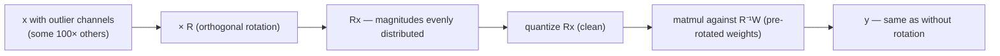

# Rotation Quantization

> **Prereqs:** [INT4 / AWQ / GPTQ](./int4-and-awq) (and ideally [FP8 Inference](./fp8-overview)). This lesson is the trick that fixes the outlier problem the previous quantization recipes have to work around.

## TL;DR

- LLM activations have **outliers** — a few channels with magnitudes 10–100× larger than typical. They wreck quantization (the scale gets pulled too wide; non-outlier values lose precision).
- **Rotation quantization** applies an orthogonal matrix `R` to the activations *and* a compensating `R⁻¹` to the next layer's weights. The math is unchanged, but the rotated activations have **no outlier channels** — their magnitudes are spread evenly.
- Rotated activations quantize cleanly to INT4 / FP4 / FP8 *without* outlier-protection tricks like AWQ. **QuaRot** (Ashkboos et al., 2024) was the first published version; **SpinQuant** (Liu et al., 2024) learns the rotation; both deliver near-FP16 accuracy at INT4.
- The rotation cost: one extra small matmul per attention block at runtime — typically under 2% throughput hit. The accuracy gain at low bit-widths can be 2–5 points on MMLU.
- **Where it matters most: aggressive 4-bit and below.** For FP8, outliers usually don't break things. For 4-bit (MXFP4, INT4) and below, rotation is increasingly default — DeepSeek-V3 uses a related trick during training; production INT4 stacks like vLLM v1 ship rotation as an option.

## Why this matters

Outlier channels are the single most common reason "INT4 / FP4 looked great on small models but broke our 70B." Pre-rotation, the workaround is per-channel calibration (AWQ-style); post-rotation, the problem just goes away. **It's the kind of trick that, once you understand, makes the whole quantization stack feel less fragile.** It's also a beautiful piece of linear algebra — exactly the kind of insight that distinguishes the deep ML systems engineer from the recipe-follower.

## Mental model

`R⁻¹W × Rx = W × x`. Same math, but the *intermediate* `Rx` is what gets quantized, and `Rx` has no outliers.

## Concrete walkthrough

### The outlier problem

Modern transformer training produces activations with a handful of "fat" channels. Anthropic / various academic studies show that for many models, ~1% of activation channels carry magnitudes ~50× the median. Geometrically: the activation vector lives in a high-dimensional space but has most of its mass concentrated along a few axes.

When you quantize this:

- **Per-tensor scaling** sets the scale based on the absolute max → all the non-outlier values become tiny relative to the scale → they round to 0 or 1 quantization level → most of your precision is wasted on capturing outliers.
- **Per-channel scaling** (AWQ) protects the outlier channels at the cost of metadata; works but adds complexity.
- **Rotation** removes the outliers altogether by spreading their magnitude across all channels.

### Why a rotation works

If `R` is an orthogonal matrix (R⁻¹ = Rᵀ, ||R x|| = ||x||), then `Rx` has the same Euclidean norm as `x` but its mass is *redistributed* across coordinates.

Specifically, if `x` has one fat channel of magnitude 100 and 4095 others of magnitude 1, then `Rx` (for a "well-mixing" `R` like a Hadamard transform) has every coordinate of roughly the same magnitude — the fat-channel mass got smeared across all coordinates.

The math:
- `‖Rx‖² = xᵀRᵀRx = xᵀx = ‖x‖²` (norm preserved)
- `Var(Rx[i]) ≈ ‖x‖²/d` for a uniform-mixing `R` (each coordinate gets a balanced sum of all input coordinates)

A 4096-dim vector with `‖x‖² ≈ 100²` (dominated by one outlier) becomes a vector where every coordinate has magnitude `≈ 100/√4096 ≈ 1.5`. The 100× ratio between fat and thin channels collapses to roughly 1.

### Hadamard rotations

The standard "well-mixing" orthogonal matrix is the **Hadamard transform**: a `2^k × 2^k` matrix of `±1/√n` whose product with `x` is computable in `O(d log d)` time (like an FFT). It's not learned — it's a fixed structured matrix.

Hadamard rotations are:
- **Cheap to apply** at inference (`O(d log d)` instead of `O(d²)` for a generic rotation).
- **No-parameters** — you don't need to store an extra weight matrix.
- **Excellent at outlier flattening** in practice; QuaRot uses Hadamard with strong results.

QuaRot's recipe:
1. Insert a Hadamard rotation `H` between every attention block's input and the projection it feeds into.
2. Pre-multiply the next layer's weights by `H⁻¹` (offline; one-time).
3. At inference: `H` applied to activations is essentially free; quantize `Hx`; `H⁻¹W` is the new weight.
4. Quantize `H⁻¹W` using your favorite recipe (GPTQ, AWQ, or just symmetric per-block).

End result: 4-bit quantization with quality nearly indistinguishable from FP16.

### Learned rotations — SpinQuant

QuaRot fixes `R` to a Hadamard. **SpinQuant** asks: can we learn a *better* rotation per layer? The answer is yes, and the learned rotations outperform Hadamard by ~0.5 pt on aggressive (3-bit) quantization. The cost is a small calibration step (~30 minutes of training on a tiny calibration set per layer). For 4-bit, Hadamard is usually good enough; for 3-bit and below, SpinQuant pulls ahead.

SpinQuant parameterizes `R` as a product of Givens rotations (each rotates a pair of coordinates), making the optimization tractable. The rotation matrices are stored alongside the model — small overhead.

### KV-cache rotations

Rotation works equally well for KV-cache quantization. The K and V tensors have outliers; rotating before storage flattens them; the rotation is undone (or absorbed into the next attention's rotation) on read. This is what enables FP8 KV cache quantization with negligible quality regression on most models.

DeepSeek-V3's MLA (Multi-head Latent Attention) is conceptually adjacent — the latent compression includes a rotation in the head dimension that has a similar outlier-flattening effect.

### Production picture (April 2026)

- vLLM v1 ships **QuaRot-style rotation** as an opt-in for INT4 weight quantization.
- TensorRT-LLM has its own rotation-aware INT4 path.
- ExecuTorch + Hexagon (Qualcomm) uses learned rotations as part of QNN quantization.
- Llama-4 reportedly uses a related rotation in its long-context variants.

The takeaway: by mid-2026, rotation is no longer a "research trick" — it's the production default for sub-FP8 quantization. Knowing what it does is essential for anyone working with edge or aggressive-server quantization.

### Where rotation doesn't help

- **FP8 quantization** rarely needs it — the format's range is wide enough to handle outliers directly.
- **Models without outliers** — some recently-trained models with careful normalization (e.g., applying RMSNorm in a way that keeps activations bounded) have flatter activation distributions and gain less from rotation. Check the magnitude distribution of your model's activations before rotating.
- **At very low precision (1-bit, ternary)** — rotation alone isn't enough; specialized recipes (BitNet, ternary quantization) handle this differently.

## Run it in your browser — outlier flattening with Hadamard

<RunInBrowser
  description="Generate an outlier-heavy activation, apply a Hadamard rotation, watch the channel magnitudes equalize."
  code={`import numpy as np

def hadamard(n):
    """Build a 2^k x 2^k Hadamard matrix recursively."""
    if n == 1: return np.array([[1.0]])
    H = hadamard(n // 2)
    return np.block([[H, H], [H, -H]]) / np.sqrt(2)

D = 256                            # channel dimension (power of 2)
H = hadamard(D)
assert np.allclose(H @ H.T, np.eye(D))  # orthogonal

# Construct an outlier-heavy activation
rng = np.random.default_rng(0)
x = rng.standard_normal(D)
x[7]  *= 50                         # one fat channel
x[19] *= 30                         # another
x[42] *= 80                         # a third
print(f"Before rotation: max |x| = {np.abs(x).max():.2f},  ratio max/median = {np.abs(x).max() / np.median(np.abs(x)):.0f}x")

# Rotate
xr = H @ x
print(f"After  rotation: max |xr| = {np.abs(xr).max():.2f},  ratio max/median = {np.abs(xr).max() / np.median(np.abs(xr)):.1f}x")
print()
print("Norm preserved:")
print(f"  ‖x‖ = {np.linalg.norm(x):.2f}, ‖xr‖ = {np.linalg.norm(xr):.2f}")
print()

# Now quantize: per-tensor INT8 scaling
def quantize_int8_per_tensor(v):
    s = np.abs(v).max() / 127
    q = np.round(v / s).clip(-128, 127)
    return q * s, s

x_q,  s_x  = quantize_int8_per_tensor(x)
xr_q, s_xr = quantize_int8_per_tensor(xr)
err_x  = np.abs(x  - x_q ).mean()
err_xr = np.abs(xr - xr_q).mean()

print(f"Quantization error (per-tensor INT8):")
print(f"  raw activation:     mean abs err = {err_x:.4f},  scale = {s_x:.3f}")
print(f"  rotated activation: mean abs err = {err_xr:.4f}, scale = {s_xr:.3f}")
print(f"  Improvement: {err_x / err_xr:.1f}x lower error after rotation")
print()
print("The rotated vector has all-similar magnitudes -> the per-tensor scale is")
print("tight, every value gets full INT8 precision. The raw vector has its scale")
print("pulled wide by the outliers; non-outlier values quantize coarsely.")
`}
/>

The output shows the rotation flattens the channel-magnitude ratio from ~80× to ~2× — exactly the structural change that makes 4-bit / 3-bit quantization tractable.

## Quick check

<FillIn
  prompt="The key mathematical property of the rotation matrix R that makes the trick work:"
  answer="orthogonal"
  accept={["orthogonality", "R^T R = I", "R inverse = R transpose"]}
  hint="Norm-preserving, R⁻¹ = Rᵀ."
  explanation="Orthogonal matrices preserve Euclidean norms (||Rx|| = ||x||) and have R⁻¹ = Rᵀ, which is what lets us absorb the inverse into the next layer\'s weights at zero runtime cost. Hadamard transforms are a structured, especially cheap-to-apply class of orthogonal matrices."
/>

<Quiz
  question="A team is quantizing Llama-4-405B to INT4 and seeing 4 pt MMLU regression — way more than the usual 1 pt. The most likely fix:"
  options={[
    'Switch to GPTQ instead of AWQ.',
    'Add a QuaRot-style rotation before quantization to flatten outliers.',
    'Use group_size=64 instead of 128.',
    'Switch to FP8.',
  ]}
  answer={1}
  explanation="Large 4-pt regression at INT4 on a frontier model is the textbook outlier problem — the model has activation channels that pull scales too wide. Rotation (QuaRot or SpinQuant) is the structural fix; AWQ is a partial workaround that helps but tends to bottom out at 1–2 pt regression. Switching to FP8 is the safe fallback if rotation isn\'t available, but it gives up the INT4 size win."
/>

## Key takeaways

1. **LLM activations have outliers; rotation flattens them.** That's the whole game.
2. **`R` orthogonal → `R⁻¹W × Rx = Wx`.** The compensating `R⁻¹` gets absorbed into the weight matrix offline.
3. **Hadamard transforms are the canonical fast `R`.** O(d log d) to apply; no learned parameters; near-optimal mixing.
4. **QuaRot uses fixed Hadamard; SpinQuant learns better rotations** for 3-bit and below.
5. **Production default for sub-FP8 quantization in 2026.** vLLM, TensorRT-LLM, ExecuTorch all support it; expect every aggressive-INT4 / FP4 stack to bake it in.

## Go deeper

<Resources
  items={[
    { kind: 'paper', href: 'https://arxiv.org/abs/2404.00456', title: 'QuaRot: Outlier-Free 4-Bit Inference in Rotated LLMs', author: 'Ashkboos et al., 2024', note: 'The QuaRot paper. Section 3 has the math; section 5 the empirical comparison with AWQ/GPTQ.' },
    { kind: 'paper', href: 'https://arxiv.org/abs/2405.16406', title: 'SpinQuant: LLM Quantization with Learned Rotations', author: 'Liu et al., 2024', note: 'The learned-rotation paper. Pulls ahead at 3-bit and below.' },
    { kind: 'paper', href: 'https://arxiv.org/abs/2306.07629', title: 'SmoothQuant: Accurate and Efficient Post-Training Quantization for LLMs', author: 'Xiao et al., 2023', note: 'The pre-rotation per-channel-scaling alternative. Useful background.' },
    { kind: 'paper', href: 'https://arxiv.org/abs/2208.07339', title: 'LLM.int8(): 8-bit Matrix Multiplication for Transformers at Scale', author: 'Dettmers et al., 2022', note: 'The paper that first identified the outlier problem in detail. Foundational for everything since.' },
    { kind: 'docs', href: 'https://docs.vllm.ai/en/latest/quantization/quark.html', title: 'vLLM — Quark / Rotation-Aware Quantization', note: 'Production knobs for rotation-based INT4 quantization in vLLM v1.' },
    { kind: 'repo', href: 'https://github.com/spcl/QuaRot', title: 'spcl/QuaRot', note: 'Reference QuaRot implementation. The Hadamard injection points map directly to the paper figures.' },
    { kind: 'repo', href: 'https://github.com/facebookresearch/SpinQuant', title: 'facebookresearch/SpinQuant', note: 'Reference SpinQuant. The learning loop that finds optimal rotations is in `optimize_rotation/`.' },
  ]}
/>

<LessonComplete />
