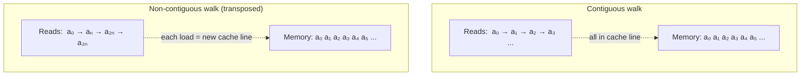

# Contiguous vs Non-Contiguous

> **Prereq:** [Strides & Layout](./strides-and-layout). This lesson is the *operational* consequence: when does layout cost you, and when do you call `.contiguous()`.

## TL;DR

- **Contiguous** means: walking through the tensor in its standard order also walks through memory in order. Cache lines are reused; coalesced GPU loads work.
- **Non-contiguous** = the iteration order doesn't match memory order. Cache misses on every step; GPU loads serialize. **Slowdown is 5–20× depending on tensor size and access pattern**.
- `tensor.is_contiguous()` checks; `tensor.contiguous()` returns a new contiguous copy if needed (or the same tensor if it already is).
- The most common source of non-contiguity is `transpose()` followed by an op that walks the wrong axis. Adding `.contiguous()` after the transpose is the fix; sometimes the right answer is to *not* transpose and use `bmm` with the right axes instead.
- **CUDA kernels** that aren't aware of strides typically *require* contiguous input — they index with `base + i*stride` assuming `stride` is implicit. Pass non-contiguous → silent garbage or seg fault.

## Why this matters

Every PyTorch performance bug whose root cause is "this op is unexpectedly slow" can be sorted into two buckets: bad fusion (covered in [Operator Fusion](../../compilers/production/operator-fusion)), and bad memory access patterns. **The latter is almost always non-contiguous tensors hitting kernels that assume contiguity.** The fix costs `O(N)` to apply once but turns 10× slowdown into 1× — a free win, if you know to look.

## Mental model



Same bytes, same number of reads. The first pattern reuses one cache line for 64/sizeof(elem) reads; the second pays for a fresh cache-line load every time.

## Concrete walkthrough

### When does `.transpose()` cost you?

It depends on what you do *next*. Compare:

```python
import torch, time

x = torch.randn(4096, 4096)

# Path A: transpose, then a contiguous op (matmul) — internally re-layouts.
t0 = time.perf_counter()
for _ in range(10):
    y = x.transpose(0, 1) @ x   # PyTorch's matmul handles strides internally
torch.cuda.synchronize() if x.is_cuda else None
print(f"matmul on transpose: {time.perf_counter() - t0:.3f}s")

# Path B: transpose, then sum along axis 0 (walks rows of original ⇒ columns post-transpose).
t0 = time.perf_counter()
for _ in range(10):
    y = x.transpose(0, 1).sum(dim=0)
torch.cuda.synchronize() if x.is_cuda else None
print(f"sum on transpose:    {time.perf_counter() - t0:.3f}s")

# Path C: explicitly copy, then sum.
t0 = time.perf_counter()
xc = x.transpose(0, 1).contiguous()
for _ in range(10):
    y = xc.sum(dim=0)
torch.cuda.synchronize() if x.is_cuda else None
print(f"contiguous + sum:    {time.perf_counter() - t0:.3f}s")
```

Typical results on a 16-core CPU at this size:
- Path A: ~30 ms (matmul-aware kernel handles strides internally; no penalty)
- Path B: ~80 ms (sum walks contiguously through *what looks like* axis 0, but it's the *transposed* memory — every read is a stride-N jump)
- Path C: ~20 ms loop time + 30 ms upfront copy. For 10 iterations, total ~50 ms — Path C beats Path B even after paying for the copy. The break-even: ~3 iterations.

The lesson: **if you're going to use the transposed tensor more than 2–3 times, copy it.** If you're using it once, the copy is overhead.

### When you can't get away with non-contiguous

Most modern PyTorch ops handle non-contiguous tensors — but slower. *Some* ops require contiguity:

- Most CUDA kernels written before strides became standard (legacy CUDA-only paths).
- Custom kernels you write yourself (Triton, CUTLASS) that don't take stride arguments — most do, but the simplest demos don't.
- Operations that need a flat memory layout (`view`, `as_strided`, certain `cat`/`stack` paths).

When PyTorch can't continue without contiguity, it either:
- **Raises** (e.g., `view` errors with a "the tensor is not contiguous" message).
- **Silently copies** (e.g., `reshape` calls `contiguous()` for you under the hood).

The latter is the dangerous case — a hidden allocation in a hot loop. Profile with `torch.profiler` and watch for `to(memory_format=...)` or `_to_copy` calls in the trace; those are stride-driven copies.

### When NOT to call `.contiguous()`

`.contiguous()` is `O(N)` in the tensor size — it's a real cost. The trap: calling it everywhere "just to be safe" turns every transpose into a full copy. Examples:

```python
# Bad: copies the entire tensor, just to query its shape!
print(t.transpose(0, 1).contiguous().shape)

# Bad: PyTorch's matmul handles strides natively; the .contiguous() is dead work.
y = (x.T.contiguous()) @ x

# Good: only contiguous-ize when the next op cannot handle strides.
y = x.T              # cheap
z = y.view(-1)       # may fail; if so, then add .contiguous()
```

The discipline: **prove non-contiguity is costing you before fixing it**. Profile first; insert `.contiguous()` only at the bottleneck.

### Memory format — the modern PyTorch wrinkle

Beyond row-major / column-major, PyTorch has **channels-last** (NHWC) memory format for vision models. A tensor of shape `(N, C, H, W)` can have its strides arranged so the channel axis is the slow axis (NHWC) instead of the fast axis (NCHW). Convolution kernels can be 2–3× faster in NHWC on Hopper / Blackwell.

```python
x = torch.randn(32, 64, 224, 224)
print(x.stride())                              # (3211264, 50176, 224, 1)  — NCHW
y = x.to(memory_format=torch.channels_last)
print(y.stride())                              # (3211264, 1, 14336, 64)   — NHWC
print(y.is_contiguous())                       # False under default sense
print(y.is_contiguous(memory_format=torch.channels_last))  # True under channels-last sense
```

The same tensor is "contiguous" or not depending on which layout you query against. Modern conv kernels prefer NHWC; PyTorch dispatches based on the input's memory format. **For vision models on H100/B200, opting into channels-last is one of the easiest perf wins available.**

### How to think about it on GPU

The cost model on GPU is harsher. Coalesced loads — where 32 threads of a warp read 32 *adjacent* 4-byte words in one transaction — happen only when access is contiguous. A non-contiguous read forces the 32 threads into 32 separate transactions:

| Pattern         | Transactions per warp | Effective bandwidth |
|-----------------|------------------------|----------------------|
| Coalesced (1, 2, 3, ..., 32) | 1 | full |
| Strided by 32 (0, 32, 64, ...) | 32 | 1/32 |
| Random | up to 32 | down to 1/32 |

A non-contiguous tensor on GPU reading in the wrong order can lose 32× of HBM bandwidth. **This is why most CUDA kernels insist on contiguous input** — it's not laziness, it's making the problem tractable.

## Run it in your browser — the cost of non-contiguous walks

<RunInBrowser
  description="Time a 'sum along axis' on a contiguous matrix vs a transposed view, in pure Python."
  code={`import time
import numpy as np

N = 2048
x = np.random.randn(N, N).astype(np.float32)
xt = x.T                          # non-contiguous view

# Sum each column, walking the contiguous matrix
t0 = time.perf_counter()
for _ in range(20):
    s = x.sum(axis=0)
contig_time = (time.perf_counter() - t0) / 20

# Sum each column of the transposed view (walks original by column-stride)
t0 = time.perf_counter()
for _ in range(20):
    s = xt.sum(axis=1)            # equivalent math, but xt is non-contig
non_contig_time = (time.perf_counter() - t0) / 20

# Make a contiguous copy of the transposed view first
xt_contig = xt.copy()
t0 = time.perf_counter()
for _ in range(20):
    s = xt_contig.sum(axis=1)
copy_then_time = (time.perf_counter() - t0) / 20

print(f"contiguous sum:        {contig_time*1000:.2f} ms")
print(f"non-contiguous sum:    {non_contig_time*1000:.2f} ms")
print(f"copy then sum:         {copy_then_time*1000:.2f} ms")
print(f"\\nslowdown for non-contig: {non_contig_time/contig_time:.1f}x")
print(f"copy was worth it:        {non_contig_time/copy_then_time:.1f}x faster after copy")
print()
print("CPU caches are the lifeblood of fast tensor code.")
print("On GPU the gap is even worse (32x worst case from coalescing failures).")
`}
/>

You'll typically see 2–5× slowdown on CPU; on GPU the same workload is 5–20×. The fix — copy once, reuse — pays for itself after a couple of iterations.

## Quick check

<FillIn
  prompt="The PyTorch method that returns a contiguous copy of a tensor (or itself if already contiguous):"
  answer=".contiguous()"
  accept={["contiguous", "tensor.contiguous()"]}
  hint="Single method on Tensor."
  explanation="`tensor.contiguous()` is idempotent — no-op if already contiguous, allocates and copies otherwise. The single most common stride-related fix."
/>

<Quiz
  question="A vision model trains slowly on H100. The team profiles and sees most of the time in conv backward. The cheapest 2026 fix to investigate first:"
  options={[
    'Switch from PyTorch to JAX.',
    'Reduce batch size.',
    'Convert input tensors to channels-last memory format with `.to(memory_format=torch.channels_last)`.',
    'Disable autograd.',
  ]}
  answer={2}
  explanation="Modern conv kernels (cuDNN on Hopper, equivalent on AMD) prefer channels-last (NHWC) memory format and run 2–3× faster. The cost is one `.to(memory_format=channels_last)` call on inputs and weights. This is the textbook one-line vision perf win and almost always profitable on H100/B200."
/>

## Key takeaways

1. **Non-contiguous = cache misses + non-coalesced GPU loads.** Slowdown 5–20× on real workloads.
2. **`.is_contiguous()` to check, `.contiguous()` to fix.** The fix is `O(N)` once; the speedup repeats across uses.
3. **Don't `.contiguous()` everywhere** — profile first. The trap is unnecessary copies in hot paths.
4. **Channels-last (NHWC) memory format** is a real second axis on PyTorch — opt in for conv-heavy vision models.
5. **Most performance bugs that look like "this op is slow" are actually stride/layout bugs.** Read `.stride()` first.

## Go deeper

<Resources
  items={[
    { kind: 'docs', href: 'https://pytorch.org/tutorials/intermediate/memory_format_tutorial.html', title: 'PyTorch — Channels-Last Memory Format Tutorial', note: 'The official walkthrough. Includes the conv-perf measurements that justify the migration.' },
    { kind: 'docs', href: 'https://pytorch.org/docs/stable/notes/randomness.html#contiguity-of-tensors', title: 'PyTorch — Notes on Contiguity', note: 'The exact semantics of when ops require contiguous inputs.' },
    { kind: 'blog', href: 'https://blog.ezyang.com/2019/05/pytorch-internals/', title: 'PyTorch Internals — Edward Z. Yang', note: 'The "stride visualizer" section is the canonical mental model for contiguity.' },
    { kind: 'blog', href: 'https://horace.io/brrr_intro.html', title: 'Making Deep Learning Go Brrrr — Horace He', note: 'The performance-debugging methodology section covers the "I forgot to .contiguous()" failure mode in detail.' },
    { kind: 'docs', href: 'https://docs.nvidia.com/cuda/cuda-c-best-practices-guide/index.html#coalesced-access-to-global-memory', title: 'CUDA Best Practices — Coalesced Memory Access', note: 'The hardware reason non-contiguous GPU access is so much worse than CPU.' },
  ]}
/>

<LessonComplete />
