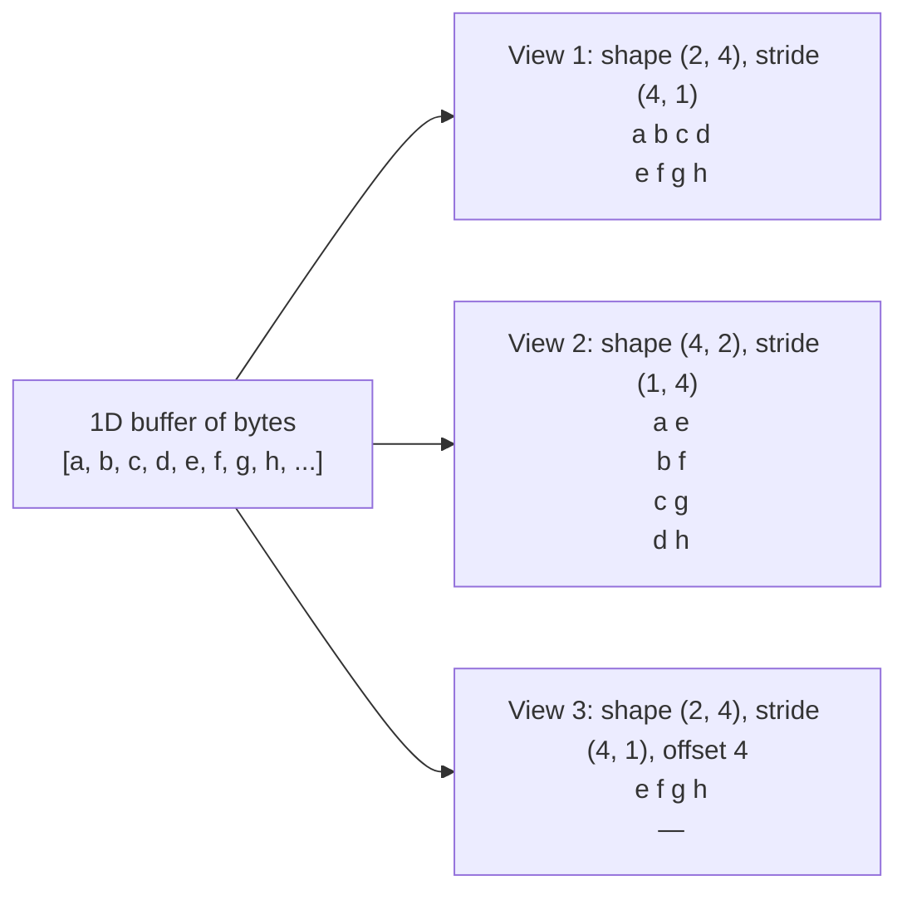

# Strides & Layout

<Mode is="learn">

In a managed-runtime numerical library, you tend to imagine a tensor as a 2D box of numbers — *the* matrix. The shape is what defines it. Reshape it and a new matrix appears. Transpose it and a new matrix appears.

That mental model is wrong, and the wrongness costs you. Underneath, a tensor is **one flat 1D buffer of bytes** plus a tiny pile of integers — a shape, a stride table, and an offset — that describe how to *walk* through that buffer. Transpose is O(1) because it just swaps two stride numbers. Slicing is O(1) because it shifts an offset. Most "operations" are not operations on data; they're metadata changes that *describe a different walk over the same bytes*.

This is liberating until it bites. A non-contiguous tensor read in the wrong order can be 10× slower than a contiguous one, even though the math is identical, because the cache hates non-sequential access. **Until you can read a tensor's strides, you cannot reason about whether your code is fast or slow.**

## TL;DR

- A **tensor** is `(buffer, shape, strides, dtype, offset)`. The buffer holds the bytes; shape and strides decide how to walk them.
- **Stride[i] = how many elements to skip** to advance by 1 along axis i. For a contiguous row-major `(M, N)` tensor: strides are `(N, 1)`. Column-major: `(1, M)`.
- Most tensor ops can be done **without copying** by changing strides: `transpose`, `view`, `permute`, `expand`, slicing along an axis. That's why `T.transpose(0, 1)` is O(1) — it just swaps strides.
- The cost shows up later: a non-contiguous tensor read in the wrong order can be **10× slower** than a contiguous one because it ruins cache locality and breaks coalesced GPU loads.
- **Almost every "why is my model slow?" mystery in PyTorch traces back to strides.** A `transpose` followed by a `view` blows up with a stride error; an `as_strided` on a temporary creates a footgun. Reading strides is reading the cost model.

## Why this matters

Every modern tensor framework — PyTorch, NumPy, JAX, TensorFlow — represents tensors as a buffer + a stride table. Operations that *seem* expensive (transpose a 1B-element tensor) are O(1); operations that *seem* free (printing a tensor) sometimes copy gigabytes. The mismatch between "what looks free" and "what is free" is exactly what strides encode.

## Mental model



One buffer, three different "tensors" — same bytes, different walking instructions. Transpose, slice, broadcast, view: all are stride manipulations.

## A tensor is `(buffer, shape, strides, offset)`

The minimal tensor type:

```python
class Tensor:
    def __init__(self, buf, shape, strides, offset=0):
        self.buf = buf            # 1D array of dtype-sized elements
        self.shape = shape        # tuple of ints
        self.strides = strides    # tuple of ints (in elements, not bytes)
        self.offset = offset      # starting position in the buffer

    def get(self, *indices):
        i = self.offset
        for idx, stride in zip(indices, self.strides):
            i += idx * stride
        return self.buf[i]
```

Element at logical index `(i, j)` lives at buffer position `offset + i*stride[0] + j*stride[1]`. That's the entire data model. Every other operation is a derived view that adjusts shape, strides, or offset.

## The standard layouts

For a 2D tensor of shape `(M, N)`:

| Layout         | Strides    | Memory order                              |
|----------------|------------|--------------------------------------------|
| Row-major (C)  | `(N, 1)`   | `(0,0), (0,1), ..., (0,N-1), (1,0), ...`   |
| Column-major (Fortran) | `(1, M)` | `(0,0), (1,0), ..., (M-1,0), (0,1), ...` |

Both store the same N×M elements; the layout is just "which axis varies fastest as we walk through memory."

For higher rank, the same idea: stride `(d_{n-1}*d_{n-2}*...*d_1, ..., d_{n-1}*d_{n-2}, d_{n-1}, 1)` is canonical row-major. PyTorch defaults to row-major; many BLAS libraries default to column-major; both work, but mixing them by accident is a constant source of bugs.

## Operations as stride changes

**Transpose** swaps two strides:

```python
def transpose(t, axis_a, axis_b):
    new_shape = list(t.shape)
    new_strides = list(t.strides)
    new_shape[axis_a], new_shape[axis_b] = new_shape[axis_b], new_shape[axis_a]
    new_strides[axis_a], new_strides[axis_b] = new_strides[axis_b], new_strides[axis_a]
    return Tensor(t.buf, tuple(new_shape), tuple(new_strides), t.offset)
```

No copy. The transposed tensor shares the buffer with its original.

**Slicing** along an axis changes shape, strides, offset:

```python
# t[2:5, :]
new_offset = t.offset + 2 * t.strides[0]
new_shape = (3, t.shape[1])
new_strides = t.strides
```

**Broadcasting** sets a stride to 0 (the same element is "read" repeatedly):

```python
# A (3,) tensor "broadcast" to shape (5, 3) — without copying
new_shape = (5, 3)
new_strides = (0, 1)        # advancing along axis 0 doesn't move in memory
```

**Reshape** is the expensive one — it sometimes can't be done without copying:

- If the new shape is compatible with current strides (the new walk is monotonic in the buffer), it's O(1) — no copy.
- Otherwise PyTorch raises (`.view` fails) or silently copies (`.reshape` falls back).

The classic gotcha: `t.transpose(0, 1).view(-1)` fails because transpose made strides non-contiguous, and `view` requires contiguity. You either call `t.transpose(0, 1).contiguous().view(-1)` (explicit copy) or `t.transpose(0, 1).reshape(-1)` (implicit copy if needed).

## Why non-contiguous = slow

Modern CPUs and GPUs love sequential memory access:
- **CPU L1/L2 caches** load a 64-byte <Term name="cache line">cache line</Term> on every access. If your next read is the next address, it's free; if it's 10 KB away, you pay another cache-line load.
- **GPU coalesced loads** require the 32 threads of a warp to read 32 consecutive bytes (or 128 bytes total). Non-coalesced loads serialize into many separate transactions.
- **DRAM page walks** add latency every time you cross a page boundary (typically 4 KB).

A tensor traversed in stride order is sequential in memory → fast. A transposed tensor traversed in the original order is jumping by `N` elements per step → cache thrashing. **Same bytes, same op count, ~10× slower.**

## Reading strides in production code

Every PyTorch tensor exposes `.stride()`:

```python
import torch
t = torch.randn(1024, 1024)
print(t.shape, t.stride())              # torch.Size([1024, 1024]) (1024, 1)
print(t.is_contiguous())                # True

t2 = t.transpose(0, 1)
print(t2.shape, t2.stride())            # torch.Size([1024, 1024]) (1, 1024)
print(t2.is_contiguous())               # False — strides not in descending order

# This will copy:
t3 = t2.contiguous()
print(t3.stride())                      # (1024, 1) — back to canonical
```

The single most useful debugging move when a kernel is mysteriously slow: print `.stride()` and `.is_contiguous()` for every tensor it touches. Half the time, the answer is "I forgot to `.contiguous()` after a `.transpose()`."

## Strides matter for kernels too

Almost every Triton or CUTLASS kernel takes `stride_*` arguments:

```python
@triton.jit
def matmul_kernel(A, B, C, M, N, K, stride_am, stride_ak, stride_bk, stride_bn, ...):
    ...
    a_ptrs = A + offs_m[:, None] * stride_am + offs_k[None, :] * stride_ak
    ...
```

This is exactly the offset-from-strides math from above. Pass the wrong strides, your kernel reads garbage. Strides are the universal cost model; kernel APIs surface them explicitly because a kernel is a program over a *strided buffer*.

## Run it in your browser

<RunInBrowser
  description="Implement a strided tensor view, transpose without copying, and watch the buffer stay shared."
  code={`class StridedTensor:
    def __init__(self, buf, shape, strides, offset=0):
        self.buf, self.shape, self.strides, self.offset = buf, shape, strides, offset

    def get(self, *idx):
        i = self.offset
        for x, s in zip(idx, self.strides):
            i += x * s
        return self.buf[i]

    def transpose(self):
        return StridedTensor(self.buf,
                             self.shape[::-1],
                             self.strides[::-1],
                             self.offset)

    def is_contiguous(self):
        s = 1
        for dim in reversed(self.shape):
            if dim == 1: continue
            if self.strides[self.shape.index(dim)] != s: return False
            s *= dim
        return True

    def __repr__(self):
        return (f"shape={self.shape} strides={self.strides} "
                f"offset={self.offset} buf_len={len(self.buf)}")

# Build a 3x4 row-major tensor
buf = list(range(12))                 # [0, 1, 2, ..., 11]
A = StridedTensor(buf, (3, 4), (4, 1))
print("A (row-major):", A)
print(f"  A[1, 2] = {A.get(1, 2)}    # expects 6")
print()

# Transpose — no copy, just stride swap
At = A.transpose()
print("A.transpose():", At)
print(f"  A.T[2, 1] = {At.get(2, 1)}  # expects 6 (same physical element)")
print()

# Verify the buffer is shared (mutate via At, see via A)
At.buf[6] = 999
print(f"After At.buf[6] = 999, A[1,2] = {A.get(1, 2)}    # also 999 — shared")
print()

# A 1D 'broadcast' to (5, 3) by setting one stride to 0
v = StridedTensor(list(range(3)), (5, 3), (0, 1))
print("Broadcast (3,) -> (5, 3):", v)
print("  Each row reads the same 3 elements:")
for i in range(5):
    print(f"  row {i}: {[v.get(i, j) for j in range(3)]}")

# is_contiguous check
print(f"\\nA contiguous? {A.is_contiguous()}")
print(f"At contiguous? {At.is_contiguous()}   # False — strides not descending")
`}
/>

The transpose returns instantly regardless of buffer size — it never touches the data. That's the productive surprise of strided layouts.

## Quick check

<FillIn
  prompt="A tensor of shape (M, N) with row-major (C-order) layout has strides:"
  answer="(N, 1)"
  accept={["N, 1", "(N,1)", "(N, 1)"]}
  hint="The slow axis (rows) skips N elements per step; the fast axis (columns) skips 1."
  explanation="Row-major: advancing one row in the buffer means skipping N column-elements. Advancing one column means skipping 1 element. So strides are (N, 1). Column-major flips this to (1, M)."
/>

<Quiz
  question="A user does `y = x.transpose(0, 1).view(-1)` on a 2D tensor and gets a runtime error about view not being supported on non-contiguous tensors. The cleanest fix:"
  options={[
    'Use `x.transpose(0, 1).contiguous().view(-1)` — explicitly copy to a contiguous layout before viewing.',
    'Use `x.transpose(0, 1).reshape(-1)` — same as the explicit version when needed; reshape will copy automatically if it has to.',
    'Both A and B are valid; the choice is whether you want the copy to be visible (A) or implicit (B).',
    'Use `x.flatten()` instead.',
  ]}
  answer={2}
  explanation="Both `contiguous().view()` and `reshape()` produce the same result; the difference is whether the copy is explicit. Production code often prefers (A) because it forces you to confront the cost; quick scripts use (B) for less typing. `flatten()` is fine for the simple case but doesn\'t generalize to arbitrary reshapes."
/>

## Key takeaways

1. **A tensor = (buffer, shape, strides, offset).** Strides decide how to walk the buffer.
2. **Transpose, slice, broadcast, expand are all O(1)** — they just change the stride/offset metadata.
3. **Reshape sometimes requires a copy.** `view` errors when it can't avoid one; `reshape` copies silently.
4. **Non-contiguous → cache misses → ~10× slowdown.** This is the single most common source of "mysteriously slow" tensor code.
5. **Read `.stride()` and `.is_contiguous()` first** when debugging perf. Kernel APIs take strides explicitly because strides are the cost model.

## Go deeper

<Resources
  items={[
    { kind: 'docs', href: 'https://pytorch.org/docs/stable/tensor_view.html', title: 'PyTorch — Tensor Views', note: 'Authoritative list of view-producing ops vs ones that may copy. Bookmark this.' },
    { kind: 'docs', href: 'https://numpy.org/doc/stable/reference/arrays.ndarray.html#internal-memory-layout-of-an-ndarray', title: 'NumPy — Internal Memory Layout', note: 'Same model, slightly different vocabulary. Worth reading for the C-vs-F-contiguous nuance.' },
    { kind: 'blog', href: 'https://blog.ezyang.com/2019/05/pytorch-internals/', title: 'PyTorch Internals — Edward Z. Yang', note: 'Best free essay on PyTorch\'s tensor representation. The "Stride visualizer" section is gold.' },
    { kind: 'blog', href: 'https://ajcr.net/stride-guide-part-1/', title: 'A guide to NumPy strides — Alex Riley', note: 'Walks through every common stride trick with diagrams. The intuition-builder.' },
    { kind: 'video', href: 'https://www.youtube.com/watch?v=OQqwthlRiLs', title: 'Tinygrad — A Tensor Library from Scratch (livestream)', author: 'George Hotz', note: 'Watch tinygrad\'s tensor type get built from nothing — the [module capstone](./index) is a structured weekend version of this.' },
    { kind: 'repo', href: 'https://github.com/tinygrad/tinygrad', title: 'tinygrad/tinygrad', note: 'Reference for "what does a 200-line tensor library look like?" — `tinygrad/shape/` is the strided view layer.' },
    { kind: 'repo', href: 'https://github.com/pytorch/pytorch', title: 'pytorch/pytorch', note: '`aten/src/ATen/core/TensorImpl.h` is the canonical strided-tensor implementation in modern code.' },
  ]}
/>

</Mode>

<Mode is="reference">

## TL;DR

- A **tensor** is `(buffer, shape, strides, dtype, offset)`. The buffer holds the bytes; shape and strides decide how to walk them.
- **Stride[i] = how many elements to skip** to advance by 1 along axis i. For a contiguous row-major `(M, N)` tensor: strides are `(N, 1)`. Column-major: `(1, M)`.
- Most tensor ops can be done **without copying** by changing strides: `transpose`, `view`, `permute`, `expand`, slicing along an axis. That's why `T.transpose(0, 1)` is O(1) — it just swaps strides.
- The cost shows up later: a non-contiguous tensor read in the wrong order can be **10× slower** than a contiguous one because it ruins cache locality and breaks coalesced GPU loads.
- **Almost every "why is my model slow?" mystery in PyTorch traces back to strides.** A `transpose` followed by a `view` blows up with a stride error; an `as_strided` on a temporary creates a footgun. Reading strides is reading the cost model.

## Why this matters

Every modern tensor framework — PyTorch, NumPy, JAX, TensorFlow — represents tensors as a buffer + a stride table. Operations that *seem* expensive (transpose a 1B-element tensor) are O(1); operations that *seem* free (printing a tensor) sometimes copy gigabytes. The mismatch between "what looks free" and "what is free" is exactly what strides encode. **Until you can read a tensor's strides, you cannot reason about whether your code is fast or slow.**

## Mental model


One buffer, three different "tensors" — same bytes, different walking instructions. Transpose, slice, broadcast, view: all are stride manipulations.

## Concrete walkthrough

### A tensor is `(buffer, shape, strides, offset)`

The minimal tensor type:

```python
class Tensor:
    def __init__(self, buf, shape, strides, offset=0):
        self.buf = buf            # 1D array of dtype-sized elements
        self.shape = shape        # tuple of ints
        self.strides = strides    # tuple of ints (in elements, not bytes)
        self.offset = offset      # starting position in the buffer

    def get(self, *indices):
        i = self.offset
        for idx, stride in zip(indices, self.strides):
            i += idx * stride
        return self.buf[i]
```

Element at logical index `(i, j)` lives at buffer position `offset + i*stride[0] + j*stride[1]`. That's the entire data model. Every other operation is a derived view that adjusts shape, strides, or offset.

### The standard layouts

For a 2D tensor of shape `(M, N)`:

| Layout         | Strides    | Memory order                              |
|----------------|------------|--------------------------------------------|
| Row-major (C)  | `(N, 1)`   | `(0,0), (0,1), ..., (0,N-1), (1,0), ...`   |
| Column-major (Fortran) | `(1, M)` | `(0,0), (1,0), ..., (M-1,0), (0,1), ...` |

Both store the same N×M elements; the layout is just "which axis varies fastest as we walk through memory."

For higher rank, the same idea: stride `(d_{n-1}*d_{n-2}*...*d_1, ..., d_{n-1}*d_{n-2}, d_{n-1}, 1)` is canonical row-major. PyTorch defaults to row-major; many BLAS libraries default to column-major; both work, but mixing them by accident is a constant source of bugs.

### Operations as stride changes

**Transpose** swaps two strides:

```python
def transpose(t, axis_a, axis_b):
    new_shape = list(t.shape)
    new_strides = list(t.strides)
    new_shape[axis_a], new_shape[axis_b] = new_shape[axis_b], new_shape[axis_a]
    new_strides[axis_a], new_strides[axis_b] = new_strides[axis_b], new_strides[axis_a]
    return Tensor(t.buf, tuple(new_shape), tuple(new_strides), t.offset)
```

No copy. The transposed tensor shares the buffer with its original.

**Slicing** along an axis changes shape, strides, offset:

```python
# t[2:5, :]
new_offset = t.offset + 2 * t.strides[0]
new_shape = (3, t.shape[1])
new_strides = t.strides
```

**Broadcasting** sets a stride to 0 (the same element is "read" repeatedly):

```python
# A (3,) tensor "broadcast" to shape (5, 3) — without copying
new_shape = (5, 3)
new_strides = (0, 1)        # advancing along axis 0 doesn't move in memory
```

**Reshape** is the expensive one — it sometimes can't be done without copying:

- If the new shape is compatible with current strides (the new walk is monotonic in the buffer), it's O(1) — no copy.
- Otherwise PyTorch raises (`.view` fails) or silently copies (`.reshape` falls back).

The classic gotcha: `t.transpose(0, 1).view(-1)` fails because transpose made strides non-contiguous, and `view` requires contiguity. You either call `t.transpose(0, 1).contiguous().view(-1)` (explicit copy) or `t.transpose(0, 1).reshape(-1)` (implicit copy if needed).

### Why non-contiguous = slow

Modern CPUs and GPUs love sequential memory access:
- **CPU L1/L2 caches** load a 64-byte cache line on every access. If your next read is the next address, it's free; if it's 10 KB away, you pay another cache-line load.
- **GPU coalesced loads** require the 32 threads of a warp to read 32 consecutive bytes (or 128 bytes total). Non-coalesced loads serialize into many separate transactions.
- **DRAM page walks** add latency every time you cross a page boundary (typically 4 KB).

A tensor traversed in stride order is sequential in memory → fast. A transposed tensor traversed in the original order is jumping by `N` elements per step → cache thrashing. **Same bytes, same op count, ~10× slower.**

### Reading strides in production code

Every PyTorch tensor exposes `.stride()`:

```python
import torch
t = torch.randn(1024, 1024)
print(t.shape, t.stride())              # torch.Size([1024, 1024]) (1024, 1)
print(t.is_contiguous())                # True

t2 = t.transpose(0, 1)
print(t2.shape, t2.stride())            # torch.Size([1024, 1024]) (1, 1024)
print(t2.is_contiguous())               # False — strides not in descending order

# This will copy:
t3 = t2.contiguous()
print(t3.stride())                      # (1024, 1) — back to canonical
```

The single most useful debugging move when a kernel is mysteriously slow: print `.stride()` and `.is_contiguous()` for every tensor it touches. Half the time, the answer is "I forgot to `.contiguous()` after a `.transpose()`."

### Strides matter for kernels too

Almost every Triton or CUTLASS kernel takes `stride_*` arguments:

```python
@triton.jit
def matmul_kernel(A, B, C, M, N, K, stride_am, stride_ak, stride_bk, stride_bn, ...):
    ...
    a_ptrs = A + offs_m[:, None] * stride_am + offs_k[None, :] * stride_ak
    ...
```

This is exactly the offset-from-strides math from above. Pass the wrong strides, your kernel reads garbage. Strides are the universal cost model; kernel APIs surface them explicitly because a kernel is a program over a *strided buffer*.

## Run it in your browser

<RunInBrowser
  description="Implement a strided tensor view, transpose without copying, and watch the buffer stay shared."
  code={`class StridedTensor:
    def __init__(self, buf, shape, strides, offset=0):
        self.buf, self.shape, self.strides, self.offset = buf, shape, strides, offset

    def get(self, *idx):
        i = self.offset
        for x, s in zip(idx, self.strides):
            i += x * s
        return self.buf[i]

    def transpose(self):
        return StridedTensor(self.buf,
                             self.shape[::-1],
                             self.strides[::-1],
                             self.offset)

    def is_contiguous(self):
        s = 1
        for dim in reversed(self.shape):
            if dim == 1: continue
            if self.strides[self.shape.index(dim)] != s: return False
            s *= dim
        return True

    def __repr__(self):
        return (f"shape={self.shape} strides={self.strides} "
                f"offset={self.offset} buf_len={len(self.buf)}")

# Build a 3x4 row-major tensor
buf = list(range(12))                 # [0, 1, 2, ..., 11]
A = StridedTensor(buf, (3, 4), (4, 1))
print("A (row-major):", A)
print(f"  A[1, 2] = {A.get(1, 2)}    # expects 6")
print()

# Transpose — no copy, just stride swap
At = A.transpose()
print("A.transpose():", At)
print(f"  A.T[2, 1] = {At.get(2, 1)}  # expects 6 (same physical element)")
print()

# Verify the buffer is shared (mutate via At, see via A)
At.buf[6] = 999
print(f"After At.buf[6] = 999, A[1,2] = {A.get(1, 2)}    # also 999 — shared")
print()

# A 1D 'broadcast' to (5, 3) by setting one stride to 0
v = StridedTensor(list(range(3)), (5, 3), (0, 1))
print("Broadcast (3,) -> (5, 3):", v)
print("  Each row reads the same 3 elements:")
for i in range(5):
    print(f"  row {i}: {[v.get(i, j) for j in range(3)]}")

# is_contiguous check
print(f"\\nA contiguous? {A.is_contiguous()}")
print(f"At contiguous? {At.is_contiguous()}   # False — strides not descending")
`}
/>

The transpose returns instantly regardless of buffer size — it never touches the data. That's the productive surprise of strided layouts.

## Quick check

<FillIn
  prompt="A tensor of shape (M, N) with row-major (C-order) layout has strides:"
  answer="(N, 1)"
  accept={["N, 1", "(N,1)", "(N, 1)"]}
  hint="The slow axis (rows) skips N elements per step; the fast axis (columns) skips 1."
  explanation="Row-major: advancing one row in the buffer means skipping N column-elements. Advancing one column means skipping 1 element. So strides are (N, 1). Column-major flips this to (1, M)."
/>

<Quiz
  question="A user does `y = x.transpose(0, 1).view(-1)` on a 2D tensor and gets a runtime error about view not being supported on non-contiguous tensors. The cleanest fix:"
  options={[
    'Use `x.transpose(0, 1).contiguous().view(-1)` — explicitly copy to a contiguous layout before viewing.',
    'Use `x.transpose(0, 1).reshape(-1)` — same as the explicit version when needed; reshape will copy automatically if it has to.',
    'Both A and B are valid; the choice is whether you want the copy to be visible (A) or implicit (B).',
    'Use `x.flatten()` instead.',
  ]}
  answer={2}
  explanation="Both `contiguous().view()` and `reshape()` produce the same result; the difference is whether the copy is explicit. Production code often prefers (A) because it forces you to confront the cost; quick scripts use (B) for less typing. `flatten()` is fine for the simple case but doesn\'t generalize to arbitrary reshapes."
/>

## Key takeaways

1. **A tensor = (buffer, shape, strides, offset).** Strides decide how to walk the buffer.
2. **Transpose, slice, broadcast, expand are all O(1)** — they just change the stride/offset metadata.
3. **Reshape sometimes requires a copy.** `view` errors when it can't avoid one; `reshape` copies silently.
4. **Non-contiguous → cache misses → ~10× slowdown.** This is the single most common source of "mysteriously slow" tensor code.
5. **Read `.stride()` and `.is_contiguous()` first** when debugging perf. Kernel APIs take strides explicitly because strides are the cost model.

## Go deeper

<Resources
  items={[
    { kind: 'docs', href: 'https://pytorch.org/docs/stable/tensor_view.html', title: 'PyTorch — Tensor Views', note: 'Authoritative list of view-producing ops vs ones that may copy. Bookmark this.' },
    { kind: 'docs', href: 'https://numpy.org/doc/stable/reference/arrays.ndarray.html#internal-memory-layout-of-an-ndarray', title: 'NumPy — Internal Memory Layout', note: 'Same model, slightly different vocabulary. Worth reading for the C-vs-F-contiguous nuance.' },
    { kind: 'blog', href: 'https://blog.ezyang.com/2019/05/pytorch-internals/', title: 'PyTorch Internals — Edward Z. Yang', note: 'Best free essay on PyTorch\'s tensor representation. The "Stride visualizer" section is gold.' },
    { kind: 'blog', href: 'https://ajcr.net/stride-guide-part-1/', title: 'A guide to NumPy strides — Alex Riley', note: 'Walks through every common stride trick with diagrams. The intuition-builder.' },
    { kind: 'video', href: 'https://www.youtube.com/watch?v=OQqwthlRiLs', title: 'Tinygrad — A Tensor Library from Scratch (livestream)', author: 'George Hotz', note: 'Watch tinygrad\'s tensor type get built from nothing — the [module capstone](./index) is a structured weekend version of this.' },
    { kind: 'repo', href: 'https://github.com/tinygrad/tinygrad', title: 'tinygrad/tinygrad', note: 'Reference for "what does a 200-line tensor library look like?" — `tinygrad/shape/` is the strided view layer.' },
    { kind: 'repo', href: 'https://github.com/pytorch/pytorch', title: 'pytorch/pytorch', note: '`aten/src/ATen/core/TensorImpl.h` is the canonical strided-tensor implementation in modern code.' },
  ]}
/>

</Mode>

<LessonComplete />
