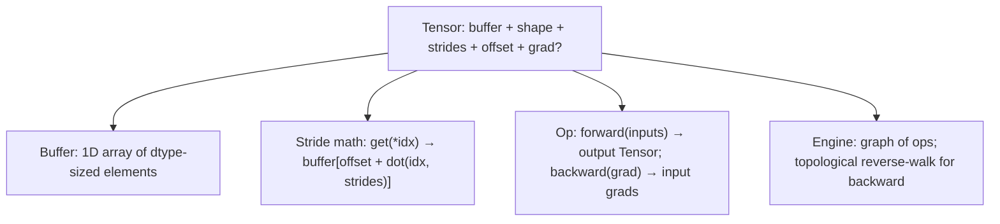

# Build a Tensor Library

> **Prereqs:** [Strides & Layout](./strides-and-layout), [Contiguous vs Non-Contiguous](./contiguous-vs-non). This lesson is the *do it* version of the prior two.

## TL;DR

- A tensor library is **smaller than people think**: ~200 lines of Python gets you strided views, broadcasting, and a handful of ops good enough to train MNIST.
- The four types you need: `Buffer` (raw memory), `Tensor` (buffer + shape + strides + offset), `Op` (forward + backward), `Engine` (the autograd graph + topological execution).
- **Once you've written one yourself, every "magic" in PyTorch / JAX becomes legible**: shape errors, stride bugs, retain_graph weirdness, why `.detach()` exists.
- Real production libraries (PyTorch, JAX, tinygrad) add: dispatch to backends (CUDA, MPS, ROCm), op fusion, JIT compilation, distributed semantics. All of this is bolted onto the same core abstraction.
- The lesson companion is the [module capstone](./index) — a 200-line tinygrad clone running MNIST.

## Why this matters

Frameworks feel like magic until you build one. After you've written 200 lines of strided tensor + autograd, you'll never again type `loss.backward()` without picturing exactly what it does — *which* buffers it allocates, *which* graph it walks, *what* `requires_grad` means at the implementation level. This understanding is what lets you debug PyTorch internals when something goes wrong, and it's what makes the [Compilers](../../compilers) track readable, because every framework's IR maps back to these fundamentals.

## Mental model



Four boxes. Build them in order, MNIST runs.

## Concrete walkthrough

### Step 1 — the buffer

A buffer is a 1D array. Use Python `list` for the toy version; `numpy.ndarray` for the not-toy version (we use a backing buffer for speed but the abstraction is the same).

```python
import numpy as np

class Buffer:
    """1D contiguous storage. The actual bytes."""
    def __init__(self, data):
        self.data = np.asarray(data, dtype=np.float32).ravel()

    def __len__(self): return len(self.data)
    def __getitem__(self, i): return self.data[i]
    def __setitem__(self, i, v): self.data[i] = v
```

That's it for memory. The interesting structure is on top.

### Step 2 — the strided tensor

Same as the [Strides & Layout](./strides-and-layout) lesson, with a few utility methods:

```python
class Tensor:
    def __init__(self, buf, shape, strides=None, offset=0, requires_grad=False):
        self.buf = buf if isinstance(buf, Buffer) else Buffer(buf)
        self.shape = tuple(shape)
        if strides is None:
            # Default to contiguous row-major
            s = []
            cur = 1
            for d in reversed(self.shape):
                s.append(cur)
                cur *= d
            strides = tuple(reversed(s))
        self.strides = tuple(strides)
        self.offset = offset
        self.requires_grad = requires_grad
        self.grad = None
        self._ctx = None        # autograd: which Op produced me + inputs

    def numel(self):
        n = 1
        for d in self.shape: n *= d
        return n

    def __getitem__(self, idx):
        if isinstance(idx, int): idx = (idx,)
        i = self.offset + sum(x * s for x, s in zip(idx, self.strides))
        return self.buf[i]

    # View-producing ops (cheap)
    def transpose(self, a, b):
        s = list(self.shape); st = list(self.strides)
        s[a], s[b] = s[b], s[a]; st[a], st[b] = st[b], st[a]
        return Tensor(self.buf, s, st, self.offset, self.requires_grad)
```

Operations that change strides without copying are O(1). All the cheap manipulations from the previous lesson get one method here.

### Step 3 — the op (forward + backward)

An op is a class with `forward()` and `backward()`. We attach `_ctx` to the output so backward can find what produced it.

```python
class Op:
    def __init__(self, *inputs):
        self.inputs = inputs
        self.requires_grad = any(t.requires_grad for t in inputs)

    def forward(self):
        raise NotImplementedError

    def backward(self, grad):
        raise NotImplementedError

    def apply(self):
        out = self.forward()
        if self.requires_grad:
            out._ctx = self          # remember who produced me
            out.requires_grad = True
        return out

class Add(Op):
    def forward(self):
        a, b = self.inputs
        # Assume contiguous + same shape for simplicity
        out_data = a.buf.data + b.buf.data
        return Tensor(Buffer(out_data), a.shape)

    def backward(self, grad):
        # d(a+b)/da = 1, d(a+b)/db = 1
        return [grad, grad]

class MatMul(Op):
    def forward(self):
        a, b = self.inputs
        out = np.matmul(a.buf.data.reshape(a.shape),
                        b.buf.data.reshape(b.shape))
        return Tensor(Buffer(out), out.shape)

    def backward(self, grad):
        a, b = self.inputs
        ga = np.matmul(grad.buf.data.reshape(grad.shape),
                       b.buf.data.reshape(b.shape).T)
        gb = np.matmul(a.buf.data.reshape(a.shape).T,
                       grad.buf.data.reshape(grad.shape))
        return [Tensor(Buffer(ga), a.shape), Tensor(Buffer(gb), b.shape)]

class ReLU(Op):
    def forward(self):
        x, = self.inputs
        out = np.maximum(x.buf.data, 0)
        return Tensor(Buffer(out), x.shape)

    def backward(self, grad):
        x, = self.inputs
        mask = (x.buf.data > 0).astype(np.float32)
        return [Tensor(Buffer(grad.buf.data * mask), grad.shape)]
```

Five ops (add, matmul, relu, plus mul and softmax/cross-entropy) is enough for an MLP. Each is the math of forward + the math of backward.

### Step 4 — the autograd engine

Topological sort of the op graph; walk it in reverse, accumulating gradients into `.grad`.

```python
def backward(loss_tensor):
    # 1. Build the topological order of nodes ending at loss_tensor.
    visited = set()
    topo = []
    def dfs(node):
        if id(node) in visited or node._ctx is None: return
        visited.add(id(node))
        for inp in node._ctx.inputs:
            dfs(inp)
        topo.append(node)
    dfs(loss_tensor)

    # 2. Seed the gradient at the loss with 1.
    loss_tensor.grad = Tensor(Buffer(np.ones_like(loss_tensor.buf.data)), loss_tensor.shape)

    # 3. Walk in reverse, calling each op's backward.
    for node in reversed(topo):
        op = node._ctx
        grads = op.backward(node.grad)
        for inp, g in zip(op.inputs, grads):
            if not inp.requires_grad: continue
            if inp.grad is None:
                inp.grad = g
            else:
                inp.grad = Tensor(Buffer(inp.grad.buf.data + g.buf.data), inp.shape)
```

That's autograd. Topological order, reverse walk, accumulate. PyTorch's `loss.backward()` is the same algorithm with thousands of ops in the registry instead of five.

### Putting it together — train MNIST

```python
# Two-layer MLP
W1 = Tensor(Buffer(np.random.randn(784, 128).astype(np.float32) * 0.02), (784, 128), requires_grad=True)
W2 = Tensor(Buffer(np.random.randn(128, 10).astype(np.float32) * 0.02), (128, 10), requires_grad=True)

for epoch in range(5):
    for x, y in batches(mnist):
        h = ReLU(MatMul(x, W1).apply()).apply()
        logits = MatMul(h, W2).apply()
        loss = CrossEntropy(logits, y).apply()

        backward(loss)

        # SGD step
        for p in (W1, W2):
            p.buf.data -= 0.01 * p.grad.buf.data
            p.grad = None
```

This is a complete training loop. Real frameworks add: param groups, optimizer abstractions, learning-rate schedulers, mixed-precision casting, distributed all-reduce. None of that changes the four-box mental model — they're just additional layers on top.

### What you skip in the toy version

- **Dispatch to backends.** Real frameworks abstract over CPU, CUDA, MPS, etc. Each op needs a per-backend impl.
- **Op fusion / JIT.** The compilers track is exactly this story.
- **Lazy evaluation.** PyTorch is eager; tinygrad and JAX are lazy/traced. Lazy lets you fuse; eager is simpler to debug.
- **Memory pooling.** Real frameworks pre-allocate from a pool; the toy version trusts the OS allocator.
- **Distributed.** All-reduce, broadcast, gather. The training distributed module covers this.

What you keep:
- **The autograd algorithm** is the same.
- **The strided tensor representation** is the same.
- **The op-as-class abstraction** is the same.

That's why writing the toy version is so productive — the load-bearing concepts are *all* present in 200 lines.

## Run it in your browser — a tiny working tensor + autograd

<RunInBrowser
  description="A complete autograd in 60 lines: tensor with grad, two ops, backward. Train a one-step linear regression."
  code={`import numpy as np

class T:
    def __init__(self, data, _ctx=None, requires_grad=False):
        self.data = np.asarray(data, dtype=np.float32)
        self.shape = self.data.shape
        self._ctx = _ctx
        self.requires_grad = requires_grad
        self.grad = None

    def __repr__(self):
        return f"T(shape={self.shape}, data={self.data.flatten()[:4]}{'...' if self.data.size>4 else ''})"

class Op:
    def __init__(self, *inputs):
        self.inputs = inputs
    def apply(self):
        out_data, ctx_state = self.forward(*[t.data for t in self.inputs])
        out = T(out_data, _ctx=(self, ctx_state),
                requires_grad=any(t.requires_grad for t in self.inputs))
        return out

class Add(Op):
    def forward(self, a, b): return a + b, None
    def backward(self, grad, _state): return grad, grad

class Mul(Op):
    def forward(self, a, b): return a * b, (a, b)
    def backward(self, grad, state):
        a, b = state
        return grad * b, grad * a

def backward(root):
    visited, topo = set(), []
    def dfs(n):
        if id(n) in visited or n._ctx is None: return
        visited.add(id(n))
        for inp in n._ctx[0].inputs: dfs(inp)
        topo.append(n)
    dfs(root)
    root.grad = np.ones_like(root.data)
    for n in reversed(topo):
        op, state = n._ctx
        grads = op.backward(n.grad, state)
        for inp, g in zip(op.inputs, grads):
            if not inp.requires_grad: continue
            inp.grad = g if inp.grad is None else inp.grad + g

# One-step linear regression: y = w*x + b, fit (x=2 → y=5).
w = T(0.0, requires_grad=True)
b = T(0.0, requires_grad=True)
x = T(2.0)
y_target = T(5.0)

for step in range(100):
    # forward: pred = w*x + b ; loss = (pred - y)^2
    pred = Add(Mul(w, x).apply(), b).apply()
    err  = Add(pred, T(-y_target.data)).apply()
    loss = Mul(err, err).apply()

    # backward
    w.grad = b.grad = None
    backward(loss)

    # SGD step
    w.data = w.data - 0.05 * w.grad
    b.data = b.data - 0.05 * b.grad

    if step % 20 == 0 or step == 99:
        print(f"step {step:>3}: loss={loss.data:.4f}, w={w.data:.3f}, b={b.data:.3f}, pred={pred.data:.3f}")

print(f"\\nFinal: y(x=2) = {w.data * 2 + b.data:.3f} (target 5.000)")
print("That's autograd. Build it once; understand frameworks forever.")
`}
/>

The training loop converges in ~100 steps. You wrote a working ML framework. The next 199 lines (broadcasting, more ops, MNIST) are straightforward variations.

## Quick check

<FillIn
  prompt="The data structure that backward traversal walks in reverse:"
  answer="topological order"
  accept={["topological sort", "topo order", "topo sort", "the autograd graph"]}
  hint="Standard graph algorithm. Same shape as compilation order in compilers."
  explanation="Autograd builds a DAG of ops as the forward pass runs. backward() seeds the loss\'s gradient and walks the DAG in reverse-topological order, calling each op\'s backward and accumulating gradients into the inputs. This is the entire algorithm."
/>

<Quiz
  question="A library author adds a new op `gelu` to their toy framework. What's the minimum they have to write?"
  options={[
    'A new Tensor subclass.',
    'A `forward()` (compute the gelu) and a `backward(grad)` (the chain-rule term).',
    'A C++ kernel.',
    'A new optimizer.',
  ]}
  answer={1}
  explanation="The framework abstraction is: an Op is a (forward, backward) pair. Adding `gelu` means writing those two methods. Real frameworks add backend dispatch (CUDA, CPU) and possibly fused-op variants, but the *minimum viable* op is just the two methods. This is why toy autograd is small and full of insight: the abstraction is genuinely complete."
/>

## Key takeaways

1. **A tensor library is small.** ~200 lines for strided tensors + autograd + 5 ops + MNIST.
2. **Four boxes:** Buffer, Tensor, Op (forward+backward), Engine (topo sort + reverse walk).
3. **Strides are the cost model**, autograd is the math, ops are the API. Each is independent and learnable.
4. **Real frameworks scale this with dispatch, fusion, JIT, distributed.** The core is the same.
5. **Build it once.** PyTorch / JAX stop being magic; debugging them becomes tractable; the [Compilers](../../compilers) track immediately makes more sense.

## Go deeper

<Resources
  items={[
    { kind: 'video', href: 'https://www.youtube.com/watch?v=VMj-3S1tku0', title: 'micrograd — Andrej Karpathy', note: '~50-line autograd in Python from scratch. The clearest tutorial on the planet for the engine half of this lesson.' },
    { kind: 'repo', href: 'https://github.com/karpathy/micrograd', title: 'karpathy/micrograd', note: 'The reference repo. Read in 30 minutes.' },
    { kind: 'repo', href: 'https://github.com/tinygrad/tinygrad', title: 'tinygrad/tinygrad', note: '~5000 lines for a real framework with strides + 25 ops + multiple backends. The "scale up the toy" reference.' },
    { kind: 'blog', href: 'https://blog.ezyang.com/2019/05/pytorch-internals/', title: 'PyTorch Internals — Edward Z. Yang', note: 'How the production version is structured. Read after writing your own toy.' },
    { kind: 'paper', href: 'https://arxiv.org/abs/1502.05767', title: 'Automatic Differentiation in Machine Learning: A Survey', author: 'Baydin et al., 2018', note: 'Foundational reference on forward-mode vs reverse-mode autograd. Section 3 frames why reverse-mode is the right choice for ML.' },
    { kind: 'docs', href: 'https://pytorch.org/docs/stable/notes/extending.html', title: 'PyTorch — Extending Autograd', note: 'How to write a custom autograd Function in real PyTorch. The same forward+backward pattern, dispatched into the framework graph.' },
  ]}
/>

<LessonComplete />
