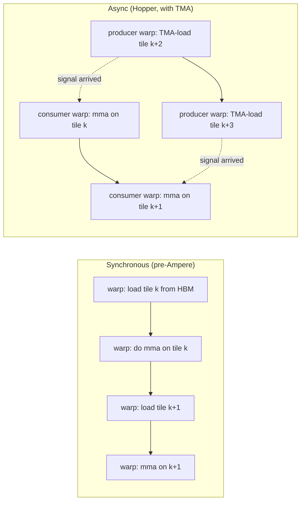

# TMA & cp.async

> **Prereqs:** [SM Architecture](../gpu-fundamentals/sm-architecture), [Shared Memory](../gpu-fundamentals/shared-memory). This lesson is the modern *async-copy* story that makes warp-specialized kernels possible.

## TL;DR

- The single biggest perf insight in modern GPU kernels: **don't make threads wait for memory**. Use a hardware engine to copy bytes from HBM to SMEM in the background while the warp keeps computing.
- **`cp.async`** (Ampere, 2020) was the first such instruction: a thread issues an async copy from HBM to SMEM, then later does a `cp.async.wait_group` when it actually needs the data. While waiting, the warp can do other work.
- **TMA — Tensor Memory Accelerator** (Hopper, 2022) generalizes this: one *thread* issues a copy of an entire 2D/3D *tile* (described by a precomputed TMA descriptor), and a hardware engine performs the entire copy. No 32-thread cooperation needed.
- **TMA + warp specialization + multi-stage pipeline** is the recipe behind FlashAttention-3, every CUTLASS 4 GEMM, all of cuBLAS on Hopper, and most modern Triton kernels: producer warps issue TMA loads, consumer warps do the math, perfect overlap.
- Blackwell extends the design with a **CTA-cluster TMA**: one TMA descriptor can populate SMEM across multiple CTAs in a cluster simultaneously, enabling new kernel topologies.

## Why this matters

A typical AI kernel is HBM-bound — most of the wall time is waiting for the next tile to arrive in SMEM. Without async copy, the warp doing the math must *also* drive the load, alternating between "fetch" and "compute" and being underutilized at both. With TMA + warp specialization, the kernel becomes a **perfectly-pipelined producer/consumer system**: tensor cores never wait, HBM bandwidth is fully utilized, and you hit 70%+ of theoretical peak. Knowing this hardware is non-optional for serious kernel work in 2026.

## Mental model



The async version overlaps loads with math. The kernel achieves 100% utilization on both pipelines simultaneously.

## Concrete walkthrough

### `cp.async` — the Ampere primitive

The basic shape on A100/H100:

```cuda
__shared__ float smem[BLOCK];
const float* gptr = gmem + tid;

// One thread issues the async copy. The hardware does the work later.
asm volatile("cp.async.cg.shared.global [%0], [%1], 16;\n"
             :: "r"(__cvta_generic_to_shared(&smem[tid])),
                "l"(gptr));

asm volatile("cp.async.commit_group;\n");          // mark group N
// ... do other work, possibly issue more cp.async copies into different groups
asm volatile("cp.async.wait_group 0;\n");          // wait until group 0 lands
__syncthreads();
// now smem is populated; safe to read.
```

In practice you don't write the inline PTX — you use higher-level primitives:

- **CUDA `cuda::pipeline`**: a stage-managed wrapper that handles `cp.async` + commit + wait.
- **CUTLASS `cutlass::arch::cp_async_zfill`**: same semantics, shorter API.
- **Triton's `tl.load`** with `cache_modifier='cg'`: emits `cp.async` under the hood.

The point is: even at 32-thread granularity, async copies let you overlap the inevitable HBM latency with useful work.

### TMA — the Hopper upgrade

Two structural changes from `cp.async`:

1. **One thread issues; hardware copies the whole tile.** No 32-thread cooperation. The producer warp can be just one warp, freeing 7 warps for compute.
2. **Tile descriptor precomputed.** You build a `CUtensorMap` once on the host (or once at kernel entry), describing the tensor's strides, datatype, swizzle, fill mode. Subsequent TMA calls just reference the descriptor by index.

The PTX (you mostly don't write this directly):

```cuda
// 2D tile load: copies a (BLOCK_M, BLOCK_K) tile of A from HBM to SMEM
asm volatile("cp.async.bulk.tensor.2d.shared::cluster.global.mbarrier::complete_tx::bytes "
             "[%0], [%1, {%2, %3}], [%4];\n"
             :: "r"(__cvta_generic_to_shared(smem_ptr)),
                "l"(tma_descriptor),    // precomputed
                "r"(coord_m), "r"(coord_k),
                "r"(__cvta_generic_to_shared(&barrier)));
```

What's happening:
- `cp.async.bulk.tensor.2d` — bulk async copy of a 2D tile.
- `mbarrier::complete_tx::bytes` — when the copy completes, signal the named barrier so consumers waiting on it wake up.
- The `tma_descriptor` carries everything: source pointer, total tensor shape, strides, datatype, swizzle.

In CUTLASS-style C++ via CuTe, this becomes:

```cpp
auto tma_a = make_tma_atom(SM90_TMA_LOAD{}, gA, smemA_layout);
copy(tma_a, gA, smemA);
```

In Triton, opt-in TMA via `@triton.jit(num_stages=...)` (Triton picks TMA when shapes match).

### Warp specialization — the architectural pattern

With TMA's "one thread issues the load," you naturally split your kernel's warps by role:

```cuda
__global__ void warp_specialized_gemm(...) {
    int warp_id = threadIdx.x / 32;
    if (warp_id < N_PRODUCER_WARPS) {
        // Producer: issue TMA loads to fill SMEM stages
        for (int k_iter = 0; k_iter < K_ITERS; ++k_iter) {
            int stage = k_iter % N_STAGES;
            wait_for_stage_consumed(stage);
            tma_load_tile(smem_a[stage], k_iter);
            tma_load_tile(smem_b[stage], k_iter);
            signal_stage_filled(stage);
        }
    } else {
        // Consumer: do the matmul, drain stages
        for (int k_iter = 0; k_iter < K_ITERS; ++k_iter) {
            int stage = k_iter % N_STAGES;
            wait_for_stage_filled(stage);
            wgmma(acc, smem_a[stage], smem_b[stage]);
            signal_stage_consumed(stage);
        }
    }
    // Epilogue: write acc to HBM
}
```

The two roles run independently. Stages sync via mbarriers (Hopper's hardware-level lightweight barriers — much cheaper than `__syncthreads()`). With ~4 stages and balanced producers/consumers, the GPU never stalls.

This is the **single most important kernel pattern** for Hopper-class hardware. CUTLASS 4 ships it as a template (`KernelTmaWarpSpecializedPingpong` etc.); ThunderKittens makes it the default; Triton's `num_consumer_groups=N` exposes it.

### Multi-stage pipelining

`N_STAGES` is the number of in-flight buffers. Each stage holds a tile being loaded or consumed:

| stage | k=0    | k=1    | k=2    | k=3    | k=4    |
|-------|--------|--------|--------|--------|--------|
| 0     | LOAD   | COMP   | LOAD   | COMP   | LOAD   |
| 1     | (idle) | LOAD   | COMP   | LOAD   | COMP   |
| 2     | (idle) | (idle) | LOAD   | COMP   | LOAD   |

With 3 stages, by k=2 the pipeline is full: every step has a stage being loaded, a stage being consumed, and a stage waiting. Three-stage pipelines hide ~99% of HBM latency on H100. Production CUTLASS GEMMs use 3–5 stages depending on tile size and SMEM capacity.

The constraint: each stage needs its own SMEM buffer, so `total_smem = N_STAGES × tile_size_bytes`. A 128×64 BF16 tile is 16 KB; 3 stages = 48 KB; fits in 228 KB H100 SMEM with room for accumulators. Larger tiles or more stages start crowding.

### Blackwell additions

5th-gen NVIDIA hardware (B200, GB200) extends TMA in two ways:

1. **CTA-cluster TMA** — a single TMA descriptor can fan out into SMEM across multiple CTAs in the same cluster. Enables larger effective tiles without a single CTA needing to hold them all.
2. **Tensor Memory** — a new on-chip pool between SMEM and registers, accessible to tensor cores and TMA. Used for accumulators that don't fit in registers.

These compose with warp specialization rather than replacing it. The pattern stays: producer warps issue async loads, consumer warps compute, hardware barriers synchronize.

## Run it in your browser — pipelined async-load simulator

<RunInBrowser
  description="Simulate a 3-stage pipeline. Compare wall time to a synchronous version."
  code={`from collections import deque

def simulate(stages, k_iters, load_t=10, mma_t=8):
    """Each tick: advance any in-flight loads + the active mma.
       Return (cycles, hbm_busy_cycles, mma_busy_cycles)."""
    pipeline = deque()                       # entries: (k_index, status, ticks_left)
    next_k_to_load = 0
    next_k_to_consume = 0
    cycle = 0
    hbm_busy = mma_busy = 0
    mma_in_progress = None                   # (k, ticks_left)

    while next_k_to_consume < k_iters:
        # Issue a new TMA load if we have a stage free + more k to load
        if len(pipeline) < stages and next_k_to_load < k_iters:
            pipeline.append((next_k_to_load, 'loading', load_t))
            next_k_to_load += 1

        # Advance loads + count HBM busy
        if any(s == 'loading' for _, s, _ in pipeline):
            hbm_busy += 1
        new_pipe = deque()
        for k, status, t in pipeline:
            if status == 'loading':
                t -= 1
                if t == 0: status = 'ready'
            new_pipe.append((k, status, t))
        pipeline = new_pipe

        # If no mma running and a tile is ready, start mma
        if mma_in_progress is None and pipeline and pipeline[0][1] == 'ready':
            k, _, _ = pipeline.popleft()
            mma_in_progress = (k, mma_t)

        # Advance mma
        if mma_in_progress is not None:
            mma_busy += 1
            k, t = mma_in_progress
            t -= 1
            if t == 0:
                mma_in_progress = None
                next_k_to_consume += 1
            else:
                mma_in_progress = (k, t)

        cycle += 1

    return cycle, hbm_busy, mma_busy

print(f"{'config':<30} {'cycles':>8} {'hbm util':>10} {'mma util':>10}")
print('-' * 60)
k = 20
for stages in (1, 2, 3, 4):
    cycles, hbm, mma = simulate(stages, k_iters=k, load_t=10, mma_t=8)
    print(f"stages={stages}, k={k:>3}      "
          f"{cycles:>8}  {hbm/cycles:>9.1%}  {mma/cycles:>9.1%}")
print()
print("With 1 stage: synchronous; HBM and MMA take turns; 18 cycles per iteration.")
print("With 3+ stages: full pipelining; both kept busy ~100%; ~10 cycles per iteration.")
print("Real Hopper kernels use 3-5 stages; this simulator captures the shape exactly.")
`}
/>

The output mirrors what you'd see profiling a real CUTLASS kernel: stages = 1 → tensor cores wait half the time; stages = 3+ → tensor cores never wait. **Adding pipelining is the single biggest kernel-perf win after using tensor cores at all.**

## Quick check

<FillIn
  prompt="The hardware engine on Hopper that copies a 2D tile from HBM to SMEM with a single instruction issued by one thread:"
  answer="TMA"
  accept={["Tensor Memory Accelerator", "tensor memory accelerator"]}
  hint="Three letters; introduced with H100."
  explanation="TMA = Tensor Memory Accelerator. Pre-TMA, async loads required all 32 lanes of a warp to issue copies cooperatively (`cp.async`). TMA lets one thread submit a tile descriptor and the engine handles the rest, freeing the rest of the warp for compute."
/>

<Quiz
  question="A team writes a Hopper GEMM that runs at 35% of cuBLAS. Profiling shows tensor cores at 30% utilization, HBM at 95%. The most likely fix:"
  options={[
    'Increase tile size (more compute per load).',
    'Reduce tile size.',
    'Add or increase the number of pipeline stages so loads run in parallel with mma.',
    'Switch to FP32 accumulator.',
  ]}
  answer={2}
  explanation="HBM at 95% utilization with low tensor-core utilization means the kernel is HBM-bound but the tensor cores are starving. The classic fix is multi-stage pipelining (3-5 stages of cp.async/TMA loads in flight) so the next tile is arriving while the current one is being mma\'d. Increasing tile size helps too but doesn\'t fix the fundamental serialization; pipelining is the structural answer."
/>

## Key takeaways

1. **Async copy decouples HBM latency from compute latency.** This is what makes ~70%+ of peak achievable.
2. **`cp.async` (Ampere) → TMA (Hopper) → CTA-cluster TMA (Blackwell)** is the evolution. Each step makes the producer simpler.
3. **Warp specialization** — split warps into producers (TMA loads) and consumers (mma) — is the canonical kernel pattern from H100 onward.
4. **Multi-stage pipelining (3–5 stages)** hides almost all HBM latency. The cost is SMEM proportional to stages × tile size.
5. **CUTLASS, FlashAttention-3, ThunderKittens, modern Triton all use this pattern.** Reading any of them is reading the design in this lesson.

## Go deeper

<Resources
  items={[
    { kind: 'docs', href: 'https://docs.nvidia.com/cuda/parallel-thread-execution/index.html#data-movement-and-conversion-instructions-cp-async-bulk-tensor', title: 'PTX ISA — cp.async.bulk.tensor (TMA)', note: 'The hardware spec. Section is dense but authoritative.' },
    { kind: 'docs', href: 'https://docs.nvidia.com/cuda/cuda-c-programming-guide/index.html#asynchronous-data-copies', title: 'CUDA C++ Programming Guide — Asynchronous Data Copies', note: 'High-level cp.async + TMA programming model. Section 7 has the cuda::pipeline tutorial.' },
    { kind: 'blog', href: 'https://research.colfax-intl.com/tutorial-hopper-async-warp-specialization/', title: 'Colfax — Hopper Asynchronous Warp Specialization', note: 'The clearest hands-on walkthrough. Reads like a tutorial.' },
    { kind: 'blog', href: 'https://hazyresearch.stanford.edu/blog/2024-05-12-tk', title: 'ThunderKittens — Hazy Research', note: 'TK\'s producer/consumer split is the most legible production-grade implementation; read after the Colfax tutorial.' },
    { kind: 'paper', href: 'https://arxiv.org/abs/2407.08608', title: 'FlashAttention-3', author: 'Shah et al., 2024', note: 'Section 4.2: warp-specialized + multi-stage TMA on Hopper. The reference application of the technique.' },
    { kind: 'video', href: 'https://www.nvidia.com/gtc/session-catalog/?tab.scheduledorondemand=1583520458947001NJiE&search=warp%20specialization', title: 'GTC — Hopper Warp Specialization Talks', note: 'NVIDIA\'s own talks on the design and the tradeoffs vs synchronous kernels.' },
    { kind: 'repo', href: 'https://github.com/NVIDIA/cutlass', title: 'NVIDIA/cutlass', note: '`include/cute/atom/copy_traits_sm90.hpp` is where TMA gets exposed; `examples/48_hopper_warp_specialized_gemm/` is the reference kernel.' },
  ]}
/>

<LessonComplete />
