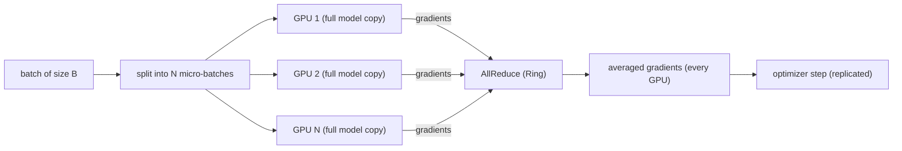

# Data Parallel & DDP

<Mode is="learn">

> **Prereq:** [Backprop as a Graph](../optimization/backprop). DDP is what wraps backprop when you have more than one GPU.

In a managed cloud, "scale out" means another instance behind the load balancer. The instances don't know about each other. The load balancer hands one request per worker, the workers respond, the system scales horizontally. The trick that makes it look simple is that there's no shared state — workers handle independent requests.

Multi-GPU training is *not* that. Every GPU runs the same step on a different slice of the same batch, and once they're done with backward, they have to *agree* on the gradient before the optimizer can step — otherwise the model copies drift apart and the run diverges.

The agreement primitive is <Term name="allreduce">AllReduce</Term>: every GPU contributes its local gradient tensor, and every GPU receives the average across the whole pool. <Term name="nccl">NCCL</Term> implements it as Ring-AllReduce — the bandwidth-optimal algorithm that moves gradients around the GPU ring in two passes (reduce-scatter, all-gather). PyTorch's <Term name="ddp">DDP</Term> wraps your model in one line and injects async AllReduce calls into backward.

Two engineering tricks turn DDP from "parallel-but-slow" into "70%+ efficient up to ~32 GPUs": **bucketing** (group thousands of small per-parameter AllReduces into a few large ones) and **comm-compute overlap** (start AllReduce on layer N's gradients while still computing backward on layer N−1). Both are invisible from the user's point of view — `model = DDP(model)` and the framework does the rest. But every distributed-training failure mode at scale traces back to one of these going wrong, so you need to know what they are.

## TL;DR

- **Data parallel (DP)** = each GPU holds a *full copy* of the model weights, processes a different *slice of the batch*, then averages gradients across GPUs at backward time.
- **PyTorch DDP** is the canonical implementation. Wraps your model in one line; the framework adds AllReduce calls during backward.
- The communication primitive is **Ring-AllReduce** — gradients flow around the GPU ring in two passes (reduce-scatter, all-gather). Cost: `2 × (N-1) × params / N` bytes per GPU per step.
- **Gradient bucketing** groups small parameter tensors into fixed-size buckets so the AllReduce traffic happens in a few large transfers instead of many tiny ones. ~10× higher achieved bandwidth.
- **Comm-compute overlap** — start AllReduce on layer N's gradients while still computing backward on layer N-1. This is what gets DDP from "parallel but not scaling" to "70%+ efficient up to ~32 GPUs".

## Mental model



Forward and backward run in parallel; the AllReduce is the only synchronization.

## Wrap your model

```python
import torch
import torch.distributed as dist
from torch.nn.parallel import DistributedDataParallel as DDP

dist.init_process_group(backend="nccl")
torch.cuda.set_device(local_rank)
model = MyModel().to(local_rank)
model = DDP(model, device_ids=[local_rank])

# Training loop is the same
for batch in dataloader:
    out = model(batch)
    loss = criterion(out, target)
    loss.backward()                 # DDP injects AllReduce here
    optimizer.step()
```

That's it. The framework intercepts the autograd backward, accumulates gradients per parameter, and at appropriate moments launches an AllReduce that averages the gradients across all participating GPUs.

## Ring-AllReduce, in pictures

For N GPUs in a logical ring, an AllReduce of P parameters proceeds in two phases:

**Reduce-Scatter**: each GPU starts with the full P parameters' worth of local gradients. They split into N chunks of P/N each. Then for N-1 rounds:
- Each GPU sends one chunk to the next GPU in the ring.
- Each GPU receives one chunk from the previous GPU and adds it to its local copy.

After N-1 rounds, each GPU has the *fully-summed* gradient for one of the N chunks.

**All-Gather**: each GPU now broadcasts its summed chunk to the rest of the ring, in another N-1 rounds.

**Total bytes moved per GPU**: `2 × (N-1)/N × P × bytes_per_param`. For 8 GPUs, that's about `1.75 × P × bytes_per_param`.

This is **bandwidth-optimal** — no algorithm can beat it within a constant factor — and is what NCCL implements under the hood.

## Bucket the gradients

Naive DDP would call AllReduce once per parameter tensor. For a 7B model with thousands of named parameters, that's thousands of small AllReduces — disastrous bandwidth utilization (~10% of peak NVLink).

DDP **buckets** parameters into fixed-size groups (default: 25 MB):

```python
model = DDP(model, device_ids=[local_rank], bucket_cap_mb=25)
```

Now there are ~50–100 large AllReduces per step instead of 10000. Achieved bandwidth jumps to ~80–95% of peak. For most models, the default bucket size is fine; only tune it if profiling shows comm time dominating.

## Overlap comm with compute

A naive backward pass runs all backward ops, then does the AllReduce. Comm and compute serialize → wall time = compute + comm.

Real DDP overlaps them: as soon as a layer's gradients are computed, its AllReduce launches asynchronously. While the AllReduce is in flight on the network, the GPU keeps computing the next layer's backward.

```python
# Conceptual; DDP does this internally
def backward_with_overlap():
    for layer in reversed(layers):
        grad = layer.backward()
        # Launch async AllReduce on this layer's grad bucket if full
        if bucket_full(layer):
            handle = dist.all_reduce(bucket, async_op=True)
            handles.append(handle)
    for h in handles: h.wait()
```

Wall time becomes `max(compute, comm)` instead of `compute + comm`. For most models with reasonable network bandwidth, this hides most of the AllReduce — getting you from 50% scaling efficiency to 80%+.

## Cost model

Per-step bytes per GPU for AllReduce:

```
bytes_per_step = 2 × (N-1)/N × params × bytes_per_grad
```

For a 7B model in BF16 across 8 GPUs:

```
bytes = 2 × 7/8 × 7e9 × 2 = ~24 GB / GPU / step
```

At 50 GB/s effective inter-GPU bandwidth (NVLink Gen 4), that's ~500 ms of pure communication per step. For a step with 200 ms of compute, comm dominates and DDP scales poorly. **For larger models or tight networks, you graduate to FSDP, TP, or PP** — covered in the next lessons.

The crossover for typical configs: DDP works well up to ~32 GPUs; beyond, communication starts to dominate and you need to shard.

## When DDP wins

- **Model fits on a single GPU.** If the model + activations + optimizer state don't fit, you can't replicate; you need <Term name="fsdp">FSDP</Term>/<Term name="zero">ZeRO</Term>.
- **Batch size scales well.** Some training tasks (small models, small dataset) hit batch-size diminishing returns long before DDP saturates.
- **Network is good.** NVLink within a node is fine; cross-node Ethernet at 25 Gbps is where DDP starts to break.

## Practical knobs

```python
DDP(
    model,
    device_ids=[local_rank],
    bucket_cap_mb=25,                    # default 25; rarely needs tuning
    find_unused_parameters=False,        # set True only if conditional execution
    gradient_as_bucket_view=True,        # save memory; default in modern PyTorch
    static_graph=True,                   # if no conditional ops; better overlap
)
```

`find_unused_parameters=True` is a footgun — it adds bookkeeping overhead even when not needed. Default to False; only enable if you actually have conditional graph branches.

## Run it in your browser — DDP cost model simulator

<RunInBrowser
  description="Plug in your model and network; see expected per-step communication time and scaling efficiency."
  code={`def ddp_step_time(params_b, n_gpus, bytes_per_param=2,
                  compute_ms=200, network_gbps=50,
                  overlap_factor=0.85):
    """Estimate per-step wall time and scaling efficiency."""
    # Ring-AllReduce bytes per GPU
    p = params_b * 1e9
    bytes_per_step = 2 * (n_gpus - 1) / n_gpus * p * bytes_per_param
    comm_ms = bytes_per_step / (network_gbps * 1e9 / 1000) * 1000

    # With overlap: wall = max(compute, comm) approximately
    wall = max(compute_ms, comm_ms) + (1 - overlap_factor) * min(compute_ms, comm_ms)

    # Scaling efficiency vs ideal (single-GPU compute)
    eff = compute_ms / wall
    return {'compute_ms': compute_ms, 'comm_ms': comm_ms, 'wall_ms': wall,
            'efficiency': eff, 'bytes_gb': bytes_per_step / 1024**3}

print(f"{'config':<40} {'comm':>8} {'wall':>8} {'eff':>6}")
print('-' * 70)
for n in (1, 4, 8, 16, 32, 64):
    for p_b, label in [(1.3, '1.3B'), (7, '7B'), (70, '70B')]:
        r = ddp_step_time(p_b, n, network_gbps=50)
        print(f"DDP {label} on {n:>3} GPUs (NVLink 50 GB/s)   "
              f"{r['comm_ms']:>5.0f} ms  {r['wall_ms']:>5.0f} ms  {r['efficiency']:>5.1%}")
    print()
`}
/>

You'll see efficiency hold above 80% up to ~16 GPUs for the 7B, then collapse beyond ~32 GPUs as comm time exceeds compute. **That's exactly the regime where you stop using pure DDP and graduate to FSDP / TP.**

## Quick check

<FillIn
  prompt="The collective operation that averages gradients across all GPUs in DDP:"
  answer="AllReduce"
  accept={["all-reduce", "allreduce", "all reduce"]}
  hint="Two words; reduce + broadcast in one round."
  explanation="AllReduce is the canonical primitive: every GPU contributes a tensor, every GPU receives the (sum or average) of all contributions. Implemented as Ring-AllReduce in NCCL — bandwidth-optimal under typical topologies."
/>

<Quiz
  question="A team's 7B model trains at 50% scaling efficiency on 16 GPUs (NVLink, intra-node). They expected 80%+. Most likely first thing to check:"
  options={[
    'Switch to fp16.',
    'Verify gradient bucketing is on (default 25 MB) and there are no per-parameter AllReduce calls in the trace.',
    'Switch to FSDP.',
    'Reduce batch size.',
  ]}
  answer={1}
  explanation={`50% efficiency at 16 GPUs is the textbook un-bucketed-DDP failure mode. With proper bucketing you should see 80%+ comm-compute overlap. Profile with torch.profiler; if you see thousands of small AllReduce calls, your bucket size is wrong or DDP's bucketing logic isn't firing (sometimes happens with custom forward hooks). FSDP is the answer for "model doesn't fit," not "DDP is slow on a model that fits."`}
/>

## Key takeaways

1. **DDP replicates weights, splits the batch, AllReduces gradients.** That's the entire algorithm.
2. **Ring-AllReduce moves `2(N-1)/N × params × bytes_per_grad` per GPU per step.** Memorize this; it's the bandwidth cost.
3. **Gradient bucketing → ~10× higher achieved bandwidth.** Default 25 MB; rarely needs tuning.
4. **Comm-compute overlap turns serial into parallel.** Wall time becomes `max(compute, comm)` instead of `compute + comm`.
5. **DDP works well up to ~32 GPUs for typical models.** Beyond, graduate to FSDP / TP / PP.

## Go deeper

<Resources
  items={[
    { kind: 'paper', href: 'https://arxiv.org/abs/2006.15704', title: 'PyTorch Distributed: Experiences on Accelerating Data Parallel Training', author: 'Li et al., 2020', note: 'The DDP design paper. Section 4 has the bucketing + overlap rationale.' },
    { kind: 'docs', href: 'https://pytorch.org/docs/stable/notes/ddp.html', title: 'PyTorch — DDP Notes', note: 'Authoritative on the API + how to debug. The "internal design" section is the design paper distilled.' },
    { kind: 'docs', href: 'https://docs.nvidia.com/deeplearning/nccl/user-guide/docs/index.html', title: 'NVIDIA NCCL User Guide', note: 'The library underneath. The "Algorithms" page describes Ring-AllReduce in detail.' },
    { kind: 'blog', href: 'https://andrew.gibiansky.com/blog/machine-learning/baidu-allreduce/', title: 'Bringing HPC Techniques to Deep Learning', author: 'Andrew Gibiansky (Baidu), 2017', note: 'The classic explanation of Ring-AllReduce that every distributed-training engineer reads. Diagrams + intuition.' },
    { kind: 'blog', href: 'https://huggingface.co/blog/3d-parallelism-intro', title: 'Hugging Face — Intro to 3D Parallelism', note: 'How DDP composes with TP and PP. Useful big-picture framing.' },
    { kind: 'repo', href: 'https://github.com/pytorch/pytorch', title: 'pytorch/pytorch', note: '`torch/distributed/algorithms/ddp_comm_hooks/` for the comm-hook plumbing; `torch/nn/parallel/distributed.py` is the wrapper itself.' },
    { kind: 'repo', href: 'https://github.com/pytorch/torchtitan', title: 'pytorch/torchtitan', note: 'Reference distributed-training stack. Read `train.py` to see DDP composed with TP and FSDP in production code.' },
  ]}
/>

</Mode>

<Mode is="reference">

> **Prereq:** [Backprop as a Graph](../optimization/backprop). DDP is what wraps backprop when you have more than one GPU.

## TL;DR

- **Data parallel (DP)** = each GPU holds a *full copy* of the model weights, processes a different *slice of the batch*, then averages gradients across GPUs at backward time.
- **PyTorch DDP** is the canonical implementation. Wraps your model in one line; the framework adds AllReduce calls during backward.
- The communication primitive is **Ring-AllReduce** — gradients flow around the GPU ring in two passes (reduce-scatter, all-gather). Cost: `2 × (N-1) × params / N` bytes per GPU per step.
- **Gradient bucketing** groups small parameter tensors into fixed-size buckets so the AllReduce traffic happens in a few large transfers instead of many tiny ones. ~10× higher achieved bandwidth.
- **Comm-compute overlap** — start AllReduce on layer N's gradients while still computing backward on layer N-1. This is what gets DDP from "parallel but not scaling" to "70%+ efficient up to ~32 GPUs".

## Why this matters

Every distributed training paradigm — TP, PP, FSDP, EP — composes with DDP at the outermost level. **DDP is the foundation.** Knowing what AllReduce costs, when bucketing helps, and how comm-compute overlap works is what lets you reason about why a multi-GPU training run is or isn't scaling. The numbers — bytes-per-step, scaling efficiency at N GPUs — are the conversation language for any production-training engineer.

## Mental model


Forward and backward run in parallel; the AllReduce is the only synchronization.

## Concrete walkthrough

### Wrap your model

```python
import torch
import torch.distributed as dist
from torch.nn.parallel import DistributedDataParallel as DDP

dist.init_process_group(backend="nccl")
torch.cuda.set_device(local_rank)
model = MyModel().to(local_rank)
model = DDP(model, device_ids=[local_rank])

# Training loop is the same
for batch in dataloader:
    out = model(batch)
    loss = criterion(out, target)
    loss.backward()                 # DDP injects AllReduce here
    optimizer.step()
```

That's it. The framework intercepts the autograd backward, accumulates gradients per parameter, and at appropriate moments launches an AllReduce that averages the gradients across all participating GPUs.

### Ring-AllReduce, in pictures

For N GPUs in a logical ring, an AllReduce of P parameters proceeds in two phases:

**Reduce-Scatter**: each GPU starts with the full P parameters' worth of local gradients. They split into N chunks of P/N each. Then for N-1 rounds:
- Each GPU sends one chunk to the next GPU in the ring.
- Each GPU receives one chunk from the previous GPU and adds it to its local copy.

After N-1 rounds, each GPU has the *fully-summed* gradient for one of the N chunks.

**All-Gather**: each GPU now broadcasts its summed chunk to the rest of the ring, in another N-1 rounds.

**Total bytes moved per GPU**: `2 × (N-1)/N × P × bytes_per_param`. For 8 GPUs, that's about `1.75 × P × bytes_per_param`.

This is **bandwidth-optimal** — no algorithm can beat it within a constant factor — and is what NCCL implements under the hood.

### Bucket the gradients

Naive DDP would call AllReduce once per parameter tensor. For a 7B model with thousands of named parameters, that's thousands of small AllReduces — disastrous bandwidth utilization (~10% of peak NVLink).

DDP **buckets** parameters into fixed-size groups (default: 25 MB):

```python
model = DDP(model, device_ids=[local_rank], bucket_cap_mb=25)
```

Now there are ~50–100 large AllReduces per step instead of 10000. Achieved bandwidth jumps to ~80–95% of peak. For most models, the default bucket size is fine; only tune it if profiling shows comm time dominating.

### Overlap comm with compute

A naive backward pass runs all backward ops, then does the AllReduce. Comm and compute serialize → wall time = compute + comm.

Real DDP overlaps them: as soon as a layer's gradients are computed, its AllReduce launches asynchronously. While the AllReduce is in flight on the network, the GPU keeps computing the next layer's backward.

```python
# Conceptual; DDP does this internally
def backward_with_overlap():
    for layer in reversed(layers):
        grad = layer.backward()
        # Launch async AllReduce on this layer's grad bucket if full
        if bucket_full(layer):
            handle = dist.all_reduce(bucket, async_op=True)
            handles.append(handle)
    for h in handles: h.wait()
```

Wall time becomes `max(compute, comm)` instead of `compute + comm`. For most models with reasonable network bandwidth, this hides most of the AllReduce — getting you from 50% scaling efficiency to 80%+.

### Cost model

Per-step bytes per GPU for AllReduce:

```
bytes_per_step = 2 × (N-1)/N × params × bytes_per_grad
```

For a 7B model in BF16 across 8 GPUs:

```
bytes = 2 × 7/8 × 7e9 × 2 = ~24 GB / GPU / step
```

At 50 GB/s effective inter-GPU bandwidth (NVLink Gen 4), that's ~500 ms of pure communication per step. For a step with 200 ms of compute, comm dominates and DDP scales poorly. **For larger models or tight networks, you graduate to FSDP, TP, or PP** — covered in the next lessons.

The crossover for typical configs: DDP works well up to ~32 GPUs; beyond, communication starts to dominate and you need to shard.

### When DDP wins

- **Model fits on a single GPU.** If the model + activations + optimizer state don't fit, you can't replicate; you need FSDP/ZeRO.
- **Batch size scales well.** Some training tasks (small models, small dataset) hit batch-size diminishing returns long before DDP saturates.
- **Network is good.** NVLink within a node is fine; cross-node Ethernet at 25 Gbps is where DDP starts to break.

### Practical knobs

```python
DDP(
    model,
    device_ids=[local_rank],
    bucket_cap_mb=25,                    # default 25; rarely needs tuning
    find_unused_parameters=False,        # set True only if conditional execution
    gradient_as_bucket_view=True,        # save memory; default in modern PyTorch
    static_graph=True,                   # if no conditional ops; better overlap
)
```

`find_unused_parameters=True` is a footgun — it adds bookkeeping overhead even when not needed. Default to False; only enable if you actually have conditional graph branches.

## Run it in your browser — DDP cost model simulator

<RunInBrowser
  description="Plug in your model and network; see expected per-step communication time and scaling efficiency."
  code={`def ddp_step_time(params_b, n_gpus, bytes_per_param=2,
                  compute_ms=200, network_gbps=50,
                  overlap_factor=0.85):
    """Estimate per-step wall time and scaling efficiency."""
    # Ring-AllReduce bytes per GPU
    p = params_b * 1e9
    bytes_per_step = 2 * (n_gpus - 1) / n_gpus * p * bytes_per_param
    comm_ms = bytes_per_step / (network_gbps * 1e9 / 1000) * 1000

    # With overlap: wall = max(compute, comm) approximately
    wall = max(compute_ms, comm_ms) + (1 - overlap_factor) * min(compute_ms, comm_ms)

    # Scaling efficiency vs ideal (single-GPU compute)
    eff = compute_ms / wall
    return {'compute_ms': compute_ms, 'comm_ms': comm_ms, 'wall_ms': wall,
            'efficiency': eff, 'bytes_gb': bytes_per_step / 1024**3}

print(f"{'config':<40} {'comm':>8} {'wall':>8} {'eff':>6}")
print('-' * 70)
for n in (1, 4, 8, 16, 32, 64):
    for p_b, label in [(1.3, '1.3B'), (7, '7B'), (70, '70B')]:
        r = ddp_step_time(p_b, n, network_gbps=50)
        print(f"DDP {label} on {n:>3} GPUs (NVLink 50 GB/s)   "
              f"{r['comm_ms']:>5.0f} ms  {r['wall_ms']:>5.0f} ms  {r['efficiency']:>5.1%}")
    print()
`}
/>

You'll see efficiency hold above 80% up to ~16 GPUs for the 7B, then collapse beyond ~32 GPUs as comm time exceeds compute. **That's exactly the regime where you stop using pure DDP and graduate to FSDP / TP.**

## Quick check

<FillIn
  prompt="The collective operation that averages gradients across all GPUs in DDP:"
  answer="AllReduce"
  accept={["all-reduce", "allreduce", "all reduce"]}
  hint="Two words; reduce + broadcast in one round."
  explanation="AllReduce is the canonical primitive: every GPU contributes a tensor, every GPU receives the (sum or average) of all contributions. Implemented as Ring-AllReduce in NCCL — bandwidth-optimal under typical topologies."
/>

<Quiz
  question="A team's 7B model trains at 50% scaling efficiency on 16 GPUs (NVLink, intra-node). They expected 80%+. Most likely first thing to check:"
  options={[
    'Switch to fp16.',
    'Verify gradient bucketing is on (default 25 MB) and there are no per-parameter AllReduce calls in the trace.',
    'Switch to FSDP.',
    'Reduce batch size.',
  ]}
  answer={1}
  explanation={`50% efficiency at 16 GPUs is the textbook un-bucketed-DDP failure mode. With proper bucketing you should see 80%+ comm-compute overlap. Profile with torch.profiler; if you see thousands of small AllReduce calls, your bucket size is wrong or DDP's bucketing logic isn't firing (sometimes happens with custom forward hooks). FSDP is the answer for "model doesn't fit," not "DDP is slow on a model that fits."`}
/>

## Key takeaways

1. **DDP replicates weights, splits the batch, AllReduces gradients.** That's the entire algorithm.
2. **Ring-AllReduce moves `2(N-1)/N × params × bytes_per_grad` per GPU per step.** Memorize this; it's the bandwidth cost.
3. **Gradient bucketing → ~10× higher achieved bandwidth.** Default 25 MB; rarely needs tuning.
4. **Comm-compute overlap turns serial into parallel.** Wall time becomes `max(compute, comm)` instead of `compute + comm`.
5. **DDP works well up to ~32 GPUs for typical models.** Beyond, graduate to FSDP / TP / PP.

## Go deeper

<Resources
  items={[
    { kind: 'paper', href: 'https://arxiv.org/abs/2006.15704', title: 'PyTorch Distributed: Experiences on Accelerating Data Parallel Training', author: 'Li et al., 2020', note: 'The DDP design paper. Section 4 has the bucketing + overlap rationale.' },
    { kind: 'docs', href: 'https://pytorch.org/docs/stable/notes/ddp.html', title: 'PyTorch — DDP Notes', note: 'Authoritative on the API + how to debug. The "internal design" section is the design paper distilled.' },
    { kind: 'docs', href: 'https://docs.nvidia.com/deeplearning/nccl/user-guide/docs/index.html', title: 'NVIDIA NCCL User Guide', note: 'The library underneath. The "Algorithms" page describes Ring-AllReduce in detail.' },
    { kind: 'blog', href: 'https://andrew.gibiansky.com/blog/machine-learning/baidu-allreduce/', title: 'Bringing HPC Techniques to Deep Learning', author: 'Andrew Gibiansky (Baidu), 2017', note: 'The classic explanation of Ring-AllReduce that every distributed-training engineer reads. Diagrams + intuition.' },
    { kind: 'blog', href: 'https://huggingface.co/blog/3d-parallelism-intro', title: 'Hugging Face — Intro to 3D Parallelism', note: 'How DDP composes with TP and PP. Useful big-picture framing.' },
    { kind: 'repo', href: 'https://github.com/pytorch/pytorch', title: 'pytorch/pytorch', note: '`torch/distributed/algorithms/ddp_comm_hooks/` for the comm-hook plumbing; `torch/nn/parallel/distributed.py` is the wrapper itself.' },
    { kind: 'repo', href: 'https://github.com/pytorch/torchtitan', title: 'pytorch/torchtitan', note: 'Reference distributed-training stack. Read `train.py` to see DDP composed with TP and FSDP in production code.' },
  ]}
/>

</Mode>

<LessonComplete />
