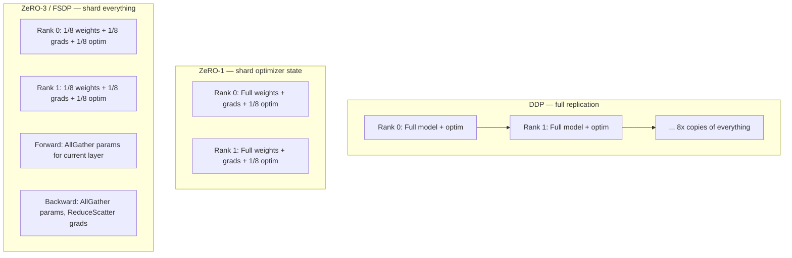

# ZeRO & FSDP2

## TL;DR

- **DDP** replicates the full model on every rank. Out of memory at large scale.
- **ZeRO** (Rajbhandari et al., 2020) progressively shards what's replicated: stages 1 (optimizer state), 2 (+ gradients), 3 (+ parameters). Stage 3 = the whole model lives across ranks; only the active layer is materialized.
- **FSDP** is PyTorch's ZeRO-3 (2022). **FSDP2** (2024) replaces module-level sharding with **per-parameter sharding via DTensor**, composes cleanly with TP/PP, much faster wraps, simpler code.
- For a 70B BF16 model on 8 GPUs: DDP doesn't fit at all. FSDP2 fits with room for a 32K-token batch.
- Default in production through 2026: **FSDP2 (HSDP)** — hybrid sharding within a node + replication across nodes — composed with tensor parallel and pipeline parallel for very large runs.

## Why this matters

A 70B model in BF16 is 140 GB of weights, plus ~280 GB of optimizer state (AdamW), plus ~40 GB of gradients = 460 GB of state. Doesn't fit on any single accelerator. **FSDP/ZeRO is what makes large-scale training possible at all** for any team that doesn't run on $100K-per-node TPU pods.

It's also the most common reason a training run is slow when it shouldn't be — communication-compute overlap is a delicate dance, and FSDP misconfiguration commonly costs 30–50% of throughput silently.

## Mental model



Each stage trades memory for communication. ZeRO-3 (= FSDP) shards everything; the price is that **each forward and backward pass must AllGather the layer's parameters** before computing it.

## Concrete walkthrough — the four ZeRO stages

| Stage | What's sharded | Memory per rank | Comm pattern |
| --- | --- | --- | --- |
| Baseline (DDP) | nothing | full × 1 | AllReduce gradients |
| **ZeRO-1** | optimizer state | full params + grads + (1/N) optim | AllReduce gradients |
| **ZeRO-2** | + gradients | full params + (1/N)(grads + optim) | ReduceScatter grads |
| **ZeRO-3 / FSDP** | + parameters | (1/N) of everything | AllGather params + ReduceScatter grads |

For 70B BF16 on 8 ranks:

| Stage | Mem/rank | Fits on H100 80GB? |
| --- | --- | --- |
| DDP | 460 GB | No |
| ZeRO-1 | 215 GB | No |
| ZeRO-2 | 175 GB | No |
| **FSDP / ZeRO-3** | **57 GB** | **Yes** (with selective recompute) |

ZeRO-3 is the only setting that fits a 70B BF16 training step on a single 8×H100 node.

### What FSDP does each step

```text
Forward pass (per layer):
  1. AllGather this layer's full weight from N shards across DP ranks
  2. Compute forward
  3. Free the full weight (keep activation)

Backward pass (per layer, in reverse):
  4. AllGather this layer's full weight again
  5. Compute backward, produce full gradient
  6. ReduceScatter the gradient: each rank ends up with its 1/N shard of the average grad
  7. Free the full weight

Optimizer step:
  8. Each rank updates its 1/N shard of params using its 1/N shard of grad and optim state
```

The two communication ops — AllGather (forward + backward) and ReduceScatter (backward) — should overlap with compute. **The whole game of FSDP performance tuning is making sure they do.**

### FSDP1 vs FSDP2

**FSDP1** (2022) wrapped at the module level. You'd `wrap(transformer_layer)` and the entire layer's params became one shard. Caveats:

- Coarse: a `transformer_layer` of mixed-shape params got one big AllGather instead of fine-grained per-tensor ones
- Couldn't compose with tensor parallel cleanly (the wrap boundary fought the TP boundary)
- Slow to wrap large models (~10s for a 70B at startup)

**FSDP2** (2024) shards **per-parameter** via PyTorch's DTensor:

```python
# FSDP1 (deprecated)
from torch.distributed.fsdp import FullyShardedDataParallel as FSDP1
model = FSDP1(model, auto_wrap_policy=...)

# FSDP2 (modern)
from torch.distributed._composable.fsdp import fully_shard
for layer in model.layers:
    fully_shard(layer)              # shards each layer's parameters separately
fully_shard(model)                  # shards the rest
```

FSDP2 advantages:

- **Composes with TP** — a parameter can be both sharded (FSDP) on the data dim *and* sharded (TP) on the head dim. DTensor handles the bookkeeping.
- **Faster wraps** — per-tensor sharding is essentially free at startup.
- **Cleaner gradient communication** — ReduceScatter happens at parameter granularity, easier to overlap.
- **Future-proof** — Megatron-Core, TorchTitan, and most 2024-2026 production stacks use FSDP2.

### Hybrid sharding (HSDP)

For multi-node training, full FSDP across all ranks means cross-node AllGathers — expensive over IB / Ethernet. **HSDP** shards within a node (NVLink) and replicates across nodes (which use AllReduce instead of AllGather):

```python
mesh = init_device_mesh(..., mesh_dim_names=("inter_node", "intra_node"))
fully_shard(model, mesh=mesh["intra_node"])  # FSDP within node, DDP across
```

This is the production default for any run with more than one node.

## Real numbers — Llama-2 70B training, 8×H100

| Setup | Memory/rank | tokens/sec | Notes |
| --- | --- | --- | --- |
| DDP | OOM | — | Doesn't fit |
| FSDP1 (full shard) | 62 GB | 18,500 | Works |
| **FSDP2 (full shard)** | **57 GB** | **22,000** | Faster wraps, better overlap |
| **FSDP2 + selective ckpt** | **41 GB** | **20,500** | Headroom for longer sequences |
| FSDP2 + TP=2 + PP=2 (4D) | 32 GB | 28,000 | Required for 405B |

FSDP2 alone gets you to 70B; composed with TP/PP, you scale arbitrarily.

## Run it in your browser — pick the right ZeRO stage

<RunInBrowser
  description="Memory budget across DDP, ZeRO-1, ZeRO-2, FSDP for various model sizes."
  code={`def memory_gb_per_rank(params_b, n_ranks, stage, dtype_bytes=2, optimizer_bytes=8, grad_bytes=2):
    P = params_b * 1e9
    weights_full = P * dtype_bytes
    optim_full   = P * optimizer_bytes
    grads_full   = P * grad_bytes
    if stage == 'ddp':
        total = weights_full + optim_full + grads_full
    elif stage == 'zero1':
        total = weights_full + grads_full + optim_full / n_ranks
    elif stage == 'zero2':
        total = weights_full + (grads_full + optim_full) / n_ranks
    elif stage == 'fsdp':
        total = (weights_full + grads_full + optim_full) / n_ranks
    return total / 1024**3

print(f"{'config':<35}{'  DDP':>10}{'  ZeRO-1':>10}{'  ZeRO-2':>10}{'  FSDP':>10}")
for params_b in (7, 13, 70, 405):
    for n in (4, 8, 32):
        row = f"{params_b}B  ranks={n:<3}"
        ddp   = memory_gb_per_rank(params_b, n, 'ddp')
        z1    = memory_gb_per_rank(params_b, n, 'zero1')
        z2    = memory_gb_per_rank(params_b, n, 'zero2')
        fsdp  = memory_gb_per_rank(params_b, n, 'fsdp')
        print(f"{row:<35}{ddp:>9.1f}G {z1:>9.1f}G {z2:>9.1f}G {fsdp:>9.1f}G")
`}
/>

You'll see DDP becomes infeasible past ~10B; FSDP keeps memory linear-friendly down to many ranks.

## Quick check

<Quiz
  question="You're training a 70B model with FSDP2 across 8×H100. tokens/sec is 60% of expected. The profiler shows AllGather operations dominating each step. What's the most likely fix?"
  options={[
    'Increase the batch size.',
    'Reduce the number of GPUs.',
    'Make sure activation checkpointing is enabled and tune `prefetch_limit` so AllGather overlaps with prior-layer compute.',
    'Switch to FSDP1.',
  ]}
  answer={2}
  explanation="When AllGather time dominates, the issue is communication-compute overlap. FSDP2's `prefetch_limit` controls how many layers ahead it pre-fetches; bumping it (with enough memory) lets AllGather run while the previous layer computes. Activation checkpointing also frees memory for more aggressive prefetching. Switching to FSDP1 would lose perf, not gain it."
/>

## Key takeaways

1. **FSDP2 is the production default in 2026** for single-node and HSDP for multi-node. FSDP1 is legacy.
2. **The whole game is communication-compute overlap.** AllGather hides behind prior compute when configured right; surfaces as time when not.
3. **ZeRO-3 / FSDP-only scales to ~70B on a node.** Past that, compose with TP and PP — the 4D mesh.
4. **Selective activation checkpointing pairs with FSDP** to free memory for prefetching and longer sequences.
5. **Profile every run** — `torch.profiler` with NVTX ranges. AllGather bars vs compute bars tell you instantly whether your FSDP config is right.

## Go deeper

<Resources
  items={[
    { kind: 'paper', href: 'https://arxiv.org/abs/1910.02054', title: 'ZeRO: Memory Optimizations Toward Training Trillion Parameter Models', author: 'Rajbhandari, Rasley, Ruwase, He (Microsoft, 2020)', note: 'The original ZeRO paper. Stages 1, 2, 3 defined here.' },
    { kind: 'paper', href: 'https://arxiv.org/abs/2304.11277', title: 'PyTorch FSDP: Experiences on Scaling Fully Sharded Data Parallel', author: 'Zhao et al. (Meta, 2023)', note: 'The FSDP1 retrospective paper. Required if you want to operate FSDP at scale.' },
    { kind: 'docs', href: 'https://pytorch.org/docs/stable/distributed.fsdp.fully_shard.html', title: 'PyTorch — fully_shard (FSDP2) docs', note: 'The current API reference. Replaces the FSDP1 wrapper.' },
    { kind: 'blog', href: 'https://pytorch.org/blog/training-using-float8-fsdp2/', title: 'PyTorch Blog — FSDP2 + Float8 (2024)', note: 'How FSDP2 composes with FP8 training. The current 2025 frontier configuration.' },
    { kind: 'repo', href: 'https://github.com/pytorch/torchtitan', title: 'pytorch/torchtitan', note: 'Reference implementations of FSDP2 + TP + PP for Llama-class models. Read `torchtitan/parallelisms/`.' },
    { kind: 'paper', href: 'https://arxiv.org/abs/2304.11267', title: 'Megatron-Core: Distributed Training Frameworks', note: 'NVIDIA\'s alternative stack. Worth reading for the production-ML-systems perspective.' },
    { kind: 'video', href: 'https://www.youtube.com/watch?v=8_k76AHu__s', title: 'Less Wright — Mastering FSDP2', note: 'Walkthrough of the API and tuning knobs by a PyTorch engineer.' },
    { kind: 'blog', href: 'https://www.deepspeed.ai/tutorials/zero/', title: 'DeepSpeed — ZeRO tutorials', note: 'The other big stack. Conceptually identical to FSDP, different ergonomics.' },
  ]}
/>

<LessonComplete />
