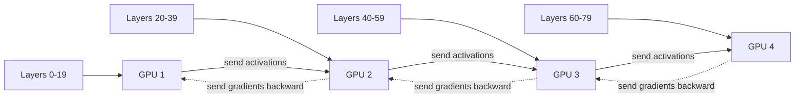

# Pipeline & Zero-Bubble

<Mode is="learn">

> **Prereqs:** [Data Parallel & DDP](./data-parallel), [Tensor Parallel](./tensor-parallel). PP is the third axis of frontier-scale parallelism.

In a managed cloud, "scale across many machines" is what an HTTP load balancer does for you — every machine handles independent requests, the network only carries the request and response. <Term name="tensor parallel">Tensor parallel</Term> is the opposite of that: every GPU AllReduces 160 times per step, network is the bottleneck, the comm pattern is so heavy you can only pin TP inside an NVLink domain. Span it across nodes and it collapses.

<Term name="pipeline parallel">Pipeline parallel</Term> is the parallelism axis that *does* scale across nodes. Cut the model into stages — stage 0 holds layers 0–19, stage 1 holds 20–39, etc. — and the only thing that crosses GPUs is **activations between adjacent stages**. Point-to-point send/recv, no collectives, small. Frontier training runs use TP within node, PP across nodes, FSDP over data-parallel ranks; that's the 4D mesh that fits a 405B model.

The cost is the <Term name="bubble">bubble</Term>: when GPU 4 starts forward on a fresh micro-batch, GPU 1 already finished and is sitting idle waiting for backward to come back around. Naive pipelines spend ~half the step in bubble. Three schedule innovations fix it: **GPipe** feeds many micro-batches sequentially (smaller bubble per micro-batch). **<Term name="1f1b">1F1B</Term>** interleaves forward and backward to keep activations bounded. **<Term name="zero-bubble">Zero-bubble</Term>** (Qi et al., 2024) splits gradient computation into a critical-path piece (input gradient) and a deferrable piece (weight gradient), and schedules the deferrable work into bubble time — eliminating the bubble for typical configs.

The Python is `pipeline_stage = PipelineStage(model, stage_id, mesh, schedule="1F1B")`. PyTorch's `torch.distributed.pipelining` injects the send/recv calls and the schedule. The recipe is on a postcard; the wall-clock difference between getting it right and wrong is 30%+ of your training budget.

## TL;DR

- **Pipeline parallel (PP)** splits the model across GPUs *by layer*. GPU 0 holds layers 0–N, GPU 1 holds N–2N, etc. Activations flow forward through the pipeline; gradients flow backward.
- The naive version (GPipe, Huang et al., 2019) has a **bubble**: when GPU N starts forward, GPU 0 is already done and idle. The first stages spend much of the step waiting.
- **1F1B** (one-forward-one-backward) interleaves forward and backward to fill the bubble. Default in Megatron-LM and DeepSpeed since 2020.
- **Interleaved 1F1B / virtual stages**: split each GPU's layers into multiple "virtual stages" so the bubble shrinks further. Megatron-Core's default for >8 stages.
- **Zero-bubble (Qi et al., 2024)** is the 2024 breakthrough — a careful schedule that fully eliminates pipeline bubbles by separating gradient computation from weight updates. Now ships in TorchTitan and Megatron-Core.

## Mental model



Forward → activations down the pipeline; backward → gradients back up. Each transition is a point-to-point send, much smaller than DP/TP collectives.

## Naive PP and the bubble

Imagine 4 GPUs, each holds 1/4 of a model. Process one micro-batch:

```
time → 
GPU1: F1 - - - - - - - B1
GPU2:    F1 - - - - B1 - -
GPU3:       F1 - B1 - - - -
GPU4:          F1 B1 - - - -
                 ← time wasted →
```

The "F1" rectangles are forward; "B1" backward. GPU 1 finishes early but waits for everything else; GPU 4 starts late. **For 4 stages, ~half the time is bubble.** The bubble fraction is `(P-1)/(P + M - 1)` for P stages and M micro-batches; with M=1 and P=4, that's 75% bubble.

## GPipe — many micro-batches reduce the bubble

GPipe (Huang et al., 2019) feeds in many micro-batches sequentially:

```
GPU1: F1 F2 F3 F4 - - - - B4 B3 B2 B1
GPU2:    F1 F2 F3 F4 - - B4 B3 B2 B1 -
GPU3:       F1 F2 F3 F4 B4 B3 B2 B1 - -
GPU4:          F1 F2 F3 F4 B1 - - - - -
```

Bubble fraction: `(P-1)/(M + P - 1)`. With M=8 micro-batches and P=4 stages: 27% bubble. With M=32: 9%. **More micro-batches → smaller bubble.**

The cost: micro-batches must be small enough that all P stages' forward activations fit in memory simultaneously. For a 70B model with PP=4, that limits effective batch sizes.

## 1F1B — the production default

The 2020 improvement: instead of running all forwards first then all backwards, **interleave them**:

```
GPU1: F1 F2 F3 F4 B1 F5 B2 F6 B3 F7 B4 F8 B5 B6 B7 B8
GPU2:    F1 F2 F3 B1 F4 B2 F5 B3 F6 B4 F7 B5 F8 B6 B7 B8
...
```

Each stage starts the backward of micro-batch `i` as soon as the forward of `i` reaches the last stage and starts coming back. **Same bubble fraction**, but **lower memory** — only `P` forward activations live in memory at once instead of `M`.

1F1B is the default in Megatron-LM, DeepSpeed, and TorchTitan since ~2021.

## Interleaved 1F1B (virtual stages)

To shrink the bubble more without huge `M`: split each GPU's layers into multiple "virtual stages" and interleave them. With V virtual stages per GPU:

- Bubble fraction becomes `(P-1) / (V × M + P - 1)`.
- For V=4, M=8, P=4: bubble 11% (vs 27% for non-virtual).

The cost: more pipeline activations (each virtual stage needs its own activation buffer) and slightly higher network overhead. Used in Megatron-Core for any pipeline beyond ~4 stages.

## Zero-bubble (Qi et al., 2024)

The 2024 breakthrough: **the bubble exists because every stage waits for upstream activations / downstream gradients before it can do anything useful.** Qi et al. observed that gradient computation has *two phases*:

1. **Compute the input gradient** `dx` (needed by the previous stage to continue backward).
2. **Compute the weight gradient** `dW` (used only at the optimizer step at the end).

Phase 2 doesn't need to be in the critical path. By scheduling phase-1 (input grad) eagerly and phase-2 (weight grad) during what would have been bubble time, the bubble shrinks to **essentially zero** for typical configurations.

The schedule is more complex (the zero-bubble paper has detailed diagrams) but the engineering payoff is real: 4–10% wall-clock improvement on real production training runs. Shipped in TorchTitan and Megatron-Core in 2024.

## Activation memory under PP

A subtle PP cost: each stage must hold activations for *all in-flight forwards* until backward consumes them. With M micro-batches and P stages, the worst-case is `M` activation snapshots per stage early in the schedule.

The 1F1B schedule reduces this to ~`P` snapshots (each stage holds at most `P` micro-batches in flight). With activation checkpointing (recompute), you pay ~`√L` more compute per stage to drop activation memory by 4–8×. Most production runs use selective checkpointing (cheap activations stay; expensive ones recompute).

## Composing PP with TP and DP

The full mesh:

| Axis | Shards what | Comm pattern | Bandwidth need |
|------|-------------|---------------|------------------|
| **TP** | Each weight matrix | AllReduce on activations | Highest (intra-node) |
| **PP** | Layers | Point-to-point send/recv | Low (cross-node OK) |
| **DP** | Batch | AllReduce on gradients (or AllGather on weights for FSDP) | Medium |

Since PP comm is point-to-point and small (just activations between two GPUs), **PP scales across nodes well**. TP is intra-node only; DP/FSDP is everywhere; PP is the cross-node multiplier.

A frontier training run for a 405B model might look like: TP=8 within node, PP=8 across 8 nodes, DP=4 across 4 sets-of-8-nodes. 8 × 8 × 4 = 256 GPUs.

## Cost summary, per-step

For pipeline degree P with M micro-batches:

| Quantity              | Naive GPipe | 1F1B | Interleaved 1F1B (V vstages) | Zero-bubble |
|-----------------------|-------------|------|-------------------------------|--------------|
| Bubble fraction       | (P-1)/(M+P-1) | same | (P-1)/(VM+P-1) | ~0 |
| Activation memory     | ~M snapshots | ~P snapshots | ~PV snapshots | ~PV snapshots |
| Code complexity       | low | medium | high | high |
| Production usage 2026 | rare | common | common at large P | rolling out |

## When PP wins

- **Model doesn't fit even with TP within node.** TP=8 limits weights per GPU to about 1/8 of the model; for >70B models you need PP across nodes too.
- **Comm-bound DP scenarios.** PP's point-to-point comm is cheaper than DP's AllReduce when network is the bottleneck.
- **Async-friendly pipelines.** Mature production stacks can run PP with relaxed sync that compute frameworks can't.

## When PP loses

- **Small models.** The bubble overhead isn't worth it for models that fit with just TP+DP.
- **Inference.** PP is for training. Inference uses different strategies (chunked prefill, disaggregated serving — see [Disaggregated Serving](../../llm-architecture/kv-cache/disaggregated)).

## Run it in your browser — bubble fraction calculator

<RunInBrowser
  description="See how bubble fraction scales with stages, micro-batches, and virtual stages."
  code={`def bubble_fraction(P, M, V=1):
    """P pipeline stages, M micro-batches, V virtual stages per GPU.
       Returns fraction of step time spent in bubble."""
    return (P - 1) / (V * M + P - 1)

print(f"{'config':<35} {'bubble':>10} {'efficiency':>12}")
print('-' * 60)

cases = [
    ("P=4, M=1 (worst case)",      4, 1, 1),
    ("P=4, M=4",                    4, 4, 1),
    ("P=4, M=16",                   4, 16, 1),
    ("P=4, M=4, V=4 (interleaved)", 4, 4, 4),
    ("P=8, M=8",                    8, 8, 1),
    ("P=8, M=8, V=4",               8, 8, 4),
    ("P=16, M=8",                   16, 8, 1),
    ("P=16, M=8, V=4",              16, 8, 4),
    ("P=16, M=8, zero-bubble",      16, 8, 100),  # approx as V huge
]

for label, P, M, V in cases:
    b = bubble_fraction(P, M, V)
    print(f"{label:<35} {b:>9.1%}    {1-b:>10.1%}")

print()
print("Frontier training runs aim for >95% pipeline efficiency.")
print("That requires either V≥4 interleaving + M≥8 micro-batches, or zero-bubble.")
`}
/>

The math says everything: **without interleaving, even M=16 leaves a meaningful bubble at P=4. With interleaving V=4 and zero-bubble, you can keep efficiency above 95% even at P=16.** This is why the schedule innovations matter so much for frontier-scale runs.

## Quick check

<FillIn
  prompt="The PP scheduling pattern that interleaves forward and backward to reduce activation memory:"
  answer="1F1B"
  accept={["one-forward-one-backward", "1f1b"]}
  hint="Acronym for one-forward-one-backward."
  explanation="1F1B = one-forward-one-backward. Production default in Megatron, DeepSpeed, TorchTitan since ~2021. Same bubble fraction as GPipe but ~M/P less activation memory."
/>

<Quiz
  question="A team trains a 405B model and sees ~30% pipeline bubble (PP=8, M=8). The most surgical fix in 2026:"
  options={[
    'Add more GPUs.',
    'Increase micro-batches to M=64 — too costly in activation memory.',
    'Adopt interleaved 1F1B with V=4 virtual stages, or upgrade to zero-bubble. Both shrink the bubble without raising memory.',
    'Switch from PP to DP entirely.',
  ]}
  answer={2}
  explanation={`At P=8 / M=8, naive 1F1B has (8-1)/(8+7) = 47% bubble (or 30% if some overlap is happening). Interleaved 1F1B with V=4 gets you to (8-1)/(32+7) = 18%. Zero-bubble pushes it near 0%. Both are pure-software wins; no hardware change. Increasing M dramatically blows up activation memory (M snapshots per stage); switching to DP doesn't fit the model on single GPUs.`}
/>

## Key takeaways

1. **PP splits the model layer-by-layer across GPUs.** Forward flows down; gradients flow back up.
2. **The bubble is `(P-1)/(M+P-1)`** for naive 1F1B. Interleaving (V virtual stages) and zero-bubble shrink it.
3. **1F1B is the production default** since 2021; interleaved 1F1B and zero-bubble are 2022 / 2024 upgrades.
4. **PP scales across nodes** (point-to-point comm is small). TP is intra-node-only; PP is the cross-node multiplier.
5. **Frontier training is TP × PP × DP × maybe EP**, with each axis tuned to its bandwidth budget.

## Go deeper

<Resources
  items={[
    { kind: 'paper', href: 'https://arxiv.org/abs/1811.06965', title: 'GPipe: Efficient Training of Giant Neural Networks using Pipeline Parallelism', author: 'Huang et al., 2019', note: 'The original. Section 3 has the bubble math.' },
    { kind: 'paper', href: 'https://arxiv.org/abs/2104.04473', title: 'Efficient Large-Scale Language Model Training on GPU Clusters Using Megatron-LM', author: 'Narayanan et al., SC21', note: 'The 1F1B + interleaved formalization. Section 4 covers the schedule design.' },
    { kind: 'paper', href: 'https://arxiv.org/abs/2401.10241', title: 'Zero Bubble Pipeline Parallelism', author: 'Qi et al., 2024', note: 'The 2024 breakthrough. The figures showing the schedule are essential.' },
    { kind: 'blog', href: 'https://huggingface.co/blog/3d-parallelism-intro', title: 'Hugging Face — 3D Parallelism', note: 'Best illustrated walkthrough of TP × PP × DP composition.' },
    { kind: 'docs', href: 'https://pytorch.org/docs/stable/distributed.pipelining.html', title: 'PyTorch — Pipelining (torch.distributed.pipelining)', note: 'The modern PyTorch API for PP. Includes 1F1B and interleaved schedules.' },
    { kind: 'repo', href: 'https://github.com/NVIDIA/Megatron-LM', title: 'NVIDIA/Megatron-LM', note: 'Production reference. `megatron/core/pipeline_parallel/schedules.py` has every schedule.' },
    { kind: 'repo', href: 'https://github.com/sail-sg/zero-bubble-pipeline-parallelism', title: 'sail-sg/zero-bubble-pipeline-parallelism', note: 'Reference impl of zero-bubble for PyTorch.' },
  ]}
/>

</Mode>

<Mode is="reference">

> **Prereqs:** [Data Parallel & DDP](./data-parallel), [Tensor Parallel](./tensor-parallel). PP is the third axis of frontier-scale parallelism.

## TL;DR

- **Pipeline parallel (PP)** splits the model across GPUs *by layer*. GPU 0 holds layers 0–N, GPU 1 holds N–2N, etc. Activations flow forward through the pipeline; gradients flow backward.
- The naive version (GPipe, Huang et al., 2019) has a **bubble**: when GPU N starts forward, GPU 0 is already done and idle. The first stages spend much of the step waiting.
- **1F1B** (one-forward-one-backward) interleaves forward and backward to fill the bubble. Default in Megatron-LM and DeepSpeed since 2020.
- **Interleaved 1F1B / virtual stages**: split each GPU's layers into multiple "virtual stages" so the bubble shrinks further. Megatron-Core's default for >8 stages.
- **Zero-bubble (Qi et al., 2024)** is the 2024 breakthrough — a careful schedule that fully eliminates pipeline bubbles by separating gradient computation from weight updates. Now ships in TorchTitan and Megatron-Core.

## Why this matters

The 4-axis training mesh is **TP (within node) × PP (across nodes for very large models) × DP (replication) × maybe EP (experts)**. PP is the axis that makes models like GPT-4 / DeepSeek-V3 / Llama-405B physically fit — when even with TP=8 you still need to span more than one node. Knowing the bubble math, the 1F1B schedule, and the zero-bubble breakthrough is what lets you reason about why frontier training runs cost what they cost.

## Mental model


Forward → activations down the pipeline; backward → gradients back up. Each transition is a point-to-point send, much smaller than DP/TP collectives.

## Concrete walkthrough

### Naive PP and the bubble

Imagine 4 GPUs, each holds 1/4 of a model. Process one micro-batch:

```
time → 
GPU1: F1 - - - - - - - B1
GPU2:    F1 - - - - B1 - -
GPU3:       F1 - B1 - - - -
GPU4:          F1 B1 - - - -
                 ← time wasted →
```

The "F1" rectangles are forward; "B1" backward. GPU 1 finishes early but waits for everything else; GPU 4 starts late. **For 4 stages, ~half the time is bubble.** The bubble fraction is `(P-1)/(P + M - 1)` for P stages and M micro-batches; with M=1 and P=4, that's 75% bubble.

### GPipe — many micro-batches reduce the bubble

GPipe (Huang et al., 2019) feeds in many micro-batches sequentially:

```
GPU1: F1 F2 F3 F4 - - - - B4 B3 B2 B1
GPU2:    F1 F2 F3 F4 - - B4 B3 B2 B1 -
GPU3:       F1 F2 F3 F4 B4 B3 B2 B1 - -
GPU4:          F1 F2 F3 F4 B1 - - - - -
```

Bubble fraction: `(P-1)/(M + P - 1)`. With M=8 micro-batches and P=4 stages: 27% bubble. With M=32: 9%. **More micro-batches → smaller bubble.**

The cost: micro-batches must be small enough that all P stages' forward activations fit in memory simultaneously. For a 70B model with PP=4, that limits effective batch sizes.

### 1F1B — the production default

The 2020 improvement: instead of running all forwards first then all backwards, **interleave them**:

```
GPU1: F1 F2 F3 F4 B1 F5 B2 F6 B3 F7 B4 F8 B5 B6 B7 B8
GPU2:    F1 F2 F3 B1 F4 B2 F5 B3 F6 B4 F7 B5 F8 B6 B7 B8
...
```

Each stage starts the backward of micro-batch `i` as soon as the forward of `i` reaches the last stage and starts coming back. **Same bubble fraction**, but **lower memory** — only `P` forward activations live in memory at once instead of `M`.

1F1B is the default in Megatron-LM, DeepSpeed, and TorchTitan since ~2021.

### Interleaved 1F1B (virtual stages)

To shrink the bubble more without huge `M`: split each GPU's layers into multiple "virtual stages" and interleave them. With V virtual stages per GPU:

- Bubble fraction becomes `(P-1) / (V × M + P - 1)`.
- For V=4, M=8, P=4: bubble 11% (vs 27% for non-virtual).

The cost: more pipeline activations (each virtual stage needs its own activation buffer) and slightly higher network overhead. Used in Megatron-Core for any pipeline beyond ~4 stages.

### Zero-bubble (Qi et al., 2024)

The 2024 breakthrough: **the bubble exists because every stage waits for upstream activations / downstream gradients before it can do anything useful.** Qi et al. observed that gradient computation has *two phases*:

1. **Compute the input gradient** `dx` (needed by the previous stage to continue backward).
2. **Compute the weight gradient** `dW` (used only at the optimizer step at the end).

Phase 2 doesn't need to be in the critical path. By scheduling phase-1 (input grad) eagerly and phase-2 (weight grad) during what would have been bubble time, the bubble shrinks to **essentially zero** for typical configurations.

The schedule is more complex (the zero-bubble paper has detailed diagrams) but the engineering payoff is real: 4–10% wall-clock improvement on real production training runs. Shipped in TorchTitan and Megatron-Core in 2024.

### Activation memory under PP

A subtle PP cost: each stage must hold activations for *all in-flight forwards* until backward consumes them. With M micro-batches and P stages, the worst-case is `M` activation snapshots per stage early in the schedule.

The 1F1B schedule reduces this to ~`P` snapshots (each stage holds at most `P` micro-batches in flight). With activation checkpointing (recompute), you pay ~`√L` more compute per stage to drop activation memory by 4–8×. Most production runs use selective checkpointing (cheap activations stay; expensive ones recompute).

### Composing PP with TP and DP

The full mesh:

| Axis | Shards what | Comm pattern | Bandwidth need |
|------|-------------|---------------|------------------|
| **TP** | Each weight matrix | AllReduce on activations | Highest (intra-node) |
| **PP** | Layers | Point-to-point send/recv | Low (cross-node OK) |
| **DP** | Batch | AllReduce on gradients (or AllGather on weights for FSDP) | Medium |

Since PP comm is point-to-point and small (just activations between two GPUs), **PP scales across nodes well**. TP is intra-node only; DP/FSDP is everywhere; PP is the cross-node multiplier.

A frontier training run for a 405B model might look like: TP=8 within node, PP=8 across 8 nodes, DP=4 across 4 sets-of-8-nodes. 8 × 8 × 4 = 256 GPUs.

### Cost summary, per-step

For pipeline degree P with M micro-batches:

| Quantity              | Naive GPipe | 1F1B | Interleaved 1F1B (V vstages) | Zero-bubble |
|-----------------------|-------------|------|-------------------------------|--------------|
| Bubble fraction       | (P-1)/(M+P-1) | same | (P-1)/(VM+P-1) | ~0 |
| Activation memory     | ~M snapshots | ~P snapshots | ~PV snapshots | ~PV snapshots |
| Code complexity       | low | medium | high | high |
| Production usage 2026 | rare | common | common at large P | rolling out |

### When PP wins

- **Model doesn't fit even with TP within node.** TP=8 limits weights per GPU to about 1/8 of the model; for >70B models you need PP across nodes too.
- **Comm-bound DP scenarios.** PP's point-to-point comm is cheaper than DP's AllReduce when network is the bottleneck.
- **Async-friendly pipelines.** Mature production stacks can run PP with relaxed sync that compute frameworks can't.

### When PP loses

- **Small models.** The bubble overhead isn't worth it for models that fit with just TP+DP.
- **Inference.** PP is for training. Inference uses different strategies (chunked prefill, disaggregated serving — see [Disaggregated Serving](../../llm-architecture/kv-cache/disaggregated)).

## Run it in your browser — bubble fraction calculator

<RunInBrowser
  description="See how bubble fraction scales with stages, micro-batches, and virtual stages."
  code={`def bubble_fraction(P, M, V=1):
    """P pipeline stages, M micro-batches, V virtual stages per GPU.
       Returns fraction of step time spent in bubble."""
    return (P - 1) / (V * M + P - 1)

print(f"{'config':<35} {'bubble':>10} {'efficiency':>12}")
print('-' * 60)

cases = [
    ("P=4, M=1 (worst case)",      4, 1, 1),
    ("P=4, M=4",                    4, 4, 1),
    ("P=4, M=16",                   4, 16, 1),
    ("P=4, M=4, V=4 (interleaved)", 4, 4, 4),
    ("P=8, M=8",                    8, 8, 1),
    ("P=8, M=8, V=4",               8, 8, 4),
    ("P=16, M=8",                   16, 8, 1),
    ("P=16, M=8, V=4",              16, 8, 4),
    ("P=16, M=8, zero-bubble",      16, 8, 100),  # approx as V huge
]

for label, P, M, V in cases:
    b = bubble_fraction(P, M, V)
    print(f"{label:<35} {b:>9.1%}    {1-b:>10.1%}")

print()
print("Frontier training runs aim for >95% pipeline efficiency.")
print("That requires either V≥4 interleaving + M≥8 micro-batches, or zero-bubble.")
`}
/>

The math says everything: **without interleaving, even M=16 leaves a meaningful bubble at P=4. With interleaving V=4 and zero-bubble, you can keep efficiency above 95% even at P=16.** This is why the schedule innovations matter so much for frontier-scale runs.

## Quick check

<FillIn
  prompt="The PP scheduling pattern that interleaves forward and backward to reduce activation memory:"
  answer="1F1B"
  accept={["one-forward-one-backward", "1f1b"]}
  hint="Acronym for one-forward-one-backward."
  explanation="1F1B = one-forward-one-backward. Production default in Megatron, DeepSpeed, TorchTitan since ~2021. Same bubble fraction as GPipe but ~M/P less activation memory."
/>

<Quiz
  question="A team trains a 405B model and sees ~30% pipeline bubble (PP=8, M=8). The most surgical fix in 2026:"
  options={[
    'Add more GPUs.',
    'Increase micro-batches to M=64 — too costly in activation memory.',
    'Adopt interleaved 1F1B with V=4 virtual stages, or upgrade to zero-bubble. Both shrink the bubble without raising memory.',
    'Switch from PP to DP entirely.',
  ]}
  answer={2}
  explanation={`At P=8 / M=8, naive 1F1B has (8-1)/(8+7) = 47% bubble (or 30% if some overlap is happening). Interleaved 1F1B with V=4 gets you to (8-1)/(32+7) = 18%. Zero-bubble pushes it near 0%. Both are pure-software wins; no hardware change. Increasing M dramatically blows up activation memory (M snapshots per stage); switching to DP doesn't fit the model on single GPUs.`}
/>

## Key takeaways

1. **PP splits the model layer-by-layer across GPUs.** Forward flows down; gradients flow back up.
2. **The bubble is `(P-1)/(M+P-1)`** for naive 1F1B. Interleaving (V virtual stages) and zero-bubble shrink it.
3. **1F1B is the production default** since 2021; interleaved 1F1B and zero-bubble are 2022 / 2024 upgrades.
4. **PP scales across nodes** (point-to-point comm is small). TP is intra-node-only; PP is the cross-node multiplier.
5. **Frontier training is TP × PP × DP × maybe EP**, with each axis tuned to its bandwidth budget.

## Go deeper

<Resources
  items={[
    { kind: 'paper', href: 'https://arxiv.org/abs/1811.06965', title: 'GPipe: Efficient Training of Giant Neural Networks using Pipeline Parallelism', author: 'Huang et al., 2019', note: 'The original. Section 3 has the bubble math.' },
    { kind: 'paper', href: 'https://arxiv.org/abs/2104.04473', title: 'Efficient Large-Scale Language Model Training on GPU Clusters Using Megatron-LM', author: 'Narayanan et al., SC21', note: 'The 1F1B + interleaved formalization. Section 4 covers the schedule design.' },
    { kind: 'paper', href: 'https://arxiv.org/abs/2401.10241', title: 'Zero Bubble Pipeline Parallelism', author: 'Qi et al., 2024', note: 'The 2024 breakthrough. The figures showing the schedule are essential.' },
    { kind: 'blog', href: 'https://huggingface.co/blog/3d-parallelism-intro', title: 'Hugging Face — 3D Parallelism', note: 'Best illustrated walkthrough of TP × PP × DP composition.' },
    { kind: 'docs', href: 'https://pytorch.org/docs/stable/distributed.pipelining.html', title: 'PyTorch — Pipelining (torch.distributed.pipelining)', note: 'The modern PyTorch API for PP. Includes 1F1B and interleaved schedules.' },
    { kind: 'repo', href: 'https://github.com/NVIDIA/Megatron-LM', title: 'NVIDIA/Megatron-LM', note: 'Production reference. `megatron/core/pipeline_parallel/schedules.py` has every schedule.' },
    { kind: 'repo', href: 'https://github.com/sail-sg/zero-bubble-pipeline-parallelism', title: 'sail-sg/zero-bubble-pipeline-parallelism', note: 'Reference impl of zero-bubble for PyTorch.' },
  ]}
/>

</Mode>

<LessonComplete />
