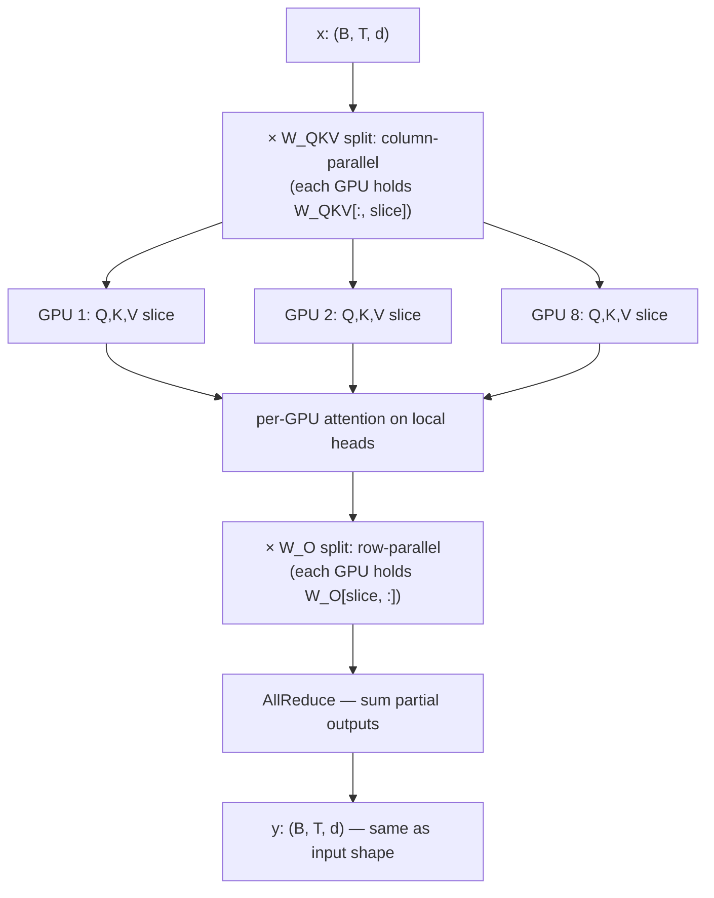

# Tensor Parallel

<Mode is="learn">

> **Prereqs:** [Data Parallel & DDP](./data-parallel), [Multi-Head Attention](../../llm-architecture/attention/mha). TP shards the *math inside a layer*, not the batch.

DDP shards the *batch* — every GPU runs the same model on different data. FSDP shards the *parameters* — the model lives across ranks but each rank reconstructs full layers on the fly. <Term name="tensor parallel">Tensor parallel</Term> shards the **math inside each individual layer**: the matmul itself runs across GPUs, with each GPU computing a slice of every weight matrix.

Megatron-LM (Shoeybi et al., 2019) is the canonical recipe. The trick is to compose two complementary slice patterns. The first matmul of a transformer block (the QKV projection in attention, the up-projection in MLP) is **column-parallel** — split along the output dim, each GPU gets a slice of the output, no communication needed. The second matmul (the output projection in attention, the down-projection in MLP) is **row-parallel** — split along the input dim, each GPU produces a *partial sum* of the output, and one <Term name="allreduce">AllReduce</Term> sums them. **Two AllReduces per transformer layer**, one per major sub-block.

The Python is `parallelize_module(layer, mesh, plan)`. PyTorch's <Term name="dtensor">DTensor</Term> lets you spell out the sharding scheme; the framework inserts the right collective at the right place. What's actually running underneath is NCCL Ring-AllReduce on the activations, twice per layer, every forward pass — and the bandwidth needed is so high that **TP only works within an NVLink domain**. Span TP across nodes and it collapses on InfiniBand. The universal recipe in 2026 is TP=8 within a node, FSDP across data-parallel ranks, <Term name="pipeline parallel">PP</Term> for cross-node depth.

## TL;DR

- **Tensor parallel (TP)** splits each individual matmul (and embedding, attention) across multiple GPUs. Each GPU holds a *slice* of every weight matrix; activations get AllReduced after the slice.
- **Megatron-LM** introduced the canonical TP design (Shoeybi et al., 2019): column-parallel for the first matmul of an MLP, row-parallel for the second, **two AllReduces per transformer layer** (one in attention, one in MLP).
- TP shards weights *and* compute → memory and FLOPs scale roughly linearly with TP degree. The cost is communication: **AllReduce on the activations** every layer, twice.
- **TP works best within a single NVLink domain** (one DGX node, ~8 GPUs). Across nodes, comm bandwidth tanks and TP scaling collapses. Production: TP=8 within node, DP / PP across nodes.
- The 2026 default for training a 70B+ model: TP=8 + FSDP (DP / sharded) + PP=4. This is what TorchTitan, Megatron-Core, NeMo all assume.

## Mental model



The trick: column-parallel input × row-parallel output means each GPU computes a *partial sum*, and the AllReduce sums them.

## Column-parallel matmul

A linear layer `y = x @ W` where `W` is `(in, out)`. Column-parallel: split `W` along the *output* dimension across G GPUs:

- GPU g holds `W[:, g*out/G : (g+1)*out/G]`, a slice of shape `(in, out/G)`.
- Each GPU computes `y_g = x @ W[:, slice]`, output shape `(B, T, out/G)`.
- The *concatenation* of all `y_g` along the last dim equals the full output.

**No comm needed for the forward output** — each GPU has its slice. Comm comes in the backward, where the input gradient `dx = dy @ W.T` requires accumulating across GPUs.

## Row-parallel matmul

The complement: split `W` along the *input* dimension:

- GPU g holds `W[g*in/G : (g+1)*in/G, :]`, shape `(in/G, out)`.
- Input `x` must already be sharded along its last dim (its `in/G` slice on each GPU).
- Each GPU computes `y_g = x_g @ W[slice, :]`, output `(B, T, out)` — but it's a *partial sum*, not the final result.
- **AllReduce** sums the partial outputs across GPUs → final `y`.

Row-parallel has the AllReduce in forward; column-parallel has it in backward.

## The Megatron MLP block

The genius of Megatron's design is to compose the two:

```
MLP(x) = ((x @ W_up) · gelu) @ W_down
```

- `W_up`: (d, d_ffn). **Column-parallel** — each GPU holds (d, d_ffn/G). Output: (B, T, d_ffn/G) per GPU. **No comm.**
- gelu: pointwise, no comm.
- `W_down`: (d_ffn, d). **Row-parallel** — each GPU holds (d_ffn/G, d). Input is already sharded (output of column-parallel). Output: full (B, T, d), partial sum. **AllReduce** to finish.

**One AllReduce per MLP block in forward.** No intermediate AllReduces. The (B, T, d_ffn/G) intermediate stays sharded across the gelu without needing communication.

## The Megatron attention block

Same composition for attention:

- `W_QKV`: (d, 3d). **Column-parallel** — each GPU holds (d, 3d/G), gets its own Q,K,V slice. Naturally maps to `n_heads / G` heads per GPU.
- Per-head attention: each GPU runs flash-attention on its local heads. **No comm.**
- `W_O`: (d, d). **Row-parallel** — input is the per-GPU attention output, sharded across heads. Output is full (B, T, d), partial sum. **AllReduce.**

**One AllReduce per attention block in forward.** Combined with MLP: **two AllReduces per layer** (one per major sub-block).

For a 70B model with 80 layers, that's 160 AllReduces per forward step. Each AllReduce moves `(B × T × d × bytes)` bytes per GPU. At B=4, T=8K, d=8192, BF16: each AllReduce is 4 × 8192 × 8192 × 2 = 512 MB / GPU. NVLink Gen 4 at 100 GB/s does that in 5 ms; over 160 layers that's 800 ms of comm per step.

## TP cost summary

For TP degree `G` on a single node:

| Component             | Memory (per GPU)        | Comm                                   |
|-----------------------|--------------------------|------------------------------------------|
| Model weights         | `params / G` × bytes     | none                                     |
| Activations           | `(B × T × d) / G` (sharded for some, replicated for others) | depends |
| Attention forward     | `B × T × T × n_heads/G` (with FA: O(N) effective) | one AllReduce in `W_O` |
| MLP forward           | `B × T × d_ffn / G`      | one AllReduce in `W_down`              |
| Per-layer total comm  | -                        | **2 AllReduces** of `B × T × d` bytes   |

Per layer, per GPU bandwidth: `2 × 2(G-1)/G × B × T × d × bytes`. For typical configs, this is ~100s of MB per layer; with 80 layers, the network is busy ~all the time.

## Why TP only within NVLink

Cross-node bandwidth is ~25–100 GB/s effective on InfiniBand (vs 100–600 GB/s NVLink). The same 512 MB AllReduce that takes 5 ms on NVLink takes 30+ ms across IB. Multiplied by 160 AllReduces per step, the comm dominates and your "8-way TP across two nodes" runs slower than 8-way TP within one node. **Hence the rule: TP=8 within node, scale across nodes via PP / DP.**

## Composing with FSDP / PP

Production setups stack:

```
Mesh: 1024 GPUs
- TP dim:  8 (within node, NVLink)
- PP dim:  4 (across-node pipeline)
- DP dim: 32 (replication, FSDP-sharded weights)
8 × 4 × 32 = 1024 ✓
```

PyTorch's <Term name="device mesh">DeviceMesh</Term> API (and TorchTitan, Megatron-Core, NeMo) lets you spell this out:

```python
from torch.distributed.device_mesh import init_device_mesh

mesh = init_device_mesh("cuda", (32, 4, 8), mesh_dim_names=("dp", "pp", "tp"))
# Now you have a logical 3D grid; ops know which axes to communicate along.
```

The challenge of multi-dimensional parallelism is keeping the comm patterns separate — TP AllReduces happen on the TP axis only, FSDP AllGathers on the DP axis only. DTensor (PyTorch) and the equivalent in Megatron-Core handle this for you.

## Run it in your browser — TP overhead simulator

<RunInBrowser
  description="Compute per-layer comm time and total step time for various TP degrees + bandwidth scenarios."
  code={`def tp_step(params_b, n_layers, batch, seq, d_model,
             tp_degree, bandwidth_gbps, compute_per_layer_ms,
             dtype_bytes=2):
    """Per-step wall time for a TP-sharded forward pass."""
    # Activations communicated per AllReduce: B × T × d bytes
    bytes_per_allreduce = batch * seq * d_model * dtype_bytes
    # Ring-AllReduce sends 2(G-1)/G × bytes per GPU
    G = tp_degree
    comm_bytes_per_layer = 2 * 2 * (G - 1) / G * bytes_per_allreduce  # 2 AllReduces per layer
    comm_ms_per_layer = comm_bytes_per_layer / (bandwidth_gbps * 1e9 / 1000) * 1000
    compute_ms_per_layer = compute_per_layer_ms / G  # compute scales with TP degree

    # With overlap (assume 70% overlap)
    layer_wall_ms = max(compute_ms_per_layer, comm_ms_per_layer) + 0.3 * min(compute_ms_per_layer, comm_ms_per_layer)
    return {
        'compute_per_layer_ms': compute_ms_per_layer,
        'comm_per_layer_ms':    comm_ms_per_layer,
        'layer_wall_ms':         layer_wall_ms,
        'total_step_ms':        layer_wall_ms * n_layers,
    }

print(f"{'config':<55} {'compute':>9} {'comm':>9} {'wall':>9}")
print('-' * 90)
for tp in (1, 2, 4, 8, 16):
    for bw, label in [(450, 'NVLink intra-node'), (50, 'IB cross-node')]:
        r = tp_step(70, 80, 4, 8192, 8192, tp, bw, compute_per_layer_ms=10)
        print(f"TP={tp:>2} 70B model, {label:<24}  "
              f"{r['compute_per_layer_ms']:>5.1f}ms  {r['comm_per_layer_ms']:>5.1f}ms  "
              f"{r['total_step_ms']:>6.0f}ms")
    print()
`}
/>

You'll see TP=8 on NVLink runs ~5× faster than no TP; the same TP=8 across IB runs *slower* than no TP because comm dominates. **This single number is why every frontier training stack pins TP within node.**

## Quick check

<FillIn
  prompt="The number of AllReduce communications per transformer layer in Megatron-style TP forward pass:"
  answer="2"
  accept={["two", "2 (one in attention, one in MLP)"]}
  hint="One per major sub-block."
  explanation="One AllReduce in the row-parallel `W_O` (attention output projection); one in the row-parallel `W_down` (MLP output). The intermediate (column-parallel outputs, gelu, attention itself) is naturally sharded and needs no comm."
/>

<Quiz
  question="A team trains a 70B model on 16 GPUs split across 2 nodes connected by 200Gbps InfiniBand. They configure TP=16 (across both nodes). Throughput is way below expectations. Best fix:"
  options={[
    'Add more GPUs.',
    'Reconfigure as TP=8 within each node, with PP=2 or DP=2 spanning the two nodes — pin tensor-parallel comm to NVLink.',
    'Switch to FP16.',
    'Reduce batch size.',
  ]}
  answer={1}
  explanation={`TP=16 across nodes means every per-layer AllReduce traverses InfiniBand at ~25 GB/s effective (vs 450 GB/s NVLink). With 160 AllReduces per step, that's tens of seconds of comm — far worse than compute. The standard recipe: pin TP within NVLink domain (TP=8 per node), use PP or DP across nodes where the comm pattern is more forgiving.`}
/>

## Key takeaways

1. **TP shards each layer's matmuls.** Column-parallel input matmul, row-parallel output matmul, two AllReduces per layer.
2. **Megatron's MLP design**: `W_up` column-parallel, `W_down` row-parallel; one AllReduce per MLP. Same pattern for attention.
3. **TP within NVLink (TP=8 per node) is the universal recipe.** Cross-node TP collapses on comm.
4. **TP, PP, DP/FSDP compose as orthogonal axes** of a 3D / 4D / 5D mesh. PyTorch `DeviceMesh` is how you express it.
5. **Megatron-Core, TorchTitan, NeMo** are the production references. Read their config files to see real-world TP × PP × DP shapes.

## Go deeper

<Resources
  items={[
    { kind: 'paper', href: 'https://arxiv.org/abs/1909.08053', title: 'Megatron-LM: Training Multi-Billion Parameter Language Models Using Model Parallelism', author: 'Shoeybi et al., 2019', note: 'The TP design paper. Section 3 has the column/row split.' },
    { kind: 'paper', href: 'https://arxiv.org/abs/2104.04473', title: 'Efficient Large-Scale Language Model Training on GPU Clusters Using Megatron-LM', author: 'Narayanan et al., SC21', note: 'How TP, PP, DP compose. Section 4 has the cost model that drives every modern training stack.' },
    { kind: 'docs', href: 'https://pytorch.org/docs/stable/distributed.tensor.html', title: 'PyTorch — DTensor', note: 'The modern abstraction. DTensor = a tensor that knows how it\'s sharded across a DeviceMesh.' },
    { kind: 'blog', href: 'https://huggingface.co/blog/3d-parallelism-intro', title: 'Hugging Face — Intro to 3D Parallelism', note: 'Best gentle introduction with diagrams. Read before the Megatron paper.' },
    { kind: 'blog', href: 'https://pytorch.org/blog/training-moes/', title: 'PyTorch Blog — Training Mixture of Experts', note: 'How TP composes with EP (expert parallelism) for MoE models.' },
    { kind: 'repo', href: 'https://github.com/NVIDIA/Megatron-LM', title: 'NVIDIA/Megatron-LM', note: 'The reference. `megatron/core/tensor_parallel/` is the canonical TP implementation.' },
    { kind: 'repo', href: 'https://github.com/pytorch/torchtitan', title: 'pytorch/torchtitan', note: 'Modern PyTorch training stack with DTensor-based TP. Read `train.py` for production composition.' },
  ]}
/>

</Mode>

<Mode is="reference">

> **Prereqs:** [Data Parallel & DDP](./data-parallel), [Multi-Head Attention](../../llm-architecture/attention/mha). TP shards the *math inside a layer*, not the batch.

## TL;DR

- **Tensor parallel (TP)** splits each individual matmul (and embedding, attention) across multiple GPUs. Each GPU holds a *slice* of every weight matrix; activations get AllReduced after the slice.
- **Megatron-LM** introduced the canonical TP design (Shoeybi et al., 2019): column-parallel for the first matmul of an MLP, row-parallel for the second, **two AllReduces per transformer layer** (one in attention, one in MLP).
- TP shards weights *and* compute → memory and FLOPs scale roughly linearly with TP degree. The cost is communication: **AllReduce on the activations** every layer, twice.
- **TP works best within a single NVLink domain** (one DGX node, ~8 GPUs). Across nodes, comm bandwidth tanks and TP scaling collapses. Production: TP=8 within node, DP / PP across nodes.
- The 2026 default for training a 70B+ model: TP=8 + FSDP (DP / sharded) + PP=4. This is what TorchTitan, Megatron-Core, NeMo all assume.

## Why this matters

When the model doesn't fit on a single GPU, TP is one of the two answers (the other is FSDP). For training, TP is preferred over FSDP for the *largest* tensors (attention QKV, FFN up/down) because the comm pattern is fixed-size and predictable. Knowing how TP shards each op, what the AllReduces cost, and when to combine TP with PP / FSDP is the foundation of any frontier training system. **No engineer who can't draw the Megatron diagram can talk credibly about training-systems architecture.**

## Mental model


The trick: column-parallel input × row-parallel output means each GPU computes a *partial sum*, and the AllReduce sums them.

## Concrete walkthrough

### Column-parallel matmul

A linear layer `y = x @ W` where `W` is `(in, out)`. Column-parallel: split `W` along the *output* dimension across G GPUs:

- GPU g holds `W[:, g*out/G : (g+1)*out/G]`, a slice of shape `(in, out/G)`.
- Each GPU computes `y_g = x @ W[:, slice]`, output shape `(B, T, out/G)`.
- The *concatenation* of all `y_g` along the last dim equals the full output.

**No comm needed for the forward output** — each GPU has its slice. Comm comes in the backward, where the input gradient `dx = dy @ W.T` requires accumulating across GPUs.

### Row-parallel matmul

The complement: split `W` along the *input* dimension:

- GPU g holds `W[g*in/G : (g+1)*in/G, :]`, shape `(in/G, out)`.
- Input `x` must already be sharded along its last dim (its `in/G` slice on each GPU).
- Each GPU computes `y_g = x_g @ W[slice, :]`, output `(B, T, out)` — but it's a *partial sum*, not the final result.
- **AllReduce** sums the partial outputs across GPUs → final `y`.

Row-parallel has the AllReduce in forward; column-parallel has it in backward.

### The Megatron MLP block

The genius of Megatron's design is to compose the two:

```
MLP(x) = ((x @ W_up) · gelu) @ W_down
```

- `W_up`: (d, d_ffn). **Column-parallel** — each GPU holds (d, d_ffn/G). Output: (B, T, d_ffn/G) per GPU. **No comm.**
- gelu: pointwise, no comm.
- `W_down`: (d_ffn, d). **Row-parallel** — each GPU holds (d_ffn/G, d). Input is already sharded (output of column-parallel). Output: full (B, T, d), partial sum. **AllReduce** to finish.

**One AllReduce per MLP block in forward.** No intermediate AllReduces. The (B, T, d_ffn/G) intermediate stays sharded across the gelu without needing communication.

### The Megatron attention block

Same composition for attention:

- `W_QKV`: (d, 3d). **Column-parallel** — each GPU holds (d, 3d/G), gets its own Q,K,V slice. Naturally maps to `n_heads / G` heads per GPU.
- Per-head attention: each GPU runs flash-attention on its local heads. **No comm.**
- `W_O`: (d, d). **Row-parallel** — input is the per-GPU attention output, sharded across heads. Output is full (B, T, d), partial sum. **AllReduce.**

**One AllReduce per attention block in forward.** Combined with MLP: **two AllReduces per layer** (one per major sub-block).

For a 70B model with 80 layers, that's 160 AllReduces per forward step. Each AllReduce moves `(B × T × d × bytes)` bytes per GPU. At B=4, T=8K, d=8192, BF16: each AllReduce is 4 × 8192 × 8192 × 2 = 512 MB / GPU. NVLink Gen 4 at 100 GB/s does that in 5 ms; over 160 layers that's 800 ms of comm per step.

### TP cost summary

For TP degree `G` on a single node:

| Component             | Memory (per GPU)        | Comm                                   |
|-----------------------|--------------------------|------------------------------------------|
| Model weights         | `params / G` × bytes     | none                                     |
| Activations           | `(B × T × d) / G` (sharded for some, replicated for others) | depends |
| Attention forward     | `B × T × T × n_heads/G` (with FA: O(N) effective) | one AllReduce in `W_O` |
| MLP forward           | `B × T × d_ffn / G`      | one AllReduce in `W_down`              |
| Per-layer total comm  | -                        | **2 AllReduces** of `B × T × d` bytes   |

Per layer, per GPU bandwidth: `2 × 2(G-1)/G × B × T × d × bytes`. For typical configs, this is ~100s of MB per layer; with 80 layers, the network is busy ~all the time.

### Why TP only within NVLink

Cross-node bandwidth is ~25–100 GB/s effective on InfiniBand (vs 100–600 GB/s NVLink). The same 512 MB AllReduce that takes 5 ms on NVLink takes 30+ ms across IB. Multiplied by 160 AllReduces per step, the comm dominates and your "8-way TP across two nodes" runs slower than 8-way TP within one node. **Hence the rule: TP=8 within node, scale across nodes via PP / DP.**

### Composing with FSDP / PP

Production setups stack:

```
Mesh: 1024 GPUs
- TP dim:  8 (within node, NVLink)
- PP dim:  4 (across-node pipeline)
- DP dim: 32 (replication, FSDP-sharded weights)
8 × 4 × 32 = 1024 ✓
```

PyTorch's `DeviceMesh` API (and TorchTitan, Megatron-Core, NeMo) lets you spell this out:

```python
from torch.distributed.device_mesh import init_device_mesh

mesh = init_device_mesh("cuda", (32, 4, 8), mesh_dim_names=("dp", "pp", "tp"))
# Now you have a logical 3D grid; ops know which axes to communicate along.
```

The challenge of multi-dimensional parallelism is keeping the comm patterns separate — TP AllReduces happen on the TP axis only, FSDP AllGathers on the DP axis only. DTensor (PyTorch) and the equivalent in Megatron-Core handle this for you.

## Run it in your browser — TP overhead simulator

<RunInBrowser
  description="Compute per-layer comm time and total step time for various TP degrees + bandwidth scenarios."
  code={`def tp_step(params_b, n_layers, batch, seq, d_model,
             tp_degree, bandwidth_gbps, compute_per_layer_ms,
             dtype_bytes=2):
    """Per-step wall time for a TP-sharded forward pass."""
    # Activations communicated per AllReduce: B × T × d bytes
    bytes_per_allreduce = batch * seq * d_model * dtype_bytes
    # Ring-AllReduce sends 2(G-1)/G × bytes per GPU
    G = tp_degree
    comm_bytes_per_layer = 2 * 2 * (G - 1) / G * bytes_per_allreduce  # 2 AllReduces per layer
    comm_ms_per_layer = comm_bytes_per_layer / (bandwidth_gbps * 1e9 / 1000) * 1000
    compute_ms_per_layer = compute_per_layer_ms / G  # compute scales with TP degree

    # With overlap (assume 70% overlap)
    layer_wall_ms = max(compute_ms_per_layer, comm_ms_per_layer) + 0.3 * min(compute_ms_per_layer, comm_ms_per_layer)
    return {
        'compute_per_layer_ms': compute_ms_per_layer,
        'comm_per_layer_ms':    comm_ms_per_layer,
        'layer_wall_ms':         layer_wall_ms,
        'total_step_ms':        layer_wall_ms * n_layers,
    }

print(f"{'config':<55} {'compute':>9} {'comm':>9} {'wall':>9}")
print('-' * 90)
for tp in (1, 2, 4, 8, 16):
    for bw, label in [(450, 'NVLink intra-node'), (50, 'IB cross-node')]:
        r = tp_step(70, 80, 4, 8192, 8192, tp, bw, compute_per_layer_ms=10)
        print(f"TP={tp:>2} 70B model, {label:<24}  "
              f"{r['compute_per_layer_ms']:>5.1f}ms  {r['comm_per_layer_ms']:>5.1f}ms  "
              f"{r['total_step_ms']:>6.0f}ms")
    print()
`}
/>

You'll see TP=8 on NVLink runs ~5× faster than no TP; the same TP=8 across IB runs *slower* than no TP because comm dominates. **This single number is why every frontier training stack pins TP within node.**

## Quick check

<FillIn
  prompt="The number of AllReduce communications per transformer layer in Megatron-style TP forward pass:"
  answer="2"
  accept={["two", "2 (one in attention, one in MLP)"]}
  hint="One per major sub-block."
  explanation="One AllReduce in the row-parallel `W_O` (attention output projection); one in the row-parallel `W_down` (MLP output). The intermediate (column-parallel outputs, gelu, attention itself) is naturally sharded and needs no comm."
/>

<Quiz
  question="A team trains a 70B model on 16 GPUs split across 2 nodes connected by 200Gbps InfiniBand. They configure TP=16 (across both nodes). Throughput is way below expectations. Best fix:"
  options={[
    'Add more GPUs.',
    'Reconfigure as TP=8 within each node, with PP=2 or DP=2 spanning the two nodes — pin tensor-parallel comm to NVLink.',
    'Switch to FP16.',
    'Reduce batch size.',
  ]}
  answer={1}
  explanation={`TP=16 across nodes means every per-layer AllReduce traverses InfiniBand at ~25 GB/s effective (vs 450 GB/s NVLink). With 160 AllReduces per step, that's tens of seconds of comm — far worse than compute. The standard recipe: pin TP within NVLink domain (TP=8 per node), use PP or DP across nodes where the comm pattern is more forgiving.`}
/>

## Key takeaways

1. **TP shards each layer's matmuls.** Column-parallel input matmul, row-parallel output matmul, two AllReduces per layer.
2. **Megatron's MLP design**: `W_up` column-parallel, `W_down` row-parallel; one AllReduce per MLP. Same pattern for attention.
3. **TP within NVLink (TP=8 per node) is the universal recipe.** Cross-node TP collapses on comm.
4. **TP, PP, DP/FSDP compose as orthogonal axes** of a 3D / 4D / 5D mesh. PyTorch `DeviceMesh` is how you express it.
5. **Megatron-Core, TorchTitan, NeMo** are the production references. Read their config files to see real-world TP × PP × DP shapes.

## Go deeper

<Resources
  items={[
    { kind: 'paper', href: 'https://arxiv.org/abs/1909.08053', title: 'Megatron-LM: Training Multi-Billion Parameter Language Models Using Model Parallelism', author: 'Shoeybi et al., 2019', note: 'The TP design paper. Section 3 has the column/row split.' },
    { kind: 'paper', href: 'https://arxiv.org/abs/2104.04473', title: 'Efficient Large-Scale Language Model Training on GPU Clusters Using Megatron-LM', author: 'Narayanan et al., SC21', note: 'How TP, PP, DP compose. Section 4 has the cost model that drives every modern training stack.' },
    { kind: 'docs', href: 'https://pytorch.org/docs/stable/distributed.tensor.html', title: 'PyTorch — DTensor', note: 'The modern abstraction. DTensor = a tensor that knows how it\'s sharded across a DeviceMesh.' },
    { kind: 'blog', href: 'https://huggingface.co/blog/3d-parallelism-intro', title: 'Hugging Face — Intro to 3D Parallelism', note: 'Best gentle introduction with diagrams. Read before the Megatron paper.' },
    { kind: 'blog', href: 'https://pytorch.org/blog/training-moes/', title: 'PyTorch Blog — Training Mixture of Experts', note: 'How TP composes with EP (expert parallelism) for MoE models.' },
    { kind: 'repo', href: 'https://github.com/NVIDIA/Megatron-LM', title: 'NVIDIA/Megatron-LM', note: 'The reference. `megatron/core/tensor_parallel/` is the canonical TP implementation.' },
    { kind: 'repo', href: 'https://github.com/pytorch/torchtitan', title: 'pytorch/torchtitan', note: 'Modern PyTorch training stack with DTensor-based TP. Read `train.py` for production composition.' },
  ]}
/>

</Mode>

<LessonComplete />
