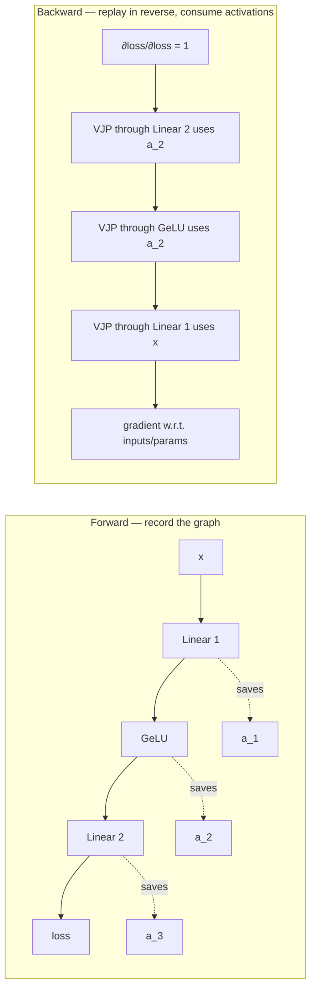

# Backprop as a Graph

## TL;DR

- Backprop isn't really about derivatives — those are bookkeeping. It's about **executing a computational graph backward**, with the **forward activations** as the binding state.
- Activations dominate training memory. For a 7B model at 8K context, activations can exceed weights by 5–10× without checkpointing.
- PyTorch's autograd records a tape of operations during forward; backward replays it in reverse, freeing tensors as soon as their gradient is computed.
- **VJP** (Vector-Jacobian Product) is the right mental model — `.backward()` doesn't compute Jacobians, it computes $J^\top v$ for some upstream $v$, one op at a time.
- The big systems consequence: **gradient checkpointing** trades compute for memory by *recomputing* activations during backward instead of storing them.

## Why this matters

If you can't predict where activations live, you can't predict what your training run will OOM on. Memory pressure isn't about the model size — it's about activations × batch × sequence length.

This is also the foundation of every memory-saving training trick: gradient checkpointing, activation offloading, micro-batching, FSDP. They're all variations on "manage activations more cleverly during backward".

## Mental model



The forward pass writes activations to memory; the backward pass reads them in reverse, computing one VJP per op, freeing each activation as soon as its corresponding op has computed its gradient.

The peak memory is the activation accumulation at the deepest point of the network — typically all activations for one forward pass live simultaneously by the time the loss is computed.

## Concrete walkthrough

### Why activations dominate

For a Transformer block:

| Item | Per-token bytes (BF16) |
| --- | --- |
| Attention QKV inputs | $3 \times d \times 2$ |
| Attention scores ($N \times N$ for sequence $N$) | $H \times N \times 2$ |
| Attention output | $d \times 2$ |
| FFN intermediate ($d_{\text{ffn}} = 4d$) | $4d \times 2$ |
| Total per layer | $\sim 12d$ + $H N$ |

For Llama-3.1 70B ($d = 8192$, $H = 64$, $L = 80$) at $N = 8192$, batch 1:

> **activations** ≈ 80 × (12·8192 + 64·8192) × 8192 × 2 bytes ≈ **92 GB**

Compare: weights are 140 GB. Optimizer state (AdamW) adds another 280 GB. **Activations alone exceed an H100's 80 GB on a single sequence at long context.**

This is why every frontier training run uses gradient checkpointing.

### What `.backward()` actually does (autograd in 30 lines)

```python
class Tensor:
    def __init__(self, data, parents=(), op=None, grad_fn=None):
        self.data = data
        self.grad = None
        self.parents = parents          # tensors this depends on
        self.grad_fn = grad_fn          # function: (upstream_grad) -> per-parent grads

    def backward(self, upstream=1.0):
        # Topological sort + reverse traversal.
        order, seen = [], set()
        def topo(t):
            if id(t) in seen: return
            seen.add(id(t))
            for p in t.parents: topo(p)
            order.append(t)
        topo(self)
        # seed root grad
        self.grad = upstream
        # walk in reverse, accumulating grads at each tensor
        for t in reversed(order):
            if t.grad_fn is None: continue
            parent_grads = t.grad_fn(t.grad)
            for p, g in zip(t.parents, parent_grads):
                p.grad = g if p.grad is None else p.grad + g

# Each op registers its parents and a grad_fn that's its VJP.
def matmul(A, B):
    out = Tensor(A.data @ B.data, parents=(A, B),
                 grad_fn=lambda gO: (gO @ B.data.T, A.data.T @ gO))
    return out
```

This is essentially what PyTorch's autograd does, scaled and optimized: a tape, a topological sort, and per-op VJP closures.

### VJP, not Jacobian

For an op with $m$ inputs and $n$ outputs, the Jacobian is an $n \times m$ matrix — usually huge. We never materialize it. We compute $J^\top v$ for some upstream gradient $v \in \mathbb{R}^n$, which is just a vector of size $m$.

For `matmul(A, B) = AB`, the Jacobian w.r.t. $A$ is enormous, but the VJP is simple:

$$
\frac{\partial \mathcal{L}}{\partial A} = \frac{\partial \mathcal{L}}{\partial Y} \cdot B^\top
$$

— another matmul. Most ops have similarly clean VJPs that fit on one line.

### Gradient checkpointing — the key memory-saving trick

Idea: **don't save all activations during forward. Save only at checkpoints. Recompute the rest during backward.**

```python
# Without checkpointing: 1 fwd, 1 bwd, peak memory = full activation stack
# With checkpointing every K layers: 1 fwd + 1 partial recomputation per K layers, peak = K layers' worth
```

Trade-off: ~33% more compute (one extra forward through each non-checkpointed segment), but memory drops from $O(L)$ to $O(\sqrt{L})$ if checkpoints are placed evenly. For deep models this is the difference between fits and doesn't.

PyTorch's `torch.utils.checkpoint.checkpoint` wraps a function so its activations aren't saved; backward recomputes them.

```python
from torch.utils.checkpoint import checkpoint
# Selective checkpointing: only checkpoint the attention block (which has the N×N matrix)
def forward(x):
    x = checkpoint(self.attn_block, x, use_reentrant=False)
    x = self.ffn_block(x)
    return x
```

**Megatron's "selective recompute"** (Korthikanti et al., 2022) chooses *which* activations to keep based on cost — recomputing FlashAttention is cheap (the math is fast), so attention is always recomputed; recomputing the FFN is expensive, so it's saved. This gets the memory of full checkpointing with ~5% extra compute instead of 33%.

## Real numbers — Llama 7B at 8K context, single A100

| Setup | Activations | Total mem |
| --- | --- | --- |
| No checkpointing | 39 GB | OOM |
| Full checkpointing | 4 GB | 28 GB |
| Selective (attn only) | 6 GB | 30 GB |

Selective is the production sweet spot.

## Run it in your browser — predict activation memory

<RunInBrowser
  description="Estimate activation memory for a Transformer training run."
  code={`def activation_gb(L, d, ffn_mult, T, B, dtype_bytes=2, checkpoint='none'):
    """Activation memory for a Transformer training step (Megatron-LM formula,
    Korthikanti 2022, assuming FlashAttention so the T×T score matrix is never
    materialized in HBM). Captures dominant terms: Q/K/V/O projections + FFN
    intermediate. Ignores small bookkeeping (norm scratch, dropout masks)."""
    attn_proj = 4 * d              # Q, K, V, attn-output activations
    ffn       = 2 * ffn_mult       # FFN input + SwiGLU/GELU intermediate
    per_layer = (attn_proj + ffn) * T * B * dtype_bytes
    total     = L * per_layer
    if checkpoint == 'full':
        # Save only at layer boundaries; recompute the rest. ~√L reduction.
        total /= (L ** 0.5)
    elif checkpoint == 'selective':
        # Megatron selective recomputation: keep cheap, recompute expensive. ~0.4×.
        total *= 0.4
    return total / 1024**3

configs = [
    ("Llama-7B  d=4096 L=32  ffn=11k T=8K  B=1  no-ckpt",     dict(L=32, d=4096, ffn_mult=11008, T=8192, B=1, checkpoint='none')),
    ("Llama-7B  same  selective ckpt                  ",      dict(L=32, d=4096, ffn_mult=11008, T=8192, B=1, checkpoint='selective')),
    ("Llama-7B  same  full ckpt                       ",      dict(L=32, d=4096, ffn_mult=11008, T=8192, B=1, checkpoint='full')),
    ("Llama-70B d=8192 L=80  ffn=28k T=8K  B=1  no-ckpt",     dict(L=80, d=8192, ffn_mult=28672, T=8192, B=1, checkpoint='none')),
    ("Llama-70B same  selective ckpt                  ",      dict(L=80, d=8192, ffn_mult=28672, T=8192, B=1, checkpoint='selective')),
]
print(f"{'config':<55}  {'activations':>14}")
print('-' * 75)
for label, kw in configs:
    print(f"{label:<55}  {activation_gb(**kw):>11.2f} GB")
`}
/>

You'll see Llama-70B at 8K with no checkpointing exceeds an H100; selective checkpointing brings it within budget.

## Quick check

<Quiz
  question="You're training a 13B model on 8 A100s and OOMing during the backward pass. The forward pass succeeds. What's the most appropriate first fix?"
  options={[
    'Reduce the learning rate.',
    'Switch from AdamW to a lower-memory optimizer like SGD.',
    'Enable selective gradient checkpointing on attention.',
    'Use a smaller batch size and accumulate gradients.',
  ]}
  answer={2}
  explanation="OOM during backward (but not forward) means peak activation memory is the constraint, not weights or optimizer state. Selective checkpointing on the attention block trades ~5% compute for a 3-5× drop in activation memory. Smaller batches help too but you typically want to keep your effective batch size; checkpointing is the targeted fix."
/>

## Key takeaways

1. **Backward is graph replay.** Forward saves activations; backward consumes them via per-op VJPs.
2. **Activations, not weights, often dominate training memory.** Predict them or you'll OOM.
3. **Use VJP intuitions, not Jacobian intuitions.** No one materializes $J$. Always think $J^\top v$.
4. **Selective gradient checkpointing is the production default.** Pay ~5% compute for 3–5× lower activation memory.
5. **PyTorch autograd is ~600 lines of clever bookkeeping.** Read `torch/autograd/` once — the abstractions are simpler than they look.

## Go deeper

<Resources
  items={[
    { kind: 'paper', href: 'https://arxiv.org/abs/1502.05767', title: 'Automatic Differentiation in Machine Learning: A Survey', author: 'Baydin, Pearlmutter, Radul, Siskind (2018)', note: 'The reference for *what* AD actually is. Section 3 on reverse mode is enough.' },
    { kind: 'paper', href: 'https://arxiv.org/abs/1604.06174', title: 'Training Deep Nets with Sublinear Memory Cost', author: 'Chen et al. (2016)', note: 'The original gradient checkpointing paper. Surprisingly accessible.' },
    { kind: 'paper', href: 'https://arxiv.org/abs/2205.05198', title: 'Reducing Activation Recomputation in Large Transformer Models', author: 'Korthikanti et al. (Megatron, 2022)', note: 'Selective recompute. The recipe behind every modern training run.' },
    { kind: 'video', href: 'https://www.youtube.com/watch?v=VMj-3S1tku0', title: 'Andrej Karpathy — micrograd: a tiny autograd engine', author: 'Andrej Karpathy', note: 'Builds autograd in 100 lines from scratch. The clearest explanation that exists.' },
    { kind: 'repo', href: 'https://github.com/karpathy/micrograd', title: 'karpathy/micrograd', note: 'The reference 100-line autograd. Read it before reading PyTorch\'s.' },
    { kind: 'docs', href: 'https://pytorch.org/docs/stable/notes/autograd.html', title: 'PyTorch — autograd notes', note: 'The official explanation of how the tape, hooks, and `retain_graph` actually work. Required for serious training work.' },
    { kind: 'blog', href: 'https://www.thonking.ai/p/what-shapes-do-matrix-multiplications', title: 'Horace He — what shapes do matmuls like?', note: 'Activation memory framing applied to real PyTorch profiling.' },
    { kind: 'docs', href: 'https://pytorch.org/docs/stable/checkpoint.html', title: 'PyTorch — torch.utils.checkpoint', note: 'How to enable selective + activation checkpointing in practice.' },
  ]}
/>

<LessonComplete />
