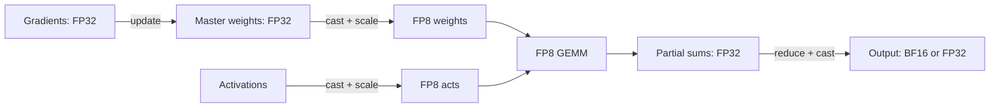

# FP8 Training (DeepSeek-V3 Recipe)

<Mode is="learn">

In the cloud, "use a faster instance type" is the wall-clock optimization of last resort. In ML training, the equivalent is to use *the same hardware* in a different numerical format. Hopper's tensor cores can do <Term name="fp8">FP8</Term> matmul at twice the throughput of <Term name="bf16">BF16</Term>. Same chips, same kernels, half the bytes per number — wall-clock training time drops by ~1.5×, end-to-end.

The Python is `with te.fp8_autocast(enabled=True):`. Behind that one line: forward GEMMs cast their inputs to <Term name="e4m3">E4M3</Term> (4-exponent, 3-mantissa) and run on the FP8 tensor cores; backward GEMMs cast to <Term name="e5m2">E5M2</Term> (wider range, less precision) for gradients; partial sums accumulate in FP32 to avoid round-off error; an FP32 <Term name="master weights">master copy</Term> of weights tracks every optimizer step at full precision; per-block scale factors (one per 128×128 tile of weights, one per 1×128 channel of activations) keep outliers from blowing out the dynamic range. Get any of those wrong and the training run silently underfits or diverges.

DeepSeek-V3 (December 2024) was the first public proof that FP8 training works at frontier scale — 671B parameters, 14.8T tokens, total cost ~$5.6M. A BF16 baseline would have been ~$8M. The recipe was open-sourced, the field copied it, and FP8 is now the default for any serious 2026 pretraining run on H100 or newer hardware.

## TL;DR

- **FP8 training** runs forward and backward passes in 8-bit floats (E4M3 or E5M2), with a **higher-precision master copy** of weights and a **scaling strategy** to keep values in dynamic range.
- On H100/B200, FP8 GEMM is **~2× the throughput** of BF16 on tensor cores. End-to-end training is typically **1.4–1.8× faster** wall-clock than BF16, with no quality regression at scale.
- **DeepSeek-V3** (Dec 2024) is the most-cited public recipe: per-tile/per-block scaling, FP8 forward + backward, FP32 master + FP32 reduce-scatter, "increased-accuracy accumulation" via partial sums in FP32.
- **Blackwell B200/B300 (2025)** added **NVFP4** (4-bit float) and **<Term name="mxfp8">MXFP8</Term>** (block-scaled 8-bit) in tensor cores, opening the door to 4-bit training experiments through 2025–2026.
- Below-frontier scale, **BF16 + FP8 inference** is more common than FP8 training. The training recipe is heavyweight; test on a 1–7B model before committing.

## Mental model



Three precisions in one training step:

1. **FP8** for the dense GEMMs and bytes moved across SMs/HBM.
2. **FP32** for the master weight copy, gradient accumulation, and optimizer state.
3. **BF16** as a useful intermediate for activations crossing layer boundaries.

## The four FP8 recipes

### 1. Per-tensor scaling (basic)

Pick one scale factor per tensor (a whole weight matrix or a whole activation tensor):

```text
fp8_value = clip(round(fp32_value / scale), MIN_FP8, MAX_FP8)
gemm_out  = fp8_a * fp8_b * scale_a * scale_b   # accumulated in FP32
```

Scale is updated based on the running-max statistic of the tensor. Easy to implement, OK at small scale, **breaks at large scale** because outlier values blow out the dynamic range.

### 2. Delayed scaling (NVIDIA Transformer Engine v1)

Same as per-tensor, but the scale lags one step — you compute the scale from this step's amax to use *next* step. This avoids the chicken-and-egg of "I need to know amax to choose scale, but I need scale to compute amax".

NVIDIA's <Term name="transformer engine">Transformer Engine</Term> made this the production default 2022–2024. Works to ~70B but starts to wobble at long-context training.

### 3. Per-tile / per-block scaling (DeepSeek-V3)

Split each tensor into small blocks (e.g., 128×128 or 1×128) and **store one FP8 scale per block**. Outliers can't blow out the whole tensor — they just blow out their own block.

This is the recipe that worked at 671B scale. Three engineering details:

- **Forward** uses 1×128 (channel-wise) FP8 scaling for activations and 128×128 FP8 scaling for weights.
- **Backward** uses similar block-scaling on the gradients.
- **Increased-accuracy accumulation** — the GEMM does partial sums in FP32 every $K$ inner iterations to avoid round-off error from many FP8×FP8 products.

DeepSeek's engineers showed empirically that this matches BF16 training loss curves to within noise, while running ~1.5× faster wall-clock.

### 4. MX formats (Blackwell-era, 2025+)

The Open Compute Project's **<Term name="microscaling">Microscaling</Term> (MX)** spec defines FP8/FP6/FP4 formats with a shared 8-bit scale per 32-element block. **MXFP8** and **NVFP4** are now native tensor-core formats on B200/B300.

Production recipes through 2025 (NVIDIA NeMo, several open releases) use MXFP8 across forward + backward — strictly better numerical behavior than per-tile FP8 in most cases, with no software per-block scaling code. **NVFP4 training is research as of April 2026** but actively being explored.

## What you actually run (PyTorch + Transformer Engine)

```python
import transformer_engine.pytorch as te
from transformer_engine.common.recipe import DelayedScaling, Format

fp8_recipe = DelayedScaling(
    fp8_format=Format.HYBRID,        # E4M3 forward, E5M2 backward
    amax_history_len=16,
    amax_compute_algo="max",
)

# Wrap your transformer layer in TE's FP8-aware version
layer = te.TransformerLayer(hidden_size=4096, ffn_hidden_size=11008, num_attention_heads=32)

# Train inside the FP8 autocast region
for step in range(n_steps):
    with te.fp8_autocast(enabled=True, fp8_recipe=fp8_recipe):
        out = layer(x)
        loss = loss_fn(out, target)
    loss.backward()
    optimizer.step()
```

DeepSeek-V3-style per-block scaling lives in their custom <Term name="cutlass">CUTLASS</Term>-based GEMM kernels, not (yet) in stock TE — see their open-sourced `inference/` and `training/` code for the reference implementation.

## Real numbers — DeepSeek-V3 training

From their tech report (December 2024):

- 671B-param MoE (37B active per token), FP8 forward + backward
- **2.788M H800 hours** total — about $5.6M of compute at the public rate
- BF16 baseline (estimated) would have taken **~4M hours** — FP8 saved ~$2.4M
- Final loss within noise of BF16 (validated by training a 1B model both ways and comparing curves)

For comparison: GPT-4 (2023, BF16) is estimated at ~$60–100M of compute. FP8 plus MoE plus a few other tricks let DeepSeek get a frontier-tier model for ~5% of that.

This is what "compute-efficient frontier" looks like in 2024–2026.

## Run it in your browser — when does FP8 pay?

<RunInBrowser
  description="Roofline-style estimate of FP8 vs BF16 wall-clock for several training scenarios."
  code={`def time_per_step_s(params_b, tokens_per_step, util_bf16=0.5, util_fp8=0.45):
    """Rough wall-clock per training step (forward + backward = ~3x flops vs forward)."""
    # 6 * params * tokens for forward + backward (the standard rule of thumb)
    flops_per_step = 6 * params_b * 1e9 * tokens_per_step
    h100_bf16_peak = 989e12   # TFLOPS
    h100_fp8_peak  = 1979e12  # TFLOPS
    bf16_s = flops_per_step / (h100_bf16_peak * util_bf16)
    fp8_s  = flops_per_step / (h100_fp8_peak  * util_fp8)
    return bf16_s, fp8_s

scenarios = [
    ("7B   pretraining   bs=4M tok/step", 7,    4_000_000),
    ("70B  pretraining   bs=4M tok/step", 70,   4_000_000),
    ("405B pretraining   bs=4M tok/step", 405,  4_000_000),
    ("70B  fine-tune     bs=128K tok/step", 70,  131_072),
]

for name, p, t in scenarios:
    bf16, fp8 = time_per_step_s(p, t)
    speedup = bf16 / fp8
    print(f"{name:<40}  BF16: {bf16:>6.2f} s  FP8: {fp8:>6.2f} s  speedup: {speedup:.2f}x")
`}
/>

You'll see ~1.6–1.8× speedup at frontier scale. The gap shrinks for small fine-tunes because per-step overhead (optimizer, communication) starts to dominate.

## Quick check

<Quiz
  question="DeepSeek-V3 trained 671B params in FP8 successfully where earlier FP8 attempts failed at scale. What was the most important technical change?"
  options={[
    'Faster H100 GPUs.',
    'Per-tile / per-block scaling instead of per-tensor — outliers can no longer blow out the whole tensor.',
    'Higher learning rate.',
    'More training tokens.',
  ]}
  answer={1}
  explanation="The breakthrough was per-tile (1×128 for activations, 128×128 for weights) FP8 scaling plus FP32 accumulation. Per-tensor scaling fails at scale because a single outlier value blows out the dynamic range for the entire tensor. Block-scaling localizes the damage. NVIDIA Transformer Engine's delayed scaling worked to ~70B; DeepSeek showed block-scaling works to 600B+."
/>

## Key takeaways

1. **FP8 training is the frontier wall-clock optimization.** ~1.5–1.8× over BF16 at scale, no quality cost when done right.
2. **Block-scaling is what makes it work at scale.** Per-tensor was a dead end past ~70B.
3. **You always keep an FP32 master copy** of weights, gradients, and optimizer state. FP8 is just for the GEMMs and the bytes moved.
4. **Test FP8 on a 1B model before betting on it for a 70B run.** The recipe is brittle; small misconfigurations show up as silent quality drops.
5. **Blackwell era brings MXFP8 and NVFP4 as hardware natives.** Watch this space through 2026.

## Go deeper

<Resources
  items={[
    { kind: 'paper', href: 'https://arxiv.org/abs/2209.05433', title: 'FP8 Formats for Deep Learning', author: 'Micikevicius et al. (NVIDIA, 2022)', note: 'Defines E4M3 / E5M2. The original NVIDIA white paper.' },
    { kind: 'paper', href: 'https://arxiv.org/abs/2412.19437', title: 'DeepSeek-V3 Technical Report', author: 'DeepSeek-AI (December 2024)', note: 'The recipe. Sections 3.3 and 4.1 describe FP8 training in detail. Read it.' },
    { kind: 'docs', href: 'https://docs.nvidia.com/deeplearning/transformer-engine/user-guide/index.html', title: 'NVIDIA Transformer Engine docs', note: 'How to actually call FP8 training from PyTorch. Operational reference.' },
    { kind: 'docs', href: 'https://www.opencompute.org/documents/ocp-microscaling-formats-mx-v1-0-spec-final-pdf', title: 'OCP Microscaling Specification v1.0', note: 'The MXFP8 / MXFP4 / NVFP4 spec. Hardware-vendor reference.' },
    { kind: 'paper', href: 'https://arxiv.org/abs/2310.18313', title: 'FP8-LM: Training FP8 Large Language Models', author: 'Peng et al. (Microsoft, 2023)', note: 'Pre-DeepSeek attempt at scaled FP8 training. Useful for what didn\'t work.' },
    { kind: 'video', href: 'https://www.youtube.com/watch?v=zEuwuCTEf_0', title: 'Tri Dao — FP8 in FlashAttention-3', author: 'Tri Dao at Hazy Research', note: 'How FP8 + block-scaled accumulation works at the kernel level.' },
    { kind: 'repo', href: 'https://github.com/deepseek-ai/DeepSeek-V3', title: 'deepseek-ai/DeepSeek-V3', note: 'Reference implementation. Read `inference/` for FP8 GEMM kernels.' },
    { kind: 'blog', href: 'https://huggingface.co/blog/hf-bitsandbytes-integration', title: 'Hugging Face — FP8 inference', note: 'Less involved than training; useful as a contrasting baseline.' },
  ]}
/>

</Mode>

<Mode is="reference">

## TL;DR

- **FP8 training** runs forward and backward passes in 8-bit floats (E4M3 or E5M2), with a **higher-precision master copy** of weights and a **scaling strategy** to keep values in dynamic range.
- On H100/B200, FP8 GEMM is **~2× the throughput** of BF16 on tensor cores. End-to-end training is typically **1.4–1.8× faster** wall-clock than BF16, with no quality regression at scale.
- **DeepSeek-V3** (Dec 2024) is the most-cited public recipe: per-tile/per-block scaling, FP8 forward + backward, FP32 master + FP32 reduce-scatter, "increased-accuracy accumulation" via partial sums in FP32.
- **Blackwell B200/B300 (2025)** added **NVFP4** (4-bit float) and **MXFP8** (block-scaled 8-bit) in tensor cores, opening the door to 4-bit training experiments through 2025–2026.
- Below-frontier scale, **BF16 + FP8 inference** is more common than FP8 training. The training recipe is heavyweight; test on a 1–7B model before committing.

## Why this matters

Wall-clock training time ≈ `flops / (tensor-core peak × utilization)`. Going BF16 → FP8 doubles the tensor-core peak. The whole frontier moved when DeepSeek published a recipe that *worked at 671B-parameter scale*, removing the previous excuse that "FP8 only works at toy scale."

This is also where the term "compute-optimal" becomes "compute-and-memory-bandwidth-optimal" — FP8 halves the bytes moved per gradient as well as the math cost.

## Mental model


Three precisions in one training step:

1. **FP8** for the dense GEMMs and bytes moved across SMs/HBM.
2. **FP32** for the master weight copy, gradient accumulation, and optimizer state.
3. **BF16** as a useful intermediate for activations crossing layer boundaries.

## Concrete walkthrough — the four FP8 recipes

### 1. Per-tensor scaling (basic)

Pick one scale factor per tensor (a whole weight matrix or a whole activation tensor):

```text
fp8_value = clip(round(fp32_value / scale), MIN_FP8, MAX_FP8)
gemm_out  = fp8_a * fp8_b * scale_a * scale_b   # accumulated in FP32
```

Scale is updated based on the running-max statistic of the tensor. Easy to implement, OK at small scale, **breaks at large scale** because outlier values blow out the dynamic range.

### 2. Delayed scaling (NVIDIA Transformer Engine v1)

Same as per-tensor, but the scale lags one step — you compute the scale from this step's amax to use *next* step. This avoids the chicken-and-egg of "I need to know amax to choose scale, but I need scale to compute amax".

NVIDIA's Transformer Engine made this the production default 2022–2024. Works to ~70B but starts to wobble at long-context training.

### 3. Per-tile / per-block scaling (DeepSeek-V3)

Split each tensor into small blocks (e.g., 128×128 or 1×128) and **store one FP8 scale per block**. Outliers can't blow out the whole tensor — they just blow out their own block.

This is the recipe that worked at 671B scale. Three engineering details:

- **Forward** uses 1×128 (channel-wise) FP8 scaling for activations and 128×128 FP8 scaling for weights.
- **Backward** uses similar block-scaling on the gradients.
- **Increased-accuracy accumulation** — the GEMM does partial sums in FP32 every $K$ inner iterations to avoid round-off error from many FP8×FP8 products.

DeepSeek's engineers showed empirically that this matches BF16 training loss curves to within noise, while running ~1.5× faster wall-clock.

### 4. MX formats (Blackwell-era, 2025+)

The Open Compute Project's **Microscaling (MX)** spec defines FP8/FP6/FP4 formats with a shared 8-bit scale per 32-element block. **MXFP8** and **NVFP4** are now native tensor-core formats on B200/B300.

Production recipes through 2025 (NVIDIA NeMo, several open releases) use MXFP8 across forward + backward — strictly better numerical behavior than per-tile FP8 in most cases, with no software per-block scaling code. **NVFP4 training is research as of April 2026** but actively being explored.

## What you actually run (PyTorch + Transformer Engine)

```python
import transformer_engine.pytorch as te
from transformer_engine.common.recipe import DelayedScaling, Format

fp8_recipe = DelayedScaling(
    fp8_format=Format.HYBRID,        # E4M3 forward, E5M2 backward
    amax_history_len=16,
    amax_compute_algo="max",
)

# Wrap your transformer layer in TE's FP8-aware version
layer = te.TransformerLayer(hidden_size=4096, ffn_hidden_size=11008, num_attention_heads=32)

# Train inside the FP8 autocast region
for step in range(n_steps):
    with te.fp8_autocast(enabled=True, fp8_recipe=fp8_recipe):
        out = layer(x)
        loss = loss_fn(out, target)
    loss.backward()
    optimizer.step()
```

DeepSeek-V3-style per-block scaling lives in their custom CUTLASS-based GEMM kernels, not (yet) in stock TE — see their open-sourced `inference/` and `training/` code for the reference implementation.

## Real numbers — DeepSeek-V3 training

From their tech report (December 2024):

- 671B-param MoE (37B active per token), FP8 forward + backward
- **2.788M H800 hours** total — about $5.6M of compute at the public rate
- BF16 baseline (estimated) would have taken **~4M hours** — FP8 saved ~$2.4M
- Final loss within noise of BF16 (validated by training a 1B model both ways and comparing curves)

For comparison: GPT-4 (2023, BF16) is estimated at ~$60–100M of compute. FP8 plus MoE plus a few other tricks let DeepSeek get a frontier-tier model for ~5% of that.

This is what "compute-efficient frontier" looks like in 2024–2026.

## Run it in your browser — when does FP8 pay?

<RunInBrowser
  description="Roofline-style estimate of FP8 vs BF16 wall-clock for several training scenarios."
  code={`def time_per_step_s(params_b, tokens_per_step, util_bf16=0.5, util_fp8=0.45):
    """Rough wall-clock per training step (forward + backward = ~3x flops vs forward)."""
    # 6 * params * tokens for forward + backward (the standard rule of thumb)
    flops_per_step = 6 * params_b * 1e9 * tokens_per_step
    h100_bf16_peak = 989e12   # TFLOPS
    h100_fp8_peak  = 1979e12  # TFLOPS
    bf16_s = flops_per_step / (h100_bf16_peak * util_bf16)
    fp8_s  = flops_per_step / (h100_fp8_peak  * util_fp8)
    return bf16_s, fp8_s

scenarios = [
    ("7B   pretraining   bs=4M tok/step", 7,    4_000_000),
    ("70B  pretraining   bs=4M tok/step", 70,   4_000_000),
    ("405B pretraining   bs=4M tok/step", 405,  4_000_000),
    ("70B  fine-tune     bs=128K tok/step", 70,  131_072),
]

for name, p, t in scenarios:
    bf16, fp8 = time_per_step_s(p, t)
    speedup = bf16 / fp8
    print(f"{name:<40}  BF16: {bf16:>6.2f} s  FP8: {fp8:>6.2f} s  speedup: {speedup:.2f}x")
`}
/>

You'll see ~1.6–1.8× speedup at frontier scale. The gap shrinks for small fine-tunes because per-step overhead (optimizer, communication) starts to dominate.

## Quick check

<Quiz
  question="DeepSeek-V3 trained 671B params in FP8 successfully where earlier FP8 attempts failed at scale. What was the most important technical change?"
  options={[
    'Faster H100 GPUs.',
    'Per-tile / per-block scaling instead of per-tensor — outliers can no longer blow out the whole tensor.',
    'Higher learning rate.',
    'More training tokens.',
  ]}
  answer={1}
  explanation="The breakthrough was per-tile (1×128 for activations, 128×128 for weights) FP8 scaling plus FP32 accumulation. Per-tensor scaling fails at scale because a single outlier value blows out the dynamic range for the entire tensor. Block-scaling localizes the damage. NVIDIA Transformer Engine's delayed scaling worked to ~70B; DeepSeek showed block-scaling works to 600B+."
/>

## Key takeaways

1. **FP8 training is the frontier wall-clock optimization.** ~1.5–1.8× over BF16 at scale, no quality cost when done right.
2. **Block-scaling is what makes it work at scale.** Per-tensor was a dead end past ~70B.
3. **You always keep an FP32 master copy** of weights, gradients, and optimizer state. FP8 is just for the GEMMs and the bytes moved.
4. **Test FP8 on a 1B model before betting on it for a 70B run.** The recipe is brittle; small misconfigurations show up as silent quality drops.
5. **Blackwell era brings MXFP8 and NVFP4 as hardware natives.** Watch this space through 2026.

## Go deeper

<Resources
  items={[
    { kind: 'paper', href: 'https://arxiv.org/abs/2209.05433', title: 'FP8 Formats for Deep Learning', author: 'Micikevicius et al. (NVIDIA, 2022)', note: 'Defines E4M3 / E5M2. The original NVIDIA white paper.' },
    { kind: 'paper', href: 'https://arxiv.org/abs/2412.19437', title: 'DeepSeek-V3 Technical Report', author: 'DeepSeek-AI (December 2024)', note: 'The recipe. Sections 3.3 and 4.1 describe FP8 training in detail. Read it.' },
    { kind: 'docs', href: 'https://docs.nvidia.com/deeplearning/transformer-engine/user-guide/index.html', title: 'NVIDIA Transformer Engine docs', note: 'How to actually call FP8 training from PyTorch. Operational reference.' },
    { kind: 'docs', href: 'https://www.opencompute.org/documents/ocp-microscaling-formats-mx-v1-0-spec-final-pdf', title: 'OCP Microscaling Specification v1.0', note: 'The MXFP8 / MXFP4 / NVFP4 spec. Hardware-vendor reference.' },
    { kind: 'paper', href: 'https://arxiv.org/abs/2310.18313', title: 'FP8-LM: Training FP8 Large Language Models', author: 'Peng et al. (Microsoft, 2023)', note: 'Pre-DeepSeek attempt at scaled FP8 training. Useful for what didn\'t work.' },
    { kind: 'video', href: 'https://www.youtube.com/watch?v=zEuwuCTEf_0', title: 'Tri Dao — FP8 in FlashAttention-3', author: 'Tri Dao at Hazy Research', note: 'How FP8 + block-scaled accumulation works at the kernel level.' },
    { kind: 'repo', href: 'https://github.com/deepseek-ai/DeepSeek-V3', title: 'deepseek-ai/DeepSeek-V3', note: 'Reference implementation. Read `inference/` for FP8 GEMM kernels.' },
    { kind: 'blog', href: 'https://huggingface.co/blog/hf-bitsandbytes-integration', title: 'Hugging Face — FP8 inference', note: 'Less involved than training; useful as a contrasting baseline.' },
  ]}
/>

</Mode>

<LessonComplete />
