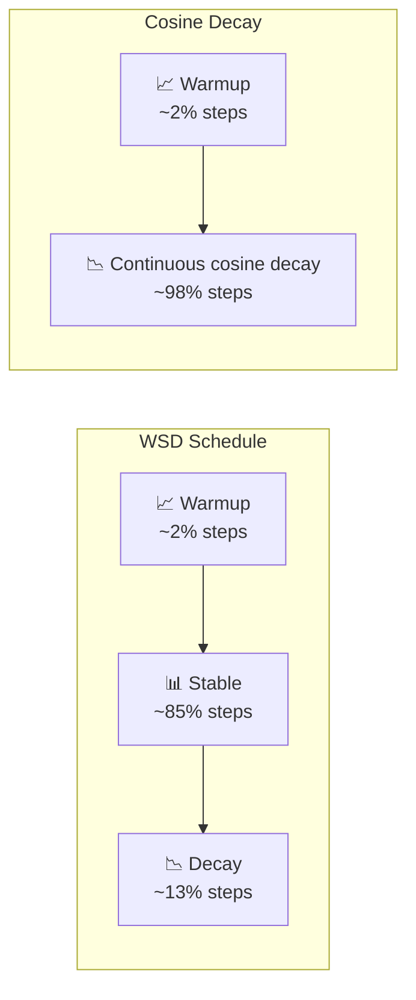

# LR Schedules & WSD

## TL;DR

- **Cosine decay** was the default for GPT-3 through Llama 2: the LR follows a half-cosine from peak to ~0 over a fixed number of steps. Works well but **requires knowing total training steps upfront**.
- **Warmup-Stable-Decay (WSD)** splits training into three phases: a short linear warmup (0.5–5% of steps), a long stable plateau at peak LR (80–90%), and a final cooldown (5–15%). MiniCPM, DeepSeek-V3, and Qwen 2.5 all use variants of WSD.
- WSD's killer advantage: **you don't need to decide total compute budget before training starts.** You can train indefinitely at the plateau, then cool down whenever you want a strong checkpoint.
- The cooldown phase does most of the final loss improvement — it suppresses gradient noise and lets the model settle into a sharper minimum. Skipping it costs 0.5–2% quality.

## Why this matters

Cosine decay has a hidden cost: you commit to a step count before training begins. If you want to train 20% longer (because loss is still dropping), you either restart with a new schedule or hack an extension — both waste compute. MiniCPM showed in 2024 that WSD eliminates this problem entirely. DeepSeek-V3 (14.8T tokens, 2048 H800s) ran its main phase at constant LR and only decayed at the very end, after deciding exactly when to stop based on live loss curves.

For practitioners: choosing the wrong schedule — or the wrong warmup duration — can waste 10–30% of your compute budget before you even notice. This lesson teaches you how to pick.

## Mental model



**Cosine** continuously drops the LR, which means early-to-mid training is already at a reduced rate — potentially under-exploring. **WSD** keeps the full learning rate during the exploration phase and only cools down when you're ready to commit.

## Concrete walkthrough

### The three schedules you'll actually see

**1. Cosine decay (GPT-3, Llama 1/2, Mistral 7B)**

```python
def cosine_lr(step, total_steps, warmup_steps, peak_lr, min_lr=0):
    if step < warmup_steps:
        return peak_lr * step / warmup_steps
    progress = (step - warmup_steps) / (total_steps - warmup_steps)
    return min_lr + 0.5 * (peak_lr - min_lr) * (1 + math.cos(math.pi * progress))
```

Pros: smooth, well-studied, one less hyperparameter (no "when to decay" decision).
Cons: must know `total_steps` at init. Extending training means restarting. Mid-training checkpoints are suboptimal because the LR is already partially decayed.

**2. WSD — Warmup-Stable-Decay (MiniCPM, DeepSeek-V3, Qwen 2.5)**

```python
def wsd_lr(step, warmup_steps, stable_steps, decay_steps, peak_lr, min_lr=0):
    if step < warmup_steps:
        return peak_lr * step / warmup_steps
    elif step < warmup_steps + stable_steps:
        return peak_lr
    else:
        decay_progress = (step - warmup_steps - stable_steps) / decay_steps
        decay_progress = min(decay_progress, 1.0)
        return min_lr + 0.5 * (peak_lr - min_lr) * (1 + math.cos(math.pi * decay_progress))
```

The stable phase is the key innovation. You train at peak LR until you're satisfied with convergence, then trigger decay for the final push. DeepSeek-V3 ran 14.8T tokens at stable LR, then decayed over the final 500B.

**3. Linear decay (Llama 3, simple baseline)**

Warmup → linear ramp down to min_lr. Simple. Often 90% as good as cosine.

### What the numbers look like in practice

| Model | Schedule | Warmup | Stable/Decay | Peak LR | Tokens |
|---|---|---|---|---|---|
| GPT-3 175B | Cosine | 375M tokens | Full cosine | 6e-5 | 300B |
| Llama 2 70B | Cosine | 2000 steps | Full cosine | 1.5e-4 | 2T |
| MiniCPM 2.4B (µP) | WSD | 2000 steps | 90% stable / 10% decay | 1e-2 \* | 1T |
| DeepSeek-V3 671B | WSD | 2000 steps | ~97% stable / ~3% decay | 2.2e-4 | 14.8T |
| Qwen 2.5 72B | WSD | 2000 steps | ~85% stable / ~15% decay | 1.5e-4 | 18T |

Notice: DeepSeek-V3 ran at peak LR for **14.3T tokens** and only decayed over the final 500B. That's the WSD philosophy — explore fully, then settle.

> **\* MiniCPM's "1e-2" peak LR is a µP-parameterization artifact**, not a number you'd transfer to a non-µP run. MiniCPM uses Maximal Update Parameterization (Yang et al.), which scales each layer's effective LR by `1/width` — so the *raw* config knob is 1e-2, but the *effective* LR per parameter is closer to ~1e-3 (the same order as GPT-3 / Llama). If you copy `peak_lr=1e-2` into a vanilla AdamW run, you'll diverge immediately.


### Warmup: how much is enough?

Too little warmup → loss spikes, training diverges early.
Too much warmup → wasted compute at low LR.

The rule of thumb from Llama 3 and DeepSeek-V3: **2000 steps is almost always sufficient**, regardless of model size. For very large batch sizes, extend to ~4000 steps.

```
warmup_tokens ≈ 2000 × batch_size × seq_len
             ≈ 2000 × 4M × 4096
             ≈ ~33B tokens  (for a DeepSeek-V3-class run)
```

## Run it in your browser

<RunInBrowser
  description="Compare cosine vs WSD vs linear schedules side-by-side."
  code={`import math

def cosine_lr(step, total, warmup, peak, min_lr=0):
    if step < warmup: return peak * step / warmup
    p = (step - warmup) / (total - warmup)
    return min_lr + 0.5 * (peak - min_lr) * (1 + math.cos(math.pi * p))

def wsd_lr(step, warmup, stable, decay, peak, min_lr=0):
    if step < warmup: return peak * step / warmup
    if step < warmup + stable: return peak
    p = min((step - warmup - stable) / decay, 1.0)
    return min_lr + 0.5 * (peak - min_lr) * (1 + math.cos(math.pi * p))

def linear_lr(step, total, warmup, peak, min_lr=0):
    if step < warmup: return peak * step / warmup
    p = (step - warmup) / (total - warmup)
    return peak - (peak - min_lr) * p

total = 1000
warmup = 20
peak = 3e-4
min_lr = 3e-5

print(f"{'Step':>6} {'Cosine':>10} {'WSD':>10} {'Linear':>10}")
print("-" * 40)
for s in range(0, total + 1, 50):
    c = cosine_lr(s, total, warmup, peak, min_lr)
    w = wsd_lr(s, warmup, 830, 150, peak, min_lr)
    l = linear_lr(s, total, warmup, peak, min_lr)
    print(f"{s:>6} {c:>10.2e} {w:>10.2e} {l:>10.2e}")

print("\\nKey insight: WSD holds peak LR until step 850,")
print("while cosine has already dropped 75% by that point.")
`}
/>

## Quick check

<Quiz
  question="You're pretraining a 13B model and realize at 80% of planned compute that loss is still dropping steeply. You used cosine decay. What's the problem?"
  options={[
    'The learning rate is too high — you should have started lower.',
    'Cosine decay has already reduced the LR significantly, limiting further learning. WSD would have kept peak LR through this phase.',
    'You need more warmup steps.',
    'The batch size is too small.',
  ]}
  answer={1}
  explanation="At 80% of cosine's schedule, the LR is already at ~19% of peak (cos(0.8π) ≈ -0.81). The model is learning slower than it could be. WSD would have maintained peak LR through this exploration phase, decaying only when you decide to stop."
/>

## Key takeaways

1. **WSD is the new default for frontier pretraining.** DeepSeek-V3, MiniCPM, and Qwen 2.5 all use it. Cosine decay is legacy for new runs.
2. **The stable phase is the key innovation.** It lets you train indefinitely without committing to a step count. Decay when *you* decide, not when the schedule decides.
3. **Warmup = 2000 steps** is almost universally sufficient. Don't overthink it.
4. **The cooldown matters.** Even a short cosine cooldown (5–15% of training) drops loss measurably. Never skip it.
5. **Linear decay is a strong baseline.** If you can't decide between cosine and WSD, linear is 90% as good with zero complexity.

## Go deeper

<Resources
  items={[
    { kind: 'paper', href: 'https://arxiv.org/abs/2404.06395', title: 'MiniCPM: Unveiling the Potential of Small Language Models', author: 'Hu et al. (2024)', note: 'Introduced WSD to the mainstream. Section 3.2 is the canonical reference for the schedule.' },
    { kind: 'paper', href: 'https://arxiv.org/abs/2412.19437', title: 'DeepSeek-V3 Technical Report', author: 'DeepSeek-AI (2024)', note: 'WSD at 14.8T-token scale. Section 3.1 covers the learning rate schedule in detail.' },
    { kind: 'paper', href: 'https://arxiv.org/abs/2405.18392', title: 'Scaling Laws and Compute-Optimal Training Beyond Fixed Training Durations', author: 'Hägele et al. (NeurIPS 2024)', note: 'Rigorous analysis of how cooldown phases affect scaling law predictions. The theory behind why WSD works.' },
    { kind: 'video', href: 'https://www.youtube.com/watch?v=l8pRSuU81PU', title: 'Andrej Karpathy — Let\'s reproduce GPT-2', author: 'Andrej Karpathy', note: 'Uses cosine decay. Watching this then switching to WSD is the best way to internalize the difference.' },
    { kind: 'blog', href: 'https://magazine.sebastianraschka.com/', title: 'Sebastian Raschka — LLM Training Digest', author: 'Sebastian Raschka', note: 'Monthly updates on training practices including schedule comparisons across labs.' },
    { kind: 'repo', href: 'https://github.com/deepseek-ai/DeepSeek-V3', title: 'deepseek-ai/DeepSeek-V3', note: 'Reference implementation. Check the training config for exact WSD parameters.' },
  ]}
/>

<LessonComplete />
