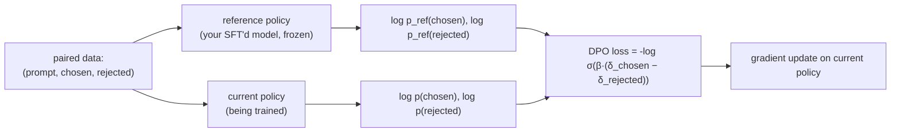

# DPO / IPO / KTO

> **Prereqs:** [SFT & Instruction Tune](./sft). DPO is what you do *after* SFT to teach preferences without the RL machinery.

## TL;DR

- **DPO (Direct Preference Optimization)** — Rafailov et al., 2023 — replaces PPO-RLHF with a closed-form classification loss on **chosen vs rejected response pairs**. No reward model, no RL, no rollouts. Same gradient direction; vastly simpler training.
- The DPO loss derives from the same Bradley-Terry preference model RLHF uses, but with the reward function *eliminated analytically* — the policy is its own implicit reward model.
- **IPO (Identity Preference Optimization)** — Azar et al., 2023 — a regularization fix for DPO that prevents over-optimization when preference data is noisy or near-tied.
- **KTO (Kahneman-Tversky Optimization)** — ContextualAI, 2024 — uses a single thumbs-up / thumbs-down label per response (no pairs needed). Closer to real production feedback signal.
- For 2026 production: DPO is the default for paired-preference data; KTO when you only have unary feedback. IPO and other variants come up when DPO drifts.

## Why this matters

PPO-RLHF (2022 GPT-3.5 / GPT-4 era) requires rollout collection, a separate reward model, and PPO's complex training loop with KL penalties. DPO collapses this into a single supervised loss — same idea, ~10× simpler infrastructure. **Almost every open-model post-training pipeline in 2023–2026 uses DPO or a variant** because the engineering cost of PPO-RLHF was prohibitive for any team without an RL infra group. Knowing DPO is the price of admission for any post-training conversation today.

## Mental model



The model trains to make its **log-probability ratio** of chosen-vs-rejected larger relative to the reference policy. No reward model, no sampling — just two forward passes per training example.

## Concrete walkthrough

### The DPO loss

Given a prompt $x$, a chosen response $y_w$ ("winner"), a rejected response $y_l$ ("loser"), and a frozen reference policy $\pi_\text{ref}$ (typically your SFT'd model), the DPO loss is:

$$
\mathcal{L}_\text{DPO} = -\log \sigma\left( \beta \cdot \left[ \log \frac{\pi_\theta(y_w | x)}{\pi_\text{ref}(y_w | x)} - \log \frac{\pi_\theta(y_l | x)}{\pi_\text{ref}(y_l | x)} \right] \right)
$$

In words:
- Compute the ratio of the current policy's probability to the reference policy's probability for *both* the chosen and rejected response.
- Take the difference of those ratios.
- Apply a sigmoid (Bradley-Terry → binary classification).
- Negative log-likelihood as the loss.

The hyperparameter $\beta$ controls how much the policy is allowed to deviate from the reference. Typical values: 0.1–0.5. Higher β = stay closer to reference (less risk, less gain); lower β = move further (more risk, more reward).

### Why this works (intuition)

The DPO paper proves: if you set up the standard RLHF objective (maximize reward subject to KL constraint vs reference) and *analytically eliminate* the reward function from the optimal policy expression, you get exactly the loss above. **The policy itself, divided by the reference, is the implicit reward model.**

The practical consequence: training the policy with this loss is equivalent to training it with the optimal RLHF reward — but without ever sampling from the policy or training a separate reward model. **Everything is offline supervised learning.**

### The training loop

```python
from torch.nn.functional import logsigmoid

def dpo_loss(model, ref_model, prompts, chosen, rejected, beta=0.1):
    """Compute DPO loss on a batch of preference pairs."""
    # Two forward passes through the current policy
    chosen_logits = model(prompts + chosen).logits
    rejected_logits = model(prompts + rejected).logits

    # Two forward passes through the reference (no grad)
    with torch.no_grad():
        chosen_logits_ref = ref_model(prompts + chosen).logits
        rejected_logits_ref = ref_model(prompts + rejected).logits

    # Sum log-probs over the response tokens
    chosen_logps = sum_token_logps(chosen_logits, chosen)
    rejected_logps = sum_token_logps(rejected_logits, rejected)
    chosen_logps_ref = sum_token_logps(chosen_logits_ref, chosen)
    rejected_logps_ref = sum_token_logps(rejected_logits_ref, rejected)

    # The DPO loss
    pi_logratio = chosen_logps - rejected_logps
    ref_logratio = chosen_logps_ref - rejected_logps_ref
    return -logsigmoid(beta * (pi_logratio - ref_logratio)).mean()

# Train loop
for batch in preference_dataloader:
    loss = dpo_loss(model, ref_model, batch.prompts, batch.chosen, batch.rejected)
    loss.backward()
    optimizer.step()
```

That's the entire training loop. Each example needs **4 forward passes** (chosen + rejected, current + ref). With smart caching of the ref-model passes (since the ref doesn't change), you can pre-compute reference log-probs once and store them, halving training compute.

### Hyperparameters that matter

| Knob | Default | Notes |
|---|---|---|
| `β` | 0.1 | Higher = closer to ref (less divergence). Tune on eval. |
| Learning rate | 1e-7 to 5e-7 | Way smaller than SFT. DPO is delicate. |
| Number of epochs | 1–3 | More is usually worse. DPO over-fits preference data fast. |
| Batch size | 32–256 (preference pairs) | Smaller than SFT batches because each pair is two sequences. |

The most common DPO failure mode: **over-optimization**. With β too low or too many epochs, the policy drifts so far from the reference that it generates pathological responses that satisfy the preference data but are bad in general. **Always evaluate on held-out preference pairs *and* on general benchmarks (MMLU, etc.); both should improve or stay flat. If MMLU drops, β is too low or training too long.**

### IPO — the regularization fix

IPO (Identity Preference Optimization, Azar et al., 2023) adds a square-loss-shaped regularizer that fights the over-optimization tendency. The math is similar but the loss penalizes large `log π / π_ref` ratios beyond what the data supports.

In practice, IPO matters most when:
- Preference data is noisy (annotators disagree).
- Many "near-tie" pairs (chosen barely beats rejected).
- The base model is already strong (less room to grow).

For most tasks, DPO works well. Reach for IPO when DPO is over-fitting on your eval.

### KTO — the no-pair version

KTO (Kahneman-Tversky Optimization, ContextualAI 2024) uses **unary feedback**: one response, one label (good/bad). No pairs needed.

The loss derives from prospect theory (loss aversion); it treats the cost of a "bad" response as proportionally larger than the gain of a "good" one. Training-wise, it looks similar to DPO but each example contributes one term, not two:

```python
# Unary preference: (prompt, response, label∈{good, bad})
if label == 'good':
    loss = -logsigmoid(β · (logp - logp_ref) - λ_good)
else:
    loss = -logsigmoid(λ_bad - β · (logp - logp_ref))
```

KTO is **the right choice when your production feedback is unary** — thumbs-up/down, click vs no-click, success vs failure. You don't have to construct artificial pairs from production logs. This makes KTO compelling for product-feedback-driven post-training.

### What DPO replaced and why

The 2022-era post-training stack:

1. SFT
2. Train a reward model (a separate transformer that scores responses).
3. PPO-RLHF: sample from policy → score with reward model → PPO step → repeat. Includes KL penalty against SFT model.

The 2023+ DPO stack:

1. SFT
2. DPO on preference pairs.

That's it. No reward model, no rollouts, no RL infrastructure. **Same paper-level results on standard benchmarks.** The simplification was so dramatic that within a year of DPO's release, most open-source post-training pipelines (Llama-3, Mistral, Qwen 2, DeepSeek series) had switched.

PPO-RLHF still has uses — when reward signal is too sparse or non-verifiable for offline preference data — but for "make the model prefer chosen over rejected" workflows, DPO won decisively.

### And then GRPO came along

For *reasoning* workloads (math, code, formal logic), DPO has limits — it works on the response level, not on intermediate reasoning steps. **GRPO** (DeepSeek-R1's recipe — see [GRPO & RL Reasoning](./grpo-reasoning)) brings RL back specifically for verifiable-reward reasoning. The 2026 picture:

- **General preferences** (helpfulness, style, safety) → DPO.
- **Verifiable rewards** (math, code, exact answers) → GRPO.
- Most production stacks use both: DPO for chat polish, GRPO for reasoning power.

## Run it in your browser — DPO loss simulator

<RunInBrowser
  description="Compute the DPO loss for synthetic logprobs; see how β and the policy-vs-reference gap interact."
  code={`import math

def sigmoid(x): return 1 / (1 + math.exp(-x))

def dpo_loss(logp_w, logp_l, logp_w_ref, logp_l_ref, beta):
    """Single-pair DPO loss."""
    pi_logratio  = logp_w - logp_l
    ref_logratio = logp_w_ref - logp_l_ref
    z = beta * (pi_logratio - ref_logratio)
    return -math.log(sigmoid(z))

# Imagine a training example (pseudo log-probs)
# Reference: chosen at -8.5, rejected at -8.6 (small preference)
logp_w_ref, logp_l_ref = -8.5, -8.6

# How does training change the loss as the policy moves?
print(f"{'policy gap':>12} {'β=0.05':>10} {'β=0.1':>10} {'β=0.5':>10} {'β=1.0':>10}")
print('-' * 60)
for delta in (-0.5, 0.0, 0.2, 0.5, 1.0, 2.0, 5.0):
    # Policy: chosen has gap=delta vs reference; rejected unchanged
    logp_w = logp_w_ref + delta
    logp_l = logp_l_ref
    row = []
    for b in (0.05, 0.1, 0.5, 1.0):
        L = dpo_loss(logp_w, logp_l, logp_w_ref, logp_l_ref, b)
        row.append(f'{L:.3f}')
    print(f"{delta:>+11.2f} " + " ".join(f"{x:>10}" for x in row))

print()
print("β=0.1: loss decreases steadily as policy preference grows.")
print("β=0.5: loss saturates faster — strong push at small gaps, plateau at large.")
print("β=1.0: any large gap quickly minimizes the loss → less room to overshoot.")
print()
print("Production typical: β = 0.1. Tune on eval; the curve below is why.")
`}
/>

The output shape — loss decreasing as the policy's preference gap grows, faster for higher β — is the entire DPO training dynamic in miniature.

## Quick check

<FillIn
  prompt="The 2024 preference-optimization variant that uses unary thumbs-up/thumbs-down feedback instead of paired chosen-vs-rejected data:"
  answer="KTO"
  accept={["Kahneman-Tversky Optimization"]}
  hint="Three letters; named after a Nobel Prize–winning psychology pair."
  explanation="KTO (Kahneman-Tversky Optimization) replaces the (chosen, rejected) pair requirement with single (response, label) examples, where label is good/bad. Useful when production feedback is naturally unary (👍/👎, click/no-click)."
/>

<Quiz
  question="A team running DPO sees their model improving on the preference benchmark but regressing on MMLU by 4 points. Most likely cause:"
  options={[
    'They need more training data.',
    'β is too low or training too long — the policy is over-optimizing on preference data and drifting from the SFT distribution. Raise β, train fewer epochs, consider IPO.',
    'They should switch to PPO-RLHF.',
    'Their preference data is biased.',
  ]}
  answer={1}
  explanation={`The textbook DPO over-optimization symptom: gains on the preference eval, regression on general capability. The fix is exactly what β controls — it's the implicit KL regularizer. Try β=0.3 instead of 0.1; train 1 epoch instead of 3; or switch to IPO whose square-loss term explicitly fights this drift. PPO-RLHF would have the same problem with the same fix (KL coefficient).`}
/>

## Key takeaways

1. **DPO replaced PPO-RLHF** as the post-training default. No reward model, no rollouts, no RL.
2. **The loss is closed-form**: a sigmoid over the difference of policy-vs-reference log-ratios for chosen and rejected.
3. **β is the KL regularizer.** Too low → over-optimization (good on preference, bad on general capability). Tune on held-out eval.
4. **IPO regularizes DPO** for noisy / near-tied preference data. **KTO uses unary feedback** instead of pairs.
5. **DPO + GRPO is the 2026 production combo.** DPO for general preferences; GRPO for verifiable-reward reasoning.

## Go deeper

<Resources
  items={[
    { kind: 'paper', href: 'https://arxiv.org/abs/2305.18290', title: 'Direct Preference Optimization: Your Language Model is Secretly a Reward Model', author: 'Rafailov et al., 2023', note: 'The DPO paper. Section 4 has the elegant derivation eliminating the reward model.' },
    { kind: 'paper', href: 'https://arxiv.org/abs/2310.12036', title: 'A General Theoretical Paradigm to Understand Learning from Human Preferences (IPO)', author: 'Azar et al., 2023', note: 'IPO + the theory of why DPO over-optimizes. Section 5 has the regularizer derivation.' },
    { kind: 'paper', href: 'https://arxiv.org/abs/2402.01306', title: 'KTO: Model Alignment as Prospect Theoretic Optimization', author: 'Ethayarajh et al., 2024', note: 'KTO derives from prospect theory; section 4 has the unary loss formulation.' },
    { kind: 'blog', href: 'https://huggingface.co/blog/dpo-trl', title: 'Hugging Face — DPO with TRL', note: 'Practitioner walkthrough including hyperparameter recipes.' },
    { kind: 'docs', href: 'https://huggingface.co/docs/trl/main/en/dpo_trainer', title: 'TRL — DPO Trainer', note: 'The de facto open-source DPO trainer. Read the source for production-grade implementation details.' },
    { kind: 'repo', href: 'https://github.com/eric-mitchell/direct-preference-optimization', title: 'eric-mitchell/direct-preference-optimization', note: 'Reference impl from the paper authors. Cleanest small DPO codebase.' },
    { kind: 'repo', href: 'https://github.com/huggingface/trl', title: 'huggingface/trl', note: 'Production-grade DPO + KTO + IPO + ORPO + more. The post-training swiss army knife.' },
  ]}
/>

<LessonComplete />
