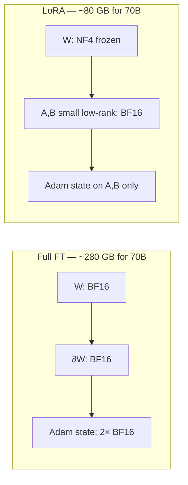

# LoRA, QLoRA & DoRA

<Mode is="learn">

In a managed cloud environment, "fine-tune the model" used to mean: copy the weights, change all 70 billion of them, write back a 280 GB checkpoint that's exactly the same shape as the original but slightly different. One job per customer. One copy per use case. The economics broke at three customers, never mind a thousand.

<Term name="lora">LoRA</Term> showed that almost none of those 70 billion weights actually need to move. The change a fine-tune induces is **low rank** — it can be expressed as the product of two thin matrices, `A · B`, where `A` is `(d × r)` and `B` is `(r × d)` with `r` somewhere around 16. Train those two small matrices, freeze everything else, and you've fine-tuned the model. Storage drops 100×. Optimizer state drops with it.

<Term name="qlora">QLoRA</Term> went further: keep the frozen base in 4 bits — <Term name="nf4">NF4</Term>, a quantization specifically designed for normally-distributed weights — and the LoRA adapters in <Term name="bf16">bfloat16</Term>. Suddenly Llama-3-70B fine-tuning fits on a single 80 GB H100. The user-surface API is still `model = get_peft_model(model, config); trainer.train()`. The 4-bit kernels, the dequant-on-the-fly during forward, the paged optimizer that survives sharp memory spikes — none of it is in the user code.

This lesson is the math, the memory budget, and what the abstraction is hiding.

## TL;DR

- **LoRA** trains two small low-rank matrices `A` and `B` instead of the full weight `W`. Update is `W + (B·A) × scale`. Storage and gradient memory drop ~100×.
- **QLoRA** keeps the base model's weights frozen and quantized to **NF4** (4-bit), only LoRA adapters are FP16. This is what lets you fine-tune **Llama-3-70B on a single 80 GB GPU**.
- **DoRA** decomposes weight updates into magnitude + direction. Closes most of the gap between LoRA and full fine-tuning at small additional cost.
- Production serving uses **multi-LoRA** (S-LoRA, vLLM `--enable-lora`) — one base model, many tenant-specific adapters hot-swapped per request.
- **Rule of thumb:** rank `r=16, alpha=32` is the sane default. Bump `r` to 64 only if you can't fit the task otherwise.

## What LoRA actually does

For each linear layer `y = W·x` in the base model, freeze `W` and add a learnable side-path:

$$
y = W x + \alpha/r \cdot B A x
$$

where `A ∈ ℝ^(r × d_in)` is initialized to small random values, `B ∈ ℝ^(d_out × r)` is initialized to zero, and `r` (the rank) is small — typically 8 to 64. At step zero `B = 0`, so the side-path output is zero and the model is bit-identical to the base. As training proceeds, the model learns small `A` and `B` matrices that combine to the update the task needs.

The win: a `(4096 × 4096)` weight has 16.8M parameters. Its rank-16 LoRA replacement is `(4096 × 16) + (16 × 4096) = 131K` parameters — **128× fewer**. Across all 7 attention+MLP projections of a 7B model, you go from ~7B trainable parameters to ~10M.

This matters in three places that compound:

1. **Trainable parameters** drop ~100× → less memory for the parameters themselves.
2. **Optimizer state** drops with them. AdamW stores 2 moments per param; that's 2× the parameter cost in BF16 plus an FP32 master copy → 8 bytes per trainable param. For a 7B model: **56 GB → 80 MB**.
3. **Backward-pass activations** for the frozen base don't need to be retained for gradient computation — only the activations along the LoRA path.

The result: fine-tuning that needed 4× H100s now runs on a Colab T4.

## Mental model



Forward pass: `output = W·x + alpha/r × B·A·x`. Backward pass touches only `A` and `B` — `W` has no gradient and no optimizer state. That's where the 100× memory reduction comes from.

## QLoRA — the 4-bit base trick

QLoRA's contribution: the frozen base doesn't need to be in BF16. Quantize it to NF4 (4 bits per weight, ~7× less than BF16) and dequantize on the fly during the forward pass. The LoRA adapters stay in BF16 — they're tiny anyway, and the gradient signal needs the precision.

Three QLoRA tricks compound:

- **NF4** — a 4-bit datatype whose quantization levels are placed at quantiles of a unit normal distribution. LLM weights are roughly normal; NF4 packs them with optimal information-per-bit. Beats naive INT4 by ~0.3 bits/param of effective precision.
- **Double quantization** — even the per-block scale factors get quantized. Saves another ~0.4 bits per param.
- **Paged optimizers** — when the optimizer's memory footprint spikes (e.g., on long sequences), CUDA's unified memory pages it out to host RAM and back. Survives transient OOMs that would otherwise kill the run.

Net effect: a 70B model that wouldn't fit even at BF16 inference (~140 GB) becomes trainable on one 80 GB H100. The QLoRA paper's table 1 is the receipt.

## Concrete walkthrough — fine-tuning Llama-3.2-1B with QLoRA

```python
from transformers import AutoModelForCausalLM, AutoTokenizer, BitsAndBytesConfig
from peft import LoraConfig, get_peft_model, prepare_model_for_kbit_training
from trl import SFTTrainer, SFTConfig

# 1. Load the base model in NF4 (4-bit). Weights are frozen.
bnb = BitsAndBytesConfig(
    load_in_4bit=True,
    bnb_4bit_quant_type="nf4",       # NF4 = NormalFloat 4-bit, info-theoretically optimal for weights
    bnb_4bit_compute_dtype="bfloat16",
    bnb_4bit_use_double_quant=True,  # quantize the quantization constants too — saves another ~0.4 bits/param
)
model = AutoModelForCausalLM.from_pretrained(
    "meta-llama/Llama-3.2-1B-Instruct",
    quantization_config=bnb,
    device_map="auto",
)
model = prepare_model_for_kbit_training(model)

# 2. Wrap with LoRA adapters on attention + MLP projections.
peft_cfg = LoraConfig(
    r=16,                                         # rank — the most important knob
    lora_alpha=32,                                # scaling: alpha/r = 2
    target_modules=["q_proj", "k_proj", "v_proj", "o_proj", "gate_proj", "up_proj", "down_proj"],
    lora_dropout=0.05,
    bias="none",
    task_type="CAUSAL_LM",
)
model = get_peft_model(model, peft_cfg)
model.print_trainable_parameters()
# trainable params: 11,272,192 || all params: 1,247,086,592 || trainable%: 0.90

# 3. Train. Standard SFT on instruction data.
tok = AutoTokenizer.from_pretrained("meta-llama/Llama-3.2-1B-Instruct")
trainer = SFTTrainer(
    model=model,
    tokenizer=tok,
    train_dataset=load_dataset("yahma/alpaca-cleaned", split="train[:5000]"),
    args=SFTConfig(
        output_dir="./out",
        num_train_epochs=1,
        per_device_train_batch_size=4,
        gradient_accumulation_steps=4,
        learning_rate=2e-4,                        # higher than full FT — LoRA likes ~1e-4 to 5e-4
        bf16=True,
        max_seq_length=1024,
    ),
)
trainer.train()

# 4. Save the *adapter only* (~50 MB), not the full model.
model.save_pretrained("./my-adapter")
```

The whole thing fits in **~6 GB of GPU RAM** for a 1B model — Colab's free T4 handles it comfortably. Scale to 7B on a Colab Pro A100 (40 GB), 70B on an H100 (80 GB).

What `get_peft_model` did: walked the module tree, replaced every `nn.Linear` matching `target_modules` with a `LoRALinear` wrapper that holds the frozen NF4 weight plus the BF16 `A, B` matrices. What `prepare_model_for_kbit_training` did: cast the input embeddings to FP32 for stability, enable gradient checkpointing, and turn off dropout on the frozen path. None of it is in the user code; all of it is in `peft`.

## DoRA — when LoRA's quality isn't enough

<Term name="dora">DoRA</Term> (Liu et al., 2024) decomposes each weight update into magnitude (a per-output-channel scalar) and direction (a unit-norm matrix), then trains both separately. The magnitude update captures changes LoRA can't easily express; the direction update is itself low-rank.

Training cost is ~5% over LoRA. Quality typically lands halfway between LoRA and full fine-tuning on benchmarks where LoRA underperforms. Drop-in replacement in `peft` (`use_dora=True` in `LoraConfig`).

## Multi-LoRA serving — the unsung win

The bigger production unlock is *serving*. A LoRA adapter is ~50 MB. A full fine-tuned model is ~14 GB. Storage matters, but throughput matters more.

S-LoRA (Sheng et al., 2023) and vLLM's `--enable-lora` flag let you keep one base model in GPU memory and dynamically swap adapters per request — the GEMM kernels apply the active adapter's `A, B` on the fly. **One base model, thousands of tenants.**

```python
from vllm import LLM, SamplingParams
from vllm.lora.request import LoRARequest

llm = LLM(model="meta-llama/Llama-3.2-3B", enable_lora=True)
# Per-request adapter selection
lora_req = LoRARequest("customer-42", 1, "/adapters/cust42")
out = llm.generate(prompt, sampling_params, lora_request=lora_req)
```

This is what makes per-tenant fine-tuning economically real. 1000 customers × 50 MB of adapter = 50 GB on disk. 1000 customers × 14 GB of full model = 14 TB. The math doesn't even need to be debated.

## Run it in your browser

In-browser arithmetic for "what fits where":

<RunInBrowser
  description="Memory budget calculator for QLoRA fine-tuning. Edit the model size and GPU."
  code={`def qlora_memory(params_b, ctx, batch, rank=16, target='qkvo+ffn'):
    """QLoRA memory in GB for a Llama-shaped model: NF4 frozen base + BF16 adapters.
    Assumes FlashAttention (so attention scores aren't materialized) and AdamW
    on adapter params only (frozen base has no optimizer state)."""
    # Llama-family shapes — use a lookup so the demo doesn't depend on a guess.
    SHAPES = {
        1:  dict(d=2048, d_ffn=8192,  L=22),
        3:  dict(d=3072, d_ffn=8192,  L=28),
        7:  dict(d=4096, d_ffn=11008, L=32),
        8:  dict(d=4096, d_ffn=14336, L=32),
        13: dict(d=5120, d_ffn=13824, L=40),
        70: dict(d=8192, d_ffn=28672, L=80),
    }
    s = SHAPES.get(params_b, SHAPES[7])
    d, d_ffn, L = s['d'], s['d_ffn'], s['L']

    # 1) Frozen base at NF4 = 4 bits/param = 0.5 bytes/param.
    base_b = params_b * 1e9 * 0.5

    # 2) LoRA adapter params (BF16). Each adapted projection contributes
    #    rank * (in + out) params. QKVO are square (d->d); FFN has 3 linears
    #    that touch d and d_ffn.
    qkvo = 4 * rank * (d + d) * L                        # Q, K, V, O (4 per layer)
    ffn  = 3 * rank * (d + d_ffn) * L if 'ffn' in target else 0  # gate, up, down
    lora_params = qkvo + ffn
    lora_b = lora_params * 2

    # 3) AdamW on adapters only: m + v in BF16 (4 B) + FP32 master (4 B) = 8 B/param.
    optim_b = lora_params * 8

    # 4) Activations (Korthikanti 34*s*b*h, FlashAttention assumed; no checkpointing).
    act_b = 34 * ctx * batch * d * L * 2

    GB = 1024**3
    total_b = base_b + lora_b + optim_b + act_b
    return base_b/GB, lora_b/GB, optim_b/GB, act_b/GB, total_b/GB

print(f"{'config':<26} {'base':>7} {'lora':>7} {'optim':>7} {'act':>7} {'total':>8}")
print('-' * 66)
for params, ctx, bs in [(1, 1024, 4), (7, 2048, 2), (13, 2048, 1), (70, 4096, 1)]:
    base, lora, optim, act, total = qlora_memory(params, ctx, bs)
    print(f"{params:>3}B  ctx={ctx:<5} bs={bs:<3}    {base:>5.1f} G {lora:>5.2f} G "
          f"{optim:>5.2f} G {act:>5.1f} G {total:>6.1f} G")
`}
/>

## Quick check

<Quiz
  question="You QLoRA-train an adapter on top of Llama-3-8B for a customer's domain, and you want to serve 50 customers — each with their own adapter — from a single endpoint. What's the right architecture?"
  options={[
    'Deploy 50 fine-tuned models behind a load balancer.',
    'Merge each adapter into the base model and serve 50 GGUFs.',
    'Run vLLM with `--enable-lora`, hot-swap adapters per request.',
    'Use one adapter trained on all 50 customers\' data jointly.',
  ]}
  answer={2}
  explanation="vLLM's multi-LoRA support (and S-LoRA more generally) lets you keep one base model in GPU memory and dynamically swap adapters per request. 50 adapters = ~2.5 GB; 50 fine-tuned models = ~1 TB. The math doesn't even need to be debated."
/>

## Key takeaways

1. **NF4 is information-theoretically optimal** for weight quantization (assumes weights are normally distributed — they roughly are). This is what makes QLoRA's "4-bit base + BF16 adapter" actually work.
2. **`r=16, alpha=32` is the default.** Don't tune the rank as your first experiment — tune the data.
3. **Target the right modules.** All 7 attention+MLP projections is the standard. Just `q_proj, v_proj` is faster and underperforms.
4. **Multi-LoRA serving is the real production unlock**, not training. One base model, many tenants.
5. **DoRA when you need quality.** ~5% extra training cost, often closes the gap with full FT.

## Go deeper

<Resources
  items={[
    { kind: 'paper', href: 'https://arxiv.org/abs/2106.09685', title: 'LoRA: Low-Rank Adaptation of Large Language Models', author: 'Hu et al., 2021', note: 'The original. Short, clear, every modern PEFT paper builds on this.' },
    { kind: 'paper', href: 'https://arxiv.org/abs/2305.14314', title: 'QLoRA: Efficient Finetuning of Quantized LLMs', author: 'Dettmers et al., 2023', note: 'Introduces NF4, double-quantization, paged optimizers. Required reading.' },
    { kind: 'paper', href: 'https://arxiv.org/abs/2402.09353', title: 'DoRA: Weight-Decomposed Low-Rank Adaptation', author: 'Liu et al., 2024', note: 'Decomposes weight update into magnitude + direction. Often closes the LoRA→full-FT gap.' },
    { kind: 'paper', href: 'https://arxiv.org/abs/2311.03285', title: 'S-LoRA: Serving Thousands of Concurrent LoRA Adapters', author: 'Sheng et al., 2023', note: 'How multi-LoRA serving actually works in production.' },
    { kind: 'docs', href: 'https://huggingface.co/docs/peft/index', title: 'PEFT documentation', note: 'The library you\'ll use; their tutorials are quite good.' },
    { kind: 'video', href: 'https://www.youtube.com/watch?v=l69ov6b7vw0', title: 'LoRA & QLoRA explained', author: 'Sebastian Raschka', note: 'Best 30-min intuitive walkthrough.' },
  ]}
/>

</Mode>

<Mode is="reference">

## TL;DR

- **LoRA** trains two small low-rank matrices `A` and `B` instead of the full weight `W`. Update is `W + (B·A) × scale`. Storage and gradient memory drop ~100×.
- **QLoRA** keeps the base model's weights frozen and quantized to **NF4** (4-bit), only LoRA adapters are FP16. This is what lets you fine-tune **Llama-3-70B on a single 80 GB GPU**.
- **DoRA** decomposes weight updates into magnitude + direction. Closes most of the gap between LoRA and full fine-tuning at small additional cost.
- Production serving uses **multi-LoRA** (S-LoRA, vLLM `--enable-lora`) — one base model, many tenant-specific adapters hot-swapped per request.
- **Rule of thumb:** rank `r=16, alpha=32` is the sane default. Bump `r` to 64 only if you can't fit the task otherwise.

## Why this matters

Full fine-tuning of a 70B model needs ~280 GB of GPU memory just for weights + optimizer state in BF16. PEFT (Parameter-Efficient Fine-Tuning) lets you do the same job with a 24 GB consumer GPU for 7B, and a single 80 GB H100 for 70B. It's the technique behind every "I fine-tuned a model on my domain" blog post since 2023.

But it's not just about cheap fine-tuning — **multi-LoRA serving** is what makes per-customer fine-tuning economically viable. One base model + 1000 adapters fits where 1000 fine-tuned models wouldn't.

## Mental model


Forward pass: `output = W·x + alpha/r × B·A·x`. Backward pass touches only `A` and `B` — `W` has no gradient and no optimizer state. That's where the 100× memory reduction comes from.

## Concrete walkthrough — fine-tuning Llama-3.2-1B with QLoRA

```python
from transformers import AutoModelForCausalLM, AutoTokenizer, BitsAndBytesConfig
from peft import LoraConfig, get_peft_model, prepare_model_for_kbit_training
from trl import SFTTrainer, SFTConfig

# 1. Load the base model in NF4 (4-bit). Weights are frozen.
bnb = BitsAndBytesConfig(
    load_in_4bit=True,
    bnb_4bit_quant_type="nf4",       # NF4 = NormalFloat 4-bit, info-theoretically optimal for weights
    bnb_4bit_compute_dtype="bfloat16",
    bnb_4bit_use_double_quant=True,  # quantize the quantization constants too — saves another ~0.4 bits/param
)
model = AutoModelForCausalLM.from_pretrained(
    "meta-llama/Llama-3.2-1B-Instruct",
    quantization_config=bnb,
    device_map="auto",
)
model = prepare_model_for_kbit_training(model)

# 2. Wrap with LoRA adapters on attention + MLP projections.
peft_cfg = LoraConfig(
    r=16,                                         # rank — the most important knob
    lora_alpha=32,                                # scaling: alpha/r = 2
    target_modules=["q_proj", "k_proj", "v_proj", "o_proj", "gate_proj", "up_proj", "down_proj"],
    lora_dropout=0.05,
    bias="none",
    task_type="CAUSAL_LM",
)
model = get_peft_model(model, peft_cfg)
model.print_trainable_parameters()
# trainable params: 11,272,192 || all params: 1,247,086,592 || trainable%: 0.90

# 3. Train. Standard SFT on instruction data.
tok = AutoTokenizer.from_pretrained("meta-llama/Llama-3.2-1B-Instruct")
trainer = SFTTrainer(
    model=model,
    tokenizer=tok,
    train_dataset=load_dataset("yahma/alpaca-cleaned", split="train[:5000]"),
    args=SFTConfig(
        output_dir="./out",
        num_train_epochs=1,
        per_device_train_batch_size=4,
        gradient_accumulation_steps=4,
        learning_rate=2e-4,                        # higher than full FT — LoRA likes ~1e-4 to 5e-4
        bf16=True,
        max_seq_length=1024,
    ),
)
trainer.train()

# 4. Save the *adapter only* (~50 MB), not the full model.
model.save_pretrained("./my-adapter")
```

The whole thing fits in **~6 GB of GPU RAM** for a 1B model — Colab's free T4 handles it comfortably. Scale to 7B on a Colab Pro A100 (40 GB), 70B on an H100 (80 GB).

## Run it in your browser

In-browser arithmetic for "what fits where":

<RunInBrowser
  description="Memory budget calculator for QLoRA fine-tuning. Edit the model size and GPU."
  code={`def qlora_memory(params_b, ctx, batch, rank=16, target='qkvo+ffn'):
    """QLoRA memory in GB for a Llama-shaped model: NF4 frozen base + BF16 adapters.
    Assumes FlashAttention (so attention scores aren't materialized) and AdamW
    on adapter params only (frozen base has no optimizer state)."""
    # Llama-family shapes — use a lookup so the demo doesn't depend on a guess.
    SHAPES = {
        1:  dict(d=2048, d_ffn=8192,  L=22),
        3:  dict(d=3072, d_ffn=8192,  L=28),
        7:  dict(d=4096, d_ffn=11008, L=32),
        8:  dict(d=4096, d_ffn=14336, L=32),
        13: dict(d=5120, d_ffn=13824, L=40),
        70: dict(d=8192, d_ffn=28672, L=80),
    }
    s = SHAPES.get(params_b, SHAPES[7])
    d, d_ffn, L = s['d'], s['d_ffn'], s['L']

    # 1) Frozen base at NF4 = 4 bits/param = 0.5 bytes/param.
    base_b = params_b * 1e9 * 0.5

    # 2) LoRA adapter params (BF16). Each adapted projection contributes
    #    rank * (in + out) params. QKVO are square (d->d); FFN has 3 linears
    #    that touch d and d_ffn.
    qkvo = 4 * rank * (d + d) * L                        # Q, K, V, O (4 per layer)
    ffn  = 3 * rank * (d + d_ffn) * L if 'ffn' in target else 0  # gate, up, down
    lora_params = qkvo + ffn
    lora_b = lora_params * 2

    # 3) AdamW on adapters only: m + v in BF16 (4 B) + FP32 master (4 B) = 8 B/param.
    optim_b = lora_params * 8

    # 4) Activations (Korthikanti 34*s*b*h, FlashAttention assumed; no checkpointing).
    act_b = 34 * ctx * batch * d * L * 2

    GB = 1024**3
    total_b = base_b + lora_b + optim_b + act_b
    return base_b/GB, lora_b/GB, optim_b/GB, act_b/GB, total_b/GB

print(f"{'config':<26} {'base':>7} {'lora':>7} {'optim':>7} {'act':>7} {'total':>8}")
print('-' * 66)
for params, ctx, bs in [(1, 1024, 4), (7, 2048, 2), (13, 2048, 1), (70, 4096, 1)]:
    base, lora, optim, act, total = qlora_memory(params, ctx, bs)
    print(f"{params:>3}B  ctx={ctx:<5} bs={bs:<3}    {base:>5.1f} G {lora:>5.2f} G "
          f"{optim:>5.2f} G {act:>5.1f} G {total:>6.1f} G")
`}
/>

## Quick check

<Quiz
  question="You QLoRA-train an adapter on top of Llama-3-8B for a customer's domain, and you want to serve 50 customers — each with their own adapter — from a single endpoint. What's the right architecture?"
  options={[
    'Deploy 50 fine-tuned models behind a load balancer.',
    'Merge each adapter into the base model and serve 50 GGUFs.',
    'Run vLLM with `--enable-lora`, hot-swap adapters per request.',
    'Use one adapter trained on all 50 customers\' data jointly.',
  ]}
  answer={2}
  explanation="vLLM's multi-LoRA support (and S-LoRA more generally) lets you keep one base model in GPU memory and dynamically swap adapters per request. 50 adapters = ~2.5 GB; 50 fine-tuned models = ~1 TB. The math doesn't even need to be debated."
/>

## Key takeaways

1. **NF4 is information-theoretically optimal** for weight quantization (assumes weights are normally distributed — they roughly are). This is what makes QLoRA's "4-bit base + BF16 adapter" actually work.
2. **`r=16, alpha=32` is the default.** Don't tune the rank as your first experiment — tune the data.
3. **Target the right modules.** All 7 attention+MLP projections is the standard. Just `q_proj, v_proj` is faster and underperforms.
4. **Multi-LoRA serving is the real production unlock**, not training. One base model, many tenants.
5. **DoRA when you need quality.** ~5% extra training cost, often closes the gap with full FT.

## Go deeper

<Resources
  items={[
    { kind: 'paper', href: 'https://arxiv.org/abs/2106.09685', title: 'LoRA: Low-Rank Adaptation of Large Language Models', author: 'Hu et al., 2021', note: 'The original. Short, clear, every modern PEFT paper builds on this.' },
    { kind: 'paper', href: 'https://arxiv.org/abs/2305.14314', title: 'QLoRA: Efficient Finetuning of Quantized LLMs', author: 'Dettmers et al., 2023', note: 'Introduces NF4, double-quantization, paged optimizers. Required reading.' },
    { kind: 'paper', href: 'https://arxiv.org/abs/2402.09353', title: 'DoRA: Weight-Decomposed Low-Rank Adaptation', author: 'Liu et al., 2024', note: 'Decomposes weight update into magnitude + direction. Often closes the LoRA→full-FT gap.' },
    { kind: 'paper', href: 'https://arxiv.org/abs/2311.03285', title: 'S-LoRA: Serving Thousands of Concurrent LoRA Adapters', author: 'Sheng et al., 2023', note: 'How multi-LoRA serving actually works in production.' },
    { kind: 'docs', href: 'https://huggingface.co/docs/peft/index', title: 'PEFT documentation', note: 'The library you\'ll use; their tutorials are quite good.' },
    { kind: 'video', href: 'https://www.youtube.com/watch?v=l69ov6b7vw0', title: 'LoRA & QLoRA explained', author: 'Sebastian Raschka', note: 'Best 30-min intuitive walkthrough.' },
  ]}
/>

</Mode>

<LessonComplete />
