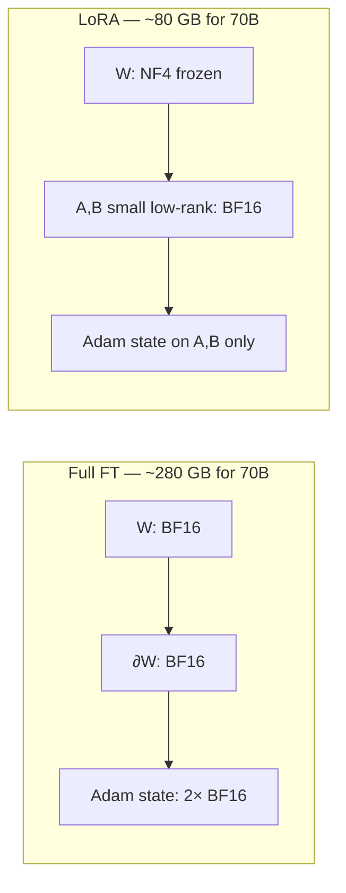

# LoRA, QLoRA & DoRA

## TL;DR

- **LoRA** trains two small low-rank matrices `A` and `B` instead of the full weight `W`. Update is `W + (B·A) × scale`. Storage and gradient memory drop ~100×.
- **QLoRA** keeps the base model's weights frozen and quantized to **NF4** (4-bit), only LoRA adapters are FP16. This is what lets you fine-tune **Llama-3-70B on a single 80 GB GPU**.
- **DoRA** decomposes weight updates into magnitude + direction. Closes most of the gap between LoRA and full fine-tuning at small additional cost.
- Production serving uses **multi-LoRA** (S-LoRA, vLLM `--enable-lora`) — one base model, many tenant-specific adapters hot-swapped per request.
- **Rule of thumb:** rank `r=16, alpha=32` is the sane default. Bump `r` to 64 only if you can't fit the task otherwise.

## Why this matters

Full fine-tuning of a 70B model needs ~280 GB of GPU memory just for weights + optimizer state in BF16. PEFT (Parameter-Efficient Fine-Tuning) lets you do the same job with a 24 GB consumer GPU for 7B, and a single 80 GB H100 for 70B. It's the technique behind every "I fine-tuned a model on my domain" blog post since 2023.

But it's not just about cheap fine-tuning — **multi-LoRA serving** is what makes per-customer fine-tuning economically viable. One base model + 1000 adapters fits where 1000 fine-tuned models wouldn't.

## Mental model



Forward pass: `output = W·x + alpha/r × B·A·x`. Backward pass touches only `A` and `B` — `W` has no gradient and no optimizer state. That's where the 100× memory reduction comes from.

## Concrete walkthrough — fine-tuning Llama-3.2-1B with QLoRA

```python
from transformers import AutoModelForCausalLM, AutoTokenizer, BitsAndBytesConfig
from peft import LoraConfig, get_peft_model, prepare_model_for_kbit_training
from trl import SFTTrainer, SFTConfig

# 1. Load the base model in NF4 (4-bit). Weights are frozen.
bnb = BitsAndBytesConfig(
    load_in_4bit=True,
    bnb_4bit_quant_type="nf4",       # NF4 = NormalFloat 4-bit, info-theoretically optimal for weights
    bnb_4bit_compute_dtype="bfloat16",
    bnb_4bit_use_double_quant=True,  # quantize the quantization constants too — saves another ~0.4 bits/param
)
model = AutoModelForCausalLM.from_pretrained(
    "meta-llama/Llama-3.2-1B-Instruct",
    quantization_config=bnb,
    device_map="auto",
)
model = prepare_model_for_kbit_training(model)

# 2. Wrap with LoRA adapters on attention + MLP projections.
peft_cfg = LoraConfig(
    r=16,                                         # rank — the most important knob
    lora_alpha=32,                                # scaling: alpha/r = 2
    target_modules=["q_proj", "k_proj", "v_proj", "o_proj", "gate_proj", "up_proj", "down_proj"],
    lora_dropout=0.05,
    bias="none",
    task_type="CAUSAL_LM",
)
model = get_peft_model(model, peft_cfg)
model.print_trainable_parameters()
# trainable params: 11,272,192 || all params: 1,247,086,592 || trainable%: 0.90

# 3. Train. Standard SFT on instruction data.
tok = AutoTokenizer.from_pretrained("meta-llama/Llama-3.2-1B-Instruct")
trainer = SFTTrainer(
    model=model,
    tokenizer=tok,
    train_dataset=load_dataset("yahma/alpaca-cleaned", split="train[:5000]"),
    args=SFTConfig(
        output_dir="./out",
        num_train_epochs=1,
        per_device_train_batch_size=4,
        gradient_accumulation_steps=4,
        learning_rate=2e-4,                        # higher than full FT — LoRA likes ~1e-4 to 5e-4
        bf16=True,
        max_seq_length=1024,
    ),
)
trainer.train()

# 4. Save the *adapter only* (~50 MB), not the full model.
model.save_pretrained("./my-adapter")
```

The whole thing fits in **~6 GB of GPU RAM** for a 1B model — Colab's free T4 handles it comfortably. Scale to 7B on a Colab Pro A100 (40 GB), 70B on an H100 (80 GB).

## Run it in your browser

In-browser arithmetic for "what fits where":

<RunInBrowser
  description="Memory budget calculator for QLoRA fine-tuning. Edit the model size and GPU."
  code={`def qlora_memory_estimate(params_b, ctx, batch, gpu_gb, rank=16):
    """Rough QLoRA memory estimate in GB. Approximate; ignores cache fragmentation."""
    # Frozen base weights at NF4
    base_gb = params_b * 1e9 * 0.5 / 1024**3   # 4 bits = 0.5 bytes per param
    # LoRA adapters at BF16 — proportional to rank
    lora_params = 2 * rank * params_b * 1e9 / 4096  # rough: per linear layer of dim 4096
    lora_gb = lora_params * 2 / 1024**3
    # AdamW on adapters only — 8× the BF16 size (m, v, master copy)
    optim_gb = lora_gb * 8
    # Activations (forward) — depends on bs × ctx
    activations_gb = batch * ctx * params_b * 1e9 * 2 / 4096 / 1024**3 * 0.5
    total = base_gb + lora_gb + optim_gb + activations_gb
    return base_gb, lora_gb, optim_gb, activations_gb, total

for params, ctx, bs in [(1, 1024, 4), (7, 2048, 2), (13, 2048, 1), (70, 4096, 1)]:
    base, lora, optim, act, total = qlora_memory_estimate(params, ctx, bs, gpu_gb=80)
    print(f"{params:>3}B @ ctx={ctx} bs={bs}:  "
          f"base={base:>5.1f}  lora={lora:>4.1f}  optim={optim:>4.1f}  "
          f"act={act:>4.1f}  total≈{total:>5.1f} GB")
`}
/>

## Run it on real hardware

<ColabLink
  href="https://colab.research.google.com/github/your-github/mosaic-notebooks/blob/main/qlora.ipynb"
  description="QLoRA-tune Llama-3.2-1B-Instruct on Alpaca in ~25 min on a free T4. Save the adapter, merge it, benchmark inference."
/>

## Quick check

<Quiz
  question="You QLoRA-train an adapter on top of Llama-3-8B for a customer's domain, and you want to serve 50 customers — each with their own adapter — from a single endpoint. What's the right architecture?"
  options={[
    'Deploy 50 fine-tuned models behind a load balancer.',
    'Merge each adapter into the base model and serve 50 GGUFs.',
    'Run vLLM with `--enable-lora`, hot-swap adapters per request.',
    'Use one adapter trained on all 50 customers\' data jointly.',
  ]}
  answer={2}
  explanation="vLLM's multi-LoRA support (and S-LoRA more generally) lets you keep one base model in GPU memory and dynamically swap adapters per request. 50 adapters = ~2.5 GB; 50 fine-tuned models = ~1 TB. The math doesn't even need to be debated."
/>

## Key takeaways

1. **NF4 is information-theoretically optimal** for weight quantization (assumes weights are normally distributed — they roughly are). This is what makes QLoRA's "4-bit base + BF16 adapter" actually work.
2. **`r=16, alpha=32` is the default.** Don't tune the rank as your first experiment — tune the data.
3. **Target the right modules.** All 7 attention+MLP projections is the standard. Just `q_proj, v_proj` is faster and underperforms.
4. **Multi-LoRA serving is the real production unlock**, not training. One base model, many tenants.
5. **DoRA when you need quality.** ~5% extra training cost, often closes the gap with full FT.

## Go deeper

<Resources
  items={[
    { kind: 'paper', href: 'https://arxiv.org/abs/2106.09685', title: 'LoRA: Low-Rank Adaptation of Large Language Models', author: 'Hu et al., 2021', note: 'The original. Short, clear, every modern PEFT paper builds on this.' },
    { kind: 'paper', href: 'https://arxiv.org/abs/2305.14314', title: 'QLoRA: Efficient Finetuning of Quantized LLMs', author: 'Dettmers et al., 2023', note: 'Introduces NF4, double-quantization, paged optimizers. Required reading.' },
    { kind: 'paper', href: 'https://arxiv.org/abs/2402.09353', title: 'DoRA: Weight-Decomposed Low-Rank Adaptation', author: 'Liu et al., 2024', note: 'Decomposes weight update into magnitude + direction. Often closes the LoRA→full-FT gap.' },
    { kind: 'paper', href: 'https://arxiv.org/abs/2311.03285', title: 'S-LoRA: Serving Thousands of Concurrent LoRA Adapters', author: 'Sheng et al., 2023', note: 'How multi-LoRA serving actually works in production.' },
    { kind: 'docs', href: 'https://huggingface.co/docs/peft/index', title: 'PEFT documentation', note: 'The library you\'ll use; their tutorials are quite good.' },
    { kind: 'video', href: 'https://www.youtube.com/watch?v=l69ov6b7vw0', title: 'LoRA & QLoRA explained', author: 'Sebastian Raschka', note: 'Best 30-min intuitive walkthrough.' },
  ]}
/>

<LessonComplete />
