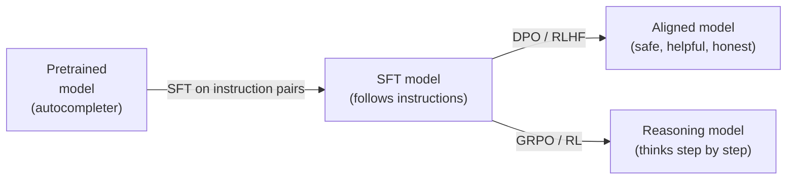

# SFT & Instruction Tuning

## TL;DR

- **Supervised Fine-Tuning (SFT)** is the first post-training step: you train on (instruction, response) pairs so the model learns to follow directions instead of just completing text.
- **Chat templates** (ChatML, Llama 3 format) wrap conversations with special tokens that delineate system/user/assistant turns. **Using the wrong template at inference = broken model.** Always match training and serving templates.
- **Prompt loss masking** zeros the loss on instruction tokens (set labels to `-100`). The model only learns to *generate* responses, not to memorize your prompts.
- **Sample packing** concatenates multiple short conversations into one sequence, eliminating padding waste. With proper attention masking, this gives 2–4× training throughput on typical chat datasets.
- Quality > quantity. 10K carefully curated examples often beats 1M noisy ones. The LIMA paper (2023) showed 1K high-quality examples suffice for strong instruction-following.

## Why this matters

A raw pretrained model is an autocompleter — it predicts the next token in internet text. It won't answer questions, follow instructions, or refuse harmful requests until you SFT it. Every chatbot, coding assistant, and AI agent starts with SFT before any preference alignment (DPO/RLHF). Get SFT wrong — wrong template, no loss masking, bad data — and every subsequent training stage inherits the damage.

## Mental model



SFT is the bridge. Without it, preference alignment has nothing to align, and RL has no base policy to improve.

## Concrete walkthrough

### 1. Chat templates — the hidden contract

Every model family defines a template that wraps conversations with special tokens. Here's what Llama 3's looks like:

```
<|begin_of_text|><|start_header_id|>system<|end_header_id|>

You are a helpful assistant.<|eot_id|><|start_header_id|>user<|end_header_id|>

What is the capital of France?<|eot_id|><|start_header_id|>assistant<|end_header_id|>

The capital of France is Paris.<|eot_id|>
```

And ChatML (used by Qwen, Mistral v0.3+):

```
<|im_start|>system
You are a helpful assistant.<|im_end|>
<|im_start|>user
What is the capital of France?<|im_end|>
<|im_start|>assistant
The capital of France is Paris.<|im_end|>
```

**The cardinal rule:** the template you train with must *exactly match* the template at inference. If you SFT with ChatML but serve with Llama 3 format, the model sees gibberish. This is the #1 debugging issue in SFT.

```python
from transformers import AutoTokenizer

tokenizer = AutoTokenizer.from_pretrained("meta-llama/Llama-3.1-8B-Instruct")
messages = [
    {"role": "system", "content": "You are a helpful assistant."},
    {"role": "user", "content": "What is the capital of France?"},
    {"role": "assistant", "content": "The capital of France is Paris."},
]
# This applies the correct template automatically:
text = tokenizer.apply_chat_template(messages, tokenize=False)
```

### 2. Prompt loss masking

Without masking, the model wastes gradient updates learning to predict the instruction tokens — tokens it will never need to generate at inference. With masking:

```python
# Simplified: mask everything except assistant responses
labels = input_ids.clone()
for i, token_id in enumerate(input_ids):
    if in_prompt_region(i):  # system + user turns
        labels[i] = -100     # CrossEntropyLoss ignores -100
# Now loss is computed ONLY on assistant tokens
```

In `trl` (the standard SFT library):

```python
from trl import SFTTrainer, SFTConfig

config = SFTConfig(
    dataset_text_field="text",
    max_seq_length=4096,
    packing=True,                    # enable sample packing
    dataset_kwargs={
        "add_special_tokens": False,  # template already has them
    },
)
```

The `SFTTrainer` handles prompt masking automatically when you provide structured message data.

### 3. Sample packing

Without packing (naive padding):
```
Seq 1: [tokens tokens tokens PAD PAD PAD PAD PAD PAD PAD]  ← 70% padding
Seq 2: [tokens tokens PAD PAD PAD PAD PAD PAD PAD PAD PAD]  ← 80% padding
Seq 3: [tokens tokens tokens tokens tokens PAD PAD PAD PAD]  ← 40% padding
```

With packing:
```
Packed: [seq1_tokens SEP seq2_tokens SEP seq3_tokens PAD]   ← 5% padding
```

The key subtlety: you must block cross-attention between packed samples using `cu_seqlens` or a block-diagonal attention mask. Without this, sample 2 attends to sample 1's tokens — a silent data leak.

### 4. The data quality ladder

| Dataset size | Quality | Typical result |
|---|---|---|
| 1K curated (LIMA-style) | Expert-written, diverse | Strong instruction-following, sometimes brittle on edge cases |
| 10K–50K (OpenHermes, Capybara) | Mix of synthetic + human | Good general-purpose chatbot |
| 100K–500K (UltraChat, SlimOrca) | Mostly synthetic, filtered | Robust but can be generic |
| 1M+ (WildChat, ShareGPT dumps) | Noisy, diverse | Volume helps coverage, but quality per-example is low |

**2025–2026 consensus:** Start with 10K–50K high-quality examples. Scale up only if evaluation shows coverage gaps. Synthetic data from frontier models (GPT-4o, Claude 3.5) is the most cost-effective source.

### The training recipe

```python
# Full SFT recipe for a 7B model on a single A100/H100
from transformers import AutoModelForCausalLM, AutoTokenizer
from trl import SFTTrainer, SFTConfig
from peft import LoraConfig

model = AutoModelForCausalLM.from_pretrained(
    "meta-llama/Llama-3.1-8B",
    torch_dtype="bfloat16",
    attn_implementation="flash_attention_2",
)

lora_config = LoraConfig(
    r=16, lora_alpha=32,
    target_modules=["q_proj", "k_proj", "v_proj", "o_proj",
                     "gate_proj", "up_proj", "down_proj"],
    lora_dropout=0.05,
    task_type="CAUSAL_LM",
)

config = SFTConfig(
    output_dir="./sft-output",
    per_device_train_batch_size=4,
    gradient_accumulation_steps=4,   # effective bs = 16
    learning_rate=2e-4,              # typical LoRA LR
    num_train_epochs=3,
    max_seq_length=4096,
    packing=True,
    bf16=True,
    logging_steps=10,
    save_strategy="epoch",
)

trainer = SFTTrainer(
    model=model,
    args=config,
    train_dataset=dataset,           # HF dataset with "messages" column
    peft_config=lora_config,
)
trainer.train()
```

## Run it in your browser

<RunInBrowser
  description="See how chat templates transform raw messages into tokenized sequences."
  code={`# Simulate chat template application (no GPU needed)
def apply_chatml(messages):
    """Apply ChatML template to a conversation."""
    output = ""
    for msg in messages:
        output += f"<|im_start|>{msg['role']}\\n{msg['content']}<|im_end|>\\n"
    return output

def apply_llama3(messages):
    """Apply Llama 3 template to a conversation."""
    output = "<|begin_of_text|>"
    for msg in messages:
        output += f"<|start_header_id|>{msg['role']}<|end_header_id|>\\n\\n"
        output += f"{msg['content']}<|eot_id|>"
    return output

messages = [
    {"role": "system", "content": "You are a helpful coding assistant."},
    {"role": "user", "content": "Write a Python function to compute fibonacci."},
    {"role": "assistant", "content": "def fib(n):\\n    if n <= 1: return n\\n    return fib(n-1) + fib(n-2)"},
]

print("=== ChatML ===")
print(apply_chatml(messages))
print("\\n=== Llama 3 ===")
print(apply_llama3(messages))
print("\\n=== Token count comparison ===")
chatml_tokens = len(apply_chatml(messages).split())
llama3_tokens = len(apply_llama3(messages).split())
print(f"ChatML:  ~{chatml_tokens} tokens")
print(f"Llama 3: ~{llama3_tokens} tokens")
print("\\nKey insight: different templates, same content.")
print("Using the WRONG template at inference = broken model.")
`}
/>

## Quick check

<Quiz
  question="You SFT a Llama 3 model but forget to apply prompt loss masking. What's the most likely consequence?"
  options={[
    'The model will refuse all instructions.',
    'The model overfits to echoing the instruction format rather than generating useful responses, wasting gradient updates on prompt tokens.',
    'Training will diverge and loss will explode.',
    'No difference — loss masking is optional.',
  ]}
  answer={1}
  explanation="Without prompt masking, the model spends gradient budget learning to predict instruction tokens it will never need to generate. This wastes capacity, can cause it to parrot prompt patterns, and typically results in worse response quality compared to masked training."
/>

## Key takeaways

1. **SFT = teach the model to follow instructions.** It's the mandatory bridge between pretraining and alignment.
2. **Chat template mismatch is the #1 SFT bug.** Always use `tokenizer.apply_chat_template()` — never format manually.
3. **Mask prompt tokens** (`labels[prompt_indices] = -100`). The model should only learn to generate responses.
4. **Sample packing gives 2–4× throughput** on typical chat data. Use it with proper attention masking to prevent cross-contamination.
5. **Quality > quantity.** 10K expert examples beats 1M noisy ones. Start small, evaluate, scale if needed.

## Go deeper

<Resources
  items={[
    { kind: 'paper', href: 'https://arxiv.org/abs/2305.11206', title: 'LIMA: Less Is More for Alignment', author: 'Zhou et al. (Meta, 2023)', note: 'The landmark paper showing 1K examples can be enough. Changed the industry\'s data philosophy.' },
    { kind: 'paper', href: 'https://arxiv.org/abs/2304.12244', title: 'LLaMA: Open and Efficient Foundation Language Models', author: 'Touvron et al. (Meta, 2023)', note: 'The Llama 1 recipe. Section on instruction tuning established the modern SFT template.' },
    { kind: 'blog', href: 'https://huggingface.co/docs/trl/sft_trainer', title: 'TRL SFTTrainer Documentation', author: 'Hugging Face', note: 'The standard library for SFT. Covers packing, masking, and all config options.' },
    { kind: 'video', href: 'https://www.youtube.com/watch?v=quh7z1q7-uc', title: 'Sebastian Raschka — Finetuning LLMs with LoRA and QLoRA', author: 'Sebastian Raschka', note: 'Best visual walkthrough of the SFT + LoRA pipeline end-to-end.' },
    { kind: 'blog', href: 'https://magazine.sebastianraschka.com/p/tips-for-llm-pretraining-and-evaluating', title: 'Tips for LLM Pretraining and Evaluating', author: 'Sebastian Raschka (2024)', note: 'Practical tips on data preparation and evaluation for SFT.' },
    { kind: 'repo', href: 'https://github.com/huggingface/trl', title: 'huggingface/trl', note: 'Reference SFT implementation. The SFTTrainer class handles templates, packing, and masking.' },
  ]}
/>

<LessonComplete />
