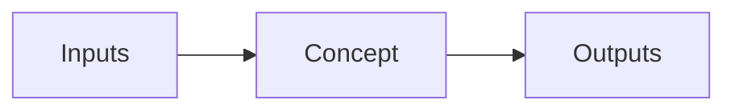

# Lesson Title

## TL;DR

- Three to five bullets.
- Each one stands alone — readable two months from now to refresh the concept.
- This block is automatically pulled into the global [/cheatsheet](/cheatsheet) page.
- Keep it scannable. No paragraphs.

## Why this matters

One paragraph: where this concept fits in the bigger picture, and why a reader should bother. Anchor it to a real-world consequence (perf, cost, correctness, hardware constraint).

## Mental model

The single diagram or analogy that makes the concept click. Use a Mermaid block:



## Concrete walkthrough

The actual content. Use code, numbers, and side-by-side comparisons. Avoid handwaving.

```python
# Concrete code, not pseudocode
import numpy as np
x = np.zeros(1024, dtype=np.float32)
```

Show the numbers:

| Variant      | Time (ms) | Memory (MB) |
| ------------ | --------- | ----------- |
| Naive        | 12.4      | 64          |
| Optimized    | 1.8       | 64          |

## Run it in your browser

A Pyodide-powered cell that students can run on their laptop *or phone*:

<RunInBrowser
  description="Tap Run — first time loads ~6 MB of Python, then it's cached."
  code={`# Demo code
print("Hello from Pyodide on whatever device you're on.")
`}
/>

## Run it on real hardware

For things Pyodide can't do (GPU kernels, large models):

<ColabLink
  href="https://colab.research.google.com/github/your-github/mosaic-notebooks/blob/main/lesson-name.ipynb"
  description="Free Colab T4 — uses 5 minutes of GPU time."
/>

## Quick check

<Quiz
  question="What is the key tradeoff this concept resolves?"
  options={[
    'Option A',
    'Option B (correct)',
    'Option C',
    'Option D',
  ]}
  answer={1}
  explanation="Brief explanation of why B is correct and the others are not."
/>

## Key takeaways

1. The first thing to remember.
2. The second thing.
3. The thing most readers get wrong.

## Go deeper

<Resources
  items={[
    { kind: 'paper', href: 'https://arxiv.org/abs/...', title: 'Foundational paper title', author: 'Lastname et al., 2024', note: 'Why this paper is the canonical reference.' },
    { kind: 'video', href: 'https://www.youtube.com/watch?v=...', title: 'Karpathy — relevant lecture title', author: 'Andrej Karpathy', note: 'Best 60-min walk through the concept.' },
    { kind: 'blog', href: 'https://...', title: 'Blog post title', author: 'Author', note: 'Most-cited blog reference.' },
    { kind: 'repo', href: 'https://github.com/...', title: 'Reference implementation' },
  ]}
/>

<LessonComplete />
