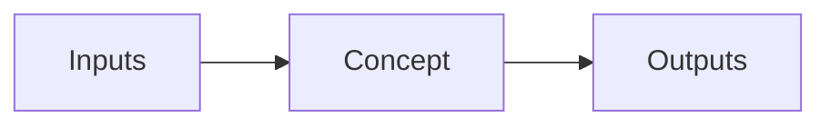

# Lesson Title

{/* See AUTHORING.md → "Reading modes" + "Voice rules" + "Code language: C++ vs Python".
    Learn block must come first (TL;DR there is what gets indexed for /cheatsheet).
    Frontmatter and # H1 above and <LessonComplete /> below are SHARED across modes. */}

<Mode is="learn">

{/* 1–3 paragraphs. Open with an analogy or contrast — not a definition.
    Anchor to GC'd / managed-runtime experience generically (no Node/React/Flutter).
    Use <Term name="..."> for jargon that has an entry in lib/glossary.ts. */}

In a managed-runtime language, when you do X, the runtime hides Y from you. C++ / CUDA / [system] makes Y explicit, and the choice of how Y happens is the lever you have on performance. This lesson is about Y and what it costs.

## TL;DR

- Three to five bullets.
- Each one stands alone — readable two months from now to refresh the concept.
- This block is automatically pulled into the global [/cheatsheet](/cheatsheet) page.
- Keep it scannable. No paragraphs.

## The concept, in plain English

Define the core abstraction before any code. Use an analogy. Compare to what most engineers already know.

## Mental model



## Concrete walkthrough

The actual content. Use code, numbers, and side-by-side comparisons. Avoid handwaving.

{/* Pick the language by what production code that does this actually uses.
    Kernel internals → C++ / CUDA. PyTorch user API → Python. Triton DSL → Python.
    Compiler IR → the IR's own text. See AUTHORING.md → "Code language" table. */}

```cpp
// Concrete code, not pseudocode. C++ for systems / kernels / allocators.
std::vector<float> v(1024);
```

Show the numbers:

| Variant      | Time (ms) | Memory (MB) |
| ------------ | --------- | ----------- |
| Naive        | 12.4      | 64          |
| Optimized    | 1.8       | 64          |

## Run it in your browser

A Pyodide-powered cell. Always Python — Pyodide is the only in-browser runtime.

<RunInBrowser
  description="Tap Run — first time loads ~6 MB of Python, then it's cached."
  code={`# Demo code
print("Hello from Pyodide on whatever device you're on.")
`}
/>

## Quick check

<Quiz
  question="What is the key tradeoff this concept resolves?"
  options={[
    'Option A',
    'Option B (correct)',
    'Option C',
    'Option D',
  ]}
  answer={1}
  explanation="Brief explanation of why B is correct and the others are not."
/>

## Key takeaways

1. The first thing to remember.
2. The second thing.
3. The thing most readers get wrong.

## Go deeper

<Resources
  items={[
    { kind: 'paper', href: 'https://arxiv.org/abs/...', title: 'Foundational paper title', author: 'Lastname et al., 2024', note: 'Why this paper is the canonical reference.' },
    { kind: 'video', href: 'https://www.youtube.com/watch?v=...', title: 'Karpathy — relevant lecture title', author: 'Andrej Karpathy', note: 'Best 60-min walk through the concept.' },
    { kind: 'blog', href: 'https://...', title: 'Blog post title', author: 'Author', note: 'Most-cited blog reference.' },
    { kind: 'repo', href: 'https://github.com/...', title: 'Reference implementation' },
  ]}
/>

</Mode>

<Mode is="reference">

{/* The dense / reference-quality version. Same facts, no warm hook.
    Lead with TL;DR, no setup paragraph. Same code, same numbers, same Quiz/Resources.
    This is the version a reader who already knows the topic comes back to. */}

## TL;DR

- Three to five bullets — same content as Learn TL;DR.

## Why this matters

One paragraph: where this concept fits in the bigger picture, and why a reader should bother. Anchor it to a real-world consequence (perf, cost, correctness, hardware constraint).

## Mental model


## Concrete walkthrough

```cpp
std::vector<float> v(1024);
```

| Variant      | Time (ms) | Memory (MB) |
| ------------ | --------- | ----------- |
| Naive        | 12.4      | 64          |
| Optimized    | 1.8       | 64          |

## Run it in your browser

<RunInBrowser
  description="Tap Run — first time loads ~6 MB of Python, then it's cached."
  code={`print("Hello from Pyodide on whatever device you're on.")
`}
/>

## Quick check

<Quiz
  question="What is the key tradeoff this concept resolves?"
  options={['Option A', 'Option B (correct)', 'Option C', 'Option D']}
  answer={1}
  explanation="Brief explanation of why B is correct and the others are not."
/>

## Key takeaways

1. The first thing to remember.
2. The second thing.
3. The thing most readers get wrong.

## Go deeper

<Resources
  items={[
    { kind: 'paper', href: 'https://arxiv.org/abs/...', title: 'Foundational paper title', author: 'Lastname et al., 2024' },
    { kind: 'repo', href: 'https://github.com/...', title: 'Reference implementation' },
  ]}
/>

</Mode>

<LessonComplete />
